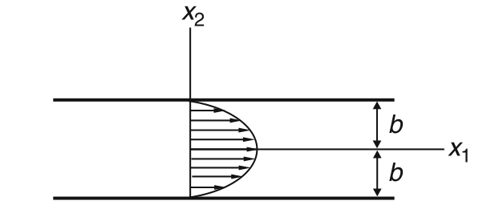
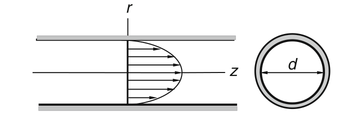
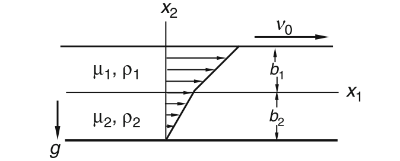

# 张量

## 指标记法

Einstein’s summation convention 爱因斯坦求和约定；dummy index 哑指标；free index 自由指标；$a_{i}=\mathbf{a}\cdot\mathbf{e}_{i}$；
$\mathbf{a} = a_{i} \mathbf{e}_{i}$

Kronecker delta 克罗内克δ函数；$\delta_{ij} = \left\{ \begin{array}{ll} 1 & \text{if } i = j, \\ 0 & \text{if } i \neq j. \end{array} \right.$；$\delta_{im}a_{m}=a_{i}$；$\delta_{im}T_{mj}=T_{ij}$；$\mathbf{e}_i\cdot\mathbf{e}_j=\delta_{ij}$

permutation symbol 置换符号；$\varepsilon_{123}=\varepsilon_{231}=\varepsilon_{312}=+1, \varepsilon_{213}=\varepsilon_{321}=\varepsilon_{132}=-1, \varepsilon_{111}=\varepsilon_{112}=\varepsilon_{222}=\ldots=0.$；$\varepsilon_{ijk} = \varepsilon_{jki} = \varepsilon_{kij} = -\varepsilon_{jik} = -\varepsilon_{kji} = -\varepsilon_{ikj}$；$\mathbf{e}_i\times\mathbf{e}_j=\varepsilon_{ijk}\mathbf{e}_k$；$\mathbf{a} \times \mathbf{b} = (a_i \mathbf{e}_i) \times (b_j \mathbf{e}_j) = a_i b_j (\mathbf{e}_i \times \mathbf{e}_j) = a_i b_j \varepsilon_{ijk} \mathbf{e}_k$；$[\mathbf{a} \times \mathbf{b}]_{k} = a_i b_j \varepsilon_{ijk}$；$[\mathbf{a} \times \mathbf{b}] = \begin{bmatrix}0 & -a_3 & a_2 \\ a_3 & 0 & -a_1 \\ -a_2 & a_1 & 0\end{bmatrix} [\mathbf{b}]$；$\varepsilon_{ijm}\varepsilon_{klm}=\delta_{ik}\delta_{jl}-\delta_{il}\delta_{jk}$

## 张量：线性变换

$\mathbf{T}\mathbf{e}_{i}=T_{ji}\mathbf{e}_{j}$；$T_{ij} = \mathbf{e}_i \cdot \mathbf{T} \mathbf{e}_j$；$(\mathbf T \mathbf S)_{ij}=T_{im}S_{mj}$；$\mathbf{a}\cdot\mathbf{T}\mathbf{b}=\mathbf{b}\cdot\mathbf{T}^{\mathrm{T}}\mathbf{a}$

dyadic product 并矢积；$(\mathbf{a}\mathbf{b})\mathbf{c}=\mathbf{a}(\mathbf{b}\cdot\mathbf{c})$；$(\mathbf{a}\mathbf{b})_{ij} = a_i b_j$；$\mathbf{T} = T_{ij}\mathbf{e}_i\mathbf{e}_j$

trace of a tensor 张量的迹；$\operatorname{tr} \mathbf{T} = T_{ii}$；$\operatorname{tr}(\mathbf{a}\mathbf{b})=\mathbf{a}\cdot\mathbf{b}$；$\operatorname{tr}(\mathbf{A}\mathbf{B})=\operatorname{tr}(\mathbf{B}\mathbf{A})$

identity tensor 单位张量；$\mathbf{I}\mathbf{a} = \mathbf{a}$；$I_{ij}=\delta_{ij}$

inverse of a tensor 张量的逆；$(\mathbf{T}^{\mathrm{T}})^{-1} = (\mathbf{T}^{-1})^{\mathrm{T}}$；$(\mathbf{TS})^{-1} = \mathbf{S}^{-1}\mathbf{T}^{-1}$

**orthogonal tensor 正交张量**；定义： $|\mathbf{Qa}|=|\mathbf{a}|$，$\cos(\mathbf{a},\mathbf{b})=\cos(\mathbf{Qa},\mathbf{Qb})$；$\mathbf{Qa}\cdot\mathbf{Qb}=\mathbf{a}\cdot\mathbf{b}$；$\mathbf{Q}^{-1} = \mathbf{Q}^{\mathrm{T}}$；$\det[\mathbf{Q}] = \pm 1$；proper/improper 正（行列式 +1）/反（行列式 -1）正交张量，反正交张量包含反射或旋转-反射。

**transformation matrix 变换矩阵**；$\{\mathbf{e}_i\}$ and $\{\mathbf{e}_i^\prime\}$ are unit vectors corresponding to two rectangular Cartesian coordinate systems, related by an orthogonal tensor $\mathbf{Q}$ through the equations below.；$\mathbf{e}_i^{\prime}=\mathbf{Q}\mathbf{e}_i=Q_{mi}\mathbf{e}_m$；$Q_{ij}=\mathbf{e}_i \cdot \mathbf{Q} \mathbf{e}_j=\cos(\mathbf{e}_i,\mathbf{e}_j^{\prime})$；The transformation law relating components of the same vector with respect to different rectangular Cartesian unit bases: $a_i=\mathbf{a}\cdot\mathbf{e}_i ,\quad a_{i}^{\prime}=\mathbf{a}\cdot\mathbf{e}_{i}^{\prime}$；$a_i' = Q_{mi}a_m$；$[\mathbf{a}]'=[\mathbf{Q}]^\mathrm{T}[\mathbf{a}]$；$a_{i} = Q_{im}a'_{m}$；$[\mathbf{a}]=[\mathbf{Q}][\mathbf{a}]'$；上式描述同一向量在不同直角笛卡尔单位基下分量之间的转换定律。需要特别注意的是，$[\mathbf{a}]'$ 表示向量 $\mathbf{a}$ 在带撇基 $\{\mathbf{e}_i^\prime\}$ 下的矩阵，而 $[\mathbf{a}]$ 表示同一向量在不带撇基 $\{\mathbf{e}_i\}$ 下的矩阵。上式与 $\mathbf{a}'=\mathbf{Q}^\mathrm{T}\mathbf{a}$ 并不相同。关键区别在于 $[\mathbf{a}]'$ 和 $[\mathbf{a}]$ 是同一向量的不同矩阵表示，而 $\mathbf{a}'$ 是 $\mathbf{a}$ 经过变换后的向量。

$T_{ij}^{\prime} = Q_{mi}Q_{nj}T_{mn}$；$[\mathbf{T}]^{\prime}=[\mathbf{Q}]^{\mathrm{T}}[\mathbf{T}][\mathbf{Q}]$；$T_{ij}=Q_{im}Q_{jn}T_{mn}'$；$[\mathbf{T}]=[\mathbf{Q}][\mathbf{T}]'[\mathbf{Q}]^{\mathrm{T}}$；$T_{ii}=T_{ii}^{\prime}$；$T_{ij}^{\prime}=[\mathbf{e}_{i}^{\prime}]^{\mathrm{T}}[\mathbf{T}][\mathbf{e}_{j}^{\prime}]$；张量是一个独立于坐标系的物理或几何实体（一个线性映射），矩阵 $[\mathbf{T}]$ 或 $[\mathbf{T}]'$ 只是这个实体在特定坐标系下的分量表示，张量变换公式是物理关系在不同坐标系下保持形式不变而必须满足的协调条件。

$S'_{ijk} = Q_{mi} Q_{nj} Q_{rk} S_{mnr}$；$C'_{ijkl} = Q_{mi} Q_{nj} Q_{rk} Q_{sl} C_{mnrs}$

symmetric 对称的 $T_{ij}=T_{ji}$；antisymmetric 反对称 $T_{ij}=-T_{ji}$；$\mathbf{T} = \mathbf{T}^\mathrm{S} + \mathbf{T}^\mathrm{A}$；$\mathbf{T}^\mathrm{S} = \frac{\mathbf{T} + \mathbf{T}^\mathrm{T}}{2}$，$\mathbf{T}^\mathrm{A} = \frac{\mathbf{T} - \mathbf{T}^\mathrm{T}}{2}$；dual vector of the antisymmetric tensor 反对称张量的对偶向量：$\mathbf{T}\mathbf{a} = \mathbf{t}^{\mathbf{A}} \times \mathbf{a}$；$\mathbf{t}^{\mathrm{A}} = -(T_{23}\mathbf{e}_1 + T_{31}\mathbf{e}_2 + T_{12}\mathbf{e}_3) = T_{32}\mathbf{e}_1 + T_{13}\mathbf{e}_2 + T_{21}\mathbf{e}_3$；$2 \mathbf{t}^{\mathbf{A}} = - \varepsilon_{ijk} T_{jk} \mathbf{e}_i$

$\mathbf{a}$ is an eigenvector and $\lambda$ is the corresponding eigenvalue: $\mathbf{Ta}=\lambda\mathbf{a}$；为明确起见，我们**约定所求的所有特征向量均为单位长度**。任何实对称张量的特征值都是实数。对于一个实对称张量（real symmetric tensor），至少存在三个实特征向量，我们也将其称为主方向（principal directions）。相应的特征值称为主值（principal values）。如果对称张量的特征值互不相同（all distinct），则这三个主方向相互垂直（mutually perpendicular）。对于每一个实对称张量，至少存在一组相互垂直的主方向三重系。$\mathbf{T}$ 的主值的最大值是 $\mathbf{T}$ 的所有矩阵的对角元素的最大值，而 $\mathbf{T}$ 的主值的最小值是 $\mathbf{T}$ 的所有矩阵的对角元素的最小值。

**The principal scalar invariants 主标量不变量**：$\lambda^{3}-I_{1}\lambda^{2}+I_{2}\lambda-I_{3}=0$；$I_1=T_{ii}=\operatorname{tr}\mathbf{T}$；$I_2 = \frac{1}{2} (T_{ii}T_{jj} - T_{ij}T_{ji}) = \frac{1}{2} \left[ (\operatorname{tr} \mathbf{T})^2 - \operatorname{tr} (\mathbf{T}^2) \right]$；$I_{3} = \operatorname{det} [\mathbf{T}]$；$I_{1}=\lambda_{1}+\lambda_{2}+\lambda_{3}$；$I_{2}=\lambda_{1}\lambda_{2}+\lambda_{2}\lambda_{3}+\lambda_{3}\lambda_{1}$；$I_{3}=\lambda_{1}\lambda_{2}\lambda_{3}$

## 张量微积分

Tensor-valued functions of a scalar 标量的张量值函数 $\mathbf{T}(t)$；$\frac{d\mathbf{T}(t)}{dt} = \lim_{\Delta t \to 0} \frac{\mathbf{T}(t + \Delta t) - \mathbf{T}(t)}{\Delta t}$；$\frac{d}{dt}(\alpha(t)\mathbf{T}) = \frac{d\alpha}{dt}\mathbf{T} + \alpha\frac{d\mathbf{T}}{dt}$；$\frac{d}{dt}(\mathbf{T}\mathbf{S}) = \frac{d\mathbf{T}}{dt}\mathbf{S} + \mathbf{T}\frac{d\mathbf{S}}{dt}$；$\frac{d}{dt}(\mathbf{T}\mathbf{a}) = \frac{d\mathbf{T}}{dt}\mathbf{a} + \mathbf{T}\frac{d\mathbf{a}}{dt}$；$\frac{d}{dt}(\mathbf{T}^\mathrm{T}) = \left(\frac{d\mathbf{T}}{dt}\right)^\mathrm{T}$

Scalar field and the gradient of a scalar function 标量场与标量函数的梯度；$d\phi = \phi(\mathbf{r} + d\mathbf{r}) - \phi(\mathbf{r}) = \nabla\phi \cdot d\mathbf{r}$；如果 $dr$ 表示 $d\mathbf{r}$ 的模，$\mathbf{e}$ 是沿 $d\mathbf{r}$ 方向的单位矢量（注：$\mathbf{e} = d\mathbf{r}/dr$），则有 $\frac{d\phi}{dr} = \nabla\phi \cdot \mathbf{e}$；$\frac{\partial \phi}{\partial x_i} = \nabla \phi \cdot \mathbf{e}_i$；$\nabla\phi=\frac{\partial\phi}{\partial x_i}\mathbf{e}_i$

vector field and gradient of a vector function 向量场与向量函数的梯度：$\mathbf{v}(\mathbf{r})$ 为一个描述位置的矢量值函数，例如位移场或速度场。$\mathbf{v}$ 的梯度（记作 $\nabla \mathbf{v}$ 或 $\text{grad } \mathbf{v}$）被定义为二阶张量。$d\mathbf{v} = \mathbf{v}(\mathbf{r} + d\mathbf{r}) - \mathbf{v}(\mathbf{r}) = (\nabla \mathbf{v}) d\mathbf{r}$；$\frac{\partial\mathbf{v}}{\partial x_{j}}=(\nabla\mathbf{v})\mathbf{e}_{j}$；$(\nabla\mathbf{v})_{ij}=\mathbf{e}_{i}\cdot(\nabla\mathbf{v})\mathbf{e}_{j}=\frac{\partial v_{i}}{\partial x_{j}}$

Divergence of a vector field and divergence of a tensor field 向量场的散度与张量场的散度；$\operatorname{div}\mathbf{v}\equiv\operatorname{tr}(\nabla\mathbf{v})= \frac{\partial v_i}{\partial x_i}$；$(\mathrm{div}\ \mathbf{T}) \cdot \mathbf{a} \equiv \mathrm{div}(\mathbf{T}^{\mathrm{T}} \mathbf{a}) - \mathrm{tr}(\mathbf{T}^{\mathrm{T}} \nabla \mathbf{a})$；$\mathrm{div}\ \mathbf{T} = (\partial T_{ij}/\partial x_j) \mathbf{e}_i$；$\mathrm{div}(\alpha \mathbf{a}) = \alpha \mathrm{div}\ \mathbf{a} + (\nabla \alpha) \cdot \mathbf{a}$；$\mathrm{div} \, (\alpha \mathbf{T}) = \mathbf{T}(\nabla \alpha) + \alpha \, \mathrm{div} \, \mathbf{T}$

Curl of a vector field 向量场的旋度。$\mathbf{v}(\mathbf{r})$ 的旋度被定义为由 $\nabla\mathbf{v}$ 的反对称部分的对偶矢量的两倍所给出的矢量场。即 $\text{curl } \mathbf{v} \equiv 2\mathbf{t}^{\mathrm{A}}$；其中 $\mathbf{t}^{\mathrm{A}}$ 是 $(\nabla\mathbf{v})^{\mathrm{A}}$ 的对偶矢量。$\text{curl } \mathbf{v} = -\varepsilon_{ijk} \frac{\partial v_j}{\partial x_k} \mathbf{e}_i$，$\text{curl }\mathbf{v} = \nabla \times \mathbf{v} = \begin{vmatrix} \mathbf{e}_1 & \mathbf{e}_2 & \mathbf{e}_3 \\ \frac{\partial}{\partial x_1} & \frac{\partial}{\partial x_2} & \frac{\partial}{\partial x_3} \\ v_1 & v_2 & v_3 \end{vmatrix}$

Laplacian 拉普拉斯算子；$\nabla^2 f = \operatorname{div}(\nabla f) = \operatorname{tr}(\nabla(\nabla f))$；$\nabla^2 \mathbf{v} = \nabla (\operatorname{div} \mathbf{v}) - \operatorname{curl} (\operatorname{curl} \mathbf{v})$；在直角坐标系中 $\nabla^2 f = \frac{\partial^2 f}{\partial x_i \partial x_i}$；$\nabla^{2}\mathbf{v} = \frac{\partial^{2}v_{i}}{\partial x_{\beta}\partial x_{\beta}}\mathbf{e}_{i} = \nabla^{2}v_{i}\mathbf{e}_{i}$

## 曲线坐标

极坐标（polar coordinates）$(r,\theta)$

柱坐标（cylindrical coordinates）$(r, \theta, z)$，$xy$ 平面上的一个极坐标 $(r, \theta)$ 加上一个垂直于 $xy$ 平面的坐标 $z$。$d\mathbf{e}_r = d\theta \mathbf{e}_\theta$，$d\mathbf{e}_\theta = -d\theta \mathbf{e}_r$，$d\mathbf{e}_z = 0$。点 $P$ 的位置矢量 $\mathbf{R} = r\mathbf{e}_r + z\mathbf{e}_z$；$d\mathbf{R} = dr\mathbf{e}_r + rd\theta\,\mathbf{e}_\theta + dz\mathbf{e}_z$。$\nabla = \mathbf{e}_r \frac{\partial}{\partial r} + \mathbf{e}_\theta \frac{1}{r}\frac{\partial}{\partial \theta} + \mathbf{e}_z \frac{\partial}{\partial z}$

$\nabla f = \frac{\partial f}{\partial r} \mathbf{e}_r + \frac{1}{r} \frac{\partial f}{\partial \theta} \mathbf{e}_\theta + \frac{\partial f}{\partial z} \mathbf{e}_z$；$[\nabla \mathbf{v}] = \begin{bmatrix}\frac{\partial v_r}{\partial r} & \frac{1}{r} \left( \frac{\partial v_r}{\partial \theta} - v_\theta \right) & \frac{\partial v_r}{\partial z} \\\frac{\partial v_\theta}{\partial r} & \frac{1}{r} \left( \frac{\partial v_\theta}{\partial \theta} + v_r \right) & \frac{\partial v_\theta}{\partial z} \\\frac{\partial v_z}{\partial r} & \frac{1}{r} \frac{\partial v_z}{\partial \theta} & \frac{\partial v_z}{\partial z}\end{bmatrix}$；$\operatorname{div} \mathbf{v} =\nabla \cdot \mathbf{v} = \left( \mathbf{e}_r \frac{\partial}{\partial r} + \mathbf{e}_\theta \frac{1}{r}\frac{\partial}{\partial \theta} + \mathbf{e}_z \frac{\partial}{\partial z} \right) \cdot (v_r \mathbf{e}_r + v_\theta \mathbf{e}_\theta + v_z \mathbf{e}_z)= \frac{\partial v_r}{\partial r} + \frac{1}{r} \left( \frac{\partial v_\theta}{\partial \theta} + v_r \right) + \frac{\partial v_z}{\partial z}$；$\operatorname{curl} \mathbf{v} = \left( \frac{1}{r} \frac{\partial v_z}{\partial \theta} - \frac{\partial v_\theta}{\partial z} \right) \mathbf{e}_r + \left( \frac{\partial v_r}{\partial z} - \frac{\partial v_z}{\partial r} \right) \mathbf{e}_\theta + \left( \frac{\partial v_\theta}{\partial r} + \frac{v_\theta}{r} - \frac{1}{r} \frac{\partial v_r}{\partial \theta} \right) \mathbf{e}_z$；$(\operatorname{div} \mathbf{T})_r = \frac{\partial T_{rr}}{\partial r} + \frac{1}{r} \frac{\partial T_{r\theta}}{\partial \theta} + \frac{T_{rr} - T_{\theta\theta}}{r} + \frac{\partial T_{rz}}{\partial z}$；$(\operatorname{div} \mathbf{T})_\theta = \frac{\partial T_{\theta r}}{\partial r} + \frac{1}{r} \frac{\partial T_{\theta\theta}}{\partial \theta} + \frac{T_{r\theta} + T_{\theta r}}{r} + \frac{\partial T_{\theta z}}{\partial z}$；$(\operatorname{div} \mathbf{T})_z = \frac{\partial T_{zr}}{\partial r} + \frac{1}{r} \frac{\partial T_{z\theta}}{\partial \theta} + \frac{\partial T_{zz}}{\partial z} + \frac{T_{zr}}{r}$；$\nabla^2 f = \operatorname{div} \nabla f = \frac{\partial^2 f}{\partial r^2} + \frac{1}{r^2} \frac{\partial^2 f}{\partial \theta^2} + \frac{1}{r} \frac{\partial f}{\partial r} + \frac{\partial^2 f}{\partial z^2}$；$(\nabla^2 \mathbf{v})_r = \frac{\partial^2 v_r}{\partial r^2} + \frac{1}{r^2} \frac{\partial^2 v_r}{\partial \theta^2} + \frac{\partial^2 v_r}{\partial z^2} + \frac{1}{r} \frac{\partial v_r}{\partial r} - \frac{v_r}{r^2} - \frac{2}{r^2} \frac{\partial v_\theta}{\partial \theta}$；$(\nabla^2 \mathbf{v})_\theta = \frac{\partial^2 v_\theta}{\partial r^2} + \frac{1}{r^2} \frac{\partial^2 v_\theta}{\partial \theta^2} + \frac{\partial^2 v_\theta}{\partial z^2} + \frac{1}{r} \frac{\partial v_\theta}{\partial r} + \frac{2}{r^2} \frac{\partial v_r}{\partial \theta} - \frac{v_\theta}{r^2}$；$(\nabla^2 \mathbf{v})_z = \frac{\partial^2 v_z}{\partial r^2} + \frac{1}{r^2} \frac{\partial^2 v_z}{\partial \theta^2} + \frac{1}{r} \frac{\partial v_z}{\partial r} + \frac{\partial^2 v_z}{\partial z^2}$

球坐标（spherical coordinates）$(r, \theta, \phi)$。点 $P$ 的位置矢量 $\mathbf{r} = r \mathbf{e}_r$；$d\mathbf{e}_r = d\theta\, \mathbf{e}_\theta + \sin\theta\, d\phi\, \mathbf{e}_\phi$，$d\mathbf{e}_\theta = -\mathbf{e}_r d\theta + \cos\theta\, d\phi\, \mathbf{e}_\phi$，$d\mathbf{e}_\phi = -\sin\theta\, d\phi\, \mathbf{e}_r - \cos\theta\, d\phi\, \mathbf{e}_\theta$；$d\mathbf{r} = dr\, \mathbf{e}_r + r\, d\theta\, \mathbf{e}_\theta + r\, \sin\theta\, d\phi\, \mathbf{e}_\phi$。$(\nabla f)_r = \frac{\partial f}{\partial r}, \quad (\nabla f)_\theta = \frac{1}{r} \frac{\partial f}{\partial \theta}, \quad (\nabla f)_\phi = \frac{1}{r \sin \theta} \frac{\partial f}{\partial \phi}$。$[\nabla \mathbf{v}] = \begin{bmatrix} \dfrac{\partial v_r}{\partial r} & \dfrac{1}{r}\dfrac{\partial v_r}{\partial \theta} - \dfrac{v_\theta}{r} & \dfrac{1}{r \sin \theta}\dfrac{\partial v_r}{\partial \phi} - \dfrac{v_\phi}{r} \\ \dfrac{\partial v_\theta}{\partial r} & \dfrac{1}{r}\dfrac{\partial v_\theta}{\partial \theta} + \dfrac{v_r}{r} & \dfrac{1}{r \sin \theta}\dfrac{\partial v_\theta}{\partial \phi} - \dfrac{v_\phi \cot \theta}{r} \\ \dfrac{\partial v_\phi}{\partial r} & \dfrac{1}{r}\dfrac{\partial v_\phi}{\partial \theta} & \dfrac{1}{r \sin \theta}\dfrac{\partial v_\phi}{\partial \phi} + \dfrac{v_r}{r} + \dfrac{v_\theta \cot \theta}{r} \end{bmatrix}$

# 连续介质运动学

## 连续体运动描述

连续介质中每个质点的路径线可由如下形式的正向运动方程描述：$\mathbf{x} = \hat{\mathbf{x}}(\mathbf{X}, t) \quad \text{with} \quad \mathbf{X} = \hat{\mathbf{x}}(\mathbf{X}, t_0)$，其中 $\mathbf{x} = x_i\mathbf{e}_i$ 是粒子 $P$ 在时刻 $t$ 的位置矢量，该粒子在时刻 $t_0$ 时位于 $\mathbf{X} = X_i\mathbf{e}_i$。对应有逆向运动方程 $\mathbf{X} = \hat{\mathbf{X}}^{-1}(\mathbf{x}, t)$。三元组 $(X_i)$ 用于标识物体的不同质点，被称为**物质坐标**（material coordinates）。

当连续介质处于运动状态时，其某个量（如温度 $\Theta$、速度 $\mathbf{v}$ 以及应力张量 $\mathbf{T}$）可能随时间变化。我们可以按如下方式描述这些变化。(1) 跟踪质点，即把某个量表示为质点（由物质坐标 $(X_i)$ 标识）和时间 $t$ 的函数$\Theta = \hat{\Theta}(X_1, X_2, X_3, t)$，这种描述称为**物质描述**（material description）。其他名称包括**拉格朗日描述**和**参考描述**。(2) 在固定位置观察变化，即把某个量表示为固定位置（由**空间坐标** $(x_i)$ 标识）和时间的函数：$\Theta = \tilde{\Theta}(x_1, x_2, x_3, t)$，这种描述称为**空间描述**（spatial description）或**欧拉描述**。**物质描述和空间描述的相互转换**：$\tilde{\Theta}(\mathbf{x}, t) = \hat{\Theta}\left( \hat{\mathbf{X}}^{-1}(\mathbf{x}, t), t \right)$，$\hat{\Theta}(\mathbf{X}, t) = \tilde{\Theta}\left( \hat{\mathbf{x}}(\mathbf{X}, t), t \right)$

一个物质粒子的某个量随时间的变化率被称为**物质导数**（material derivative），用 $D/Dt$ 表示。$\frac{D\Theta}{Dt} = \left( \frac{\partial \hat{\Theta}}{\partial t} \right)_{X_i-\text{fixed}} = \left( \frac{\partial \tilde{\Theta}}{\partial x_i} \right) \frac{\partial \hat{x}_i}{\partial t} + \left( \frac{\partial \tilde{\Theta}}{\partial t} \right)_{x_i-\text{fixed}} = \frac{\partial \tilde{\Theta}}{\partial t} + \mathbf{v} \cdot \nabla \tilde{\Theta}$，其中，$x_i$ 表示时刻 $t$ 时物质质点当前位置的坐标，它与物质坐标通过已知运动 $x_i = \hat{x}_i(X_1, X_2, X_3, t)$ 相关联。其中 $\partial \hat{x}_i / \partial t$ 应在 $X_i$ 取固定值时获得。当使用直角笛卡尔坐标系时，这些即为质点 $X_i$ 的速度分量 $v_i$。

## 变形

连续介质中一个质点的**位移场**（displacement field）$\mathbf{u}(\mathbf{X}, t) = \hat{\mathbf{x}}(\mathbf{X}, t) - \mathbf{X}$；描述一般刚体运动的方程 $\hat{\mathbf{x}} = \mathbf{R}(t)(\mathbf{X} - \mathbf{b}) + \mathbf{c}(t)$，其中 $\mathbf{R}(t)$ 是一个旋转张量，满足 $\mathbf{R}(0) = \mathbf{I}$，而 $\mathbf{c}(t)$ 是一个矢量，满足 $\mathbf{c}(0) = \mathbf{b}$。

$d\hat{\mathbf{x}} = d\mathbf{X} + (\nabla\mathbf{u})d\mathbf{X} \ = \mathbf{F}d\mathbf{X}$，其中 $\nabla\mathbf{u}$ 是一个二阶张量，称为**位移梯度**（displacement gradient）。在直角笛卡尔坐标系下 $(\nabla\mathbf{u})_{ij}=\frac{\partial u_i}{\partial X_j}$。$\mathbf{F} = \mathbf{I} + \nabla\mathbf{u}=\nabla \mathbf{x}$，这里 $\mathbf{F}$ 被称为**变形梯度**（deformation gradient）。物理学要求 $d\mathbf{x}$ 仅在 $d\mathbf{X}$ 为零时才可能为零。因此，$\mathbf{F}^{-1}$ 存在，$d\mathbf{X} = \mathbf{F}^{-1} d\mathbf{x}$；物理学不允许变形中出现反射，因此 $\det \mathbf{F} > 0$。如果 $\mathbf{F}$ 是一个正常（proper）的正交张量，则描述刚体位移，在 $\mathbf{X}$ 处没有变形。

使用符号 $\mathbf{U}$ 表示对称且正定的变形梯度（即，对于任意向量 $\mathbf{a}$，有 $\mathbf{a} \cdot \mathbf{U}\mathbf{a} \geq 0$，其中 $\mathbf{a} \cdot \mathbf{U}\mathbf{a} = 0$ 当且仅当 $\mathbf{a} = \mathbf{0}$）。显然，这种张量的所有特征值均为正数。在这种情况下，$\mathbf{X}$ 的小邻域内的材料被认为处于纯伸展变形状态（相对于参考构型）。变形长度与原始长度之比称为伸长率，$\text{Stretch} = \frac{|d\mathbf{x}|}{|d\mathbf{X}|}$；$\mathbf{U}$ 的特征值是主伸长率，包括最大和最小伸长率。因为正定，所以伸长率必为正，但是应变可正可负。

对于一个正定实对称张量，其矩阵满足：$T_{11} > 0, T_{22} > 0, T_{33} > 0$，$\left| \begin{array}{cc} T_{11} & T_{12} \\ T_{21} & T_{22} \end{array} \right| > 0, \left| \begin{array}{cc} T_{22} & T_{23} \\ T_{32} & T_{33} \end{array} \right| > 0, \left| \begin{array}{cc} T_{11} & T_{13} \\ T_{31} & T_{33} \end{array} \right| > 0$，$|\mathbf{T}| > 0$

**极分解定理（polar decomposition theorem）**。对于任何具有非零行列式的实张量 $\mathbf{F}$（即 $\mathbf{F}^{-1}$ 存在），$\mathbf{F} = \mathbf{RU}$ 或 $\mathbf{F} = \mathbf{VR}$，$\mathbf{U}$ 和 $\mathbf{V}$ 是正定对称张量，分别称为右拉伸张量（right stretch tensor）和左拉伸张量，而 $\mathbf{R}$（在两个方程中相同）是一个 proper 正交张量。该分解是唯一的。$\mathbf{U}^2 = \mathbf{F}^{\mathrm{T}} \mathbf{F}$。当变形梯度 $\mathbf{F}$ 是对称的，变形的旋转部分为零（$\mathbf{R} = \mathbf{I}$），变形梯度等于其右拉伸张量，也等于其左拉伸张量，变形是纯拉伸或无旋变形，物质微元只经历伸缩而没有发生局部刚体旋转。

右柯西-格林变形张量（Cauchy-Green） $\mathbf{C} \equiv \mathbf{U}^2$ 和左 Cauchy-Green 张量 $\mathbf{B} \equiv \mathbf{V}^2$。张量 $\mathbf{B}$ 是客观的（与观察者无关，客观性原则要求物理定律必须独立于观察者，因此本构关系只能由客观的张量来构建），而张量 $\mathbf{C}$ 是非客观的。$\mathbf{C}$ 和 $\mathbf{B}$ 描述了同一个变形事实（特征值相同，主伸长率相同），但它们选择了不同的坐标基（主方向）来表达这个事实，一个基于过去，一个基于现在。

拉格朗日应变张量（Lagrangian finite strain tensor）$\mathbf{E}^* = \frac{1}{2}(\mathbf{C} - \mathbf{I})$；欧拉应变张量（ Eulerian strain tensor）$\mathbf{e}^* = \frac{1}{2} \left( \mathbf{I} - \mathbf{B}^{-1} \right)$。$|d\mathbf{x}|^2 - |d\mathbf{X}|^2 = d\mathbf{X} \cdot (2\mathbf{E}^*) d\mathbf{X} = d\mathbf{x} \cdot (2\mathbf{e}^*) d\mathbf{x}$

由于变形引起的面积变化 $dA \mathbf{n} = dA_o J (\mathbf{F}^{-1})^\mathrm{T} \mathbf{n}_o$，其中 $J = |\det \mathbf{F}|$。由于变形引起的体积变化 $dV = J dV_o = \sqrt{\det \mathbf{C}} \, dV_o = \sqrt{\det \mathbf{B}} \, dV_o$。对于不可压缩材料，$dV = dV_o$ 且 $\det \mathbf{F} = \det \mathbf{C} = \det \mathbf{B} = 1$。

## 无穷小变形

（infinitesimal deformation）

将 $\nabla \mathbf{u}$ 分解为对称部分 $\mathbf{E}$（无穷小应变张量，infinitesimal strain tensor）和反对称部分 $\boldsymbol{\Omega}$（无穷小旋转张量，infinitesimal rotation tensor）。$\mathbf{E} = \frac{1}{2}(\nabla\mathbf{u} + (\nabla\mathbf{u})^T)$，$\boldsymbol{\Omega} = \frac{1}{2}(\nabla\mathbf{u} - (\nabla\mathbf{u})^T)$。$\mathbf{U} \approx \mathbf{V} \approx \mathbf{I} + \mathbf{E}$，$\mathbf{R} \approx \mathbf{I} + \boldsymbol{\Omega}$，$\mathbf{C} \approx \mathbf{B} \approx \mathbf{I} + 2 \mathbf{E}$，$\mathbf{E}^* \approx \mathbf{e}^* \approx \mathbf{E}$。

$E_{ij} = \frac{1}{2}\left(\frac{\partial u_i}{\partial X_j} + \frac{\partial u_j}{\partial X_i}\right)$；考虑 $d\mathbf{X} = dS\mathbf{n}$，其中 $\mathbf{n}$ 是单位矢量，$dS$ 是 $d\mathbf{X}$ 的长度 $\frac{ds - dS}{dS} = \mathbf{n} \cdot \mathbf{E}\mathbf{n} = E_{nn} \quad(\text{no sum on } n)$；沿方向 $\mathbf{n}$ 的微元的单位伸长率由 $\mathbf{n} \cdot \mathbf{E}\mathbf{n}$ 给出。$\mathbf{E}$ 的对角元也被称为**正应变**（normal strains）。令 $d\mathbf{X}^{(1)} = dS_1\mathbf{m}$ 和 $d\mathbf{X}^{(2)} = dS_2\mathbf{n}$，其中 $\mathbf{m}$ 和 $\mathbf{n}$ 是相互垂直的单位矢量。设两个变形后矢量 $d\mathbf{x}^{(1)}$ 和 $d\mathbf{x}^{(2)}$ 之间的夹角为 $\theta$，$ds_1 ds_2 \cos\theta = 2dS_1 dS_2 \mathbf{m} \cdot \mathbf{E}\mathbf{n}$；令 $\theta = \frac{\pi}{2} - \gamma$，则 $\gamma$ 衡量了 $d\mathbf{X}^{(1)}$ 和 $d\mathbf{X}^{(2)}$ 之间因变形引起的微小角度减小量（称为**剪应变** shear strain）。$\gamma = 2(\mathbf{m} \cdot \mathbf{E}\mathbf{n})$，$2E_{ij}$ 给出初始位于 $x_i$ 和 $x_j$ 方向的两个微元之间夹角的减小量。

由于应变张量 $\mathbf{E}$ 是对称的，因此至少存在三个相互正交的方向 $(\mathbf{n}_1, \mathbf{n}_2, \mathbf{n}_3)$，使得 $\mathbf{E}$ 的矩阵在此坐标系下为对角阵。从几何上看，这意味着沿方向 $(\mathbf{n}_1, \mathbf{n}_2, \mathbf{n}_3)$ 的无穷小线元在变形后仍保持相互正交。这些方向称为**主方向**（principal directions）。沿主方向的单位伸长量（即 $E_1, E_2, E_3$）是 $\mathbf{E}$ 的特征值，或称**主应变**（principal strains）。它们包括从该质点出发的所有方向中的最大和最小法向应变。对于给定的 $\mathbf{E}$，主应变可通过 $\mathbf{E}$ 的特征方程求得：$\lambda^3 - I_1 \lambda^2 + I_2 \lambda - I_3 = 0$；$I_1 = E_{11} + E_{22} + E_{33}$；$
I_2=\begin{vmatrix}E_{11}&E_{12}\\E_{21}&E_{22}\end{vmatrix}+\begin{vmatrix}E_{22}&E_{23}\\E_{32}&E_{33}\end{vmatrix}+\begin{vmatrix}E_{11}&E_{13}\\E_{31}&E_{33}\end{vmatrix}$；$I_3 = |E_{ij}|$；系数 $I_1, I_2$ 和 $I_3$ 称为应变张量的**主标量不变量**（principal scalar invariants）。**体积应变**（dilatation）$e \equiv \frac{\Delta(dV)}{dV} = E_{ii} = \frac{\partial u_i}{\partial X_i} = \operatorname{div} \mathbf{u}$。isochoric 等体的。

$d\mathbf{X}$ 方向的变化通常来自两个来源：无穷小变形张量 $\mathbf{E}$ 和无穷小旋转张量 $\boldsymbol{\Omega}$。然而，对于任何沿 $\mathbf{E}$ 的特征向量方向的 $d\mathbf{X}$，其方向变化仅由 $\boldsymbol{\Omega}$ 引起，而非 $\mathbf{E}$。因此，张量 $\boldsymbol{\Omega}$ 表示 $\mathbf{E}$ 的特征向量三元组的无穷小旋转。它可以用一个向量 $\mathbf{t}^{\mathrm{A}}$（反对称张量 $\boldsymbol{\Omega}$ 的对偶向量）来描述，满足 $\mathbf{t}^{\mathrm{A}} \times d\mathbf{X} = \boldsymbol{\Omega} d\mathbf{X}$，其中 $\mathbf{t}^{\mathrm{A}} = \Omega_{32} \mathbf{e}_1 + \Omega_{13} \mathbf{e}_2 + \Omega_{21} \mathbf{e}_3$；因此，$(\Omega_{32},\, \Omega_{13},\, \Omega_{21})$ 给出了材料微元在 $\mathbf{E}$ 主方向上的三元组绕 $\mathbf{e}_1$、$\mathbf{e}_2$ 和 $\mathbf{e}_3$ 轴的无穷小旋转角。

## 时间变化率

$\frac{D}{Dt}d\mathbf{x} = (\nabla\mathbf{v})d\mathbf{x}$，在直角坐标系 $[\nabla\mathbf{v}]_{ij} =\frac{\partial v_i}{\partial x_j}$。$\nabla\mathbf{v} = \underbrace{\frac{1}{2}(\nabla\mathbf{v} + \nabla\mathbf{v}^\mathrm{T})}_\mathbf{D} + \underbrace{\frac{1}{2}(\nabla\mathbf{v} - \nabla\mathbf{v}^\mathrm{T})}_\mathbf{W}$；对称部分 $\mathbf{D}$ 变形率张量（rate of deformation tensor），反对称部分 $\mathbf{W}$ 自旋张量（spin tensor）。在小变形的假设下：$\dot{\mathbf{E}} \approx \mathbf{D}$。$\frac{D}{Dt}d\mathbf{x} = (\mathbf{D} + \mathbf{W})d\mathbf{x} = \mathbf{D}d\mathbf{x} + \boldsymbol{\omega} \times d\mathbf{x}$。大多数微元向量 $d\mathbf{x}$ 会以不同于 $\boldsymbol{\omega}$ 的角速度旋转（同时改变其长度），只有位于 $\mathbf{D}$ 主方向上的三个材料向量才以角速度 $\boldsymbol{\omega}$ 旋转（同时改变其长度）。

## 偏微分方程

质量守恒方程（equation of conservation of mass）$\frac{D}{Dt}(\rho dV) = 0$；$\rho \operatorname{div} \mathbf{v} + \frac{D \rho}{D t} = 0$；$\frac{D \rho}{D t} = \frac{\partial \rho}{\partial t} + \mathbf{v} \cdot \nabla \rho$。质量守恒方程 $\rho dV = \rho_o dV_o$ 也可以写作 $\rho = \frac{\rho_o}{\det \mathbf{F}}$，$\rho = \frac{\rho_o}{\sqrt{\det \mathbf{C}}}$，$\rho = \frac{\rho_o}{\sqrt{\det \mathbf{B}}}$

协调条件（compatibility conditions）$\frac{\partial^{2}E_{11}}{\partial X_{2}^{2}} + \frac{\partial^{2}E_{22}}{\partial X_{1}^{2}} = 2\frac{\partial^{2}E_{12}}{\partial X_{1}\partial X_{2}}$，$\frac{\partial^{2}E_{22}}{\partial X_{3}^{2}} + \frac{\partial^{2}E_{33}}{\partial X_{2}^{2}} = 2\frac{\partial^{2}E_{23}}{\partial X_{2}\partial X_{3}}$，$\frac{\partial^{2}E_{33}}{\partial X_{1}^{2}} + \frac{\partial^{2}E_{11}}{\partial X_{3}^{2}} = 2\frac{\partial^{2}E_{31}}{\partial X_{3}\partial X_{1}}$，$\frac{\partial^{2}E_{11}}{\partial X_{2}\partial X_{3}} = \frac{\partial}{\partial X_{1}}\left(-\frac{\partial E_{23}}{\partial X_{1}} + \frac{\partial E_{31}}{\partial X_{2}} + \frac{\partial E_{12}}{\partial X_{3}}\right)$，$\frac{\partial^{2}E_{22}}{\partial X_{3}\partial X_{1}} = \frac{\partial}{\partial X_{2}}\left(-\frac{\partial E_{31}}{\partial X_{2}} + \frac{\partial E_{12}}{\partial X_{3}} + \frac{\partial E_{23}}{\partial X_{1}}\right)$，$\frac{\partial^{2}E_{33}}{\partial X_{1}\partial X_{2}} = \frac{\partial}{\partial X_{3}}\left(-\frac{\partial E_{12}}{\partial X_{3}} + \frac{\partial E_{23}}{\partial X_{1}} + \frac{\partial E_{31}}{\partial X_{2}}\right)$。变形率分量的协调条件形式相同，$\frac{\partial^{2}D_{11}}{\partial x_{2}^{2}} + \frac{\partial^{2}D_{22}}{\partial x_{1}^{2}} = 2\frac{\partial^{2}D_{12}}{\partial x_{1}\partial x_{2}}, \text{ etc.}$，$\frac{\partial^{2}D_{11}}{\partial x_{2}\partial x_{3}} = \frac{\partial}{\partial x_{1}}\left(-\frac{\partial D_{23}}{\partial x_{1}} + \frac{\partial D_{31}}{\partial x_{2}} + \frac{\partial D_{12}}{\partial x_{3}}\right), \text{ etc.}$

# 应力

正应力 normal stress，剪应力 shearing stress，应力矢量（stress vector）$
\mathbf{t} = \lim_{\Delta S \to 0} \frac{\Delta \mathbf{F}}{\Delta S}$，应力张量（stress tensor）$\mathbf{t} = \mathbf{T}(\mathbf{x}, t) \mathbf{n}$。应力张量的对称性：动量矩原理 symmetry of stress tensor: principle of moment of momentum，$\mathbf{T} = \mathbf{T}^\mathrm{T}$。对于任何实对称应力张量，至少存在三个相互垂直的主方向（mutually perpendicular principal directions）（即张量 $\mathbf{T}$ 的特征向量）。以这些方向为法线的平面称为**主平面**（principal planes）。在这些平面上，应力矢量垂直于平面（即无剪应力），而正应力称为**主应力**（principal stresses）。主应力可从 $\mathbf{T}$ 的特征方程求得，该方程可写为：$\lambda^3 - I_1 \lambda^2 + I_2 \lambda - I_3 = 0$，$I_1 = T_{ii}$，$I_2 = \left| \begin{array}{cc} T_{11} & T_{12} \\ T_{21} & T_{22} \end{array} \right| + \left| \begin{array}{cc} T_{11} & T_{13} \\ T_{31} & T_{33} \end{array} \right| + \left| \begin{array}{cc} T_{22} & T_{23} \\ T_{32} & T_{33} \end{array} \right|$，$I_3 = \det \mathbf{T}$。最大剪应力 $(T_s)_{\max} = \frac{(T_n)_{\max} - (T_n)_{\min}}{2}$，作用面总是与最大主应力方向和最小主应力方向成45°角，法线 $\mathbf{n}_s = \frac{1}{\sqrt{2}}(\mathbf{n}_1 \pm \mathbf{n}_3)$，该平面上正应力 $T_n = \frac{(T_n)_{\max} + (T_n)_{\min}}{2}$

运动方程：线动量原理 equations of motion: principle of linear momentum。体力（body force）$\mathbf{B}$。$\mathrm{div}\,\mathbf{T} + \rho \mathbf{B} = \rho \mathbf{a}$。在柱坐标，$\frac{\partial T_{rr}}{\partial r} + \frac{1}{r} \frac{\partial T_{r\theta}}{\partial \theta} + \frac{T_{rr} - T_{\theta\theta}}{r} + \frac{\partial T_{rz}}{\partial z} + \rho B_r = \rho a_r$，$\frac{\partial T_{\theta r}}{\partial r} + \frac{1}{r} \frac{\partial T_{\theta\theta}}{\partial \theta} + \frac{T_{r\theta} + T_{\theta r}}{r} + \frac{\partial T_{\theta z}}{\partial z} + \rho B_\theta = \rho a_\theta$，$\frac{\partial T_{zr}}{\partial r} + \frac{1}{r} \frac{\partial T_{z\theta}}{\partial \theta} + \frac{\partial T_{zz}}{\partial z} + \frac{T_{zr}}{r} + \rho B_z = \rho a_z$

**The first Piola-Kirchhoff stress tensor**：$d\mathbf{f} = \mathbf{t} dA = \mathbf{t}_o dA_o$，$\mathbf{t}_o = \mathbf{T}_o \mathbf{n}_o$，其中 $d\mathbf{f}$：作用在变形后面积上的真实力。这个力是客观存在的；$dA_o$：变形前的初始面积；$\mathbf{t}_o$：伪应力矢量，大小是 $df / dA_o$，方向和真实力 $d\mathbf{f}$ 的方向一致；$\mathbf{n}_o$：初始构型中的法向量。$\mathbf{T}_o = J \mathbf{T} (\mathbf{F}^{-1})^\mathrm{T} \quad \text{where} \quad J = |\det \mathbf{F}|$，$\mathbf{T}_o$ 一般是不对称的。$\left(\mathbf{n}_{\mathrm{o}} dA_{\mathrm{o}} \right) = \frac{1}{J}\; \mathbf{F}^{\mathrm{T}} \left(\mathbf{n} dA \right)$。**The second Piola-Kirchhoff stress tensor**：目标是把所有物理量都拉回到初始构型中去描述。$d\mathbf{f} = \mathbf{F} d\mathbf{\tilde{f}}$，$d\mathbf{\tilde{f}} = \mathbf{\tilde{t}} dA_o$，$\mathbf{\tilde{t}} = \mathbf{\tilde{T}} \mathbf{n}_o$，$\mathbf{\tilde{T}} = \mathbf{F}^{-1} \mathbf{T}_o = J \mathbf{F}^{-1} \mathbf{T} (\mathbf{F}^{-1})^{\mathrm{T}}$

**应力功率**（stress power）$P_s = T_{ij} D_{ij} = \mathrm{tr}(\mathbf{T}\mathbf{D})$，表示对单位体积的质点做功以改变其体积和形状的速率。通过传导进入微分单元的热流率 rate of heat flow into a differential element by conduction。设 $\mathbf{q}$ 为一个矢量，其大小表示单位面积上通过传导的热流速率，其方向表示热流的方向；则通过传导进入微元体的净热流量 $Q_c = -(\mathrm{div}\, \mathbf{q}) dV$

能量方程（energy equation）。考虑一个在时间 $t$ 位于位置 $\mathbf{x}$、具有微分体积 $dV$ 的质点。令 $U$ 表示其内能，$u$ 表示单位质量的内能，$KE$ 表示其动能，$Q_c$ 表示由周围环境通过传导进入该质点的净热流率，$Q_s$ 表示热供给（例如，由于辐射引起的热输入速率），$q_s$ 是单位质量的热供给，$P$ 表示体应力和面应力对该质点所做的功的速率。$\frac{D}{Dt}(U + KE) = P + Q_c + Q_s$，$\rho \frac{Du}{Dt} = \mathrm{tr}(\mathbf{T}\mathbf{D}) - \mathrm{div}\,\mathbf{q} + \rho q_s$

# 流体

流体定义为一类理想化的材料，当其处于刚体运动（包括静止状态）时，不能承受任何剪切应力。即，对于任意 $\mathbf{n}$，$\mathbf{Tn} = \lambda \mathbf{n}$，$\mathbf{T} = -p \mathbf{I}$，$T_{ij} = -p \delta_{ij}$，标量 $p$ 是压缩法向应力的大小，被称为静水压力（hydrostatic pressure）。对于**不可压缩流体**（incompressible fluid），$\frac{D\rho}{Dt} = 0$，$\frac{\partial v_k}{\partial x_k} = 0$。并非所有不可压缩流体都需要具有空间上均匀的密度（例如，盐度随深度非均匀变化的盐水可被建模为非均匀流体）。如果密度也是均匀的，则称为均匀流体（homogeneous fluid），此时 $\rho$ 在各处均为常数。

流体静力学方程（equations of hydrostatics）$\frac{\partial T_{ij}}{\partial x_j} + \rho B_i = 0$，其中 $B_i$ 是单位质量所受体力的分量。$\frac{\partial p}{\partial x_i} = \rho B_i$，$\nabla p = \rho \mathbf{B}$，$\frac{\partial p}{\partial x_1} = 0, \quad \frac{\partial p}{\partial x_2} = 0, \quad \frac{\partial p}{\partial x_3} = \rho g$，$p_2 - p_1 = \rho g h$，其中 $h$ 是点 2 相对于点 1 的深度。因此，液体中的静压力仅取决于深度。在同一液体中同一水平面上的所有质点的压力相同。如果流体处于刚体运动状态（形变速率为零），$-\frac{\partial p}{\partial x_i} + \rho B_i = \rho a_i$，其中 $a_i$ 是流体作为刚体运动时的加速度分量。

## 牛顿流体

由于流体在刚体运动（包括静止）下的应力状态由一个各向同性张量给出，在处理一般运动中的流体时，自然地将应力张量分解为两部分：$T_{ij} = -p\delta_{ij} + T'_{ij}$，其中 $T'_{ij}$ 仅依赖于变形速率，且当流体处于刚体运动或静止状态（即，变形速率为零）时它们为零；$p$ 是一个称为压力的标量，其值不显式依赖于变形速率。我们现在定义一类称为牛顿流体（Newtonian fluids）的理想化材料如下：1）对于每个物质点，任意时刻 $t$ 的 $T'_{ij}$ 值线性依赖于该时刻变形速率张量 $D_{ij}$ 的分量，而不依赖于任何其他运动学量（如更高阶的变形速率）。变形速率与速度梯度的关系为 $D_{ij} = \frac{1}{2} \left( \frac{\partial v_i}{\partial x_j} + \frac{\partial v_j}{\partial x_i} \right)$。2）流体相对于任何参考构型是各向同性的。对于牛顿流体（也称为线性粘性流体，linearly viscous fluid），$T'_{ij}$ 的最一般形式为 $T'_{ij} = \lambda \Delta \delta_{ij} + 2\mu D_{ij}$，其中 $\Delta \equiv D_{11} + D_{22} + D_{33} = D_{kk}$，其中 $\lambda$ 和 $\mu$ 是材料常数，其量纲为(力)(时间)/(长度)$^2$。应力张量 $T'_{ij}$ 被称为粘性应力张量（ viscous stress tensor）。因此，总应力张量为 $T_{ij} = -p\delta_{ij} + \lambda \Delta \delta_{ij} + 2\mu D_{ij}$

考虑由速度场给出的剪切流 $v_1 = v_1(x_2), \quad v_2 = 0, \quad v_3 = 0$，则有 $T_{11} = T_{22} = T_{33} = -p$，$T_{13} = T_{23} = 0$，$T_{12} = \mu \frac{dv_1}{dx_2}$，因此，$\mu$ 是将剪切应力与两条相互垂直的物质线 $\Delta x_1$ 和 $\Delta x_2$ 之间夹角减小速率相关联的比例常数。它被称为第一粘度系数（first coefficient of viscosity），或简称为粘度（viscosity）。对于一般速度场，$\frac{1}{3} T'_{ii} = \left( \lambda + \frac{2\mu}{3} \right) \Delta$，其中 $\Delta = D_{ii}$ 是体积变化率。因此 $\left( \lambda + \frac{2\mu}{3} \right)$ 是将粘性平均法向应力 ($T'_{ii}/3$) 与体积变化率 $\Delta$ 相关联的比例常数。它被称为第二粘度系数（second coefficient of viscosity），或体粘度（bulk viscosity）。

平均法向应力由下式给出 $\frac{1}{3} T_{ii} = -p + \left( \lambda + \frac{2\mu}{3} \right) \Delta$，一般来说，$p$ 并不是平均法向应力，除非 $\Delta$ 为零（例如，在不可压缩流中）。对于不可压缩流体，$\Delta \equiv D_{ii} = 0$ 始终成立。因此，此类流体的本构方程变为 $T_{ij} = -p\delta_{ij} + 2\mu D_{ij}$。对于不可压缩粘性流体，压力 $p$ 具有平均法向应力的含义。$p$ 的值不显式依赖于任何运动学量；就流体的力学行为而言，其值是不确定的。换句话说，由于流体不可压缩，可以在不影响其力学响应的情况下叠加任意均匀压力。因此，不可压缩流体中的压力通常在本构意义上被称为不定压力（indeterminate pressure）。当然，在给定具有指定压力边界条件的问题中，压力场是确定的。

## 不可压缩流体的纳维-斯托克斯方程

纳维-斯托克斯方程（Navier-Stokes equations）是以流体速度分量表示的运动方程。以应力分量表示的运动方程：$\rho \left( \frac{\partial v_i}{\partial t} + v_j \frac{\partial v_i}{\partial x_j} \right) = \frac{\partial T_{ij}}{\partial x_j} + \rho B_i$，将本构方程代入上式，$\rho \left( \frac{\partial v_i}{\partial t} + v_j \frac{\partial v_i}{\partial x_j} \right) = \rho B_i - \frac{\partial p}{\partial x_i} + \mu \frac{\partial^2 v_i}{\partial x_j \partial x_j}$，$\rho \left\{ \frac{\partial \mathbf{v}}{\partial t} + (\nabla \mathbf{v}) \mathbf{v} \right\} = \rho \mathbf{B} - \nabla p + \mu \nabla^2 \mathbf{v}$。第四个方程由连续性方程提供： $\text{div } \mathbf{v} = 0$

柱坐标，不可压缩流体的纳维-斯托克斯方程可表示为：$\frac{\partial v_r}{\partial t} + v_r \frac{\partial v_r}{\partial r} + \frac{v_\theta}{r} \left( \frac{\partial v_r}{\partial \theta} - v_\theta \right) + v_z \frac{\partial v_r}{\partial z} = -\frac{1}{\rho} \frac{\partial p}{\partial r} + B_r + \frac{\mu}{\rho} \left[ \frac{\partial^2 v_r}{\partial r^2} + \frac{1}{r^2} \frac{\partial^2 v_r}{\partial \theta^2} + \frac{\partial^2 v_r}{\partial z^2} + \frac{1}{r} \frac{\partial v_r}{\partial r} - \frac{2}{r^2} \frac{\partial v_\theta}{\partial \theta} - \frac{v_r}{r^2} \right]$，$\frac{\partial v_\theta}{\partial t} + v_r \frac{\partial v_\theta}{\partial r} + \frac{v_\theta}{r} \left( \frac{\partial v_\theta}{\partial \theta} + v_r \right) + v_z \frac{\partial v_\theta}{\partial z} = -\frac{1}{\rho r} \frac{\partial p}{\partial \theta} + B_\theta+ \frac{\mu}{\rho} \left[ \frac{\partial^2 v_\theta}{\partial r^2} + \frac{1}{r^2} \frac{\partial^2 v_\theta}{\partial \theta^2} + \frac{\partial^2 v_\theta}{\partial z^2} + \frac{1}{r} \frac{\partial v_\theta}{\partial r} + \frac{2}{r^2} \frac{\partial v_r}{\partial \theta} - \frac{v_\theta}{r^2} \right]$，$\frac{\partial v_z}{\partial t} + v_r \frac{\partial v_z}{\partial r} + \frac{v_\theta}{r} \frac{\partial v_z}{\partial \theta} + v_z \frac{\partial v_z}{\partial z} = -\frac{1}{\rho} \frac{\partial p}{\partial z} + B_z + \frac{\mu}{\rho} \left[ \frac{\partial^2 v_z}{\partial r^2} + \frac{1}{r^2} \frac{\partial^2 v_z}{\partial \theta^2} + \frac{\partial^2 v_z}{\partial z^2} + \frac{1}{r} \frac{\partial v_z}{\partial r} \right]$，连续性方程的形式为 $\frac{1}{r} \frac{\partial}{\partial r} (r v_r) + \frac{1}{r} \frac{\partial v_\theta}{\partial \theta} + \frac{\partial v_z}{\partial z}=0$

在刚性边界上，我们将施加无滑移条件（nonslip condition）（也称为附着条件，adherence condition），即紧邻刚性表面的流体层随该表面一起运动；特别地，如果表面静止，则表面上流体的速度为零。无滑移条件得到了实验的充分支持，适用于几乎所有流体，包括那些不润湿表面的流体（例如，水银）和非牛顿流体（例如，大多数聚合物流体）。

## 流线、迹线、定常、非定常、层流和湍流

在时刻 $t$，**流线**（streamline）是一条曲线，其上每一点的切线方向与该点处质点的瞬时速度矢量方向一致。实验上，流体表面的流线通常通过向其撒上反射粒子并拍摄短时间曝光的照片来获得。每个反射粒子在照片上产生一条短线，近似表示流线的切线方向。数学上，流线可从速度场 $\mathbf{v}(\mathbf{x}, t)$ 按如下方式获得：$\frac{d\mathbf{x}}{ds} = \mathbf{v}(\mathbf{x}, t)$，$\mathbf{x}(0) = \mathbf{x}_0$。**迹线**（pathline）是流体粒子所经过的路径。要拍摄轨迹线，必须使用反射粒子进行长时间曝光。数学上，位于 $\mathbf X$ 处、时间为 $t_0$ 的粒子的轨迹线可从速度场 $\mathbf{v}(\mathbf{x}, t)$ 中获得，方法如下：设 $\mathbf{x} = \mathbf{x}(t)$ 为轨迹线，则 $\frac{d\mathbf{x}}{dt} = \mathbf{v}(\mathbf{x}, t)$，$\mathbf{x}(t_0) = \mathbf{X}$。若在每一固定位置，任何量均不随时间变化，则称该流动为定常流（steady）。否则，该流动称为非定常流（unsteady）。然而需要注意的是，在定常流中，给定流体微粒的速度、加速度、温度等一般仍随时间变化。换言之，设 $\Psi$ 为任意依赖变量，则在定常流中，$(\partial \Psi / \partial t)_{x-\text{fixed}} = 0$，但 $D\Psi/Dt$ 通常不为零。对于定常流，迹线同时也是流线，反之亦然。

层流（laminar flow）是一种高度有序的流动，其中流体微粒沿光滑的层（或称“层片”，laminae）运动，各层之间滑动而不相互混合。此类流动通常在低速时实现。对于水（粘度为 $\mu$，密度为 $\rho$）流经直径为 $d$ 的圆形截面管的情况，当无量纲雷诺数 $N_R$ 定义为 $N_R = \frac{v_m \rho d}{\mu}$。小于某一特定值（约 2100）时，管内的细染料丝在整个管道内保持完整，形成一条平行于管轴的直线。任何偶然扰动都会迅速被消除。随着雷诺数增大，流动对微小扰动越来越敏感，直至达到某一阶段，染料丝断裂并在流动水中扩散。这种流体微粒在流动中不规则掺混的现象称为湍流（turbulence）。对于管流而言，使流动转为湍流的雷诺数上限是不确定的，取决于实验装置和流体初始静止程度，该上限可高达 100,000。

## 简单流动

**平面库埃特流动**（plane Couette flow）在零压力梯度条件下，不可压缩粘性流体在两块无限大的水平平板之间沿单一方向的稳定流动，其中一块平板固定，另一块以恒定速度 $v_0$ 在其自身平面内运动，称为平面库埃特流动。设 $x_1$ 为流动方向，则 $v_2 = v_3 = 0$，$v(x_2) = \frac{v_0 x_2}{d}$。

**平面泊肃叶流**（plane Poiseuille flow）在两个无限大的固定平板之间发生的二维稳态单向流动。沿流动方向的压力梯度是恒定的。该压力梯度是驱动流动的力，$\frac{dp}{dx_1} \equiv -\alpha$。$v(x_2) = \frac{\alpha}{2\mu} (b^2 - x_2^2)$。单位时间、单位宽度（沿 $x_3$ 方向）通过任意横截面的流量可通过积分获得 $Q = \int_{-b}^{b} v dx_2 = \frac{\alpha}{\mu} \left( \frac{2b^3}{3} \right)$，平均速度为 $\bar{v} = \frac{Q}{2b} = \frac{\alpha}{\mu} \frac{b^2}{3}$。在存在重力且与通道倾斜无关的情况下，泊肃叶流始终具有由上式给出的抛物线速度剖面。

**哈根-泊肃叶流**（Hagen-Poiseuille flow）在圆柱体中的一种稳态单向轴对称流动。因此，我们以如下形式在柱坐标系中寻找速度场：$v_r = 0, \quad v_\theta = 0, \quad v_z = v(r)$。$\frac{1}{r} \frac{\partial}{\partial r}(r v_r) + \frac{1}{r} \frac{\partial v_\theta}{\partial \theta} + \frac{\partial v_z}{\partial z} = 0$，$\alpha = -\frac{dp}{dz}$，则有 $-\frac{\alpha}{\mu} = \frac{1}{r} \frac{d}{dr} \left( r \frac{dv}{dr} \right)$，对上述方程积分得 $v = -\frac{\alpha r^2}{4\mu} + b \ln r + c$。由于 $v$ 在流动区域内必须有界，积分常数 $b$ 必须为零。现在，圆柱壁上的无滑移条件要求 $v = 0 \quad \text{at} \quad r = d/2$，$v = \frac{\alpha}{4\mu} \left( \frac{d^2}{4} - r^2 \right)$。平均速度为 $\bar{v} = \frac{1}{(\pi d^2/4)} \int_A v dA = \frac{\alpha d^2}{32\mu} = \frac{v_{\max}}{2}$，体积流量为 $Q = \left( \frac{\pi d^2}{4} \right) \bar{v} = \frac{\pi \alpha d^4}{128\mu}$。与平面泊肃叶流情况相同，若包含重力效应，则管内速度剖面仍如式所示；但此时驱动力为 $(p + \rho g y)$ 的梯度，其中 $y$ 是从某参考基准测量的垂直高度。

**两层不可压缩粘性流体的平面库埃特流**（plane couette flow of two layers of incompressible viscous fluids）设上层流体的粘度和密度分别为 $\mu_1$ 和 $\rho_1$，下层流体的粘度和密度分别为 $\mu_2$ 和 $\rho_2$。令 $x_1$ 为流动方向，$x_2=0$ 为两层之间的界面。我们考虑在无限平板 $x_2 = +b_1$ 和 $x_2 = -b_2$ 之间两层流体的稳态单向流动。平板 $x_2 = -b_2$ 固定不动，而平板 $x_2 = +b_1$ 以其自身平面内的速度 $v_o$ 运动。假设流动方向上的压力梯度为零。设上层中的速度分布为 $v_1^{(1)} = v^{(1)}(x_2), \quad v_2^{(1)} = v_3^{(1)} = 0$，下层中的速度分布为 $v_1^{(2)} = v^{(2)}(x_2), \quad v_2^{(2)} = v_3^{(2)} = 0$，底板固定不动的边界条件为 $v^{(2)} = 0 \quad \text{at} \quad x_2 = -b_2$，顶板运动的边界条件为 $v^{(1)} = v_o \quad \text{at} \quad x_2 = +b_1$，两层之间的界面条件为 $v^{(1)} = v^{(2)} \quad \text{at} \quad x_2 = 0$，$\mathbf{t}_{+\mathbf{e}_2}^{(1)} = -\mathbf{t}_{-\mathbf{e}_2}^{(2)} \quad \text{或} \quad \mathbf{T}^{(1)} \mathbf{e}_2 = \mathbf{T}^{(2)} \mathbf{e}_2 \quad \text{at} \quad x_2 = 0$。因此，我们有 $\mu_1 \frac{dv^{(1)}}{dx_2} = \mu_2 \frac{dv^{(2)}}{dx_2} \quad \text{and} \quad p^{(1)} = p^{(2)} \quad \text{at} \quad x_2 = 0$，速度分布为 $v_1^{(1)} = \frac{(\mu_2 x_2 + \mu_1 b_2)v_o}{(\mu_1 b_2 + \mu_2 b_1)}, \quad v_1^{(2)} = \frac{(\mu_1 x_2 + \mu_1 b_2)v_o}{(\mu_2 b_1 + \mu_1 b_2)}$。最后，条件 $p^{(1)} = p^{(2)}$ 在 $x_2 = 0$ 处给出 $p^{(1)} = -\rho_1 g x_2 + p_o, \quad p^{(2)} = -\rho_2 g x_2 + p_o$，其中 $p_o$ 是界面上的压力，是一个给定值。

## 涡量矢量

速度梯度 $(\nabla \mathbf{v})$ 的反对称部分被定义为自旋张量（spin tensor） $\mathbf{W}$，等价于一个矢量 $\boldsymbol{\omega}$，其意义为 $\mathbf{W} \mathbf{x} = \boldsymbol{\omega} \times \mathbf{x}$。$\frac{D}{Dt}(d\mathbf{x}) = (\nabla \mathbf{v}) d\mathbf{x} = \mathbf{D} d\mathbf{x} + \mathbf{W} d\mathbf{x} = \mathbf{D} d\mathbf{x} + \boldsymbol{\omega} \times d\mathbf{x}$。矢量 $\boldsymbol{\omega}$ 是该部分运动的角速度矢量，表示材料点无穷小邻域内的刚体旋转，是变形率张量 $\mathbf{D}$ 主轴方向的角速度矢量。也就是说，如果 $\mathbf{n}$ 是 $\mathbf{D}$ 的一个主方向上的单位矢量，则 $\frac{D\mathbf{n}}{Dt} = \mathbf{W} \mathbf{n} = \boldsymbol{\omega} \times \mathbf{n}$。定义涡量矢量（vorticity vector） $\boldsymbol{\zeta} = 2 \boldsymbol{\omega}$，张量 $2\mathbf{W}$ 被称为涡量张量。$\zeta_i = \epsilon_{ijk} \frac{\partial v_k}{\partial x_j}$，$\frac{\partial v_i}{\partial x_j} - \frac{\partial v_j}{\partial x_i} = - \epsilon_{kij} \zeta_k$，$\boldsymbol{\zeta} = \operatorname{curl} \mathbf{v}$。

如果在某个区域和某段时间内，与速度场对应的涡量矢量（或等价地，涡量张量）为零，则称该区域和该时间段内的流动为无旋流动（irrotational）。设 $\varphi(x_1, x_2, x_3, t)$ 为一个标量函数，并令速度分量由 $\varphi$ 按以下方程导出：$v_i = -\frac{\partial \varphi}{\partial x_i}$。定义了一个无旋流场。对于不可压缩流体，连续性方程为：$\frac{\partial^2 \varphi}{\partial x_i \partial x_i} = 0$。无粘流体，体力是保守力（即它们可由势函数导出），$B_i = -\frac{\partial \Omega}{\partial x_i}$，对于无旋流动，$-\frac{\partial \varphi}{\partial t} + \frac{v^2}{2} + \frac{p}{\rho} + \Omega = f(t)$；如果流动也是定常的，则有 $\frac{v^2}{2} + \frac{p}{\rho} + \Omega = C$，称为伯努利方程（Bernoulli Equation）。除了在粘性效应可忽略的问题中是一个非常有用的公式外，上述推导还表明：在前面所述条件下（恒定密度和保守体力），无旋流动总是动力学上可能的。在这些条件下，无论函数 $\varphi$ 如何，只要 $v_i = -\partial \varphi / \partial x_i$ 且 $\nabla^2 \varphi = 0$，运动的动力学方程总可以积分得到伯努利方程，由此可得压力分布，对应于满足运动方程的解。

