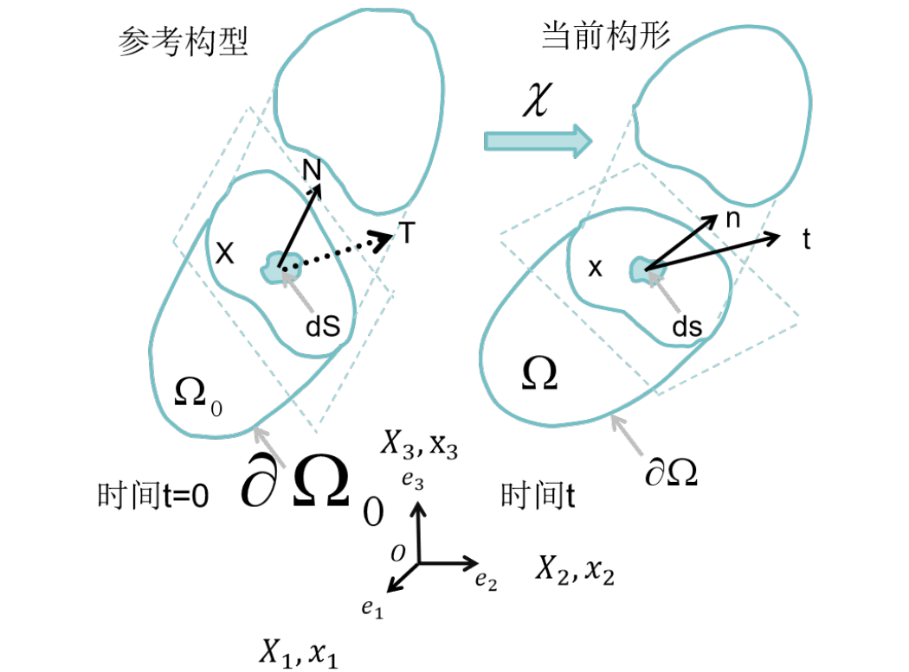
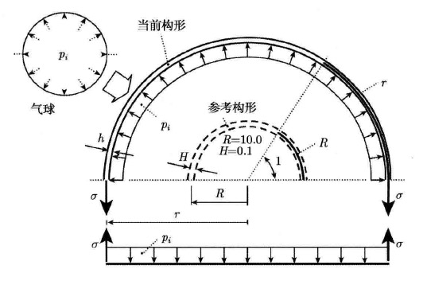
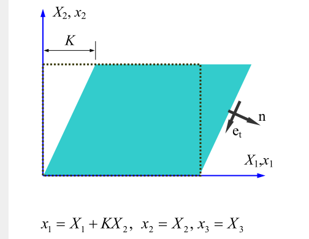
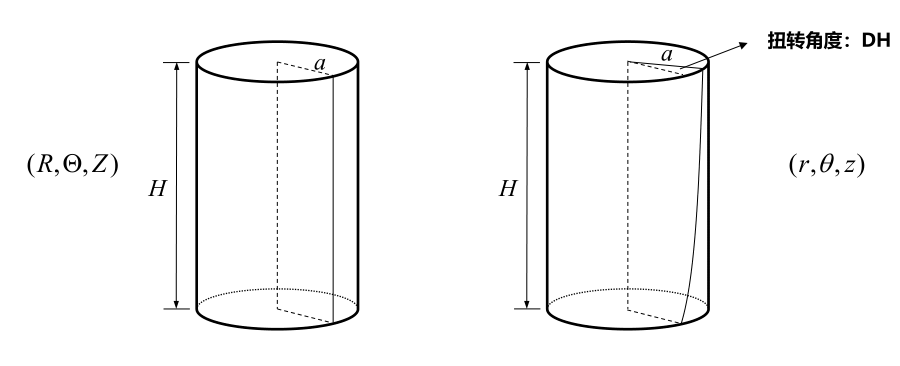

# 张量分析

## 矢量

$a_{i}=\mathbf{a}\cdot\mathbf{e}_{i}$，$\mathbf{a} = a_{i} \mathbf{e}_{i}$

$\delta_{im}a_{m}=a_{i}$，$\delta_{im}T_{mj}=T_{ij}$，$\mathbf{e}_i\cdot\mathbf{e}_j=\delta_{ij}$

$\mathbf{e}_i\times\mathbf{e}_j=\varepsilon_{ijk}\mathbf{e}_k$

$\mathbf{a} \times \mathbf{b} = (a_i \mathbf{e}_i) \times (b_j \mathbf{e}_j) = a_i b_j (\mathbf{e}_i \times \mathbf{e}_j) = a_i b_j \varepsilon_{ijk} \mathbf{e}_k$

$[\mathbf{a} \times \mathbf{b}] = \begin{bmatrix}0 & -a_3 & a_2 \\ a_3 & 0 & -a_1 \\ -a_2 & a_1 & 0\end{bmatrix} [\mathbf{b}]$

$\varepsilon_{ijm}\varepsilon_{klm}=\delta_{ik}\delta_{jl}-\delta_{il}\delta_{jk}$

$\operatorname{det} [\mathbf{A}]=\varepsilon_{ijk}A_{1i}A_{2j}A_{3k}$

## 张量

$\mathbf{T}\mathbf{e}_{i}=T_{ji}\mathbf{e}_{j}$，$T_{ij} = \mathbf{e}_i \cdot \mathbf{T} \mathbf{e}_j$

$(\mathbf T \mathbf S)_{ij}=T_{im}S_{mj}$

$\mathbf{a}\cdot\mathbf{T}\mathbf{b}=\mathbf{b}\cdot\mathbf{T}^{\mathrm{T}}\mathbf{a}$

并矢/张量积 $\otimes$：两个矢量之间的一种“外积”（Outer Product），其结果不是标量也不是矢量，而是一个二阶张量

$$
(\mathbf{a}\otimes\mathbf{b})\mathbf{c}=\mathbf{a}(\mathbf{b}\cdot\mathbf{c}),\quad (\mathbf{a}\otimes\mathbf{b})_{ij} = a_i b_j
$$

$$
\mathbf{T} = T_{ij} \boldsymbol{e}_i \otimes \boldsymbol{e}_j
$$

单位张量 $\mathbf{I} = \delta_{ij} \boldsymbol{e}_i \otimes \boldsymbol{e}_j = \boldsymbol{e}_j \otimes \boldsymbol{e}_j$

$$
\mathbf{A} \mathbf{u} = A_{ij} (\mathbf{e}_i \otimes \mathbf{e}_j) u_k \mathbf{e}_k = A_{ij} u_k \mathbf{e}_i (\mathbf{e}_j \cdot \mathbf{e}_k)= A_{ij} u_j \mathbf{e}_i
$$

$\mathbf{A} \cdot \mathbf{B} = A_{ij} \mathbf{e}_i \otimes \mathbf{e}_j \cdot B_{kl} \mathbf{e}_k \otimes \mathbf{e}_l = A_{ij} B_{kl} (\mathbf{e}_j \cdot \mathbf{e}_k) \mathbf{e}_i \otimes \mathbf{e}_l = A_{ij} B_{jl} \, \mathbf{e}_i \otimes \mathbf{e}_l$

双点积（满足交换律）

$$
\mathbf{A} : \mathbf{B} = (A_{ij} \boldsymbol{e}_i \otimes \boldsymbol{e}_j) : (B_{kl} \boldsymbol{e}_k \otimes \boldsymbol{e}_l) = A_{ij} B_{kl} \delta_{ik} \delta_{jl} = A_{ij} B_{ij}
$$

多个矢量的并矢，称为多并矢。例如 $\boldsymbol a \otimes \boldsymbol b \otimes \boldsymbol c$，称为三阶张量，可以被看作一个将矢量映射到二阶张量的线性算子。

## 坐标变换

**正交张量**（orthogonal tensor）。定义： $|\mathbf{Qa}|=|\mathbf{a}|$，$\cos(\mathbf{a},\mathbf{b})=\cos(\mathbf{Qa},\mathbf{Qb})$。

$\mathbf{Q}^{-1} = \mathbf{Q}^{\mathrm{T}}$

$\det[\mathbf{Q}] = \pm 1$，proper/improper 正（行列式 +1）/反（行列式 -1）正交张量，反正交张量包含反射或旋转-反射。

$\mathbf{Qa}\cdot\mathbf{Qb}=\mathbf{a}\cdot\mathbf{b}$

$\{\mathbf{e}_i\}$ 和 $\{\mathbf{e}_i^\prime\}$ 分别为笛卡尔空间内对应的新旧坐标系的单位基矢量，旧坐标可以通过一个变换矩阵 $\mathbf{Q}$ 到新坐标。$\mathbf{e}_i^{\prime}=\mathbf{Q}\mathbf{e}_i=Q_{mi}\mathbf{e}_m$，$Q_{ij}=\mathbf{e}_i \cdot \mathbf{Q} \mathbf{e}_j=\cos(\mathbf{e}_i,\mathbf{e}_j^{\prime})$。

同一矢量 $\boldsymbol{a}$ 在新旧坐标系 $\boldsymbol{e}_i$ 和 $\boldsymbol{e}'_i$ 下的分量数值分别为 $a_i$ 和 $a'_i$，$a_{i} = Q_{im}a'_{m}$，$[\mathbf{a}]=[\mathbf{Q}][\mathbf{a}']$，$a'_{i} = Q_{mi}a_{m}$，$[\mathbf{a}']=[\mathbf{Q}]^\mathrm{T}[\mathbf{a}]$。

$T_{ij}^{\prime} = Q_{mi}Q_{nj}T_{mn}$，$[\mathbf{T}^{\prime}]=[\mathbf{Q}]^{\mathrm{T}}[\mathbf{T}][\mathbf{Q}]$，$T_{ij}=Q_{im}Q_{jn}T_{mn}'$，$[\mathbf{T}]=[\mathbf{Q}][\mathbf{T}'][\mathbf{Q}]^{\mathrm{T}}$。

> 张量是一个独立于坐标系的物理或几何实体（一个线性映射），矩阵 $[\mathbf{T}]$ 或 $[\mathbf{T}]'$ 只是这个实体在特定坐标系下的分量表示，张量变换公式是物理关系在不同坐标系下保持形式不变而必须满足的协调条件。

$S'_{ijk} = Q_{mi} Q_{nj} Q_{rk} S_{mnr}$，$C'_{ijkl} = Q_{mi} Q_{nj} Q_{rk} Q_{sl} C_{mnrs}$

二阶张量$\mathbf{A}$，若存在非零的单位化矢量 $\hat{\mathbf{n}}_i$，满足

$$
\mathbf{A}\hat{\mathbf{n}}_i = \lambda_i\hat{\mathbf{n}}_i, \quad (i=1,2,3;\text{ no sum})
$$

则称$\lambda_i$为特征值，$\hat{\mathbf{n}}_i$为对应的特征向量。

**主值不变量**（The principal scalar invariants）：描述张量内在属性、不随坐标系变化的量。

$$
\lambda^{3}-I_{1}\lambda^{2}+I_{2}\lambda-I_{3}=0
$$

$$
I_1(\mathbf{A}) = A_{ii} = \mathrm{tr}(\mathbf{A}) = \lambda_1 + \lambda_2 + \lambda_3
$$

$$
I_2(\mathbf{A}) = \frac{1}{2}(A_{ii}A_{jj} - A_{ji}A_{ij}) = \frac{1}{2}[(\mathrm{tr}\mathbf{A})^2 - \mathrm{tr}(\mathbf{A}^2)] \\= \lambda_1\lambda_2 + \lambda_2\lambda_3 + \lambda_1\lambda_3
$$

$$
I_3(\mathbf{A}) = \epsilon_{ijk}A_{1i}A_{2j}A_{3k} = \operatorname{det}[\mathbf{A}] = \lambda_1\lambda_2\lambda_3
$$

张量的谱分解（Spectral decomposition）

令 $\mathbf{I}$ 为以三个特征向量 $\hat{\mathbf{n}}_i$ 为基的单位张量

$$
\mathbf{A} = \mathbf{A}\mathbf{I} = \mathbf{A}(\hat{\mathbf{n}}_i \otimes \hat{\mathbf{n}}_i) = (\mathbf{A}\hat{\mathbf{n}}_i) \otimes \hat{\mathbf{n}}_i = \sum_{i=1}^{3} \lambda_i \hat{\mathbf{n}}_i \otimes \hat{\mathbf{n}}_i
$$

谱分解可以使得一个张量可由它的特征值和特征向量唯一表示，以特征向量为基，其矩阵形式为 $[\mathbf{A}]_{\hat{\mathbf{n}}_i} = \operatorname{diag}(\lambda_i)$

## 张量微积分

张量函数是以张量为自变量的函数。

标量的张量值函数（Tensor-valued functions of a scalar） $\mathbf{T}(t)$。

$$
\frac{d}{dt}(\alpha(t)\mathbf{T}) = \frac{d\alpha}{dt}\mathbf{T} + \alpha\frac{d\mathbf{T}}{dt}
$$

$$
\frac{d}{dt}(\mathbf{T}\mathbf{a}) = \frac{d\mathbf{T}}{dt}\mathbf{a} + \mathbf{T}\frac{d\mathbf{a}}{dt}
$$

$$
\frac{d}{dt}(\mathbf{T}\mathbf{S}) = \frac{d\mathbf{T}}{dt}\mathbf{S} + \mathbf{T}\frac{d\mathbf{S}}{dt}
$$

$$
\frac{d}{dt}(\mathbf{T}^\mathrm{T}) = \left(\frac{d\mathbf{T}}{dt}\right)^\mathrm{T}
$$

梯度算子 $\nabla$

$$
\nabla \cdot (*) = \frac{\partial (*)}{\partial x_i} \cdot \mathbf{e}_i
$$

$$
\nabla \times (*) = \mathbf{e}_i \times \frac{\partial (*)}{\partial x_i}
$$

$$
\nabla \otimes (*) = \frac{\partial (*)}{\partial x_i} \otimes \mathbf{e}_i
$$

标量场、矢量场、张量场的梯度

$$
\operatorname{grad}\phi = \nabla\phi = \frac{\partial \phi}{\partial x_i} \mathbf{e}_i
$$

$$
\operatorname{grad}\mathbf{u} = \nabla \otimes \mathbf{u} = \frac{\partial u_i}{\partial x_j} \mathbf{e}_i \otimes \mathbf{e}_j
$$

$$
\operatorname{grad}\mathbf{A} = \nabla \otimes \mathbf{A} = \frac{\partial A_{ij}}{\partial x_k} \mathbf{e}_i \otimes \mathbf{e}_j \otimes \mathbf{e}_k
$$

矢量场、张量场的散度

$$
\operatorname{div}\mathbf{u} = \nabla \cdot \mathbf{u} = \frac{\partial u_i}{\partial x_i}
$$

$$
\operatorname{div}\mathbf{A} = \nabla \cdot \mathbf{A} = \frac{\partial A_{ij}}{\partial x_j} \mathbf{e}_i
$$

矢量场的旋度

$$
\operatorname{curl}\mathbf{u} = \nabla \times \boldsymbol{u} = \varepsilon_{ijk} \frac{\partial u_j}{\partial x_i} \boldsymbol{e}_k
$$

Laplacian 拉普拉斯算子；$\nabla^2 f = \operatorname{div}(\nabla f) = \operatorname{tr}(\nabla(\nabla f))$；$\nabla^2 \mathbf{v} = \nabla (\operatorname{div} \mathbf{v}) - \operatorname{curl} (\operatorname{curl} \mathbf{v})$；在直角坐标系中 $\nabla^2 f = \frac{\partial^2 f}{\partial x_i \partial x_i}$；$\nabla^{2}\mathbf{v} = \frac{\partial^{2}v_{i}}{\partial x_{\beta}\partial x_{\beta}}\mathbf{e}_{i} = \nabla^{2}v_{i}\mathbf{e}_{i}$

**张量函数的导数**

一个以二阶张量 $\mathbf{A}$ 为变量的标量函数 $\Phi(\mathbf{A})$，导数 $\frac{\partial \Phi(\mathbf{A})}{\partial \mathbf{A}}$ 定义为

$$
\frac{\partial \Phi(\mathbf{A})}{\partial \mathbf{A}} = \frac{\partial \Phi(\mathbf{A})}{\partial A_{ij}} \mathbf{e}_i \otimes \mathbf{e}_j
$$

$$
\frac{\partial \mathrm{tr}(\mathbf{A})}{\partial \mathbf{A}} = \mathbf{I} \qquad \frac{\partial \mathrm{tr}(\mathbf{A}^2)}{\partial \mathbf{A}} = 2\mathbf{A}^\mathrm{T}
$$

$$
\frac{\partial I_2}{\partial \mathbf{A}} = I_1 \mathbf{I} - \mathbf{A}^T \qquad \frac{\partial I_3}{\partial \mathbf{A}} = I_3 \mathbf{A}^{-T} = (\mathbf{A}^T)^2 - I_1 \mathbf{A}^T + I_2 \mathbf{I}
$$

# 运动学

Kinematics

## 运动的描述

系统所有质点在给定时刻的位置的集合被称为系统在该时刻的**构形**（configuration）。

把某个时刻系统的构形作为衡量系统运动和变形的基准，这种构形被称为参考构形 $\Omega_0$（常把 $t=0$ 时刻的构形选作参考构形）。当前时刻的构形称为即时构形 $\Omega$。

物质坐标 $\mathbf X$：某质点P在参考构形的坐标。
空间坐标 $\mathbf x$：空间中的一个位置，不同时刻被不同的质点占据。

局部导数：物理量或者几何量关于时间求导，空间坐标保持不。
物质导数：物理量或者几何量关于时间求导，物质坐标保持不变。

连续介质中一个质点的位移场（displacement field）$\mathbf{u}(\mathbf{X}, t) = \hat{\mathbf{x}}(\mathbf{X}, t) - \mathbf{X}$；描述一般刚体运动的方程 $\hat{\mathbf{x}} = \mathbf{R}(t)(\mathbf{X} - \mathbf{b}) + \mathbf{c}(t)$，其中 $\mathbf{R}(t)$ 是一个旋转张量，满足 $\mathbf{R}(0) = \mathbf{I}$，而 $\mathbf{c}(t)$ 是一个矢量，满足 $\mathbf{c}(0) = \mathbf{b}$。

## 变形

变形梯度张量

$$
\mathbf F = \frac{\partial \mathbf x}{\partial \mathbf X}
$$

物理学要求 $d\mathbf{x}$ 仅在 $d\mathbf{X}$ 为零时才可能为零。因此，$\mathbf{F}^{-1}$ 存在，$d\mathbf{X} = \mathbf{F}^{-1} d\mathbf{x}$；物理学不允许变形中出现反射，因此 $\det \mathbf{F} > 0$。如果 $\mathbf{F}$ 是一个正交张量，则描述刚体位移，没有变形。

$\mathbf{F} = \mathbf{I} + \nabla\mathbf{u}=\nabla \mathbf{x}$

**极分解定理（polar decomposition theorem）**。对于任何具有非零行列式的实张量 $\mathbf{F}$（即 $\mathbf{F}^{-1}$ 存在），$\mathbf{F} = \mathbf{RU}$ 或 $\mathbf{F} = \mathbf{VR}$，$\mathbf{U}$ 和 $\mathbf{V}$ 是正定对称张量，分别称为右拉伸张量（right stretch tensor）和左拉伸张量，而 $\mathbf{R}$（在两个方程中相同）是一个 proper 正交张量。该分解是唯一的。

右柯西-格林变形张量（Cauchy-Green） $\mathbf{C} \equiv \mathbf{U}^2 = \mathbf{F}^{\mathrm{T}}\mathbf{F}$ 和左 Cauchy-Green 张量 $\mathbf{B} \equiv \mathbf{V}^2 = \mathbf{F}\mathbf{F}^{\mathrm{T}}$。

拉格朗日应变张量（Lagrangian finite strain tensor）$\mathbf{E}^* = \frac{1}{2}(\mathbf{C} - \mathbf{I})$；欧拉应变张量（ Eulerian strain tensor）$\mathbf{e}^* = \frac{1}{2} \left( \mathbf{I} - \mathbf{B}^{-1} \right)$。

由于变形引起的面积变化 $dA \mathbf{n} = dA_o J (\mathbf{F}^{-1})^\mathrm{T} \mathbf{n}_o$，其中 $J = |\det \mathbf{F}|$。由于变形引起的体积变化 $dV = J dV_o = \sqrt{\det \mathbf{C}} \, dV_o = \sqrt{\det \mathbf{B}} \, dV_o$。对于不可压缩材料，$dV = dV_o$ 且 $\det \mathbf{F} = \det \mathbf{C} = \det \mathbf{B} = 1$。

推前操作：推前操作指将一个基于参考构形的矢量或张量变换到当前构形。
拉回操作：推前操作是推前操作的逆，指将一个基于当前构形的矢量或张量变换到参考构形。

## 谱分解

右拉伸张量 $\mathbf{U}$ 的特征值 $\lambda_a$，特征向量 $\{\mathbf{N}_a\}$，$a = 1,2,3$。

$$
\mathbf{U} \mathbf{N}_a = \lambda_a \mathbf{N}_a
$$

$$
\mathbf{C} \mathbf{N}_a = \lambda_a^2 \mathbf{N}_a
$$

记 $\mathbf{n}_a = \mathbf{R} \mathbf{N}_a$

$$
\mathbf{V} \mathbf{n}_a = \mathbf{R} \mathbf{U} \mathbf{R}^\mathrm{T} \mathbf{n}_a = \lambda_a \mathbf{n}_a
$$

$$
\mathbf{B} \mathbf{n}_a = \mathbf{V}^2 \mathbf{n}_a = \lambda_a^2 \mathbf{n}_a
$$

$$
\mathbf{F} = \sum \lambda_a \mathbf{n}_a \otimes \mathbf{N}_a
$$

## 无穷小变形

（infinitesimal deformation）

将 $\nabla \mathbf{u}$ 分解为对称部分 $\mathbf{E}$（无穷小应变张量，infinitesimal strain tensor）和反对称部分 $\boldsymbol{\Omega}$（无穷小旋转张量，infinitesimal rotation tensor）。$\mathbf{E} = \frac{1}{2}(\nabla\mathbf{u} + (\nabla\mathbf{u})^T)$，$\boldsymbol{\Omega} = \frac{1}{2}(\nabla\mathbf{u} - (\nabla\mathbf{u})^T)$。$\mathbf{U} \approx \mathbf{V} \approx \mathbf{I} + \mathbf{E}$，$\mathbf{R} \approx \mathbf{I} + \boldsymbol{\Omega}$，$\mathbf{C} \approx \mathbf{B} \approx \mathbf{I} + 2 \mathbf{E}$，$\mathbf{E}^* \approx \mathbf{e}^* \approx \mathbf{E}$。

考虑 $d\mathbf{X} = dS\mathbf{n}$，其中 $\mathbf{n}$ 是单位矢量，$dS$ 是 $d\mathbf{X}$ 的长度 $\frac{ds - dS}{dS} = \mathbf{n} \cdot \mathbf{E}\mathbf{n} = E_{nn} \quad(\text{no sum on } n)$；沿方向 $\mathbf{n}$ 的微元的单位伸长率由 $\mathbf{n} \cdot \mathbf{E}\mathbf{n}$ 给出。$\mathbf{E}$ 的对角元也被称为**正应变**（normal strains）。令 $d\mathbf{X}^{(1)} = dS_1\mathbf{m}$ 和 $d\mathbf{X}^{(2)} = dS_2\mathbf{n}$，其中 $\mathbf{m}$ 和 $\mathbf{n}$ 是相互垂直的单位矢量。设两个变形后矢量 $d\mathbf{x}^{(1)}$ 和 $d\mathbf{x}^{(2)}$ 之间的夹角为 $\theta$，$ds_1 ds_2 \cos\theta = 2dS_1 dS_2 \mathbf{m} \cdot \mathbf{E}\mathbf{n}$；令 $\theta = \frac{\pi}{2} - \gamma$，则 $\gamma$ 衡量了 $d\mathbf{X}^{(1)}$ 和 $d\mathbf{X}^{(2)}$ 之间因变形引起的微小角度减小量（称为**剪应变** shear strain）。$\gamma = 2(\mathbf{m} \cdot \mathbf{E}\mathbf{n})$，$2E_{ij}$ 给出初始位于 $x_i$ 和 $x_j$ 方向的两个微元之间夹角的减小量。

由于应变张量 $\mathbf{E}$ 是对称的，因此至少存在三个相互正交的方向 $(\mathbf{n}_1, \mathbf{n}_2, \mathbf{n}_3)$，使得 $\mathbf{E}$ 的矩阵在此坐标系下为对角阵。从几何上看，这意味着沿方向 $(\mathbf{n}_1, \mathbf{n}_2, \mathbf{n}_3)$ 的无穷小线元在变形后仍保持相互正交。这些方向称为**主方向**（principal directions）。沿主方向的单位伸长量（即 $E_1, E_2, E_3$）是 $\mathbf{E}$ 的特征值，或称**主应变**（principal strains）。它们包括从该质点出发的所有方向中的最大和最小法向应变。

**基本方程**

$$
\boldsymbol{\epsilon} = \frac{1}{2}(\nabla \mathbf{u} + (\nabla \mathbf{u})^T)
$$

平衡方程

$$
\operatorname{div} \boldsymbol{\sigma} + \mathbf{b} = 0
$$

广义胡克定律，对于各向同性线弹性材料：

$$
\boldsymbol{\epsilon} = \frac{1+\nu}{E}\boldsymbol{\sigma} - \frac{\nu}{E}\operatorname{tr}(\boldsymbol{\sigma})\mathbf{I}
$$

$$
\boldsymbol{\sigma} = \lambda \operatorname{tr}(\boldsymbol{\epsilon})\mathbf{I} + 2\mu \boldsymbol{\epsilon}
$$

$\mu = G = \dfrac{E}{2(1+\nu)}$，$\lambda = \dfrac{E\nu}{(1+\nu)(1-2\nu)}$

## 变形的时间变化率

空间速度梯度（Spatial velocity gradient）：空间速度场 $\mathbf{v}(\mathbf{x},t)$ 的导数定义为

$$
\mathbf{L}(\mathbf{x},t) = \operatorname{grad}\mathbf{v}(\mathbf{x},t)
$$

TODO:

- 变形梯度F的物质时间导数可以写成

$$
\dot{\mathbf{F}}(X,t) = \frac{\partial}{\partial t} \left( \frac{\partial \chi(X,t)}{\partial X} \right) = \frac{\partial}{\partial X} \left( \frac{\partial \chi(X,t)}{\partial t} \right)
$$

$$
= \frac{\partial \mathbf{V}(X,t)}{\partial X} = \text{Grad}\mathbf{V}(X,t) \quad or \quad \dot{F}_{aA} = \frac{\partial v_a}{\partial X_A}
$$

变形梯度F的时间变化率，即$\dot{\mathbf{F}} = D\mathbf{F}/Dt$，等于$\text{Grad}\mathbf{V}$，叫做**物质速度梯度**。

$$
\mathbf{l} = \dot{\mathbf{F}} \mathbf{F}^{-1} \quad \frac{\partial v}{\partial x} = \frac{\partial v}{\partial X} \frac{\partial X}{\partial x} = \frac{\partial}{\partial t} \left( \frac{\partial x}{\partial X} \right) \frac{\partial X}{\partial x} = \dot{\mathbf{F}} \mathbf{F}^{-1}
$$

# 应力

面力矢量：由图，对每个面力单元有

$$
\mathrm{d}\mathbf{f} = \mathbf{t}\mathrm{d}s = \mathbf{T}\mathrm{d}S
$$

将面力矢量 $t$ 分解为垂直于截面的分量（正应力 $\sigma_n$）和平行于截面的分量（切应力 $\tau$）。

柯西应力原理

$$
\mathbf{t}(\mathbf{x},t,\mathbf{n}) = \sigma(\mathbf{x}, t)\mathbf{n}
$$

$$
\mathbf{T}(\mathbf{X},t,\mathbf{N}) = P(\mathbf{X}, t)\mathbf{N}
$$

- $\sigma$（柯西应力）：是对称张量（基于角动量守恒），代表物体中真实的物理应力，对应“当前力/当前面积”。
- $P$（PK1应力）：通常是非对称张量，即名义应力（Nominal Stress）。

$$
P = J \sigma F^{-T}
$$

其中 $J$ 是体积变化率（雅可比行列式，$J = \det(F)$），$F$ 是变形梯度张量。

$$
S = F^{-1} P = J F^{-1} \sigma F^{-T}
$$

（PK2应力）具有对称性，目标是把所有物理量都拉回到初始构型中去描述。

Kirchhoff应力张量 $\tau = J \sigma$

$$
\tau = F S F^T
$$

# 基本定律

封闭系统(物质/拉格朗日描述)

- 关注某物质的运动
- 以物质坐标 $\mathbf X$ 为自变量
- 能量可以通过控制边界

开放系统(空间/欧拉描述)

- 注视空间中某固定体积单元
- 以空间坐标 $\mathbf x$ 为自变量
- 质量和能量均可以通过控制边界

**雷诺输运定理**

在 $t$ 时刻，标量场 $\Phi(x,t)$ 表示欧拉描述下的单位体积某物理量，在 $\Omega$ 空间的积分值：

$$
I(t) = \int_{\Omega} \Phi(\mathbf x,t) d v=\int_{\Omega_0} \Phi(\mathbf x(\mathbf X,t),t) J(\mathbf X,t) \, dV
$$

$$
\begin{aligned}
\dot{J} &= \frac{\partial J}{\partial F} : \dot{F} = J F^{-T} : \dot{F} = J F^{-T} : L F \\
&= J F^{-T} F^{T} : L = J I : L \\
&= J I : \text{grad} \mathbf{v} = J \cdot \text{tr}(\text{grad} \mathbf{v}) \\
&= J \cdot \text{div} \mathbf{v}
\end{aligned}
$$

由于物体运动，$\Phi$在欧拉描述下的积分边界是随时间变化的。

$$
\frac{D}{Dt} \int_{\Omega} \Phi dv = \int_{\Omega} [\dot{\Phi} + \Phi \, \operatorname{div} \mathbf{v}] dv = \int_{\Omega} \frac{\partial \Phi}{\partial t} dv + \int_{\partial \Omega} \Phi \mathbf{v} \cdot \mathbf{n} \, ds
$$

**质量守恒定律**

$$
\rho_0 = \rho J ,\qquad \dot{\rho}_0 = 0
$$

$$
\frac{\partial \rho}{\partial t} + \operatorname{div}(\rho \mathbf v) = 0
$$

动量守恒定律

$$
L(t) = \int_{\Omega} \rho(\mathbf{x}, t) \mathbf{v}(\mathbf{x}, t) d v = \int_{\Omega_0} \rho_0(\mathbf{X}) \mathbf{V}(\mathbf{X}, t) d V
$$

$$
\frac{D}{Dt}L(t)=\mathbf{F}(t)
$$

$$
\mathbf{F}(t) = \int_{\Omega} (\operatorname{div}\boldsymbol\sigma +\mathbf b)dv
$$

$$
\operatorname{div}\boldsymbol\sigma +\mathbf b = \rho \dot{\mathbf{v}}
$$

在拉格朗日描述（参考构型）下，内力做功的功率 $\mathcal{P}_{int}$ 定义为第一皮奥拉-基尔霍夫应力 $\mathbf{P}$ 与变形速度梯度 $\dot{\mathbf{F}}$ 的双点积（张量内积）：

$$
\mathcal{P}_{int} = \mathbf{P} : \dot{\mathbf{F}} = \text{tr}(\mathbf{P} \cdot \dot{\mathbf{F}}^T)
$$

# 超弹性理论

## 客观性和各向同性

**客观性**（Objectivity）：无论观察者站在哪里、或者如何移动（旋转、平移），物体内部的受力状态和储存的能量不应该发生改变

欧几里得变换（Euclidean Transformation）

$$
\mathbf{x}^+ = \mathbf{c}(t) + \mathbf{Q}(t)\mathbf{x}
$$

- $\mathbf{x}$：物体原来的空间位置。
- $\mathbf{x}^+$：变换后（观察者眼中）的位置。

变形梯度 $\mathbf{F}$ 定义为当前构型 $\mathbf{x}$ 对参考构型 $\mathbf{X}$ 的导数：$\mathbf{F} = \partial \mathbf{x} / \partial \mathbf{X}$。$\mathbf{F}^+ = \mathbf{Q}\mathbf{F}$，说明变形梯度 $\mathbf{F}$ 不是客观的（或者说不是不变的），不能直接用 $\mathbf{F}$ 来描述材料的能量。

1. $\mathbf{F}^+ = \mathbf{R}^+\mathbf{U}^+$（新状态下的极分解）。
2. $\mathbf{F}^+ = \mathbf{Q}\mathbf{F} = \mathbf{Q}(\mathbf{R}\mathbf{U}) = (\mathbf{Q}\mathbf{R})\mathbf{U}$。
3. 根据极分解的唯一性，得到：
    - 新的旋转：$\mathbf{R}^+ = \mathbf{Q}\mathbf{R}$（旋转叠加了）。
    - 新的伸长：$\mathbf{U}^+ = \mathbf{U}$。

说明 $\mathbf{U}$ 是一个不依赖于观察者、不依赖于刚体运动的物理量。

材料的应变能密度函数（本构关系）必须写成 $\mathbf{U}$（或者 $\mathbf{C} = \mathbf{U}^2$）的函数，而不能直接是 $\mathbf{F}$ 的任意函数。因为只有 $\mathbf{U}$ 剥离了刚体转动，只保留了纯变形信息。

**各向同性**（Isotropic）：材料的响应在所有方向上都是相同的。

- 有两个参考构型：原始的 $\Omega_0$ 和旋转后的 $\Omega_0^+$。
- 关系是：$\mathbf{X}^+ = \mathbf{c} + \mathbf{Q}\mathbf{X}$。这意味着我们在做实验前，先把材料试件转动了一个角度 $\mathbf{Q}$。
- 然后，把这两个试件变形到同一个当前状态 $\mathbf{x}$。

$$
\mathbf{F}^+ = \mathbf{F}\mathbf{Q}^{-1} = \mathbf{F}\mathbf{Q}^T
$$

如果材料是各向同性的，那么不管你先把材料转动多少度再拉伸，它储存的弹性能量 $\Psi$ 应该是完全一样的，$\Psi(\mathbf{F}) = \Psi(\mathbf{F}^+) = \Psi(\mathbf{F}\mathbf{Q}^T)$。

同时满足客观性和各向同性：

$$
\Psi(\mathbf{C}) = \Psi(\mathbf{Q}\mathbf{C}\mathbf{Q}^T)
$$

要满足这个条件，$\Psi$ 不能随意依赖于 $\mathbf{C}$ 的各个分量，而**只能依赖于 $\mathbf{C}$ 的不变量（Invariants）**。各向同性材料的能量函数必须写成**不变量 $I_1, I_2, I_3$ 的函数**。

## 从能量函数推导出应力

超弹性材料的特点是：应力只取决于当前的变形状态，且做功与路径无关（保守场）。

亥姆霍兹自由能（Helmholtz free-energy）$\Psi$：表示单位参考体积内储存的弹性能量，它是变形梯度 $\mathbf{F}$ 的函数。

第一皮奥拉-基尔霍夫应力（The first Piola-Kirchhoff stress tensor）$\mathbf{P}$：“名义应力”，即力除以变形前的面积。

$$
\mathbf{P} = \frac{\partial \Psi(\mathbf{F})}{\partial \mathbf{F}}
$$

柯西应力 $\boldsymbol{\sigma}$：工程中常用的“真应力”，即力除以变形后的面积

$$
\boldsymbol{\sigma} = J^{-1} \mathbf{P} \mathbf{F}^\mathrm{T}
$$

$\mathbf{F}$ 包含刚体旋转，不是一个好的状态变量。要用右柯西-格林张量 $\mathbf{C} = \mathbf{F}^T\mathbf{F}$ 来代替 $\mathbf{F}$。

推导技巧：利用功率共轭（能量变化率相等）

1. 能量随时间的变化率 $\dot{\Psi}$ 是唯一的。
2. 用 $\mathbf{F}$ 表示：$\dot{\Psi} = \text{tr}(\frac{\partial \Psi}{\partial \mathbf{F}}^T \dot{\mathbf{F}})$
3. 用 $\mathbf{C}$ 表示：$\dot{\Psi} = \text{tr}(\frac{\partial \Psi}{\partial \mathbf{C}} \dot{\mathbf{C}})$
4. 利用关系 $\dot{\mathbf{C}} = \dot{\mathbf{F}}^T\mathbf{F} + \mathbf{F}^T\dot{\mathbf{F}}$ 代入对比。

$$
\frac{\partial \Psi}{\partial \mathbf{F}} = 2 \mathbf{F} \frac{\partial \Psi}{\partial \mathbf{C}}
$$

最终得到：

$$
\mathbf{P} = 2 \mathbf{F} \frac{\partial \Psi(\mathbf{C})}{\partial \mathbf{C}}
$$

第二皮奥拉-基尔霍夫应力 $\mathbf{S} = \mathbf{F}^{-1}\mathbf{P}$：

$$
\mathbf{S} = 2 \frac{\partial \Psi(\mathbf{C})}{\partial \mathbf{C}}
$$

## 以不变量作为自变量的自由能

对于各向同性材料，能量 $\Psi$ 必须是应变不变量的函数，即 $\Psi(I_1, I_2, I_3)$。

$$
\frac{\partial \Psi}{\partial \mathbf{C}} = \frac{\partial \Psi}{\partial I_1}\frac{\partial I_1}{\partial \mathbf{C}} + \frac{\partial \Psi}{\partial I_2}\frac{\partial I_2}{\partial \mathbf{C}} + \frac{\partial \Psi}{\partial I_3}\frac{\partial I_3}{\partial \mathbf{C}}
$$

$$
\frac{\partial I_1}{\partial \mathbf{C}} = \mathbf{I}
$$

$$
\frac{\partial I_2}{\partial \mathbf{C}} = I_1 \mathbf{I} - \mathbf{C}
$$

$$
\frac{\partial I_3}{\partial \mathbf{C}} = I_3 \mathbf{C}^{-1}
$$

各向同性材料的 PK2 应力，一定是 $\mathbf{I}, \mathbf{C}, \mathbf{C}^{-1}$ 这三个张量的线性组合。

柯西应力，利用转换公式 $\boldsymbol{\sigma} = J^{-1} \mathbf{F} \mathbf{S} \mathbf{F}^T$，和哈密尔顿-凯莱定理（Cayley-Hamilton Theorem）：

$$
\mathbf{b}^2 - I_1 \mathbf{b} + I_2 \mathbf{I} - I_3 \, \mathbf{b}^{-1} = 0
$$

$$
\boldsymbol{\sigma} = 2J^{-1} \left[ \left(I_2 \frac{\partial \Psi}{\partial I_2} + I_3 \frac{\partial \Psi}{\partial I_3}\right) \mathbf{I} + \frac{\partial \Psi}{\partial I_1} \mathbf{b} - I_3 \frac{\partial \Psi}{\partial I_2} \mathbf{b}^{-1} \right]
$$

各向同性材料的真实应力，其主轴方向一定与左柯西-格林张量 $\mathbf{b}$ 的主轴重合（同轴性）。

在主轴坐标系下，张量变成对角矩阵，$\mathbf{C}$ 的特征值就是主伸长的平方 $\lambda_a^2$。
能量可以直接写成主伸长的函数：$\Psi(\lambda_1, \lambda_2, \lambda_3)$。

**主 PK1 应力**：$\displaystyle P_a = \frac{\partial \Psi}{\partial \lambda_a}$

**主 PK2 应力**：$\displaystyle S_a = \frac{1}{\lambda_a} \frac{\partial \Psi}{\partial \lambda_a}$

**主柯西应力**：$\displaystyle \sigma_a = J^{-1} \lambda_a \frac{\partial \Psi}{\partial \lambda_a}$

$J = \lambda_1 \lambda_2 \lambda_3$

## 不可压缩性

**不可压缩性**（Incompressibility）：核心约束：$J = \det \mathbf{F} = 1$。

因为体积不能变，所以我们无法通过体积的变化（膨胀/收缩）来计算压强。压强变成了一个“为了维持体积不变”而产生的**反作用力**，而不是由变形直接决定的。

拉格朗日乘子法（Lagrange Multiplier）

$$
W = \Psi(\mathbf{F}) - p(J-1)
$$

这里引入了一个新的变量 $p$（拉格朗日乘子）。在物理上，正好对应静水压力（Hydrostatic Pressure）。

$\partial J / \partial \mathbf{F} = J \mathbf{F}^{-\mathrm{T}}$

$$
\boldsymbol{\sigma} = -p\mathbf{I} + \mathbf{F}\left( \frac{\partial \Psi}{\partial \mathbf{F}} \right)^\mathrm{T}
$$

对于不可压缩各向同性材料：

- $I_3 = \det \mathbf{C} = J^2 = 1$。
- 能量函数 $\Psi$ 只需要写成 $I_1$ 和 $I_2$ 的函数：$\Psi(I_1, I_2)$。

$$
\boldsymbol{\sigma} = -p\mathbf{I} + 2 \frac{\partial \Psi}{\partial I_1}\mathbf{b} - 2 \frac{\partial \Psi}{\partial I_2}\mathbf{b}^{-1}
$$

在主轴坐标系下，变形梯度 $\mathbf{F}$ 是一个对角矩阵，对角线元素就是三个方向的伸长比 $\lambda_1, \lambda_2, \lambda_3$。

不可压缩条件：$J = \det \mathbf{F} = \lambda_1 \lambda_2 \lambda_3 = 1$

$\Psi = \Psi(\lambda_1, \lambda_2, \lambda_3) - p(J-1)$

三个方向 ($a=1,2,3$) 上的**主应力**公式

柯西主应力：$\displaystyle \sigma_a = -p + \lambda_a \frac{\partial \Psi}{\partial \lambda_a}$

主 PK1 应力：$\displaystyle P_a = -\frac{1}{\lambda_a} p + \frac{\partial \Psi}{\partial \lambda_a} = \lambda_a^{-1} \sigma_a$

主 PK2 应力：$\displaystyle S_a = -\frac{1}{\lambda_a^2} p + \frac{1}{\lambda_a} \frac{\partial \Psi}{\partial \lambda_a} = \lambda_a^{-2} \sigma_a$

## 超弹性本构模型

neo-Hookean模型 $\displaystyle \Psi = \frac{G}{2}(I_1 - 3)$

Mooney-Rivlin模型 $\displaystyle \Psi = c_{10}(I_1 - 3) + c_{20}(I_2 - 3)$

Gent模型 $\displaystyle \Psi = -\frac{G}{2}J_m \ln(1 - \frac{I_1 - 3}{J_m})$

Ogden 模型 $\displaystyle \Psi = \sum_{n=1}^{N} \frac{G_n}{\alpha_n}(\lambda_1^{\alpha_n} + \lambda_2^{\alpha_n} + \lambda_3^{\alpha_n} - 3)$

# 简单模型

## 一维拉伸

假设我们在方向1拉伸（$\lambda_1 = \lambda$），方向2和3自由收缩，$\sigma_2 = \sigma_3 = 0$。

不可压缩 $\lambda_1\lambda_2\lambda_3 = 1$

$$
\lambda_1 = \lambda, \quad \lambda_2 = \lambda_3 = \frac{1}{\sqrt{\lambda}}
$$

右柯西-格林张量等于左 Cauchy-Green 张量

$$
\mathbf{C} = \mathbf{b} = \lambda^2 \mathbf{e}_1 \otimes \mathbf{e}_1 + \frac{1}{\lambda} (\mathbf{e}_2 \otimes \mathbf{e}_2 + \mathbf{e}_3 \otimes \mathbf{e}_3)
$$

$$
I_1 = \lambda^2 + \frac{2}{\lambda}
$$

$$
p = \lambda_2 \frac{\partial \Psi}{\partial \lambda_2}
$$

$$
\sigma_1 = \lambda_1 \frac{\partial \Psi}{\partial \lambda_1} - \lambda_2 \frac{\partial \Psi}{\partial \lambda_2}
$$

## 球充气

球对称问题，球面内的任何方向均为主方向，等双轴变形（Equibiaxial deformation）

周向伸长比 $\lambda = \lambda_1 = \lambda_2$

周向Cauchy应力 $\sigma = \sigma_1 = \sigma_2$

平面应力问题：$\sigma_3 = 0$

静力平衡（取半个气球进行受力分析）

$$
\pi r^2 p = 2 \pi r h \sigma
$$

不可压缩，体积守恒

$$
4\pi r^2 h = 4\pi R^2 H
$$

> 注意本构关系中的 $p_0$ 与实际充气压力 $p$ 不同，前者是拉格朗日乘子，后者是实际的物理压力。

## 简单剪切

$$
[\mathbf{F}] = \begin{bmatrix} 1 & K & 0 \\ 0 & 1 & 0 \\ 0 & 0 & 1 \end{bmatrix} ,\qquad [\mathbf{b}] = \begin{bmatrix} 1 + K^2 & K & 0 \\ K & 1 & 0 \\ 0 & 0 & 1 \end{bmatrix}
$$

$$
I_1 = 3 + K^2, \quad I_2 = 3 + K^2, \quad I_3 = 1
$$

$$
\boldsymbol{\sigma} = -p\mathbf{I} + 2\frac{\partial\Psi}{\partial I_1}\mathbf{b} - 2\frac{\partial\Psi}{\partial I_2}\mathbf{b}^{-1}
$$

$$
\left\{
\begin{aligned}
\sigma_{11} &= -p + 2(1 + K^2)\frac{\partial\Psi}{\partial I_1} - 2\frac{\partial\Psi}{\partial I_2} \\
\sigma_{22} &= -p + 2\frac{\partial\Psi}{\partial I_1} - 2(1 + K^2)\frac{\partial\Psi}{\partial I_2} \\
\sigma_{33} &= -p + 2\frac{\partial\Psi}{\partial I_1} - 2\frac{\partial\Psi}{\partial I_2} \\
\sigma_{12} &= 2K\left(\frac{\partial\Psi}{\partial I_1} + \frac{\partial\Psi}{\partial I_2}\right) \\
\sigma_{13} &= \sigma_{23} = 0
\end{aligned}
\right.
$$

平面应力

$$
\sigma_{33}=0 \Rightarrow p=2\left(\frac{\partial \Psi}{\partial I_{1}}-\frac{\partial \Psi}{\partial I_{2}}\right)
$$

$$
\sigma_{11}=2 K^{2} \frac{\partial \Psi}{\partial I_{1}}, \quad \sigma_{22}=-2 K^{2} \frac{\partial \Psi}{\partial I_{2}}, \quad \sigma_{33}=0
$$

$$
\sigma_{12}=2 K\left(\frac{\partial \Psi}{\partial I_{1}}+\frac{\partial \Psi}{\partial I_{2}}\right), \quad \sigma_{13}=\sigma_{23}=0
$$

$$
\mathbf{n}=\frac{\mathbf{e}_{1}-K \mathbf{e}_{2}}{\sqrt{1+K^{2}}}, \quad \mathbf{e}_{t}=\frac{K \mathbf{e}_{1}+\mathbf{e}_{2}}{\sqrt{1+K^{2}}}
$$

$$
[\mathbf{t}]=[\boldsymbol{\sigma}][\mathbf{n}]=\frac{K}{\sqrt{1+K^{2}}}\left\{\begin{array}{c} -2 K \frac{\partial \Psi}{\partial I_{2}} \\ 2 \frac{\partial \Psi}{\partial I_{1}}+2\left(1+K^{2}\right) \frac{\partial \Psi}{\partial I_{2}} \end{array}\right\}
$$

$$
\sigma_{n}=\mathbf{t} \cdot \mathbf{n}=-\frac{2 K^{2}}{1+K^{2}}\left[\frac{\partial \Psi}{\partial I_{1}}+\left(2+K^{2}\right) \frac{\partial \Psi}{\partial I_{2}}\right]
$$

$$
\tau_{n}=\mathbf{t} \cdot \mathbf{e}_{t}=\frac{2 K}{1+K^{2}}\left(\frac{\partial \Psi}{\partial I_{1}}+\frac{\partial \Psi}{\partial I_{2}}\right)
$$

普适关系：$\sigma_{11}-\sigma_{22}=K \sigma_{12}$

## 圆柱扭转

$$
r = R ,\quad \theta = \Theta + DZ ,\quad z = Z
$$

$$
[\mathbf{F}] = \begin{bmatrix}
1 & 0 & 0 \\
0 & 1 & Dr \\
0 & 0 & 1
\end{bmatrix}
$$

$$
[\mathbf{b}] = [\mathbf{F} \mathbf{F}^\mathrm{T}] = \begin{bmatrix}
1 & 0 & 0 \\
0 & 1 + D^2 r^2 & Dr \\
0 & Dr & 1
\end{bmatrix}
\quad
[\mathbf{b}]^{-1} = \begin{bmatrix}
1 & 0 & 0 \\
0 & 1 & -Dr \\
0 & -Dr & 1 + D^2 r^2
\end{bmatrix}
$$

$$
I_1 = 3 + D^2 r^2, \quad I_2 = 3 + D^2 r^2
$$

$$
\boldsymbol { \sigma } = - p \mathbf { I } + 2 \frac { \partial \Psi } { \partial I _ { 1 } } \mathbf { b } - 2 \frac { \partial \Psi } { \partial I _ { 2 } } \mathbf { b } ^ { - 1 }
$$

$$
\left\{ \begin{array} { l } { { \sigma _ { r r } = - p + 2 ( \frac { \partial \Psi } { \partial I _ { 1 } } - \frac { \partial \Psi } { \partial I _ { 2 } } ) } } \\ { { \sigma _ { \theta \theta } = - p + 2 \frac { \partial \Psi } { \partial I _ { 1 } } ( 1 + D ^ { 2 } r ^ { 2 } ) - 2 \frac { \partial \Psi } { \partial I _ { 2 } } } } \\ { { \sigma _ { z z } = - p + 2 \frac { \partial \Psi } { \partial I _ { 1 } } - 2 \frac { \partial \Psi } { \partial I _ { 2 } } ( 1 + D ^ { 2 } r ^ { 2 } ) } } \\ { { \sigma _ { \theta z } = 2 ( \frac { \partial \Psi } { \partial I _ { 1 } } + \frac { \partial \Psi } { \partial I _ { 2 } } ) D r } } \\ { { \sigma _ { r z } = \sigma _ { r \theta } = 0 } } \end{array} \right.
$$

平衡方程

$$
\left\{
\begin{aligned}
&\frac{\partial \sigma_{rr}}{\partial r} + \frac{\sigma_{rr} - \sigma_{\theta\theta}}{r} + \rho b_r = 0 \\
&\frac{\partial \sigma_{r\theta}}{\partial r}+ \frac{2\sigma_{r\theta}}{r} + \rho b_\theta = 0 \\
&\frac{\partial \sigma_{rz}}{\partial r} + \frac{\sigma_{rz}}{r} + \rho b_z = 0
\end{aligned}
\right.
$$

$$

-\frac{\partial p}{\partial r} + 2 \frac{\partial}{\partial r} \left( \frac{\partial \Psi}{\partial I_1} - \frac{\partial \Psi}{\partial I_2} \right) - 2 D^2 r \frac{\partial \Psi}{\partial I_1} = 0
$$

$$
\Rightarrow \quad p(r) = 2 \left( \frac{\partial \Psi}{\partial I_1} - \frac{\partial \Psi}{\partial I_2} \right) - 2 D^2 \int^r x \frac{\partial \Psi(x)}{\partial I_1(x)} dx + \text{const}
$$

$$
\sigma_{rr} = 2D^2 \int^r x \frac{\partial \Psi(x)}{\partial I_1(x)} dx + const
$$

边界条件

$$
\sigma_{rr}(a) = 0, \sigma_{r\theta}(a) = 0, \sigma_{rz}(a) = 0
$$

$$
\sigma_{rr}(r) = 2D^2 \int_a^r x \frac{\partial \Psi(x)}{\partial I_1(x)} dx
$$

$$
\sigma_{zz}(r) = 2D^2 \int_a^r x \frac{\partial \Psi(x)}{\partial I_1(x)} dx - 2D^2 r^2 \frac{\partial \Psi(r)}{\partial I_2(r)}
$$

扭矩和轴向力

$$
M = \int_{0}^{a} \int_{0}^{2\pi} \sigma_{z\theta} r^2 dr d\theta = 4\pi D \int_{0}^{a} r^3 \left( \frac{\partial \Psi}{\partial I_1} + \frac{\partial \Psi}{\partial I_2} \right) dr
$$

$$
N = \int_{0}^{a} \int_{0}^{2\pi} \sigma_{zz} r dr d\theta = 2\pi \int_{0}^{a} \sigma_{zz} r dr
$$

