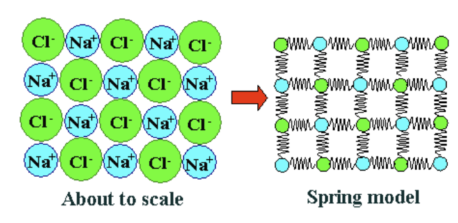
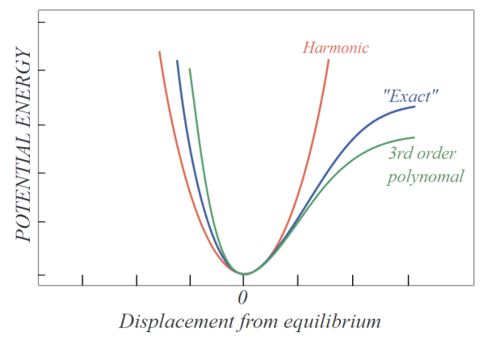

#! https://zhuanlan.zhihu.com/p/609219797
# 量子力学速通(2)量子系统

<!-- [上一章](https://zhuanlan.zhihu.com/p/608306983)我们了解了

观察式(1)，我们发现解是可数个的波函数的线性组合，这揭示了量子力学的一个基本原理，即**量子态叠加原理**。

下面将介绍量子态，以及量子叠加态的性质。

--- -->

## 量子态

[上一章](https://zhuanlan.zhihu.com/p/608306983)提到，对于一个微观粒子，我们可以用一个波函数描述。那么，对于一个量子系统（比如如多粒子系统），如何描述？

答案仍旧是波函数，因为量子力学的基本假设之一就是：对于任何一个量子系统，它的状态和该状态所决定的物理性质都可用波函数表示。因此，波函数又称态函数。

然而，描述一个量子系统的波函数是唯一的吗？

我们考虑一个描述粒子的波函数$\psi(\boldsymbol{r})$，则该粒子出现在$\boldsymbol{r}$点的概率为$|\psi(\boldsymbol{r})|^2$。如果测量其动量，则其动量为$\boldsymbol{p}$的概率密度为$|\varphi(\boldsymbol{p})|^2$。通过薛定谔方程，可以得到$\psi(\boldsymbol{r})$和$\varphi(\boldsymbol{p})$有如下关系
$$
\varphi(\boldsymbol{p})=\frac{1}{(2 \pi \hbar)^{3 / 2}} \int \psi(\boldsymbol{r}) \mathrm{e}^{-\mathrm{i} \boldsymbol{p} \cdot \boldsymbol{r} / h} \mathrm{~d}^{3} \boldsymbol{r}
$$

$$
\psi(\boldsymbol{r})=\frac{1}{(2 \pi \hbar)^{3 / 2}} \int \varphi(\boldsymbol{p}) \mathrm{e}^{\mathrm{i} \boldsymbol{p} \cdot \boldsymbol{r} / h} \mathrm{~d}^{3} \boldsymbol{p}
$$

因此，$\varphi(\boldsymbol{p})$也可以描述一个微观粒子。这提示我们用一个更抽象的概念来表示量子系统的状态，即**量子态**。

粒子的量子态，既可以用$\psi(\boldsymbol{r})$描述，也可以用$\varphi(\boldsymbol{p})$来描述（还可以有其他描述方式）。它们彼此间有确定的变换关系，彼此完全等价。它们描述的都是同一个量子态，只不过**表象**不同而已，这犹如一个矢量可以采用不同的坐标系来表述一样。我们称$\psi(\boldsymbol{r})$是量子态在坐标表象中的表示，而$\varphi(\boldsymbol{p})$则是同一个状态在动量表象中的表示。

## 希尔伯特空间

之前，我们把量子系统的状态抽象为量子态这个概念。那么，如何用数学描述描述量子态？

波函数并不合适，因为波函数只是量子态的一个表象。事实上，量子态可以用希尔伯特空间的一个向量表示。

所谓希尔伯特空间，就是完备的内积空间。所谓内积空间，就是定义了内积的线性空间。（具体内容大家自学吧，这里不打出来了）

希尔伯特空间中的向量可能为一个列矩阵，也可能为一个复变函数。但是，这不是量子态的具体形式，只是代表了量子态。可以理解为，量子态与希尔伯特空间的向量，一一对应。这是因为在量子力学中，量子系统的状态空间，与希尔伯特空间是同构的。

我们用$|\varphi\rangle$表示量子态映射到希尔伯特空间的向量。

既然量子态可以映射到希尔伯特空间，那么可观测的物理量也可以映射到希尔伯特空间。可观测的物理量可以用希尔伯特空间中的厄米算符表示。

## 可观测的物理量

记可观测物理量对应的厄米算符为$O$，则可求得其特征值与特征向量$\lambda_{i},\left|b_{i}\right\rangle$，或者称之为本征值和本征态
$$
O\left|b_{i}\right\rangle=\lambda_{i}\left|b_{i}\right\rangle 
$$

则本征值$\lambda_{i}$表示该物理量被测到的可能值（厄米算符的特征值一定为实数），而测得该值的概率为$\left|\left\langle b_{i} \mid \varphi\right\rangle\right|^{2}$（至于为什么这样……这里太小，写不下）。其中$\left|\left\langle b_{i} \mid \varphi\right\rangle\right|$表示本征态$\left|b_{i}\right\rangle$与量子态$|\varphi\rangle$的内积。而可观测量的期望值为
$$
\langle O\rangle=\langle\varphi|O| \varphi\rangle
$$
其中$\langle\varphi|$表示$|\varphi\rangle$的对偶。

由于厄米算符的特征向量是正交完备的，所以有
$$
|\varphi\rangle=\sum_{i=1}^{n} {a_{i} \left|b_{i}\right\rangle}
$$
其中$n$表示本征态的数目；$a_{i}= \left\langle b_{i} \mid \varphi\right\rangle$。

这里就引出了一件非常有意思的事。如果，我们测量一个量子态$\left|b_{i}\right\rangle$，那么测得的值为$\lambda_{i}$，之后的量子态仍旧为$\left|b_{i}\right\rangle$。这是没有异议的。

如果测量一个量子态$|\varphi\rangle$，那么测得的值为$\lambda_{i}$的概率为$\left|a_{i}\right|^{2}$。假设测得的值为$\lambda_{k}$，那么之后量子态是什么？

也许你会认为仍旧是$|\varphi\rangle$。但是，实验告诉我们，量子态变为了$\left|b_{k}\right\rangle$！！！这种现象被称为量子态坍缩。

为了说明这个现象，量子力学添加了一个基本假设，量子测量假设：当对一个量子体系进行某一力学量的测量时，测量结果一定为该力学量算符的本征值当中的某一个，测量结果为$\lambda_{i}$的概率为$\left|\left\langle b_{i} \mid \varphi\right\rangle\right|^{2}$；当测量完成后，该量子体系塌缩至$\left|b_{k}\right\rangle$（即不管再对该量子态重新测量多少次，测得的该力学量的值一定为第一次所测得的值$\lambda_{k}$）。

对量子测量假设的解释有很多，比如说测量仪器的影响，存在隐变量，意识的作用（？？），多元宇宙说（？？？）。薛定谔的猫这个思维实验也是基于量子测量假设假设提出的。虽然量子测量假设有许多疑问，但这并不妨碍其成为量子力学的基石。

> 当然，还存在简并的情况，即两个或多个本征态拥有相同的本征值。在这种情况下，测量不会确定系统将坍塌到哪一个本征态上。
> 
> 具体来说，假设一个系统处于一个两重简并本征态中，即有两个本征态对应同一个本征值。当我们测量这个量子系统时，我们可以得到相应的本征值，但是我们无法确定系统会坍塌到哪一个简并本征态上，因为这两个本征态是等价的。这种情况下，系统将坍塌到这两个简并本征态的线性组合中的一个，这个线性组合满足量子力学中的一般坍塌规则：坍塌到任意一个态的概率与其在线性组合中的系数的模长的平方成正比。
> 
> 因此，当测量得到简并本征值时，量子态会坍塌到一个简并本征态的线性组合中的一个，但是我们无法确定坍塌到哪一个本征态上，只能得到坍塌到每一个本征态的概率。这种现象称为简并坍塌。

## 不确定性原理

之前我们求了可观测量的期望。同样，我们也可以求可观测量的方差。对于厄米算符$A$，其方差为
$$
(\Delta A)^{2}=\left\langle\varphi\left|(A-\langle A\rangle)^{2}\right| \varphi\right\rangle
$$

则对于两个厄米算符$A,B$，有一个不等式
$$
\Delta A \Delta B \geq\left|\frac{\langle[A, B]\rangle}{2}\right|
$$
其中$[A, B]=A B- B A$。

这说明可观测量$A,B$的值不能同时确定。这被称为不确定性原理。

在一维粒子运动过程中，坐标算符$\hat{x}=x$，动量算符$\hat{p}=-\mathrm{i} \hbar \frac{\partial}{\partial x}$。则有
$$
[\hat{x}, \hat{p}]=i \hbar
$$

这就是正则对易关系。则有
$$
\Delta x \Delta p \geq \frac{\hbar}{2}
$$
想必学过高中物理的，都知道上面这个公式。

## 量子态的演化

量子态的演化满足薛定谔方程
<!-- $$
\mathrm{i} \hbar \frac{\mathrm{d}}{\mathrm{d} t}|\psi\rangle=\hat{H}|\psi\rangle
$$
其中，$\hat{H}$为系统的哈密顿算符，$\hbar$为约化普朗克常数。 -->

$$
\mathrm{i} \hbar\frac{\partial}{\partial t} \psi =\hat{H} \psi \tag{3}
$$
注意这里的薛定谔方程的形式与上一章的不同。因为上一章的形式只适用于粒子的运动，而这里的形式适用于更多种类的量子系统。
其中，$\hat{H}$为系统的哈密顿算符，$\hbar$为约化普朗克常数。

如何将式(3)与上一章的薛定谔方程联系起来？

这里先补充一下经典力学的知识。在经典力学中，总能量称为哈密顿量$H$。对于一维粒子，哈密顿量就是动能加势能
$$
H=\frac{p^2}{2 m}+V \tag{4}
$$

微观体系的每个可观测量的物理量都对应着厄米算符，在这里有$p \rightarrow(\hbar / \mathrm{i})(\partial / \partial x)$，将其应用于式(4)，有
$$
\hat{H}=-\frac{\hbar^{2}}{2 m} \frac{\partial^{2}}{\partial x^{2}}+V \tag{5}
$$

将式(5)代入式(3)，得到的就是上一章中的薛定谔方程。

需要注意的是，薛定谔方程只能用于描述孤立的量子系统，即没有与外部环境发生相互作用。当量子系统与环境发生相互作用时，薛定谔方程将不再适用，需要使用更复杂的方程描述系统的演化。

<!-- ## 量子叠加原理

量子态叠加原理是指，当一个量子系统处于多个可能的量子态时，它的状态是这些可能的量子态的线性叠加态。这种线性叠加态被称为量子叠加态。我们可以用更抽象的方式表达量子叠加原理。

根据量子叠加原理，体系的任何一个态$\psi$，都可展开为
$$
\psi=\sum_{k} a_{k} \psi_{k} \tag{3}
$$

其中$\psi_{k}$应该为该态空间中的一组正交完备的基矢
$$
\left(\psi_{k}, \psi_{j}\right)=\delta_{k j} \tag{4}
$$ -->

## 一维谐振子

一维谐振子的哈密顿量（系统总能量）为
$$
H=\frac{1}{2 m}\left(P^{2}+(m \omega X)^{2}\right)
$$

用其测量量子态$\psi$有
$$
-\frac{\hbar^{2}}{2 m} \frac{\mathrm{d}^{2} \psi}{\mathrm{d} x^{2}}+\frac{1}{2} m \omega^{2} x^{2} \psi=E \psi
$$

为了求出系统的本征值与本征态，先构造阶梯算符$a,a^{\dagger}$
$$
a=\frac{1}{\sqrt{2 \hbar m \omega}}(m \omega X+\mathrm{i} P) \quad a^{\dagger}=\frac{1}{\sqrt{2 \hbar m \omega}}(m \omega X-\mathrm{i} P)
$$

<!-- 则有
$$
X=\sqrt{\frac{\hbar}{2 m \omega}}\left(a^{\dagger}+a\right) \quad P=\mathrm{i} \sqrt{\frac{\hbar m \omega}{2}}\left(a^{\dagger}-a\right)
$$ -->

可以证明
$$
H=\hbar \omega\left(a^{\dagger} a+\frac{1}{2}\right)=\hbar \omega\left(N+\frac{1}{2}\right)
$$

其中$N=a^{\dagger} a$，也是一个算符。因为$H$和$N$是线性关系，所以$H$和$N$的本征态完全相同。记$N$的本征值为$n$，本征态为$|n\rangle$
$$
N|n\rangle=n|n\rangle
$$

接下来可以证明有以下代数性质
$$
\left[a, a^{\dagger}\right]=1 \quad\left[N, a^{\dagger}\right]=a^{\dagger} \quad[N, a]=-a
$$
$$
\begin{array}{c}
N(a|n\rangle)=(n-1)(a|n\rangle) \\
N\left(a^{\dagger}|n\rangle\right)=(n+1)\left(a^{\dagger}|n\rangle\right)
\end{array}
$$

经过一堆花里胡哨的操作之后，就有
$$
\begin{array}{l}
a|n\rangle=\sqrt{n}|n-1\rangle \\
a^{\dagger}|n\rangle=\sqrt{n+1}|n+1\rangle
\end{array}
$$

总之，我们找到了$H$算符对应的本征值
$$
E_{n}=\hbar \omega\left(n+\frac{1}{2}\right)
$$
与其对应的本征态
$$
\psi_{n}=\frac{1}{\sqrt{n !}}\left(a^{\dagger}\right)^{n} \psi_{0}
$$

$\psi_{0}$由下式给出
$$
a \psi_{0}=0
$$
即
$$
\frac{1}{\sqrt{2 \hbar m \omega}}(m \omega X+\mathrm{i} P) \psi_{0}=0
$$
该偏微分方程是可解的。

## 参考资料

1. 量子力学概论,大卫J格里菲斯
2. 量子力学教程,曾谨言
3. [第一章 量子力学基础知识]量子力学基本假设,https://zhuanlan.zhihu.com/p/474365250

[目录](https://zhuanlan.zhihu.com/p/609544084)
