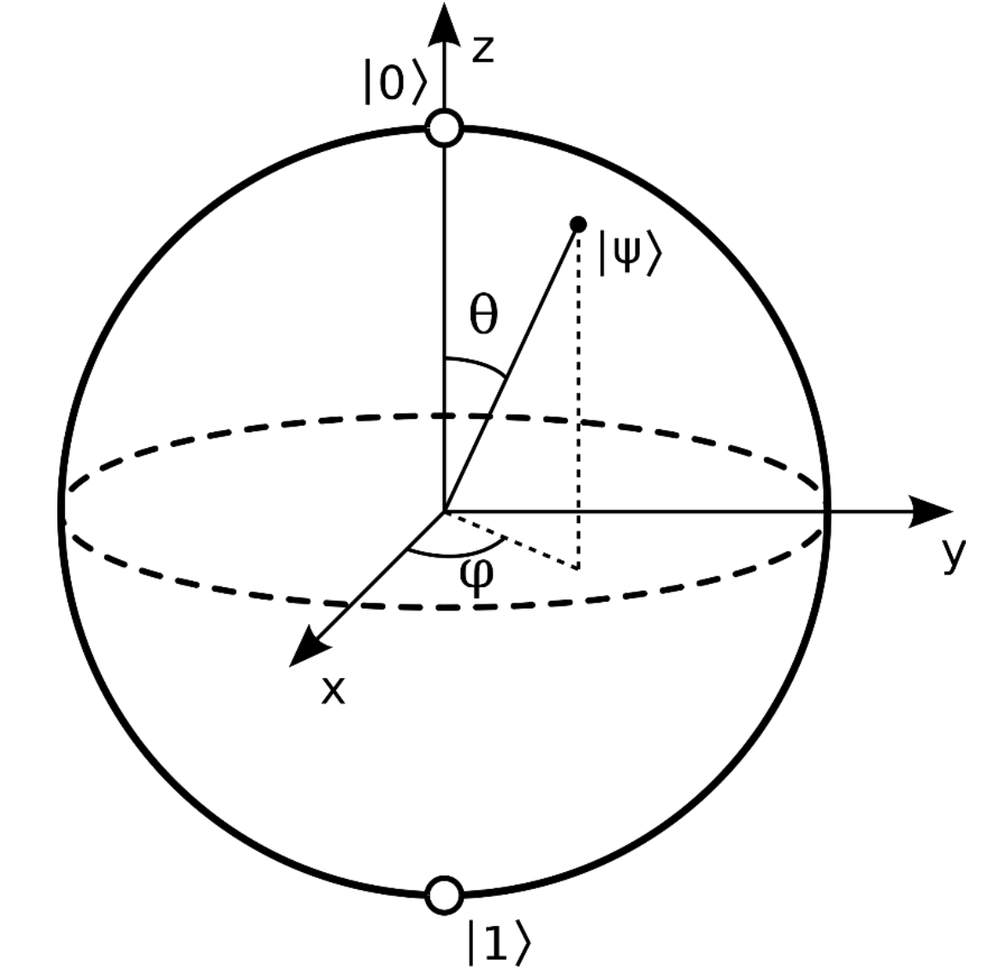
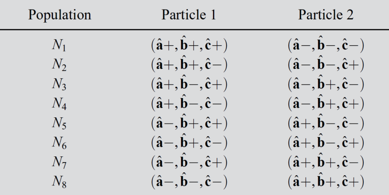
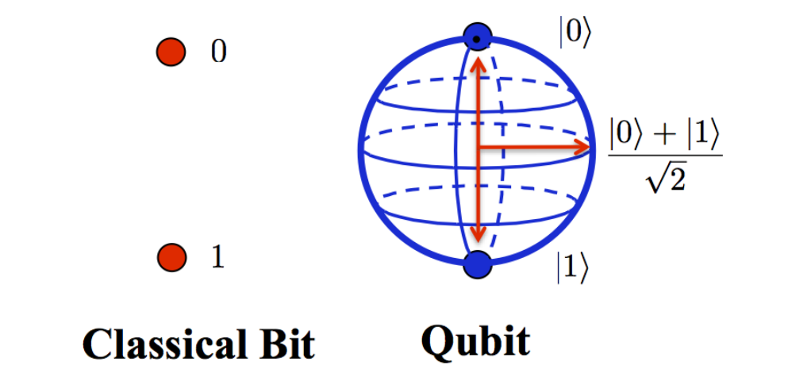
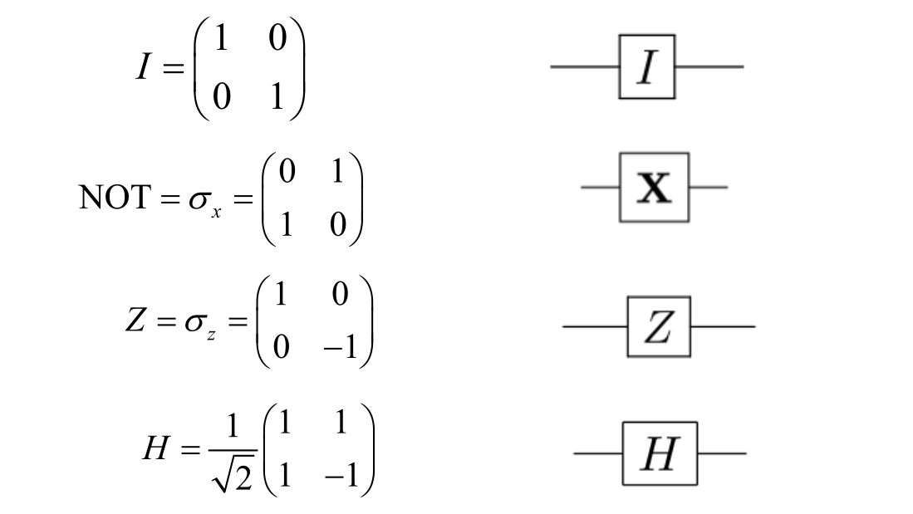
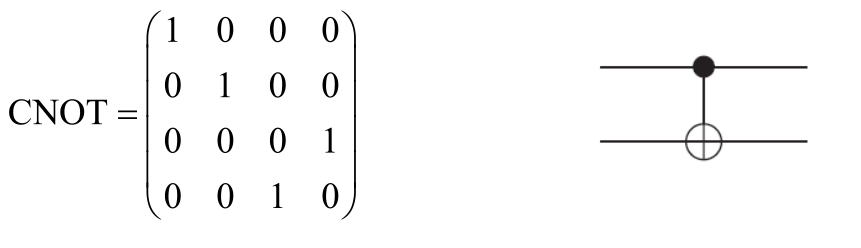
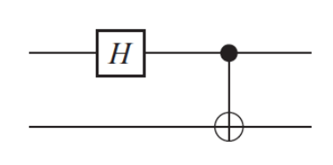
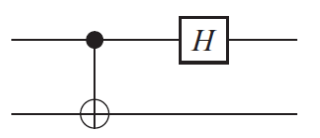
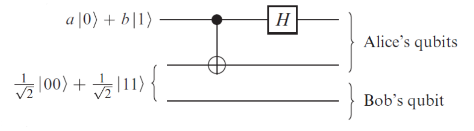
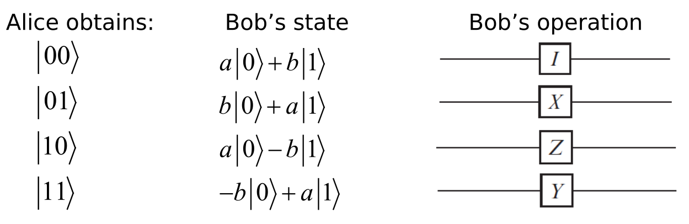

#! https://zhuanlan.zhihu.com/p/609219886
# 量子力学速通(3)量子信息

## 双态量子系统

考虑只有两个本征态的量子系统（自旋1/2、光子的偏振都属于该系统），其对应的希尔伯特空间的向量为二维复向量。再考虑该空间中的厄米算符$\sigma_{z}$
$$
\sigma_{z}=
\left(\begin{array}{cc}
1 & 0 \\
0 & -1
\end{array}\right)
$$

该算符实际上是一个二阶矩阵，有两个本征值$\lambda_{1}=1,\lambda_{2}=-1$，对应的本征态分别为

$$
\left|b_{1}\right\rangle=
\left(\begin{array}{l}
1 \\
0
\end{array}\right) \quad
\left|b_{2}\right\rangle=
\left(\begin{array}{l}
0 \\
1
\end{array}\right)
$$
习惯上用$|0\rangle,|1\rangle$去表示$\left|b_{1}\right\rangle,\left|b_{2}\right\rangle$。

则量子态可表示为
$$
|\psi\rangle=\cos (\theta / 2)|0\rangle+e^{i \phi} \sin (\theta / 2)|1\rangle
$$
其中$0 \leq \theta \leq \pi,0 \leq \phi<2 \pi$。

## 量子纠缠

<!-- 
对于一个双态量子系统，可能的量子态为$|0\rangle,|1\rangle$。当有两个这样的系统时，可能的量子态为$|00\rangle,|01\rangle,|10\rangle,|11\rangle$；三个这样的系统时，可能的量子态为$|000\rangle,|001\rangle,|010\rangle,|011\rangle,|100\rangle,|101\rangle,|110\rangle,|111\rangle$。 -->

对于两个独立的双态量子系统
$$
\begin{array}{l}
|\varphi\rangle=a_{1}|0\rangle+a_{2}|1\rangle \\
|\phi\rangle=b_{1}|0\rangle+b_{2}|1\rangle
\end{array}
$$
可以用**直积**$\otimes$计算它们组成的复合态
$$
|\varphi\rangle \otimes|\phi\rangle= a_{1} b_{1}|00\rangle+a_{1} b_{2}|01\rangle+a_{2} b_{1}|10\rangle+a_{2} b_{2}|11\rangle
$$
$|00\rangle,|01\rangle,|10\rangle,|11\rangle$组成了正交基。

直积是外积的推广，也叫克罗内克积。
$$
\mathbf{A} \otimes \mathbf{B}=\left[\begin{array}{ccc}
a_{11} \mathbf{B} & \cdots & a_{1 n} \mathbf{B} \\
\vdots & \ddots & \vdots \\
a_{m 1} \mathbf{B} & \cdots & a_{m n} \mathbf{B}
\end{array}\right]
$$

$$
\mathbf{A} \otimes \mathbf{B}=\left[\begin{array}{cccccccccc}
a_{11} b_{11} & a_{11} b_{12} & \cdots & a_{11} b_{1 q} & \cdots & \cdots & a_{1 n} b_{11} & a_{1 n} b_{12} & \cdots & a_{1 n} b_{1 q} \\
a_{11} b_{21} & a_{11} b_{22} & \cdots & a_{11} b_{2 q} & \cdots & \cdots & a_{1 n} b_{21} & a_{1 n} b_{22} & \cdots & a_{1 n} b_{2 q} \\
\vdots & \vdots & \ddots & \vdots & & & \vdots & \vdots & \ddots & \vdots \\
a_{11} b_{p 1} & a_{11} b_{p 2} & \cdots & a_{11} b_{p q} & \cdots & \cdots & a_{1 n} b_{p 1} & a_{1 n} b_{p 2} & \cdots & a_{1 n} b_{p q} \\
\vdots & \vdots & & \vdots & \ddots & & \vdots & \vdots & & \vdots \\
\vdots & \vdots & & \vdots & & \ddots & \vdots & \vdots & & \vdots \\
a_{m 1} b_{11} & a_{m 1} b_{12} & \cdots & a_{m 1} b_{1 q} & \cdots & \cdots & a_{m n} b_{11} & a_{m n} b_{12} & \cdots & a_{m n} b_{1 q} \\
a_{m 1} b_{21} & a_{m 1} b_{22} & \cdots & a_{m 1} b_{2 q} & \cdots & \cdots & a_{m n} b_{21} & a_{m n} b_{22} & \cdots & a_{m n} b_{2 q} \\
\vdots & \vdots & \ddots & \vdots & & & \vdots & \vdots & \ddots & \vdots \\
a_{m 1} b_{p 1} & a_{m 1} b_{p 2} & \cdots & a_{m 1} b_{p q} & \cdots & \cdots & a_{m n} b_{p 1} & a_{m n} b_{p 2} & \cdots & a_{m n} b_{p q}
\end{array}\right]
$$

也就是说
$$
|00\rangle=\left(\begin{array}{l}
1 \\
0 \\
0 \\
0
\end{array}\right),|01\rangle=\left(\begin{array}{l}
0 \\
1 \\
0 \\
0
\end{array}\right),|10\rangle=\left(\begin{array}{l}
0 \\
0 \\
1 \\
0
\end{array}\right),|11\rangle=\left(\begin{array}{l}
0 \\
0 \\
0 \\
1
\end{array}\right)
$$

所有的复合态都可以用直积获得吗？答案是否定的。读者可以自己尝试构造一下。

可以用直积获得的态称为**直积态**，不能用直积获得的态称为**纠缠态**。直积态说明两个子系统相互独立。而纠缠态说明两个子系统纠缠在一起，对其中一个的测量可能会影响到另一个。

## EPR悖论

假设一个量子态
$$
|\varphi\rangle=\frac{1}{\sqrt{2}}|10\rangle+\frac{1}{\sqrt{2}}|01\rangle
$$
显然这是一个纠缠态。

对其应用厄米算符$\sigma_{z 1}=\sigma_{z} \otimes \mathrm{I}$，那么该量子态要么坍塌至$|10\rangle$，要么坍塌至$|01\rangle$。但是，不管是$|10\rangle$，还是$|01\rangle$，都是直积态，而且两个子系统一个是$|0\rangle$，另一个是$|1\rangle$。这说明复合态的两个子系统都受到了影响。

厄米算符代表可观测的物理量。假如只观测复合态的某个子系统，整个复合态依旧会坍塌。这说明对一个子系统的观测会影响另一个子系统。且如果观测到的是$|0\rangle$，说明另一个子系统是$|1\rangle$，反之亦然。

现在，假如这两个相互纠缠的子系统相距很远。观测某个子系统，整个复合态依旧坍塌，如果观测到的是$|0\rangle$，说明另一个子系统是$|1\rangle$，反之亦然。而且这个过程是瞬时发生的！！！这说明发生了超距作用，信息能够以远超光速的方式传递！！！

这显然就产生了一个悖论，因为超光速是不可能的。为了解释这个悖论，物理学家提出了隐变量说，即两个子系统之间存在经典的相关性。具体来说，根据隐变量说，当两个粒子发生纠缠时，它们并不是真正的相互依存的，而是由于存在一些隐含变量，这些变量决定了两个粒子的状态在某些方面是相关的。这些隐含变量可能涉及到粒子的位置、动量、自旋等属性，但是我们无法直接观测到这些变量。

## 贝尔不等式

贝尔不等式及相关实验直接否决了隐变量说。

依旧以上面有两个双态系统的量子系统为例。构造三个厄米算符$\sigma_{a},\sigma_{b},\sigma_{c}$，这三个可观测物理量的本征值分别为$a+/a-,b+/b-,c+,c-$。观测纠缠态的这三个可观测物理量，有
$$
\begin{array}{l}
P(a+, b+)=\frac{1}{2} \sin ^{2} \frac{\theta_{a b}}{2} \\
P(a+, c+)=\frac{1}{2} \sin ^{2} \frac{\theta_{a c}}{2} \\
P(c+, b+)=\frac{1}{2} \sin ^{2} \frac{\theta_{c b}}{2}
\end{array}
$$

假设实验结果为

而根据隐变量说，有
$$
\begin{array}{l}
P(\hat{\mathbf{a}}+; \hat{\mathbf{b}}+)=\frac{\left(N_{3}+N_{4}\right)}{\sum\limits_{i=1}^{8} N_{i}} \\
P(\hat{\mathbf{a}}+; \hat{\mathbf{c}}+)=\frac{\left(N_{2}+N_{4}\right)}{\sum\limits_{i=1}^{8} N_{i}} \\
P(\hat{\mathbf{c}}+; \hat{\mathbf{b}}+)=\frac{\left(N_{3}+N_{7}\right)}{\sum\limits_{i=1}^{8} N_{i}}
\end{array}
$$

则有
$$
P(\hat{\mathbf{a}}+; \hat{\mathbf{b}}+) \leq P(\hat{\mathbf{a}}+; \hat{\mathbf{c}}+)+P(\hat{\mathbf{c}}+; \hat{\mathbf{b}}+)
$$
这就是贝尔不等式。

实验结果证明，贝尔不等式被违反了，因此隐变量说是错误的。

## No-cloning定理

根据薛定谔方程，可以推得孤立量子系统的状态通过幺正变换演化，即
$$
|\varphi\rangle \rightarrow U|\varphi\rangle
$$
其中$U$是幺正操作，其定义为$U^{+}=U^{-1}$，因此幺正变换是可逆的。

这可以引出No-cloning定理，即无法复制一个未知的量子态。

具体来说，复制实际上是这样一个过程
$$
\left|\varphi\right\rangle \otimes|\psi\rangle \rightarrow \left|\varphi\right\rangle \otimes\left|\varphi\right\rangle
$$

我们可以证明，不存在幺正操作$U$，使对任意$\left|\varphi\right\rangle$都有
$$
U|\varphi\rangle \otimes|\psi\rangle=|\varphi\rangle \otimes|\varphi\rangle
$$

因此，在量子力学中，不存在一种操作可以将任意一个未知的量子态复制到另一个相同或不同的量子系统中，而不改变原有的量子态。

No-cloning定理的意义在于，量子态的复制是一种非常重要的操作，可以用于许多量子计算和通信协议中。No-cloning定理的存在保证了量子态的安全性和保密性，同时也限制了量子计算和通信的一些应用和效率。此外，No-cloning定理保证了信息的传输速度不能超过光速！！！

## 量子计算

量子计算机是一个具有定义良好的**量子比特**(如双态量子系统)的可扩展物理系统。具体实例有超导量子比特、离子阱量子比特、光子量子比特等。

量子计算的步骤如下：
1. 初始化量子系统至简单状态(比如，所有量子比特都处在状态$|0\rangle$)
2. 通过一些量子门演化状态(由幺正操作描述)
3. 测量输出量子位(量子态坍塌)
4. 解释测量结果

### 量子比特

与经典比特不同，量子比特是一个双态量子系统，其状态有无限个。

### 量子门

对量子比特操作要用到**量子门**，其本质是一个幺正操作。对单个量子比特操作就是单量子门；对两个（纠缠在一起）量子比特操作就是双量子门。

常用的单量子门如下

双量子门

### 产生纠缠态

上图称为**量子电路**，应该非常容易理解。开始两个量子比特处于直积态。先对其中一个应用$H$操作，再对两个量子比特应用$\text{CNOT}$操作，得到一个纠缠态。

这种组合操作可以这样计算
$$
B=\text{CNOT}(H \otimes I_{2})=\frac{1}{\sqrt{2}}
\left(\begin{array}{cccc}
1 & 0 & 1 & 0 \\
0 & 1 & 0 & 1 \\
0 & 1 & 0 & -1 \\
1 & 0 & -1 & 0
\end{array}\right)
$$

从纠缠态获得直积态，可以这样操作

其组合操作为
$$
B=(H \otimes I_{2})\text{CNOT}
$$

### 量子计算机的优势

通过之前的例子可以看到，如果有$n$个量子比特，那么整个量子状态空间的向量纬度为$2^{n}$，作用于量子状态的幺正操作的纬度为$2^{n}\times 2^{n}$。

我们可以利用状态空间和操作的大维度，来解决在经典计算机上很难解决的问题。例如，经典计算机上的一个$n$位问题可能需要大约$2^{n}$个时间来解决。使用量子计算机，我们利用$n$个量子比特的$2^{n}$维状态空间在多项式时间内解决相同的问题。

量子比特是经典比特的泛化，所以$n$位量子计算机可以做$n$位计算机能做的所有事情。挑战在于扩大量子位的数量。目前看来，这是指数级的困难，因为在防止系统受环境影响方面存在困难。

## 量子传送

量子传送是一种量子信息处理的技术，它可以将一个未知的量子态从一个地方传输到另一个地方，而不需要通过中间的传输介质。虽然名字中包含“传送”，但是量子传送并不是传统意义上的物质传输。相反，它利用了量子纠缠的性质，将量子态的信息在不同的量子系统之间转移。

<!-- 具体来说，量子传送的过程包括三个部分：纠缠、测量和反演。首先，需要建立两个量子比特之间的纠缠态，使它们之间产生纠缠。接下来，在要传输的未知量子态和一个纠缠态之间进行一系列的测量，这样就可以将原始量子态的信息编码到纠缠态中。最后，利用测量结果来反演纠缠操作，使得接收端的量子比特可以重现原始的未知量子态。 -->

下面用具体例子来展示量子传送

Alice有一个量子比特$|\varphi\rangle$
$$
|\varphi\rangle=a|0\rangle+b|1\rangle
$$

他想把$|\varphi\rangle$传送给Bob。于是，他们先制造了一个纠缠态$|\psi\rangle$
$$
|\psi\rangle=\frac{1}{\sqrt{2}}(|00\rangle+|11\rangle)
$$

他们每人各自拥有该纠缠态的一个量子比特。那么整个量子系统的状态为

<!-- 假设A拥有$|\psi_{1}\rangle$，B拥有$|\psi_{2}\rangle$。 -->
$$
\begin{aligned}
|\varphi\rangle \otimes|\psi\rangle &=(a|0\rangle+b|1\rangle) \otimes \frac{1}{\sqrt{2}}(|00\rangle+|11\rangle) \\
&=\frac{a}{\sqrt{2}}(|000\rangle+|011\rangle)+\frac{b}{\sqrt{2}}(|100\rangle+|111\rangle)
\end{aligned}
$$

对整个量子系统应用操作$\text{QT}$
$$
\mathrm{QT}=\left(\mathrm{CNOT} \otimes I_{2}\right)\left(H \otimes I_{4}\right)
$$

则有
$$
\begin{aligned}
\mathrm{QT}(|\varphi\rangle \otimes|\psi\rangle) &=\frac{a}{2}(|000\rangle+|100\rangle+|011\rangle+|111\rangle)+\frac{b}{2}(|010\rangle-|110\rangle+|001\rangle-|101\rangle) \\
&=|00\rangle \otimes\left(\frac{a}{2}|0\rangle+\frac{b}{2}|1\rangle\right)+|01\rangle \otimes\left(\frac{a}{2}|1\rangle+\frac{b}{2}|0\rangle\right)+|10\rangle \otimes\left(\frac{a}{2}|0\rangle-\frac{b}{2}|1\rangle\right)+|11\rangle \otimes\left(\frac{a}{2}|1\rangle-\frac{b}{2}|0\rangle\right)
\end{aligned}
$$

现在Alice测量了他的两个量子比特。Alice的测量结果的不同，会使Bob的量子比特坍塌为不同的状态。

然后Alice将他的测量结果通过经典信息传送方式发送给Bob, Bob对他的量子比特应用适当的门，得到了$|\varphi\rangle$。于是整个量子传送过程完成了。

量子传送的实现对于量子计算、量子通信等领域具有重要的应用价值。虽然这个过程似乎可以实现“超光速”通信，但是实际上它仍然受到量子测量和通信速率等因素的限制，不会违反相对论原理。

## 参考资料

1. 量子力学概论,大卫J格里菲斯
2. 量子力学教程,曾谨言
3. 上课用的课件
4. ChatGPT

[目录](https://zhuanlan.zhihu.com/p/609544084)
