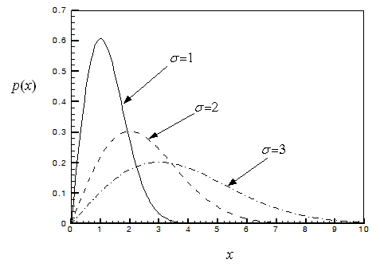
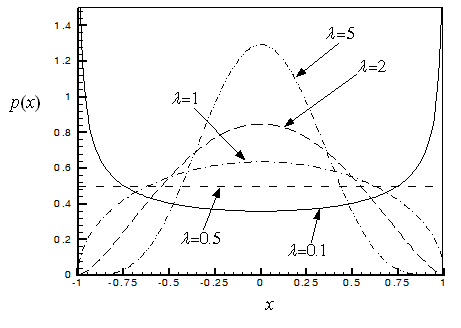
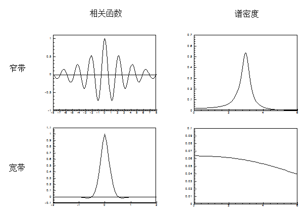
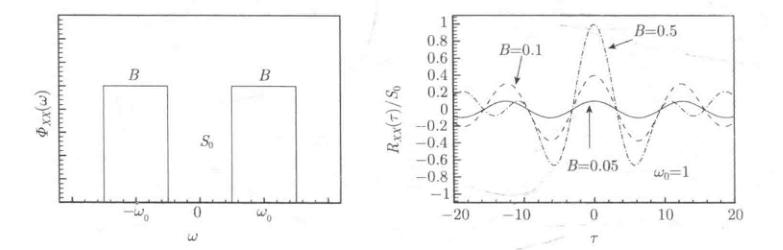
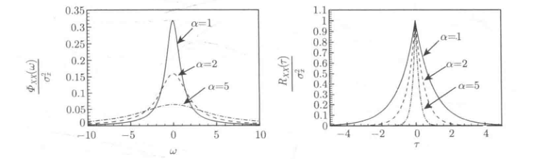

# 随机变量

- **样本空间**：考虑一个随机现象。对该现象的单次观察称为一次试验。鉴于随机性，不可能预先知道试验的结果，但总可以知道包括试验所有可能结果的集合。该集合称为上述随机现象的样本空间。
- **样本点**：一个随机现象的样本空间中的每个元素称为样本点，它表示一个可能结果。
- **事件**：事件是样本空间的一个子集。
- **事件的概率测度**：给每一个事件赋以一个出现的概率，它称为事件的概率测度
- **随机变量**：随机现象都可以用一个数 $X$ 描述，称 $X$ 为随机变量。随机变量可分成离散与连续两类。

## 随机变量的概率

- 大写字母：随机变量或随机过程
- 小写字母：状态变量，即随机量的可能值

概率函数 $P_X(x)=\mathrm{Prob}[X=x]$

概率分布 $F_X(x)=\mathrm{Prob}[X\leq x]$

概率密度函数 $p_X(x)=\dfrac{\mathrm{d}F_X(x)}{\mathrm{d}x}$

$$
p_X(x)\mathrm{d}x=\mathrm{Prob}[x\leq X\leq x+\mathrm{d}x]
$$

$$
\mathrm{Prob}[a\leq X\leq b]=\int_{a}^{b}p_X(x)\mathrm{d}x
$$

## 统计矩

随机变量 $X$ 的 $n$ 阶统计矩

$$
m_n[X]=E[X^n]=\int_{-\infty}^\infty x^np_X(x)\mathrm{d}x
$$

$E[\cdot]$ 表示以概率密度为权函数的积分，称为集合平均，统计平均，或数学期望。

- 一阶矩：$\mu_X=m_1=E[X]$，均值
- 二阶矩：$m_2=E[X^2]$，均方值
- $n$ 阶中心矩：$E[(X-\mu_X)^n]$
- 方差：二阶中心矩，

$$
\sigma_X^2=E[(X-\mu_X)^2]=E[X^2]-\mu_X^2=m_2-m_1^2
$$

- 标准离差：$\sigma_X$

- 歪斜系数：概率密度不对称性的度量。若 $\gamma_{1}=0$，则概率密度关于均值对称。

$$
\gamma_{1}=\frac{E[(X-\mu_{X})^{3}]}{\sigma_{X}^{3}}
$$

- 峰态系数：反映概率密度峰的形状。较大的 $\gamma_{2}$ 对应于一个较尖锐的峰。

$$
\gamma_{2}=\frac{E[(X-\mu_{X})^{4}]}{\sigma_{X}^{4}}
$$

- 对高斯分布的随机变量，$\gamma_{1} = 0$，$\gamma_{2}=3$。歪斜系数与峰态系数可用于鉴定概率分布的非高斯性。

概率密度 $p(x)$ 是随机变量 $X$ 的完全描述。有限数量的矩一般不是随机变量的完全描述。

## 特征函数与累积量

特征函数：随机变量的指数函数的集合平均。特征函数是概率密度函数的傅里叶变换，因此它可完全描述随机变量。

$$
M_X(\theta)=E[e^{\mathrm{i}\theta X}]=\int_{-\infty}^\infty e^{\mathrm{i}\theta x}p_X(x)\mathrm{d}x
$$

$$
p_X(x)=\frac1{2\pi}\int_{-\infty}^\infty M_X(\theta)e^{-\mathrm{i}\theta x}\mathrm{d}\theta
$$

特征函数可展成如下麦克劳林 (Maclaurin) 级数

$$
M_X(\theta)=1+\sum_{n=1}^\infty\frac{m_n}{n!}(\mathrm{i}\theta)^n
$$

$$
m_n=E[X^n]=\frac1{\mathrm{i}^n}{\left[\frac{\mathrm{d}^nM_X(\theta)}{\mathrm{d}\theta^n}\right]}_{\theta=0}
$$

取特征函数的对数，再将它展成麦克劳林级数

$$
\ln M_X(\theta)=\sum_{n=1}^\infty\frac{\kappa_n[X]}{n!}(\mathrm{i}\theta)^n
$$

$$
\kappa_n[X]=\frac1{\mathrm{i}^n}\Bigg[\frac{\mathrm{d}^n}{\mathrm{d}\theta^n}\ln M_X(\theta)\Bigg]_{\theta=0}
$$

称为 $X$ 的 $n$ 阶累积量或半不变量。

$$
\begin{aligned}
&\kappa_1=m_1=\mu_X \\
&\kappa_2=m_2-m_1^2=\sigma_X^2 \\
&\kappa_3=m_3-3m_1m_2+2m_1^3 \\
&\kappa_4=m_4-3m_2^2-4m_1m_3+12m_1^2m_2-6m_1^4
\end{aligned}
$$

## 常用概率分布

**高斯（正态）分布**

$$
p(x)=\frac1{\sqrt{2\pi}\sigma}e^{-(x-\mu)^2/2\sigma^2},\quad-\infty<x<\infty,\quad\sigma>0
$$

均值与方差

$$
\mu_X=\mu,\quad\sigma_X^2=\sigma^2
$$

特征函数

$$
M_X(\theta)=e^{\mathrm{i}\mu\theta-\frac12\sigma^2\theta^2}
$$

$X\thicksim N(\mu,\sigma)$ 表示 $X$ 是高斯随机变量。

$U\thicksim N(0,1)$ 称为标准（或单位）高斯分布。

- 概率密度由均值与均方值完全确定。
- 高斯随机变量的线性函数仍为高斯随机变量。
- 高阶矩可表示为低阶矩

$$
E[X^{n}]=\mu E[X^{n-1}]+(n-1)\sigma^{2}E[X^{n-2}],\quad n=2,3,\cdots
$$

- 对标准高斯随机变量，有

$$
E[U^{n}]=\begin{cases}
\quad0,&\quad n=\mathrm{odd} \\
1\times3\times\cdots\times(n-1),&\quad n=\mathrm{even}
\end{cases}
$$

- 高斯随机变量可用标准高斯随机变量表示

$$
X=\sigma U+\mu
$$

- 中心矩可用下式算得

$$
E[(X-\mu)^n]=\sigma^nE[U^n]
$$

**均匀分布**

$$
p(x)=\frac1{b-a},\quad a\leq x\leq b
$$

$$
\mu_X=\frac12(a+b),\quad \sigma_X^2=\frac1{12}(b-a)^2
$$

**瑞利分布**

$$
p(x)=\frac x{\sigma^2}e^{-x^2/2\sigma^2},\quad x\geq0
$$

$$
\mu_X=\sqrt{\frac\pi2}\sigma,\quad \sigma_X^2=\frac{4-\pi}2\sigma^2
$$

**指数分布**

$$
p(x)=\lambda e^{-\lambda x},\quad x\geq0,\quad\lambda>0
$$

$$
\mu_X=\frac{1}{\lambda},\quad \sigma_X^2=\frac{1}{\lambda^2}
$$

**$\lambda$-分布**

$$
p(x)=\left[B\left(\frac12,\lambda+\frac12\right)\right]^{-1}(1-x^2)^{\lambda-\frac12},
\begin{aligned}
&-1\leq x\leq1\mathrm{~for~}\lambda\geq\frac12 \\
&-1<x<1\mathrm{~for~}-\frac12<\lambda<\frac12
\end{aligned}
$$

$$
\mu_X=0,\quad\sigma_X^2=\frac1{2(\lambda+1)}
$$

## 随机矢量

在实际问题中，可能需要处理两个或多个以某种概率方式相关联的随机变量，称它们为联合分布的随机变量，或随机矢量。

设 $\mathbf{X} = [ X_1, X_2] ^{\mathsf{T}}$是二维随机矢量，它可用下列联合概率分布描述

$$
F_{X_1X_2}(x_1,x_2)=\mathrm{Prob}[(X_1\leq x_1)\cap(X_2\leq x_2)]
$$

$$
\begin{aligned}
&F_{X_1X_2}(\infty,\infty)=1 \\
&F_{X_1X_2}(-\infty,x_2)=F_{X_1X_2}(x_1,-\infty)=0 \\
&F_{X_1X_2}(x_1,\infty)=F_{X_1}(x_1),\quad F_{X_1X_2}(\infty,x_2)=F_{X_2}(x_2)
\end{aligned}
$$

联合概率密度是联合概率分布的混合偏导数

$$
p_{X_1X_2}(x_1,x_2)=\frac{\partial^2}{\partial x_1\partial x_2}F_{X_1X_2}(x_1,x_2)
$$

$$
p_{X_1}(x_1)=\int_{-\infty}^\infty p_{X_1X_2}(x_1,x_2)\mathrm{d}x_2
$$

$$
p_{X_2}(x_2)=\int_{-\infty}^\infty p_{X_1X_2}(x_1,x_2)\mathrm{d}x_1
$$

两个随机变量**独立**，当概率密度满足如下条件

$$
p_{X_1X_2}(x_1,x_2)=p_{X_1}(x_1)p_{X_2}(x_2)
$$

在固定 $X_2=x_2$ 的条件下 $X_1$ 的概率分布称为**条件概率分布**，记以

$$
F_{X_1|X_2}(x_1|x_2)=\frac{F_{X_1X_2}(x_1,x_2)}{F_{X_2}(x_2)}
$$

$$
p_{X_1|X_2}(x_1|x_2)=\frac{p_{X_1X_2}(x_1,x_2)}{p_{X_2}(x_2)}
$$

两个随机变量的联合矩定义为

$$
\begin{aligned}&m_{nk}[X_1,X_2]=E[X_1^nX_2^k]=\int_{-\infty}^\infty\int_{-\infty}^\infty x_1^nx_2^kp_{X_1X_2}(x_1,x_2)\mathrm{d}x_1\mathrm{d}x_2,\\&n,k=0,1,2,...\end{aligned}
$$

协方差：二阶联合中心矩

$$
\begin{aligned}\kappa_{X_1X_2}&=E[(X_1-\mu_{X_1})(X_2-\mu_{X_2})]\\&=E[X_1X_2]-\mu_{X_1}\mu_{X_2}=m_{11}-m_{10}m_{01}\end{aligned}
$$

相关系数：归一化的协方差

$$
\rho_{X_1X_2}=\frac{\kappa_{X_1X_2}}{\sigma_{X_1}\sigma_{X_2}},\quad\left|\rho_{X_1X_2}\right|\leq1
$$

独立的随机变量是不相关的，但两个不相关的随机变量不一定是独立的。

对二维高斯随机矢量，独立与不相关是等价的。

## 随机变量的函数

随机变量 $X$ 的函数 $Y=f(X)$ 也是随机变量，其概率与统计性质可从 $X$ 的概率与统计性质导得。

统计矩

$Y$ 的 $n$ 阶矩可按下式算得

$$
E[Y^n]=E[f^n(X)]=\int_{-\infty}^\infty f^n(x)p_X(x)\mathrm{d}x
$$

若 $Y$ 是多个随机变量的函数，即 $Y=f(X_1,X_2,...,X_n)$，则有

$$
\begin{aligned}
E[Y^n]=\int_{-\infty}^\infty\int_{-\infty}^\infty\cdots\int_{-\infty}^\infty f^n(x_1,x_2,\cdots,x_n)p_{X_1X_2\cdots X_n}(x_1,x_2,\cdots,x_n)& \\
\mathrm{d}x_1\mathrm{d}x_2,\cdots,\mathrm{d}x_n &
\end{aligned}
$$

若 $Y$ 是 $X$ 的单调函数，即 $Y$ 与 $X$ 构成一对一映射，则 $Y$ 的概率密度可按下式导得

$$
F_Y(y)=\mathrm{Prob}[Y\leq y]=\mathrm{Prob}[f(X)\leq y]=\mathrm{Prob}[X\leq g(y)]=F_X[g(y)]
$$

式中 $X=g(Y)$ 是 $Y=f(X)$ 的反函数。$Y$ 的概率密度则可按下式导得

$$
p_Y(y)=\frac{\mathrm{d}}{\mathrm{d}y}F_Y(y)=p_X[g(y)]\left|\frac{\mathrm{d}x}{\mathrm{d}y}\right|
$$

若函数关系为非单调，则问题较复杂。此时需将函数的定义域分成若干区域，使得每个区域上函数是单调的。

考虑作为两个随机变量函数的随机变量，即 $Y=f(X_1,X_2)$，有

$$
\begin{aligned}
F_{Y}(y)&=\text{Prob}[Y\leq y]=\text{Prob}[f(X_1,X_2)\leq y] \\
&=\iint_{f(x_1,x_2)\leq y}p_{X_1X_2}(x_1,x_2)\mathrm{d}x_1\mathrm{d}x_2 \\
&=\int_{a_1}^{a_2}\left[\int_{b_1}^{g_1(y,x_2)}p_{X_1X_2}(x_1,x_2)dx_1\right]\mathrm{d}x_2
\end{aligned}
$$

式中积分限 $a_1,a_2$ 和 $b_1$ 由 $f(x_1,x_2)\leq y$ 确定，$x_1=g_1(y,x_2)$ 是 $y=f(x_1,x_2)$ 的反函数。

对 $y$ 求导，得如下 $Y$ 的概率密度

$$
p_Y(y)=\int_{a_1}^{a_2}p_{X_1X_2}\left[g_1(y,x_2),x_2\right]\Big|J_1\Big|dx_2,\quad
J_1=\left|\frac{\partial g_1(y,x_2)}{\partial y}\right|=\left|\frac{\partial x_1}{\partial y}\right|
$$

# 随机过程

## 定义与描述

随机过程 $X(t)$ 是以时间 $t$ 为参数的一族随机变量。

- 每一个可能的关于 $t$ 的函数 $X_k(t)$，称为样本函数。
- 对一固定时间 $t_i$，$X(t_i)$ 是定义在样本空间上的随机变量。

**概率分布**

随机过程的一阶、二阶、直至 $n$ 阶概率密度函数为

$$
p(x,t),\:p(x_1,t_1,x_2,t_2),\cdots,\:p(x_1,t_1,x_2,t_2,\cdots;x_n,t_n)
$$

- 一阶概率密度：在一个时刻，随机过程 $\Rightarrow$ 一个随机变量
- 二阶概率密度：在两个时刻，随机过程 $\Rightarrow$ 两个相关的随机变量
- $n$ 阶概率密度：在 $n$ 个时刻，随机过程 $\Rightarrow$ $n$ 个相关的随机变量

**特征函数**

一阶

$$
M_X(\theta,t)=E[e^{i\theta X(t)}]=\int_{-\infty}^\infty e^{i\theta X(t)}p(x,t)\mathrm{d}x
$$

二阶

$$
M_X(\theta_1,t_1;\theta_2,t_2)=E\left\{e^{i[\theta_1X(t_1)+\theta_2X(t_2)]}\right\}
$$

$n$ 阶

$$
M_X(\theta_1,t_1;\theta_2,t_2;\cdots;\theta_n,t_n)=E\left\{e^{i[\theta_1X(t_1)+\theta_2X(t_2)+\cdots+\theta_nX(t_n)]}\right\}
$$

**矩函数**

一阶阶矩函数-均值函数

$$
\mu_X(t)=E[X(t)]=\int xp(x,t)\mathrm{d}x
$$

二阶矩函数-自相关函数

$$
R_{XX}(t_1,t_2)=E[X(t_1)X(t_2)]=\int\int x_1x_2p(x_1,t_1;x_2,t_2)\mathrm{d}x_1\mathrm{d}x_2
$$

描述随机过程在两个时刻的相关性。

$n$阶矩函数

$$
E[X(t_1)X(t_2)\cdots X(t_n)]
$$

自协方差函数定义为二阶中心矩函数

$$
\begin{aligned}
\kappa_{XX}(t_1,t_2)&=E\Big\{[X(t_1)-\mu_X(t_1) ][X(t_2)-\mu_X(t_2)]\Big\} \\
&=R_{XX}(t_1,t_2)-\mu_X(t_1)\mu_X(t_2)
\end{aligned}
$$

方差函数

$$
\sigma_X^2(t)=E\Big\{[X(t)-\mu_X(t)]^2\Big\}
$$

自相关系数函数

$$
\rho_{XX}(t_1,t_2)=\frac{\kappa_{XX}(t_1,t_2)}{\sigma_X(t_1)\sigma_X(t_2)},\quad\rho_{XX}(t_1,t_2)\leq1
$$

均值与方差函数是随机过程的一阶统计性质（一个时刻）。自相关、自协方差、自相关系数函数则是二阶统计性质（两个不同时刻）。

**累积量函数**

$$
\kappa_1[X(t)],\:\kappa_2[X(t_1)X(t_2)],\:\cdots,\:\kappa_n[X(t_1)X(t_2)\cdots X(t_n)]
$$

累积量函数是对数特征函数的麦克劳林展式的系数

$$
\begin{aligned}
&\ln M_{X}(\theta_{1},t_{1};\theta_{2},t_{2};\cdotp\cdotp\cdotp\cdotp\cdotp\cdotp;\theta_{n},t_{n}) \\
=&\sum_{j=1}^n(i\theta_j)\kappa_1[X(t_j)]+\frac{1}{2!}\sum_{j,k=1}^n(i\theta_j)(i\theta_k)\kappa_2[X(t_j)X(t_k)]+\cdots
\end{aligned}
$$

一阶累积量函数与一阶矩函数相同，二阶、三阶累积量
函数等同于二阶、三阶中心矩函数

**两个联合分布的随机过程**

两个随机过程 $X_1(t)$ 与 $X_2(t)$

互相关

$$
R_{X_1X_2}(t_1,t_2)=E[X_1(t_1)X_2(t_2)]
$$

互协方差

$$
\begin{aligned}
\kappa_{X_1X_2}(t_1,t_2)&=E\Big\{[X_1(t_1)-\mu_{X_1}(t_1)][X_2(t_2)-\mu_{X_2}(t_2)]\Big\} \\
&=R_{X_1X_2}(t_1,t_2)-\mu_{X_1}(t_1)\mu_{X_2}(t_2)
\end{aligned}
$$

互相关系数函数

$$
\rho_{X_1X_2}(t_1,t_2)=\frac{\kappa_{X_1X_2}(t_1,t_2)}{\sigma_{X_1}(t_1)\sigma_{X_2}(t_2)}
$$

自相关与互相关函数具有对称性

$$
R_{XX}(t_1,t_2)=R_{XX}(t_2,t_1),\quad R_{X_1X_2}(t_1,t_2)=R_{X_2X_1}(t_2,t_1)
$$

## 平稳随机过程

一个随机过程称为强平稳或严格意义上平稳，当它的全部概率结构在时间平移下不变

$$
\begin{aligned}
&p(x_1,t_1;x_2,t_2;\cdots;x_n,t_n)\\
=&p(x_1,t_1+\tau;x_2,t_2+\tau;\cdots;x_n,t_n+\tau),\quad n=1, 2,\cdots\end{aligned}
$$

若上式只对 $n= 1,2$ 成立时，该随机过程称为**弱平稳**。其一阶概率密度与时间无关，二阶概率密度只与时间差有关。

自相关函数特性

$$
R_{XX}(t_1,t_2)=R_{XX}(\tau),\quad\tau=t_2-t_1
$$

$$
R_{XX}(-\tau)=R_{XX}(\tau)
$$

$$
R_{XX}(\tau)\leq R_{XX}(0)=E[X^2]
$$

相关时间：一个平稳随机过程的相关性的定量度量

$$
\tau_0=\intop_0^\infty\lvert\rho_{XX}(\tau)\rvert \mathrm{d}\tau
$$

## 遍历过程

考虑一个平稳随机过程

集合平均：$N$ 个样本函数 $x_i(t)\left(i=1,2,\cdotp\cdotp\cdotp,N\right)$

$$
\mu_{X}(t)=E[X(t)]\approx\frac{1}{N}\sum_{i=1}^{N}x_{i}(t),\quad E[X^{2}(t)]\approx\frac{1}{N}\sum_{i=1}^{N}x_{i}^{2}(t)
$$

$$
R_{XX}(t_1,t_2)=E[X(t_1)X(t_2)]\approx\frac{1}{N}\sum_{i=1}^{N}x_i(t_1)x_i(t_2)
$$

时间平均：一个样本函数 $x(t)$

$$
\left\langle X(t)\right\rangle_t=\lim_{T\to\infty}\frac1T\int\limits_0^Tx(t)\mathrm{d}t,\quad\left\langle X^2(t)\right\rangle_t=\lim_{T\to\infty}\frac1T\int\limits_0^Tx^2(t)\mathrm{d}t
$$

$$
\left\langle X(t)X(t+\tau)\right\rangle_t=\lim_{T\to\infty}\frac1T\int\limits_0^Tx(t)x(t+\tau)\mathrm{d}t
$$

均值意义上遍历：$\left\langle X(t)\right\rangle_t=E[X(t)]=\mu_X$

均方意义上遍历：$\left\langle X^2(t)\right\rangle_t=E[X^2(t)]$

相关意义上遍历：

$$
\left\langle X(t)X(t+\tau)\right\rangle_t=E[X(t)X(t+\tau)]=R_{XX}(\tau)
$$

对物理平稳过程常作在相关意义上遍历的假设，从而均值、均方值及相关函数可用时间平均作出估计。

## 随机微积分

$X(t)$ 是一个随机过程，$X_n=X(t_n)$ 是一个随机变量序列。

收敛性是指 $X_n$ 在某种意义上趋于某随机变量 $X$。存在不同的**收敛模式**：

概率为 1 收敛（几乎肯定收敛）：

$$
\mathrm{Prob}\left[\lim_{n\to\infty}X_n=X\right]=1
$$

概率意义上收敛：

$$
\lim_{n\to\infty}\mathrm{Prob}\left[\left|X_n-X\right|\geq\varepsilon\right]=0 ,\quad \forall\varepsilon>0
$$

分布意义上收敛：

$$
\lim_{n\to\infty}F_{X_n}(x)=F_X(x)
$$

均方收敛（$L_2$ 意义上收敛）：

$$
\lim_{n\to\infty}E\left[(X_n-X)^2\right]=0
$$

**$L_2$ 意义上收敛常表示为**

$$
\underset{n\to\infty}{\operatorname*{l.i.m.}}X_n=X
$$

式中符号 l.i.m. 读作均值意义上极限 (limit in mean)。

一个随机过程是二阶过程，当

$$
\operatorname{E}[X^2(t)]<\infty ,\quad\forall t
$$

二阶随机过程有下列性质

$$
-\infty<E[X(t)]<\infty
$$

$$
-\infty<R_{XX}(t_1,t_2)<\infty
$$

$$
\lim_{t\to t_0}E[X(t)]=E[X]=E[\underset{t\to t_0}{\operatorname*{l.i.m.}}X(t)]
$$

随机过程的 $L_2$ 导数也是随机过程

$$
\frac{\mathrm{d}}{\mathrm{d}t}X(t)=\dot{X}(t)=\lim_{\Delta t\to0}\frac{X(t+\Delta t)-X(t)}{\Delta t}
$$

导数过程的统计性质可由原过程的统计性质求得

$$
\mu_{\dot{X}}(t)=E[\dot{X}(t)]=\dot{\mu}_{X}(t)
$$

$$
R_{\dot{X}X}(t_1,t_2)=E[\dot{X}(t_1)X(t_2)]=\frac{\partial}{\partial t_1}R_{XX}(t_1,t_2)
$$

$$
R_{\dot{X}\dot{X}}(t_1,t_2)=E[\dot{X}(t_1)\dot{X}(t_2)]=\frac{\partial^2}{\partial t_1\partial t_2}R_{XX}(t_1,t_2)
$$

平稳过程的导数过程的统计性质

$$
\mu_{\dot{X}}(t)=\frac{\mathrm{d}\mu_X(t)}{\mathrm{d}t}=0
$$

$$
R_{\dot{X}X}(t_1,t_2)=R_{\dot{X}X}(\tau)=-\frac{\mathrm{d}}{\mathrm{d}\tau}R_{XX}(\tau),\quad\tau=t_2-t_1
$$

$$
R_{\dot{X}\dot{X}}(t_1,t_2)=R_{\dot{X}\dot{X}}(\tau)=-\frac{\mathrm{d}^2}{\mathrm{d}\tau^2}R_{XX}(\tau),\quad\tau=t_2-t_1
$$

$$
R_{\dot{X}X}(0)=E[X(t)\dot{X}(t)]=-\frac{\mathrm{d}}{\mathrm{d}\tau}R_{XX}(\tau)\bigg|_{\tau=0}=0
$$

平稳随机过程与其导数过程是不相关的。

随机过程的 $L_2$ 积分是一个随机变量

$$
Y=\int_a^bX(t)\mathrm{d}t=\underset{n\to\infty}{\operatorname*{l.i.m.}}Y_n
$$

用下面的黎曼 (Riemann) 和近似

$$
Y_n=\sum_{j=1}^nX(t_j')(t_{j+1}-t_j) \\ t_j\leqslant t_j'\leqslant t_{j+1},\quad a=t_1<t_2<\cdots<t_{n+1}=b
$$

期望与 $L_2$ 积分运算可交换

$$
\mu_{Y}=E[Y]=\int\limits_{a}^{b}\mu_{X}(t)\mathrm{d}t
$$

$$
\sigma_{Y}^{2}=E[Y^{2}]=\int\limits_{a}^{b}\int\limits_{a}^{b}R_{XX}(t_{1},t_{2})\mathrm{d}t_{1}\mathrm{d}t_{2}
$$

## 谱描述

与自相关函数等价的另一个二阶统计性质是功率谱密度。这里只考虑零均值平稳过程的**谱密度函数**，定义为

$$
\Phi_{XX}(\omega)=\frac{1}{2\pi}\int_{-\infty}^{\infty}R_{XX}(\tau)\mathrm{e}^{-\mathrm{i}\omega\tau}\mathrm{d}\tau
$$

其逆为

$$
R_{XX}(\tau)=\int_{-\infty}^{\infty}\Phi_{XX}(\omega)\mathrm{e}^{\mathrm{i}\omega\tau}\mathrm{d}\omega
$$

物理意义

$$
R_{XX}(0)=E[X^2(t)]=\int_{-\infty}^\infty\Phi_{XX}(\omega)\mathrm{d}\omega
$$

$\Phi_{XX}(\omega)$ 描述了均方值（能量）在整个频率域上的分布。

**功率谱密度函数的性质**

功率谱密度是偶函数：$\Phi_{XX}(\omega)=\Phi_{XX}(-\omega)$

导数过程的功率谱密度：$\Phi_{\dot{X}\dot{X}}(\omega)=\omega^2\Phi_{XX}(\omega)$

非零均值过程的功率谱密度附加一个 $\delta$ 函数在 $\omega=0$ 处，即有能量在零频率处。

特殊情况：谐和过程（$\sin\omega_\mathrm{0}t$）的功率谱密度只有一个 $\delta$ 函数在 $\omega=\omega_0$ 处，全部能量在频率 $\omega_0$ 处。

**谱矩**

- 窄带过程：功率谱密度（能量）集中在一个窄的频带内。
- 宽带过程：功率谱密度（能量）在一个宽的频带上有显著值。

为定量描述随机过程的带宽，定义谱矩

$$
\lambda_n=\int_{-\infty}^\infty\left|\omega\right|^n\Phi_{XX}(\omega)\mathrm{d}\omega=2\int_0^\infty\omega^n\Phi_{XX}(\omega)\mathrm{d}\omega
$$

中心频率

$$
\gamma_1=\frac{\lambda_1}{\lambda_0}=\frac{2}{\sigma_X^2}\int_0^\infty\omega\Phi_{XX}(\omega)\mathrm{d}\omega
$$

谱方差参数：描述 $\Phi_{XX}(\omega)$ 偏离中心频率的弥散

$$
\delta=\frac{\sqrt{(\lambda_2/\lambda_0)-(\lambda_1/\lambda_0)^2}}{(\lambda_1/\lambda_0)}=\sqrt{\frac{\lambda_0\lambda_2}{\lambda_1^2}-1}
$$

带宽参数：较大的 $\varepsilon$ 对应于较宽的频带

$$
\varepsilon=\sqrt{1-\frac{\lambda_2^2}{\lambda_0\lambda_4}}
$$

**高斯白噪声**：高斯分布，零均值

功率谱密度 $\Phi_{WW}(\omega)=K$

自相关函数 $R_{WW}(\tau)=2\pi K\delta(\tau)$，在任何两个时刻都不相关，快速变化

均方值 $\sigma_W^2=R_{WW}(0)=\infty$，无穷大能量，实际不存在，理想化

**限带白噪声**

功率谱密度 $\Phi _{xx}( \omega ) = \begin{cases} S_0, & \omega _0- \frac B2\leq \left | \omega \right | \leq \omega _0+ \frac B2\\ 0, & \text{else} & \end{cases}$

$\omega_0$为中心频率，$B$ 为带宽，且 $B\leq2\omega_0$

相关函数 $R_{XX}( \tau ) = \dfrac {2S_0}\tau \cos ( \omega _0\tau ) \sin ( \frac 12B\tau )$

方差参数 $\delta=\dfrac B{2\sqrt{3}\omega_0}$

带宽参数 $\varepsilon=\dfrac{B^2(15\omega_0^2+B^2/4)}{9(5\omega_0^4+5\omega_0^2B^2/2+B^4/16)}$

**低通过程**

功率谱 $\Phi_{XX}(\omega)=\dfrac{\sigma_X^2\alpha}{\pi(\omega^2+\alpha^2)}$

自相关函数 $R_{XX}(\tau)=\sigma_X^2e^{-\alpha|\tau|}$

非平稳过程的功率谱密度随时间变化。

# 马尔可夫及与其有关的随机过程

FPK 方程描述了某些随机过程（特别是连续时间、连续状态随机过程，如扩散过程）的**概率密度函数的演化**。它是一个偏微分方程，直接作用在概率密度 $p(\boldsymbol{x}, t | \boldsymbol{x}_0, t_0)$ 上。通常，FPK 方程来源于随机微分方程（SDE）的理论，但它本身可以单独使用经典的偏微分方程求解方法来找到概率密度的演化。

在随机过程的建模中，随机微分方程（SDE）用于描述某种物理量、金融变量或系统状态的**路径级别演化**。这类方程通常涉及随机项（如 Wiener 过程或噪声项）。然而，由于 SDE 中的随机项（如布朗运动）不能直接用经典积分方法来分析其演化规律，因此我们经常通过从 SDE 推导出 FPK 方程，转而研究概率密度函数的演化规律。这样，SDE 和 FPK 方程描述的是同一个随机过程的两个不同方面。

确实，对于随机微分方程的解，直接进行积分会因噪声项（如 Wiener 过程的导数）的不可导性而变得困难甚至无意义。因此，我们使用伊藤积分或斯特拉多诺维奇积分等专门针对随机过程的积分理论，将随机过程转化为数学上可处理的形式。

## 概念

若一个随机过程只有短暂记忆，现时状态只受最近历史的影响，这类过程统称为马尔可夫过程。一个随机过程 $X(t)$ 称为**马尔可夫过程**，若其条件概率满足

$$
\begin{aligned}
\mathrm{Prob}[X(t_{n})&\leqslant x_n|X(t_{n-1})\leqslant x_{n-1},\cdots,X(t_1)\leqslant x_1]\\&=\mathrm{Prob}[X(t_n)\leqslant x_n|X(t_{n-1})\leqslant x_{n-1}]
\end{aligned}
$$

则有

$$
p(x_n,t_n|x_{n-1},t_{n-1};\cdots;x_1,t_1)=p(x_n,t_n|x_{n-1},t_{n-1})
$$

$$
\begin{aligned}
p&(x_1,t_1;x_2,t_2;\cdots;x_n,t_n) \\
&=p(x_n,t_n|x_{n-1},t_{n-1})p(x_{n-1},t_{n-1}|x_{n-2},t_{n-2})\cdots p(x_1,t_1)
\end{aligned}
$$

马尔可夫过程完全由其条件概率密度与初始概率密度（也叫转移概率密度）表征。

转移概率密度不随时间平移而改变，则为**平稳马尔柯夫过程**

$$
p(x_k,t_k|x_j,t_j)=p(x_k,t_k+\Delta t|x_j,t_j+\Delta t)=p(x_\tau,\tau|x_0,0)
$$

平稳概率密度

$$
p(x)=\lim_{\tau\to\infty}p(x,\tau|x_0)
$$

上述标量马尔可夫过程的概念易推广于矢量马尔可夫过程。设 $\boldsymbol{X}(t)=[X_1(t),X_2(t),\cdots,X_n(t)]^\mathrm{T}$ 为 $n$ 维矢量马尔可夫过程，它满足

$$
p(\boldsymbol{x}_n,t_n|\boldsymbol{x}_{n-1},t_{n-1};\cdots;\boldsymbol{x}_1,t_1)=p(\boldsymbol{x}_n,t_n|\boldsymbol{x}_{n-1},t_{n-1})
$$

矢量马尔可夫过程的分量可以是也可以不是标量马尔可夫过程。

## 马尔柯夫扩散过程

马尔柯夫扩散过程满足下面的 FPK 方程

$$
\frac{\partial}{\partial t}p+\sum_{j=1}^{n}\frac{\partial}{\partial x_{j}}G_{j}=0
$$

其中

$$
p=p(\boldsymbol{x},t|\boldsymbol{x}_0,t_0)
$$

$$
G_{j}=a_{j}p-\frac{1}{2}\sum_{k=1}^{n}\frac{\partial}{\partial x_{k}}(b_{jk}p)
$$

$$
a_{j}=a_{j}(\boldsymbol{x},t)=\lim_{\Delta t\to0}\frac{1}{\Delta t}E\Big[X_{j}(t+\Delta t)-X_{j}(t)\Big|\boldsymbol{X}(t)=\boldsymbol{x}\Big]
$$

$$
\begin{aligned}
&b_{jk}=b_{jk}(\boldsymbol{x},t)\\
=&\lim_{\Delta t\to0}\frac{1}{\Delta t}E\Big\{[X_{j}(t+\Delta t)-X_{j}(t)][X_{k}(t+\Delta t)-X_{k}(t)]\Big|\boldsymbol{X}(t)=\boldsymbol{x}\Big\}
\end{aligned}
$$

上式可以解释为概率守恒方程，而 $G_j$ 为概率流矢量 $G(\boldsymbol{x},t|\boldsymbol{x}_0,t_0)$ 的第 $j$ 个分量。

在许多问题中，初始状态是固定的

$$
p(\boldsymbol{x},t_0|\boldsymbol{x}_0,t_0)=\delta(\boldsymbol{x}-\boldsymbol{x}_0)=\prod_{j=1}^n\delta(x_j-x_{j0})
$$

对平稳马尔柯夫扩散过程，FPK 方程没有时间导数项，比较容易求解。

## 维纳过程

最简单的马尔可夫扩散过程是维纳（Wiener）过程，又称为布朗（Brownian）运动过程，以 $B(t)$ 表示，满足下列条件

- $B(t)$ 是高斯过程
- $E[B(t)]=0$
- $E[B(t_1)B(t_2)]=\sigma^2\min(t_1,t_2)$

$\sigma^2$ 称为维纳过程的强度。

其 FPK 方程为

$$
\frac\partial{\partial t}p-\frac12\sigma^2\frac{\partial^2p}{\partial z^2}=0
$$

在下列初始条件与边界条件下

$$
\lim_{t\to t_0}p(z,t|z_0,t_0)=\delta(z-z_0),\quad\lim_{z\to\pm\infty}\frac{\partial}{\partial z}p(z,t|z_0,t_0)=0
$$

解为

$$
p(z,t|z_0,t_0)=\frac{1}{\sqrt{2\pi(t-t_0)}\sigma}\exp\left[-\frac{(z-z_0)^2}{2\sigma^2(t-t_0)}\right]
$$

维纳过程是高斯过程，均值为 $z_{0}$，标准差为 $\sigma\sqrt{t-t_0}$

> 维纳过程的时间演化可以看作一个随机扩散过程，其分布始终是以初始位置为中心的高斯分布，但其宽度（即标准差）随着时间的平方根逐渐增加，从而反映了随机性的累积效应。

维纳过程的导数过程 $\dot{B}(t)$ **是一种形式上的概念**

$$
E[\dot{B}(t_1)\dot{B}(t_2)]=\frac{\partial^2}{\partial t_1\partial t_2}E[B(t_1)B(t_2)]=\sigma^2\delta(t_2-t_1)
$$

这表明维纳过程的导数在不同时间点是不相关的；而在同一时间点，它的二阶协方差是一个 $\delta$-函数，这反映了导数的“高度振荡性”。

列维振荡性

$$
\underset{\underset{\Delta_n\to 0}{n\to\infty}}{\operatorname*{l.i.m.}}\sum_{j=1}^n[B(t_j)-B(t_{j-1})]^2=\sigma^2(b-a)
$$

此外

$$
\mathrm{d}B(t_1)\mathrm{d}B(t_2)=\left\{\begin{array}{ll}\sigma^2\mathrm{d}t,&t_1=t_2 \\0,&t_1\neq t_2\end{array}\right.
$$

$\mathrm{d}B(t)$ 具有 $(\mathrm{d}t)^{1/2}$量级，$\mathrm{d}B(t)/\mathrm{d}t$ 随 $\mathrm{d}t\to 0$ 变成无界，$B(t)$ 在 $L_2$ 意义上不可微。

$B(t)$ 在任一有限时间区间内的变化是无界的，因此维纳过程只是一类物理过程的理想化数学模型。

维纳过程与高斯白噪声之间的关系

$$
\frac{\mathrm{d}B(t)}{\mathrm{d}t}=W(t)
$$

而维纳过程的强度 $\sigma^2$ 与高斯白噪声的谱密度之间的关系为

$$
\sigma^2=2\pi K
$$

## 受高斯白噪声激励的系统

一维随机系统，运动方程

$$
\frac{\mathrm{d}}{\mathrm{d}t}X(t)=f(X,t)+g(X,t)W(t)
$$

其中 $W(t)$ 是高斯白噪声，其谱密度为 $K$。

相应的 FPK 方程为

$$
\frac{\partial}{\partial t}p+\frac{\partial}{\partial x}\left[\left(f+\pi Kg\frac{\partial g}{\partial x}\right)p\right]-\pi K\frac{\partial^2}{\partial x^2}(g^2p)=0
$$

## 伊藤随机微分方程

一个标量马尔可夫扩散过程可由下式产生

$$
\mathrm{d}X(t)=m(X,t)\mathrm{d}t+\sigma(X,t)\mathrm{d}B(t)
$$

形式解

$$
X(t)=X(0)+\int_0^tm(X,\tau)\mathrm{d}\tau+\int_0^t\sigma(X,\tau)\mathrm{d}B(\tau)
$$

$$
\int_0^t\sigma[X(\tau),\tau]\mathrm{d}B(\tau)=\underset{\underset{\Delta_n\to 0}{n\to\infty}}{\operatorname*{l.i.m.}}\sum_{j=1}^n\sigma[X(\tau_j^{\prime}),\tau_j^{\prime}][B(\tau_{j+1})-B(\tau_j)]
$$

$$
\begin{aligned}
\int_a^bB(t)\mathrm{d}B(t)&=\underset{\underset{\Delta_n\to 0}{n\to\infty}}{\operatorname*{l.i.m.}}\sum_{j=1}^n B[r t_{j+1}+(1-r)t_j][B(t_{j+1})-B(t_j)] \\
&=\frac12[B^2(b)-B^2(a)]+(r-\frac12)(b-a)
\end{aligned}
$$

# 线性系统对随机激励的响应

由于随机激励的系统的响应是随机过程，只能获得它们的概率与/或统计性质。一个随机过程是无穷多个样本的集合，对每个样本，系统变成确定性的。若己知系统对各确定性样本的响应，对它们作统计分析就可得系统对随机激励的响应，这是求线性系统对随机激励的响应的基本思路。
