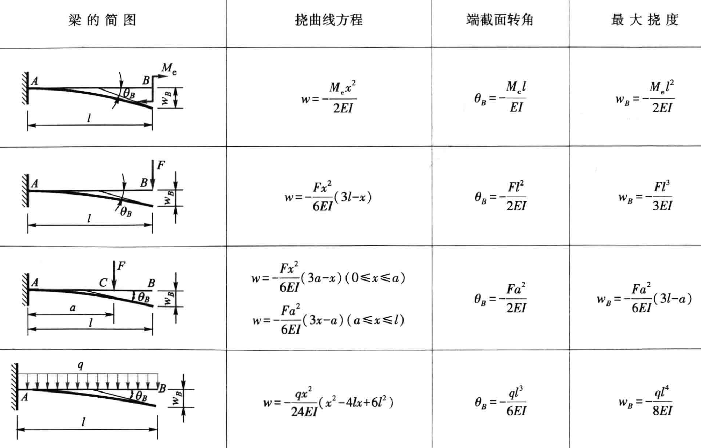
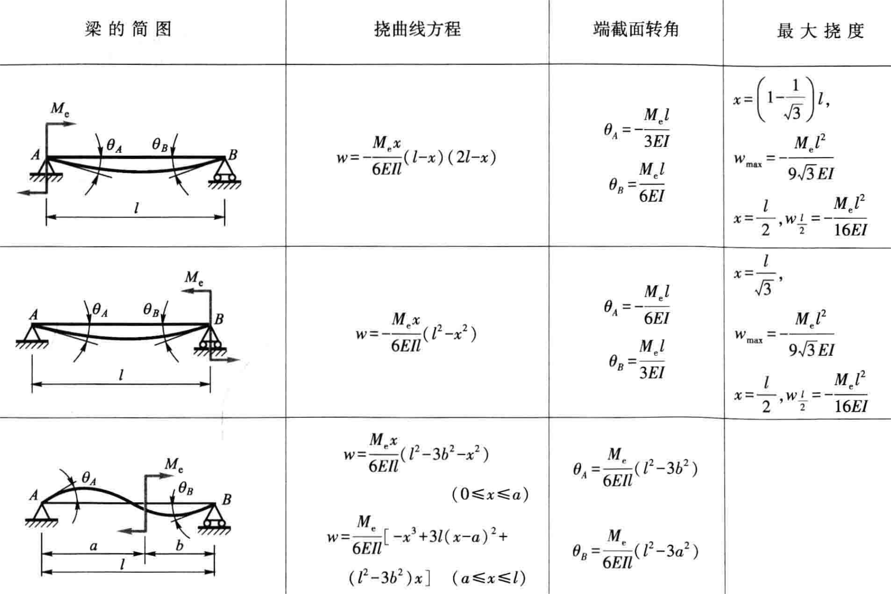
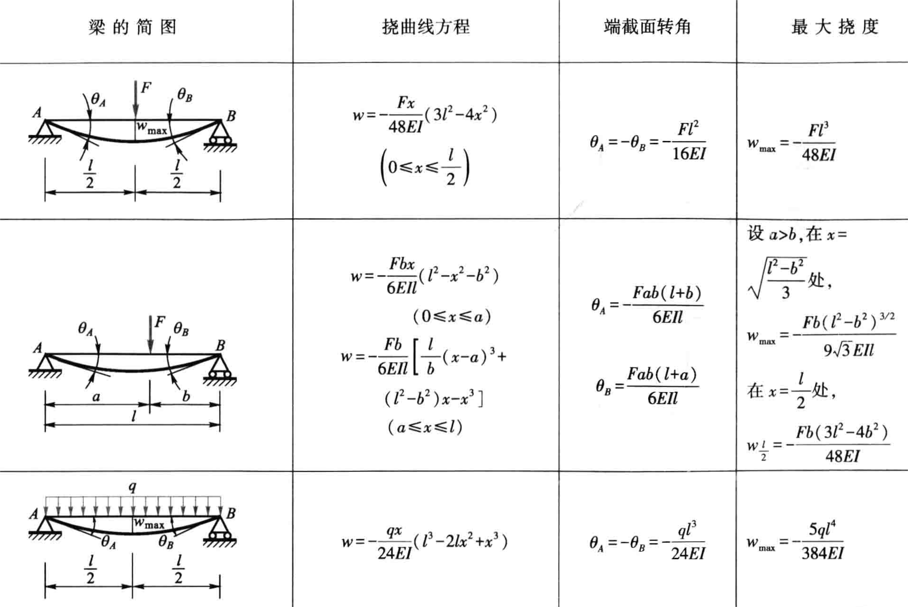
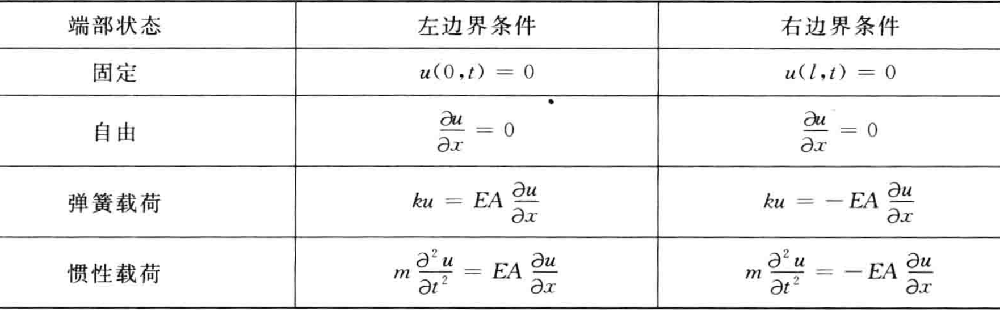
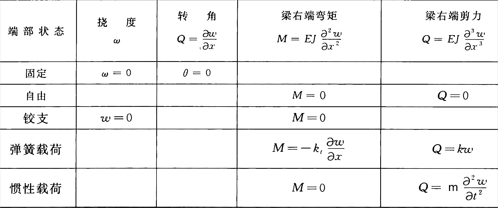

---
output:
  word_document:
    pandoc_args: ["--reference-doc=custom-reference.docx"]
---

# 飞行器结构动力学总结

## 绪论

凡是能产生振动的研究对象统称为结构动力系统，简称**系统**。飞行器结构就是一种典型的动力系统。对于引起系统振动的动载荷，例如外加的动态力或位移、初始干扰等统称为**激励**或输入；系统在输入下产生的效果称为系统的动态响应，简称**响应**，也称为输出，例如振动中产生的位移、速度、加速度、应力等。“系统”“输入”“输出”是结构动力学研究的3个要素。

飞行器结构所具有的固有的动力学特性（例如固有频率与主振型）只与系统的固有质量和刚度特性有关，而与振动的初始条件无关，称之为系统的动态**固有特性**或振动固有特性。飞行器结构的动态特性中最基本的两个就是自由振动特性和强迫振动特性。前者反映了系统的固有特性，后者还与外激励有关。

飞行器结构动力学的目的就是研究关于飞行器结构动力系统振动固有特性及它在外激励作用下产生动响应的基本理论和分析方法，使飞行器结构具有优良的动力学特性，以保证其结构安全、可靠。内容包括基础理论和专业内容。基础理论涉及单自由度系统振动、多自由度系统振动、连续弹性体系统振动和随机振动。专业内容包括飞行器结构动力学建模、模态分析、动力响应分析、结构耦合动力学和结构振动控制。

在结构动力学研究的3个要素中，已知任意两个要素求解第三个要素都属于结构动力学的研究范畴。已知动力系统和动载荷求系统的响应，称为响应预测或振动分析。已知动力系统与系统的响应来反求系统的输入，称为载荷辨识或动环境预示。在动载荷与系统响应均为已知的情况下，确定系统的动力学参数或模型，称为参数辨识或系统辨识。此类问题的另一种提法是在一定的动载荷条件下，如何来设计系统的特性，使得系统的响应满足指定的设计要求，这就是所谓的结构动力学设计。在上述3类问题中，第一类问题通常称为正问题，第二、三类问题称为反问题。第一类问题研究的基本内容分为两个大类：固有特性问题和响应问题。

**飞行器结构动力学设计(飞行器结构动态设计)的概念**：对于那些主要承受动载荷的设计情况，应当采用动力学的方法分析确定其结构设计参数，当然与此同时也应满足其他方面的要求（例如质量要求）。对于结构动力学设计，原则上主要包含以下内容：（1）在给定固有频率要求或动响应要求，或者频率、响应同时要求的情况下，对结构构型或布局进行设计优选。（2）在确定布局及构型后进行结构动力分析，对相关结构设计参数进行设计优选。（3）在基本设计参数确定之后，如有必要还应进行质量、刚度及阻尼附加的设计优选，或附加其他类型的振动控制措施。

**主要结构动力学问题**:1. **动载荷分析**：分析飞行器所处的动力环境和受到的各种动载荷。2. **结构振动固有特性分析**：研究结构的固有频率、主振型和模态阻尼。-**结构动态响应分析**：研究结构在外激励下的响应。3. **气动弹性分析**：防止飞行器发生结构动力不稳定现象，如颤振。

**基本特点**:1. 结构动力问题包含时间变量，与静力问题相比存在很大差别。2. 惯性力的存在是动力问题的一个重要特点，尤其在振动现象中。

**研究方法**：分析方法和试验方法，两者相辅相成。

结构动力学分析模型的分类主要基于系统的物理特性和所用的数学方法。以下是主要的分类方法：1.**连续系统模型（分布参数系统）**:-这类模型假设结构是连续的，质量、刚度和阻尼在整个体积上都连续分布。-使用偏微分方程来描述系统的动力行为。-适用于诸如梁、板、壳等结构，其动态行为需要在空间上连续考虑。2.**离散系统模型（集中参数系统）**:-将结构简化为有限个质量、弹簧和阻尼元素的集合，每个元素代表结构的一部分。-使用常微分方程来描述系统的动力行为。-适用于结构可以合理地被简化为几个集中质量和弹簧系统的情况，例如多层框架结构。3.**混合系统模型**:-结合连续系统和离散系统的特点，用于描述某些部分是连续的而其他部分是离散的复杂结构。-这类模型可能同时使用偏微分方程和常微分方程。4.**线性与非线性模型**:-**线性模型**假设结构的动力响应与外部激励之间关系是线性的，叠加原理适用。-**非线性模型**涉及到的力和响应不是线性关系，可能由于材料行为、几何大变形、边界条件或载荷效应导致。5.**常参数与变参数系统**:-**常参数系统**的特性参数（如质量、刚度、阻尼）不随时间变化。-**变参数系统**的一些特性参数随时间变化，这可能是由于材料性质的变化、边界条件的变化或其他外部因素。6.**确定性与随机模型**:-**确定性模型**对于给定的输入可以预测一个明确的输出。-**随机模型**用于描述输入、输出或系统参数具有随机性的情况，通常需要统计方法来分析和解释。选择哪种模型取决于结构的类型、感兴趣的现象、所需的精度和分析的复杂性。通常，更复杂的模型可以提供更精确的结果，但也需要更多的计算资源和更复杂的数学处理。

振动过程是指振动位移、速度、加速度、力和应变等机械量随时间的变化历程。对振动过程，按不同的标准有多种分类方法。振动的分类情况根据不同的特征和标准可以分为多种类型：1.**按自由度数目**:-**单自由度系统振动**:只需一个坐标来描述系统的动态行为。-**多自由度系统振动**:需要多个坐标来描述。-**连续体振动**:需要无穷多个坐标来描述，如梁、板、壳等。2.**按输入特性(激励)**:-**自由振动**:无持续外部激励，仅由初始条件引起。-**强迫振动**:外部激励引起，如周期性、随机或瞬态力。-**自激振动**:系统内部机制引起，如气流引起的颤振。-**参数振动**:系统参数的周期性变化引起。3.**按输出(响应)性质**:-**确定性振动**:振动行为可以精确预测。-**随机振动**:振动行为具有随机性，通常用统计方法描述。4.**按运动规律**:-**周期振动**:运动以固定的周期重复。-**非周期振动**:不规则或不重复的振动，如瞬态响应。-**随机振动**:振动参数随机变化，如在复杂环境中的结构。5.**按系统的线性性**:-**线性振动**:系统响应与激励成线性关系，叠加原理适用。-**非线性振动**:系统响应与激励之间的非线性关系，可能出现复杂的动态行为如混沌和跳跃。这些分类帮助工程师和研究人员根据不同的情况和需求选择适当的分析方法和控制策略。

动荷载的定义：大小、方向和作用点随时间变化；在其作用下，结构上的惯性力与外荷比不可忽视的荷载。**自重、缓慢变化的荷载，其惯性力与外荷比很小，分析时仍视作静荷载**。静荷只与作用位置有关，而动荷是坐标和时间的函数。

## 数学基础

<!-- ### 不定积分表

$$
\int \sin x \mathrm{d} x = -\cos x + C
$$

$$
\int \cos x \mathrm{d} x = \sin x + C
$$

$$
\int \sin^2 x \mathrm{d} x = \frac{1}{2}(x - \sin x \cos x) + C
$$

$$
\int \cos^2 x \mathrm{d} x = \frac{1}{2}(x + \sin x \cos x) + C
$$

$$
\int \sin^n x \mathrm{d} x = -\frac{1}{n}\cos x \sin^{n-1} x + \frac{n-1}{n} \int \sin^{n-2} x \mathrm{d} x \quad(n=2,3, \cdots)
$$

$$
\int \cos^n x \mathrm{d} x = \frac{1}{n}\sin x \cos^{n-1} x + \frac{n-1}{n} \int \cos^{n-2} x \mathrm{d} x \quad(n=2,3, \cdots)
$$

$$
\int \sin(ax) \sin(bx) \mathrm{d} x = -\frac{1}{2a} \cos((a+b)x) + \frac{1}{2a} \cos((a-b)x) + C
$$

$$
\int \sin(ax) \cos(bx) \mathrm{d} x = \frac{1}{2a} \sin((a+b)x) + \frac{1}{2a} \sin((a-b)x) + C
$$

$$
\int \cos(ax) \sin(bx) \mathrm{d} x = -\frac{1}{2a} \sin((a+b)x) + \frac{1}{2a} \sin((a-b)x) + C
$$

$$
\int \cos(ax) \cos(bx) \mathrm{d} x = \frac{1}{2a} \cos((a+b)x) + \frac{1}{2a} \cos((a-b)x) + C
$$

$$
\int \operatorname{sh} \alpha x \mathrm{d} x=\frac{1}{\alpha} \operatorname{ch} \alpha x+C
$$

$$
\int \operatorname{ch} \alpha x \mathrm{d} x=\frac{1}{\alpha} \operatorname{sh} \alpha x+C
$$

$$
\int \operatorname{sh}^{2} \alpha x \mathrm{d} x=\frac{1}{4 \alpha} \operatorname{sh} 2 \alpha x-\frac{x}{2}+C
$$

$$
\int \operatorname{ch}^{2} \alpha x \mathrm{d} x=\frac{1}{4 \alpha} \operatorname{sh} 2 \alpha x+\frac{x}{2}+C
$$

$$
\int \operatorname{sh}^{n} \alpha x \mathrm{d} x=\frac{1}{\alpha n} \operatorname{sh}^{n-1} \alpha x \cdot \operatorname{ch} \alpha x-\frac{n-1}{n} \int \operatorname{sh}^{n-2} \alpha x \mathrm{d} x \quad(n=2,3, \cdots)
$$

$$
\int \operatorname{ch}^{n} \alpha x \mathrm{d} x=\frac{1}{\alpha n} \operatorname{sh} \alpha x \cdot \operatorname{ch}^{n-1} \alpha x+\frac{n-1}{n} \int \operatorname{ch}^{n-2} \alpha x \mathrm{d} x \quad(n=2,3, \cdots)
$$

$$
\int \operatorname{sh}(\alpha x) \operatorname{sh}(\beta x) \mathrm{d} x = \frac{1}{\alpha^2 - \beta^2} (\alpha \operatorname{sh}(\beta x) \operatorname{ch}(\alpha x) - \beta \operatorname{ch}(\beta x) \operatorname{sh}(\alpha x)) + C \quad (\alpha^2 \neq \beta^2)
$$

$$
\int \operatorname{ch}(\alpha x) \operatorname{ch}(\beta x) \mathrm{d} x = \frac{1}{\alpha^2 - \beta^2} (\alpha \operatorname{sh}(\alpha x) \operatorname{ch}(\beta x) - \beta \operatorname{sh}(\beta x) \operatorname{ch}(\alpha x)) + C \quad (\alpha^2 \neq \beta^2)
$$

$$
\int \operatorname{ch}(\alpha x) \operatorname{sh}(\beta x) \mathrm{d} x = \frac{1}{\alpha^2 - \beta^2} (\alpha \operatorname{sh}(\alpha x) \operatorname{sh}(\beta x) - \beta \operatorname{ch}(\alpha x) \operatorname{ch}(\beta x)) + C \quad (\alpha^2 \neq \beta^2)
$$

$$
\int \sin(a x + b) \sin(c x + d) \mathrm{d} x = \frac{a}{a^2 + c^2} \operatorname{ch}(ax + b) \sin(c x + d) - \frac{c}{a^2 + c^2} \operatorname{sh}(ax + b) \cos(c x + d) + C
$$

$$
\int \sin(a x + b) \cos(c x + d) \mathrm{d} x = \frac{a}{a^2 + c^2} \operatorname{ch}(ax + b) \cos(c x + d) + \frac{c}{a^2 + c^2} \operatorname{sh}(ax + b) \sin(c x + d) + C
$$

$$
\int \cos(a x + b) \sin(c x + d) \mathrm{d} x = \frac{a}{a^2 + c^2} \operatorname{sh}(ax + b) \sin(c x + d) - \frac{c}{a^2 + c^2} \operatorname{ch}(ax + b) \cos(c x + d) + C
$$

$$
\int \cos(a x + b) \cos(c x + d) \mathrm{d} x = \frac{a}{a^2 + c^2} \operatorname{sh}(ax + b) \cos(c x + d) + \frac{c}{a^2 + c^2} \operatorname{ch}(ax + b) \sin(c x + d) + C
$$ -->

### 傅里叶级数

$$
F(t)=\frac{a_{0}}{2}+\sum_{n=1}^{\infty}\left(a_{n} \cos n \omega_{1} t+b_{n} \sin n \omega_{1} t\right)
$$

$$
a_{0}=\frac{2}{T} \int_{T} F(t) \mathrm{d} t
$$

$$
a_{n}=\frac{2}{T} \int_{T} F(t) \cos n \omega_{1} t \mathrm{~d} t
$$

$$
b_{n}=\frac{2}{T} \int_{T} F(t) \sin n \omega_{1} t \mathrm{~d} t
$$

$\omega_{1}=\dfrac{2 \pi}{T}$  称为基频

### 单边拉普拉斯变换

$$
\displaystyle F(s)=\int_{0_{-}}^{\infty} f(t) \mathrm{e}^{-s t} \mathrm{~d} t
$$

$$
\displaystyle f(t)=\dfrac{1}{2 \pi \mathrm{j}} \int_{\sigma-\mathrm{j} \infty}^{\sigma+\mathrm{j} \infty} F(s) \mathrm{e}^{s t} \mathrm{~d} s
$$

- $s=\sigma+\mathrm{j} \omega$

记  $F(s)=\mathscr{L}[f(t)]$

| 时间域函数 $f(t)$ | 拉普拉斯变换 $F(s)$ |
|-------------------|---------------------|
| $\delta(t)$（单位脉冲函数） | $1$ |
| $u(t)$（单位阶跃函数） | $\dfrac{1}{s}$ |
| $e^{-at}$（指数衰减函数） | $\dfrac{1}{s+a}$ |
| $\sin(bt)$ | $\dfrac{b}{s^2 + b^2}$ |
| $\cos(bt)$ | $\dfrac{s}{s^2 + b^2}$ |
| $t \cdot e^{-at}$ | $\dfrac{1}{(s+a)^2}$ |
| $t^n$ ($n$  为正整数) | $\dfrac{n!}{s^{n+1}}$ |

**线性性质**

$$
\mathscr{L}\left[a f_{1}(t)+b f_{2}(t)\right]=a \mathscr{L}\left[f_{1}(t)\right]+b \mathscr{L}\left[f_{2}(t)\right]=a F_{1}(s)+b F_{2}(s)
$$

**微分定理**

$$
\mathscr{L}\left[\dfrac{\mathrm{d} f(t)}{\mathrm{d} t}\right]=s F(s)-f(0)
$$

$$
\mathscr{L}\left[\dfrac{\mathrm{d}^{n} f(t)}{\mathrm{d} t^{n}}\right]=s^{n} F(s)-\left[s^{n-1} f(0)+s^{n-2} \dot{f}(0)+\cdots+f^{(n-1)}(0)\right]
$$

- $f(0), \dot{f}(0), \ddot{f}(0), \cdots, f^{(n-1)}(0)$  为  $f(t)$  及其各阶导数在  t=0  时的值

**积分定理**

$$
\displaystyle\mathscr{L}\left[\int f(t) \mathrm{d} t\right]=\dfrac{1}{s} F(s)+\dfrac{1}{s} f^{(-1)}(0)
$$

$$
\displaystyle\mathscr{L}\left[\underbrace{\int \cdots \int}_{n} f(t)(\mathrm{d} t)^{n}\right]=\dfrac{1}{s^{n}} F(s)+\dfrac{1}{s^{n}} f^{(-1)}(0)+\cdots+\dfrac{1}{s} f^{(-n)}(0)
$$

- $f^{(-1)}(0), f^{(-2)}(0), \cdots, f^{(-n)}(0)$  为  $f(t)$  的各重积分在  $t=0$  时的值

**初值定理**

$$
\lim _{t \rightarrow 0_{+}} f(t)=\lim _{s \rightarrow \infty} s F(s)
$$

**终值定理**

$$
\lim _{t \rightarrow \infty} f(t)=\lim _{s \rightarrow 0} s F(s)
$$

**位移定理**

$$
\mathscr{L}\left[f\left(t-\tau_{0}\right) u\left(t-\tau_{0}\right)\right]=\mathrm{e}^{-\tau_{0} s} F(s) , \quad \tau_{0} \ge 0
$$

$$
\mathscr{L}\left[\mathrm{e}^{\alpha t} f(t)\right]=F(s-\alpha)
$$

**相似定理**

$$
\mathscr{L}\left[f\left(\dfrac{t}{a}\right)\right]=a F(a s)
$$

- $a$  为实常数

**卷积定理**

设  $F_{1}(s)=\mathscr{L}\left[f_{1}(t)\right]$，$F_{2}(s)=\mathscr{L}\left[f_{2}(t)\right]$，则有

$$
F_{1}(s) F_{2}(s)=\mathscr{L}\left[\int_{0}^{t} f_{1}(t-\tau) f_{2}(\tau) \mathrm{d} \tau\right]
$$

式中，$\displaystyle\int_{0}^{t} f_{1}(t-\tau) f_{2}(\tau) \mathrm{d} \tau$  叫做  $f_{1}(t)$  和  $f_{2}(t)$  的卷积，可写为  $f_{1}(t) * f_{2}(t)$

### 有理代数分式

$$
F(s)=\dfrac{B(s)}{A(s)}=\dfrac{b_{0} s^{m}+b_{1} s^{m-1}+\cdots+b_{m-1} s+b_{m}}{s^{n}+a_{1} s^{n-1}+\cdots+a_{n-1} s+a_{n}}
$$

式中，系数  $a_{1}, a_{2}, \cdots, a_{n}$，$b_{0}, b_{1}, \cdots, b_{m}$  都是实常数。$m$、$n$ 是正整数，通常  $m<n$。为了将  $F(s)$  写为部分分式形式，首先把  $F(s)$  的分母因式分解

$$
F(s)=\dfrac{B(s)}{A(s)}=\dfrac{b_{0} s^{m}+b_{1} s^{m-1}+\cdots+b_{m-1} s+b_{m}}{\left(s-s_{1}\right)\left(s-s_{2}\right) \cdots\left(s-s_{n}\right)}
$$

式中，$s_{1}, s_{2}, \cdots, s_{n}$  是  $A(s)=0$  的根，称为  $F(s)$  的**极点**。按照这些根的性质，分以下两种情况研究。

**无重根**

$A(s)=0$  无重根

这时，  $F(s)$  可展开为  $n$  个简单的部分分式之和，每个部分分式都以  $A(s)$  的一个因式作为其分母

$$
\displaystyle F(s)=\dfrac{c_{1}}{s-s_{1}}+\dfrac{c_{2}}{s-s_{2}}+\cdots+\dfrac{c_{i}}{s-s_{i}}+\cdots+\dfrac{c_{n}}{s-s_{n}}=\sum_{i=1}^{n} \dfrac{c_{i}}{s-s_{i}}
$$

式中， $c_{i}$  为待定常数，称为  $F(s)$  在极点  $s_{i}$  处的**留数**，可按下式计算:

$$
c_{i}=\lim _{s \rightarrow s_{i}}\left[\left(s-s_{i}\right) F(s)\right]
$$

或

$$
c_{i}=\left.\dfrac{B(s)}{\dot{A}(s)}\right|_{s=s_{i}}
$$

式中， $\dot{A}(s)$  为  $A(s)$  对  $s$  求一阶导数。

$$
\displaystyle f(t)=\mathscr{L}^{-1}[F(s)]=\mathscr{L}^{-1}\left[\sum_{i=1}^{n} \dfrac{c_{i}}{s-s_{i}}\right]=\sum_{i=1}^{n} c_{i} \mathrm{e}^{s_{i} t}
$$

**有重根**

$A(s)=0$  有重根

设  $A(s)=0$  有  $r$  个重根  $s_{1}$，则  $F(s)$  可写为

$$
\begin{aligned}
F(s) & =\dfrac{B(s)}{\left(s-s_{1}\right)^{r}\left(s-s_{r+1}\right) \cdots\left(s-s_{n}\right)} \\
& =\dfrac{c_{r}}{\left(s-s_{1}\right)^{r}}+\dfrac{c_{r-1}}{\left(s-s_{1}\right)^{r-1}}+\cdots+\dfrac{c_{1}}{s-s_{1}}+\dfrac{c_{r+1}}{s-s_{r+1}}+\cdots+\dfrac{c_{n}}{s-s_{n}}
\end{aligned}
$$

式中,  $s_{1}$  为  $F(s)$  的重极点， $s_{r+1}, \cdots, s_{n}$  为  $F(s)$  的  $n-r$  个非重极点， $c_{r}, c_{r-1}, \cdots, c_{1}, c_{r+1}, \cdots ,  c_{n}$  为待定常数。其中,  $c_{r+1}, \cdots, c_{n}$  按无重根计算，但  $c_{r}, c_{r-1}, \cdots, c_{1}$  应按下式计算:

$$
\begin{aligned}
c_{r} & =\lim _{s \rightarrow s_{1}}\left(s-s_{1}\right)^{r} F(s) \\
c_{r-1} & =\lim _{s \rightarrow s_{1}} \dfrac{\mathrm{d}}{\mathrm{d} s}\left[\left(s-s_{1}\right)^{r} F(s)\right] \\
& \vdots \\
c_{r-j} & =\dfrac{1}{j !} \lim _{s \rightarrow s_{1}} \dfrac{\mathrm{d}^{(j)}}{\mathrm{d} s^{j}}\left[\left(s-s_{1}\right)^{r} F(s)\right] \\
& \vdots \\
c_{1} & =\dfrac{1}{(r-1) !} \lim _{s \rightarrow s_{1}} \dfrac{\mathrm{d}^{(r-1)}}{\mathrm{d} s^{r-1}}\left[\left(s-s_{1}\right)^{r} F(s)\right]
\end{aligned}
$$

因此，原函数  $f(t)$  为

$$
\begin{aligned}
\displaystyle f(t) & =\mathscr{L}^{-1}[F(s)] \\
& =\mathscr{L}^{-1}\left[\dfrac{c_{r}}{\left(s-s_{1}\right)^{r}}+\dfrac{c_{r-1}}{\left(s-s_{1}\right)^{r-1}}+\cdots+\dfrac{c_{1}}{s-s_{1}}+\dfrac{c_{r+1}}{s-s_{r+1}}+\cdots+\dfrac{c_{n}}{s-s_{n}}\right] \\
& =\left[\dfrac{c_{r}}{(r-1) !} t^{r-1}+\dfrac{c_{r-1}}{(r-2) !} t^{r-2}+\cdots+c_{2} t+c_{1}\right] \mathrm{e}^{s^{s} t}+\sum_{i=r+1}^{n} c_{i} \mathrm{e}^{s_{t} t}
\end{aligned}
$$

## 力学基础

### 拉格朗日方程

把任何一组能完全描述力学体系各部分位形的独立参量称为**广义坐标**。

第  $i$  个质点的虚位移可以由广义坐标的变分表示

$$
\delta \boldsymbol{r}_{i}=\sum\limits_{\alpha=1}^{s} \dfrac{\partial \boldsymbol{r}_{i}}{\partial q_{\alpha}} \delta q_{\alpha}
$$

定义**广义力**

$$
Q_{\alpha}=\sum\limits_{i=1}^{N} \boldsymbol{F}_{i} \cdot \dfrac{\partial \boldsymbol{r}_{i}}{\partial q_{\alpha}}
$$

动能

$$
T=\sum\limits_{i=1}^{N} \dfrac{1}{2} m_{i} \dot{\boldsymbol{r}}_{i}^{2}=T\left(q_{1}, q_{2}, \cdots, q_{s} ; \dot{q}_{1}, \dot{q}_{2}, \cdots, \dot{q}_{s} ; t\right)
$$

一般形式的拉格朗日方程

$$
\dfrac{\mathrm{d}}{\mathrm{d} t} \dfrac{\partial T}{\partial \dot{q}_{\alpha}}-\dfrac{\partial T}{\partial q_{\alpha}}=Q_{\alpha}, \quad \alpha=1,2, \cdots, s
$$

**保守体系**：所有主动力均为保守力时，势能  $V$

拉格朗日量

$$
L=T-V=L(q, \dot{q}, t)
$$

保守体系的拉格朗日方程

$$
\dfrac{\mathrm{d}}{\mathrm{d} t} \dfrac{\partial L}{\partial \dot{q}_{\alpha}}-\dfrac{\partial L}{\partial q_{\alpha}}=0, \quad \alpha=1,2, \cdots, s
$$

### 结构力学

#### 基本应力应变模型

$$
G=\dfrac{E}{2(1+\mu)}
$$

- $G$：切变模量
- $E$：弹性模量
- $\mu$：泊松比

**拉伸与压缩**

拉为正，压为负。对于长为 $l$ 的杆，若轴向力为 $F$，有

$$
\Delta l=\dfrac{F ~ l}{E A} ,\quad V_{\varepsilon}=\dfrac{F^{2} l}{2 E A}
$$

**弯曲**

$$
\dfrac{\mathrm{d}^{2} w}{\mathrm{~d} x^{2}}=\dfrac{\mathrm{d} \theta}{\mathrm{~d} x}=\dfrac{M}{E I} ,\quad \mathrm{d} V_{\varepsilon}=\dfrac{M^{2} \mathrm{d} x}{2 E I}
$$

- 边界条件：在固定端，挠度和转角都为零；在铰支座上，挠度为零
- 连续条件：在挠曲线的任意点上，有唯一确定的挠度和转角

横截面对 $z$ 轴的惯性矩  $\displaystyle I_{z} = \int_{A} y^{2} \mathrm{~d} A$

- 截面是高为  $h$  、宽为  $b$  的矩形，$I_{z}=\dfrac{b h^{3}}{12}$
- 截面是直径为  $d$  的圆形，$I_{z}=\dfrac{\pi d^{4}}{64}$

**扭转**

$$
\dfrac{\mathrm{d} \varphi}{\mathrm{d} x}=\dfrac{T}{G I_{p}} ,\quad \mathrm{d} V_{\varepsilon}=\dfrac{T^{2} \mathrm{d} x}{2 G I_{\mathrm{p}}}
$$

极惯性矩  $\displaystyle I_{\mathrm{p}}=\int_{A} \rho^{2} \mathrm{~d} A$

对于实心圆轴，$\displaystyle I_{\mathrm{p}}=\int_{0}^{2 \pi} \int_{0}^{R} \rho^{3} \mathrm{~d} \rho \mathrm{d} \theta=\dfrac{\pi R^{4}}{2}$

#### 能量方法

**卡氏定理**

卡氏第一定理，适用于线性和非线性的弹性结构

$$
F_{i}=\dfrac{\partial V_{\varepsilon}\left(\delta_{1}, \delta_{2}, \cdots, \delta_{i}, \cdots\right)}{\partial \delta_{i}}
$$

卡氏第二定理，适用于线弹性结构

$$
\delta_{i}=\dfrac{\partial V_{\varepsilon}\left(F_{1}, F_{2}, \cdots, F_{i}, \cdots\right)}{\partial F_{i}}
$$

**虚功原理**

外力所做的虚功等于内力在相应虚位移上所做的功，也等于杆件的虚应变能 。

**单位载荷法 莫尔积分**

利用虚功原理可以导出计算结构一点位移的单位载荷法。设在外力 $F$ 作用下, 结构  $A$  点沿某一任意方向  $a a$  的位移为 $\Delta$。结构上各点的广义位移为  $\mathrm{d} \delta$。

为了计算  $\Delta$ , 设想在同一结构的  $A$  点上, 沿  $a a$  方向作用一单位力, 它与约束力组成平衡力系。这时结构的内力为 $\bar{F}$。

把结构在原有外力 $F$ 作用下的位移作为虚位移, 加于单位力作用下的结构上。根据虚功原理

$$
1 \cdot \Delta = \int{\bar{F} \mathrm{~d} \delta}
$$

因为单位力  $1$  没有量纲，因此单位力引起的内力  $\bar{F}$  也应没有量纲。

对以抗弯为主的杆件

$$
\Delta=\int_{l} \bar{M}(x) \mathrm{d} \theta
$$

$$
\mathrm{d} \theta=\dfrac{M(x)}{E I} \mathrm{~d} x
$$

对有 $n$ 根杆的杆系,  只有轴力的拉伸或压缩

$$
\Delta=\sum_{i=1}^{n} \bar{N}_{i} \Delta l_{i}
$$

$$
\Delta l=\dfrac{N \, l}{E A}
$$

## 单自由度系统的振动

### 基本概念

离散模型的基本元素：弹性元件 $k (\text{N/m})$，阻尼元件 $c (\text{N s/m})$，惯性元件 $m (\text{kg})$

### 自由振动

$$
\ddot{x}+2 \zeta \omega_{n} \dot{x}+\omega_{n}^{2} x=0
$$

- $\omega_{n}$  无阻尼自然角频率
- $\zeta$  粘性阻尼因子
- $\sigma=-\zeta \omega_{n}$ 衰减系数
- $\omega_{d}=\omega_{n} \sqrt{1-\zeta^{2}}$ 阻尼震荡频率

$\zeta<0$ 不稳定的，$\zeta=0$ 无阻尼情况，$0<\zeta<1$ 欠阻尼情况，$\zeta=1$ 临界阻尼情况，$\zeta>1$ 过阻尼情况

对数衰减率

$$
\delta=\ln \frac{x_{1}}{x_{2}}=\frac{2 \pi \zeta}{\sqrt{1-\zeta^{2}}}
$$

### 强迫振动

强迫振动稳态响应的基本特点:

1. 系统在简谐激励的作用下，其强迫振动稳态响应是简谐振动，振动的频率与激励频率相同。
2. 强迫振动稳态响应的相位比激励的相位滞后  $\varphi$ 。无阻尼系统  $\zeta=0$,  $\varphi=0$
3. 强迫振动稳态响应振幅  $X$  与相位差  $\varphi$  只取决于系统本身的特性和激振力的频率  $\omega$  、力幅  $A$， 与振动的初始条件无关。初始条件只能影响系统的瞬态振动解。

$$
m \ddot{x}+c \dot{x}+k x=F_{0} \sin \bar{\omega} t
$$

$$
\ddot{x}+2 \xi \omega_{n} \dot{x}+\omega_{n}^{2} x=\frac{F_{0}}{m} \sin \bar{\omega} t
$$

$$
\xi=\dfrac{c}{2\sqrt{k m}} \quad \omega_{n}=\sqrt{\dfrac{k}{m}}
$$

传递函数

$$
G(s)=\dfrac{1}{s^{2}+2 \xi \omega_{n} s+\omega_{n}^{2}}
$$

特解

$$
x_{p}=X \sin (\bar{\omega} t-\phi)
$$

令  $\dfrac{\bar{\omega}}{\omega_{n}}=\beta$  (称  $\beta$  为频率比)， $D=\dfrac{X}{F_{0} / k}$  (表示稳态响应振幅与静变位之比，叫做动力放大系数，也称为振幅放大因子)，则

$$
X=\frac{F_{0} / k}{\sqrt{\left(1-\beta^{2}\right)^{2}+(2 \xi \beta)^{2}}}
$$

$$
\phi=\arctan \frac{2 \xi \beta}{1-\beta^{2}}
$$

共振：

$$
\beta=\sqrt{1-2 \xi^{2}}
$$

$$
\sqrt{\left(1-\beta^{2}\right)^{2}+(2 \xi \beta)^{2}}=2 \xi \sqrt{1-\xi^{2}}
$$

近似情况下，发生共振时，强迫振动频率与固有频率（自由振动频率）相同，即  $\bar{\omega}=\omega_{n}=\sqrt{\dfrac{k}{m}}$，此时振幅  $A=\dfrac{F_{0}}{2 k \xi}=\dfrac{F_{0}}{c \omega_{n}}$

注意在做题时，可能要把强迫振动作用点固定求固有频率。

### 隔振原理

如果干扰力作用在隔振对象上，或者是隔振对象自己发出的，则隔振是为了减小干扰力对基础的作用，称为**第一类隔振**（主动隔振），或称隔力。**第二类隔振**问题是干扰作用在基础上，隔振是为了减小基础振动对隔振对象的作用，称为被动隔振，也可称隔幅。

(1) 不论阻尼大小, 只有当  $\beta>\sqrt{2}$  时才有隔振效果, 而且, 弹簧阻尼减震器在低频区间 (相对于系统固有频率而言）对隔振不但无利反而有害。
(2)  $\beta>\sqrt{2}$  以后, 随着频率比增加,  T R  趋向于零。但在  $\beta>5$  以后,  T R  曲线几乎水平; 即使采用更好的弹簧阻尼减震器, 隔振效果也提高有限。实用上常取  $\beta$  值在  $2.5 \sim 5$  之间已足够。
(3) 当  $\beta>\sqrt{2}$  时,  T R  随  $\xi$  的增大而提高, 故此时盲目增大阻尼反而对隔振不利。

防止基础振动的位移传到隔振对象上去的问题和防止作用在隔振对象上的干扰力传到基础上去的问题，二者特性完全相同。

### 阻尼理论

等效粘性阻尼系数的等效方法：等效粘性阻尼在一个周期内消耗的能量等
于要简化的非粘性阻尼在同一周期内消耗的能量。

$$
c_{\mathrm{eq}}=\frac{W_{\mathrm{c}}}{\pi \omega A^{2}}
$$

- $W_{\mathrm{c}}$ 一个周期内等效粘性阻尼所耗的能量
- $\omega$ 简谐振动频率
- $A$ 简谐振动振幅

**库仑摩擦阻尼**

$$
F_{\mu}=\mu F_{N} ,\quad c_{\mathrm{eq}}=\frac{4 F_{\mu}}{\pi \omega A}
$$

**低粘度流体阻尼**

$$
F_{p}=c_{p} \dot{x}^{2} ,\quad c_{\mathrm{eq}}=\frac{8 c_{p} \omega A}{3 \pi}
$$

**结构阻尼**

$$
W_{c}=\alpha A^{2} ,\quad c_{\mathrm{eq}}=\frac{\alpha}{\pi \omega}
$$

## 多自由度系统的振动

### 多自由度系统的数学描述

$$
\boldsymbol{M} \ddot{\boldsymbol{q}}+\boldsymbol{C} \dot{\boldsymbol{q}}+\boldsymbol{K} \boldsymbol{q}=\boldsymbol{Q}^{F}
$$

- $\boldsymbol{q}$ 广义坐标
- $\boldsymbol{M}$ 质量矩阵，总是对称阵
- $\boldsymbol{C}$ 阻尼矩阵
- $\boldsymbol{K}$ 刚度矩阵
- $\boldsymbol{Q}^{F}$ 广义力列阵

柔度矩阵 $\boldsymbol{R} = \boldsymbol{K}^{-1}$

动能 $T=\dfrac{1}{2} \dot{\boldsymbol{q}}^{T} \boldsymbol{M} \dot{\boldsymbol{q}}$，势能 $U=\dfrac{1}{2} \boldsymbol{q}^{T} \boldsymbol{K} \boldsymbol{q}$

### 无阻尼自由振动

$$
\boldsymbol{M} \ddot{\boldsymbol{q}}+\boldsymbol{K} \boldsymbol{q}=0
$$

系统的质量阵为非对角阵，称这种情况为**惯性耦合**或动力耦合。广义刚度矩阵为非对角阵，则称此情况为**弹性耦合**或静耦合。进行适当的坐标变换可以消除耦合项，这叫**解耦**。能使多自由度系统运动方程解耦的广义坐标称为**主坐标**。采用主坐标，就可将多自由度系统的振动分解化简成若干单自由度系统的振动来分析。

$n$  自由度系统有  $n$  个**固有频率**。最小的固有频率称为一阶固有频率，简称**基频**。随着固有频率值的增加，依次称为第 $1$、第 $2$、...、第  $n$  阶固有频率。

当系统按任一固有频率振动时，振幅比是确定的，与初始条件无关。振幅比决定了整个系统的振动形态，对应于一个固有频率只有一个振动形态，并称此形态为**主振型**或主模态。对应于  $\omega_{1}$  的主振型叫第一主振型，对应于  $\omega_{2}$  的则叫第二主振型。因为主振型（有时简称振型）和固有频率一样只取决于系统的物理性质，与初始条件无关，所以把固有频率及相应的主振型合称为系统的固有特性。

作主振动时，系统各质量点同时经过静平衡位置，同时到达最大偏离位置，以确定的频率与振型作简谐振动。

**主坐标变换**

系统的运动是主振动的叠加。

$$
\boldsymbol{q}=\boldsymbol{\phi} \boldsymbol{\eta} ,\quad \boldsymbol{q}=\sum_{i=1}^{n} \boldsymbol{\phi}_{i} \eta_{i}
$$

- $\boldsymbol{\phi}$  模态矩阵，各阶主振型按列排列而成
- $\boldsymbol{\eta}$  主坐标列阵

假设讨论的质量矩阵  $\boldsymbol{M}$  是正定的，刚度矩阵  $\boldsymbol{K}$  是正定或半正定的。把刚度矩阵是正定的系统叫**正定系统**，把刚度矩阵是半正定的系统叫**半正定系统**。

一个主振型  $\boldsymbol{q}_{i}=\boldsymbol{\phi}_{i} \sin(\omega_{i} t+\varphi_{i})$ ，代入振动方程，有

$$
\boldsymbol{S} \boldsymbol{\phi}_{i}=\omega_{i}^{2} \boldsymbol{\phi}_{i}
$$

其中  $\boldsymbol{S}=\boldsymbol{M}^{-1} \boldsymbol{K}$，为系统矩阵。于是有特征方程(频率方程)

$$
|\boldsymbol{S}-\lambda \boldsymbol{I}|=0
$$

其解为特征值  $\lambda_{i}=\omega_{i}^{2}$ ，对应特征向量即  $\boldsymbol{\phi}_{i}$ ，于是可求模态矩阵  $\boldsymbol{\phi}$ 。主坐标变换代回运动方程

$$
\ddot{\boldsymbol{\eta}}+\boldsymbol{\phi}^{-1} \boldsymbol{S} \boldsymbol{\phi} \boldsymbol{\eta}=0
$$

结合初始条件  $\boldsymbol{\eta}_{0}=\boldsymbol{\phi}^{-1} \boldsymbol{q}_{0}$ 、 $\dot{\boldsymbol{\eta}}_{0}=\boldsymbol{\phi}^{-1} \dot{\boldsymbol{q}_{0}}$ ，可求解  $\boldsymbol{\eta}$ ， 从而求得  $\boldsymbol{q}$

或者

$$
\boldsymbol{A} \boldsymbol{\phi}_{i}=\dfrac{1}{\omega_{i}^{2}} \boldsymbol{\phi}_{i}
$$

动力矩阵  $\boldsymbol{A}=\boldsymbol{R M}=\boldsymbol{K}^{-1} \boldsymbol{M}$。于是有特征方程(频率方程)

$$
|\boldsymbol{A}-\bar{\lambda} \boldsymbol{I}|=0
$$

其解为特征值  $\bar{\lambda}_{i}=\dfrac{1}{\omega_{i}^{2}}$ ，正定系统的特征值是正数，半正定系统的特征值是正数或零。对应特征向量即  $\boldsymbol{\phi}_{i}$ 。与上同理，可求解系统运动

$$
\boldsymbol{\phi}^{-1} \boldsymbol{A} \boldsymbol{\phi} \ddot{\boldsymbol{\eta}}+\boldsymbol{\eta}=0
$$

**主振型的正交性**

$\boldsymbol{\phi}^{\mathrm{T}} \boldsymbol{M} \boldsymbol{\phi}$  和  $\boldsymbol{\phi}^{\mathrm{T}} \boldsymbol{K} \boldsymbol{\phi}$  都是对角矩阵，于是解耦的运动方程又可以写成

$$
\boldsymbol{\phi}^{\mathrm{T}} \boldsymbol{M} \boldsymbol{\phi} \ddot{\boldsymbol{\eta}}+\boldsymbol{\phi}^{\mathrm{T}} \boldsymbol{K} \boldsymbol{\Phi} \boldsymbol{\eta}=\mathbf{0}
$$

**正规坐标变换**

正规化（归一化）模态矩阵  $\boldsymbol{\mu}$  有

$$
\boldsymbol{\mu}^{\mathrm{T}} \boldsymbol{M} \boldsymbol{\mu}=\boldsymbol{I}
$$

$$
\boldsymbol{\mu}^{\mathrm{T}} \boldsymbol{K} \boldsymbol{\mu}=\boldsymbol{\Lambda} ,\quad (\boldsymbol{\Lambda})_{ii}=\lambda_{i}
$$

$\boldsymbol{\Lambda}$  是系统的特征值矩阵，以特征值  $\lambda$  为 对角线元素的对角阵

运动方程变换为

$$
\ddot{\boldsymbol{\eta}}+\boldsymbol{\Lambda} \boldsymbol{\eta}=\mathbf{0}
$$

通过正规坐标或主坐标变换，使原来的运动方程解耦的方法叫做**模态分析法**。分别求解每一正规坐标或主坐标下的响应，然后叠加，即可得出原始坐标所表示的响应。这种方法叫做振型叠加法，或称**模态叠加法**。

### 多自由度系统的阻尼

阻尼矩阵  $\boldsymbol{C}$  一般为对称的正定矩阵。但  $\boldsymbol{\phi}^{\mathrm{T}} \boldsymbol{C} \boldsymbol{\phi}$  一般不是对角阵。阻尼耦合解耦的方法如下：

- **比例阻尼**：$\boldsymbol{C}=a_{0} \boldsymbol{M}+a_{1} \boldsymbol{K}$
- **振型阻尼（模态阻尼）**：将非对角线元素近似地视为零。
- 黏性阻尼系统的复模态方法

## 连续弹性体系统的振动

(1)材料是均匀、连续、各向同性的。(2)在所有情况下应力都不超过弹性极限，并服从胡克定律。(3)变形是微小的，并满足连续条件。

### 基本概念

频率方程：解出固有频率的方程

单位长度重量为  $\gamma A$，则密度  $\rho=\gamma / g$

### 连续弹性体振动模型

**杆的纵向振动**

$$
\frac{\partial^{2} u}{\partial t^{2}}=a^{2} \frac{\partial^{2} u}{\partial x^{2}} ,\quad a^{2}=\frac{E}{\rho}
$$

$$
u(x, t)=\left(C_{1} \sin \frac{\omega x}{a}+C_{2} \cos \frac{\omega x}{a}\right)\left(C_{3} \sin \omega t+C_{4} \cos \omega t\right)
$$

**圆轴的自由扭转振动**

$$
\frac{\partial^{2} \theta}{\partial t^{2}}=a^{2} \frac{\partial^{2} \theta}{\partial x^{2}} ,\quad a^{2}=\frac{G}{\rho}
$$

$$
\theta(x, t)=\left(C_{1} \sin \frac{\omega x}{a}+C_{2} \cos \frac{\omega x}{a}\right)\left(C_{3} \sin \omega t+C_{4} \cos \omega t\right)
$$

| | 杆的纵振 | 轴的扭振 |
| --- | --- | --- |
| 物理参数 | $E$ 弹性模量     $A$ 截面积    $\rho$ 密度 | 剪切$G$ 弹性模量    $I_{p}$ 截面极惯性矩   $\rho$ 密度  |
| 截面的位移 | 纵向位移 | 转角 |
| 单位长度的质量或转动惯量 | $\rho A$ | $\rho I_p$ |
| 截面处力(或扭矩) | $E A \dfrac{\partial y}{\partial x}$ | $G I_p \dfrac{\partial y}{\partial x}$ |

**梁的横向振动**

无阻尼自由振动方程

$$
\frac{\partial^{2} w}{\partial t^{2}}+a^{2} \frac{\partial^{4} w}{\partial x^{4}}=0 ,\quad a^{2}=\frac{E J}{\rho A}
$$

分离变量

$$
w(x, t)=\phi(x) q(t)
$$

振型函数

$$
\phi(x)=C_{1} \sin \beta x+C_{2} \cos \beta x+C_{3} \operatorname{sh} \beta x+C_{4} \operatorname{ch} \beta x
$$

$$
\frac{\partial \phi}{\partial x}=\beta \left(C_{1} \cos \beta x-C_{2} \sin \beta x+C_{3} \operatorname{ch} \beta x+C_{4} \operatorname{sh} \beta x\right)
$$

$$
\frac{\partial^{2} \phi}{\partial x^{2}}=\beta^{2}\left(-C_{1} \sin \beta x-C_{2} \cos \beta x+C_{3} \operatorname{sh} \beta x+C_{4} \operatorname{ch} \beta x\right)
$$

$$
\frac{\partial^{3} \phi}{\partial x^{3}}=\beta^{3}\left(-C_{1} \cos \beta x+C_{2} \sin \beta x+C_{3} \operatorname{ch} \beta x+C_{4} \operatorname{sh} \beta x\right)
$$

$$
\beta^{4}=\frac{\omega^{2}}{a^{2}}
$$

$$
\operatorname{sh} x=\frac{e^{x}-e^{-x}}{2}, \quad \operatorname{ch} x=\frac{e^{x}+e^{-x}}{2}
$$

$$
q(t)=C_{5} \cos \omega t+C_{6} \sin \omega t
$$

**矩形薄板的横向振动**

$$
D\left(\frac{\partial^{4} w}{\partial x^{4}}+2 \frac{\partial^{4} w}{\partial x^{2} \partial y^{2}}+\frac{\partial^{4} w}{\partial y^{4}}\right)+\rho h \frac{\partial^{2} w}{\partial t^{2}}=P(x, y, t)
$$

- $D=\dfrac{E h^{3}}{12(1-\mu)^{2}}$  薄板的弯曲刚度
- $P(x, y, t)$  作用在板的单位面积上的外载荷，其正向与  $z$  轴方向一致

固定边: 边界上挠度为零、转角为零, 可导出

$$
w=0, \quad \frac{\partial w}{\partial x}=0(\text { 对于边界 } x=0, x=a)
$$

$$
w=0, \quad \frac{\partial w}{\partial y}=0(\text { 对于边界 } y=0, y=b)
$$

简支边: 边界上挠度为零、弯矩为零, 可导出

$$
w=0, \quad \frac{\partial^{2} w}{\partial x^{2}}=0(\text { 对于边界 } x=0, x=a)
$$

$$
w=0, \quad \frac{\partial^{2} w}{\partial y^{2}}=0(\text { 对于边界 } y=0, y=b)
$$

自由边: 边界上弯矩、剪力、转矩均等于零, 可导出:

$$
\frac{\partial^{2} w}{\partial x^{2}}+\mu \frac{\partial^{2} w}{\partial y^{2}}=0, \quad \frac{\partial^{3} w}{\partial x^{3}}+(2-\mu) \frac{\partial^{3} w}{\partial x \partial y^{2}}=0(\text { 对于边界 } x=0, x=a)
$$

$$
\frac{\partial^{2} w}{\partial y^{2}}+\mu \frac{\partial^{2} w}{\partial x^{2}}=0, \quad \frac{\partial^{3} w}{\partial y^{3}}+(2-\mu) \frac{\partial^{3} w}{\partial y \partial x^{2}}=0(\text { 对于边界 } y=0, y=b)
$$

分离变数

$$
w(x, y, t)=W(x, y) \mathrm{e}^{\mathrm{i} \omega t}
$$

板的振型函数为

$$
W_{m, n}=A_{m, n} \sin \frac{m \pi x}{a} \sin \frac{n \pi y}{b} \quad(m, n=1,2,3, \cdots)
$$

固有圆频率

$$
\omega_{m, n}=\frac{\pi^{2}}{a^{2}}\left(m^{2}+\frac{a^{2} n^{2}}{b^{2}}\right) \sqrt{\frac{D}{\rho h}} \quad(m, n=1,2, \cdots)
$$

如果是正方形板，可得到一系列的固有频率

$$
\omega_{11}=\frac{2 \pi^{2}}{a^{2}} \sqrt{\frac{D}{\rho h}}, \quad \omega_{12}=\omega_{21}=\frac{5 \pi^{2}}{a^{2}} \sqrt{\frac{D}{\rho h}}, \quad \omega_{22}=\frac{8 \pi^{2}}{a^{2}} \sqrt{\frac{D}{\rho h}}, \quad \cdots
$$

### 模态分析与模态叠加

以梁为例

振型函数  $X_{i}(x)$  与  $X_{j}(x)$  关于质量密度  $\rho(x)$  和刚度  $E I(x)$  正交

$$
\displaystyle \int \rho(x) X_{i}(x) X_{j}(x) \mathrm{d} x=0 , \quad i \neq j
$$

$$
\displaystyle \int E I(x) \frac{\partial^{2} X_{i}(x)}{\partial x^{2}} \frac{\partial^{2} X_{j}(x)}{\partial x^{2}} \mathrm{d} x=0 , \quad i \neq j
$$

振型函数的正交性反映了各阶主振动之间既不存在惯性耦合作用，也不存在弹性耦合作用。

广义质量

$$
\displaystyle M_{i}=\int \rho(x) X_{i}^{2}(x) \mathrm{d} x
$$

广义刚度

$$
\displaystyle K_{i}=\int E I(x)\left[\frac{\partial^{2} X_{i}(x)}{\partial x^{2}}\right]^{2} \mathrm{d} x
$$

$$
K_{i} / M_{i}=\omega_{i}^{2}
$$

系统挠度  $w(x,t)$  可以表示为振型函数的级数

$$
w(x,t)=\sum_{i} X_{i}(x) q_{i}(t)
$$

系统动能

$$
T=\frac{1}{2} \sum_{i} M_{i} \dot{q}_{i}^{2}
$$

系统势能

$$
U=\frac{1}{2} \sum_{i} K_{i} q_{i}^{2}
$$

