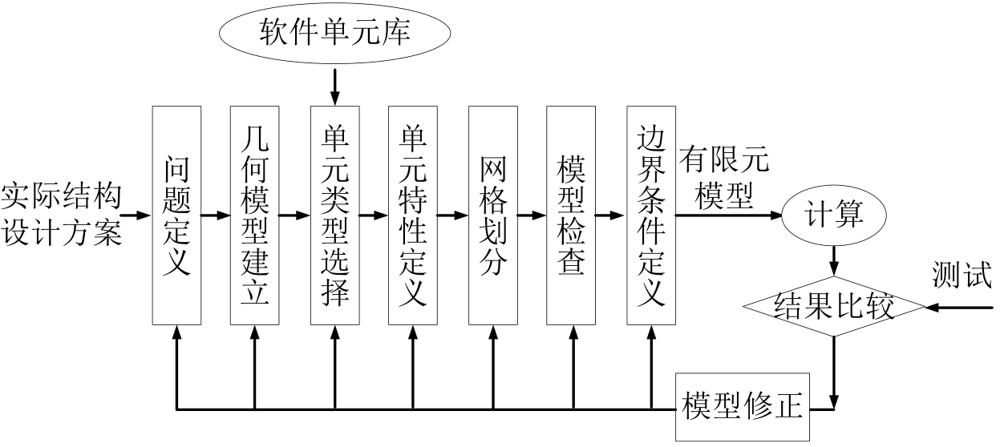

# 补充

## 有限元建模方法

有限元分析过程可分为三个阶段： 前处理、计算和后处理。

前处理(Pre-processing)
★ 前处理的任务就是建立有限元模型，故又称建模(modeling)。
★ 它的任务是将实际问题或设计方案抽象为能为数值计算提供所有输入数据的有限元模型，该模型定量反映了分析对象 的几何、材料、载荷、约束等各个方面的特性。
★ 建模的中心任务是离散。

计算(solving)
★计算的任务是基于有限元模型完成有关的数值计算，并输 出需要的计算结果。
★主要工作：单元的和总体矩阵的形成、边界条件的处理和 特性方程的求解。

后处理(Post-processing)
★后处理的任务是对计算输出的结构进行必要的处理，并按 一定的方式显示或打印出来，以便对分析对象的性能或设计 的合理性进行分析、评估，以做出相应的改进或优化，这是 进行有限元分析的目的所在。




<!-- ## 网格

**非结构网格和结构网格**

非结构网格的优势

- 适用于不规则和复杂几何形状
- 可以自动生成
- 更好的局部适应性，允许局部细化

结构网格的优势

- 结构简单，处理高效，减少内存和计算要求
- 某些情况下，在数值上更稳定
- 精度更高

**平面三角形网格和四边形网格**

三角形网格的优势

- 生成快
- 几何适应性好

四边形网格的优势

- 质量更好
- 计算效率高

三角形网格计算得到的固有频率，相比四边形网格更高 -->

## inp 脚本详细分析


```bash
** Heading +++++++++++++++++++++++++++++++++++++++++++++++++
*Heading
Hash: OIMK2iJ7, Date: 01/10/2024, Unit system: MM_TON_S_C
** Nodes +++++++++++++++++++++++++++++++++++++++++++++++++++
*Node
1, 0.00000000E+000, 1.00000000E+003, 0.00000000E+000
2, 0.00000000E+000, 0.00000000E+000, 0.00000000E+000
3, 1.00000000E+003, 0.00000000E+000, 0.00000000E+000
4, 1.00000000E+003, 1.00000000E+003, 0.00000000E+000
5, 0.00000000E+000, 5.00000000E+002, 0.00000000E+000
6, 5.00000000E+002, 0.00000000E+000, 0.00000000E+000
7, 1.00000000E+003, 5.00000000E+002, 0.00000000E+000
8, 5.00000000E+002, 1.00000000E+003, 0.00000000E+000
9, 5.00000000E+002, 5.00000000E+002, 0.00000000E+000
10, 0.00000000E+000, 7.50000000E+002, 0.00000000E+000
11, 2.50000000E+002, 5.00000000E+002, 0.00000000E+000
12, 5.00000000E+002, 7.50000000E+002, 0.00000000E+000
13, 2.50000000E+002, 1.00000000E+003, 0.00000000E+000
14, 0.00000000E+000, 2.50000000E+002, 0.00000000E+000
15, 2.50000000E+002, 0.00000000E+000, 0.00000000E+000
16, 5.00000000E+002, 2.50000000E+002, 0.00000000E+000
17, 7.50000000E+002, 0.00000000E+000, 0.00000000E+000
18, 1.00000000E+003, 2.50000000E+002, 0.00000000E+000
19, 7.50000000E+002, 5.00000000E+002, 0.00000000E+000
20, 1.00000000E+003, 7.50000000E+002, 0.00000000E+000
21, 7.50000000E+002, 1.00000000E+003, 0.00000000E+000
** Elements ++++++++++++++++++++++++++++++++++++++++++++++++
*Element, Type=S8, Elset=Shell_part-1
1, 1, 5, 9, 8, 10, 11, 12, 13
2, 5, 2, 6, 9, 14, 15, 16, 11
3, 6, 3, 7, 9, 17, 18, 19, 16
4, 7, 4, 8, 9, 20, 21, 12, 19

*Element, Type=GAPUNI
*Nset, Nset=Internal_Selection-1_Fixed-1
3
*Nset, Nset=Internal_Selection-1_Fixed-2
2
*Nset, Nset=Internal_Selection-1_Concentrated_Force-1
4
*Nset, Nset=Internal_All_Compression_Only_Constraints_NodeSet

*Elset, Elset=Internal_Selection-1_Shell_Section-1
1, 2, 3, 4

** Materials +++++++++++++++++++++++++++++++++++++++++++++++

*Material, Name=S185
*Density
7.8E-09
*Elastic
210000, 0.28
*Expansion, Zero=20
1.1E-05
*Conductivity
14
*Specific heat
440000000

** Sections ++++++++++++++++++++++++++++++++++++++++++++++++

*Shell section, Elset=Internal_Selection-1_Shell_Section-1, Material=S185, Offset=0
10

** Step-1 ++++++++++++++++++++++++++++++++++++++++++++++++++

*Step
*Static

*Output, Frequency=1

** Boundary conditions +++++++++++++++++++++++++++++++++++++

*Boundary, op=New
** Name: Fixed-1
*Boundary
Internal_Selection-1_Fixed-1, 1, 6, 0
** Name: Fixed-2
*Boundary
Internal_Selection-1_Fixed-2, 1, 6, 0
** Name: Compression_Only_BC
*Boundary
Internal_All_Compression_Only_Constraints_NodeSet, 1, 1, 0
Internal_All_Compression_Only_Constraints_NodeSet, 2, 2, 0
Internal_All_Compression_Only_Constraints_NodeSet, 3, 3, 0

** Loads +++++++++++++++++++++++++++++++++++++++++++++++++++

*Cload, op=New
*Dload, op=New
** Name: Concentrated_Force-1
*Cload
Internal_Selection-1_Concentrated_Force-1, 1, 10000
Internal_Selection-1_Concentrated_Force-1, 2, 10000

** Field outputs +++++++++++++++++++++++++++++++++++++++++++

*Node file
RF, U
*El file
S, E, NOE

*End step

```
