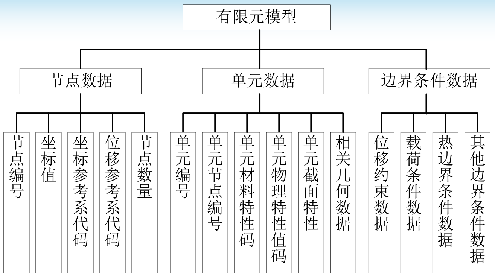
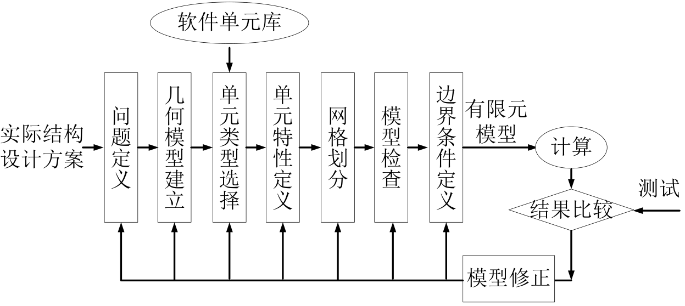
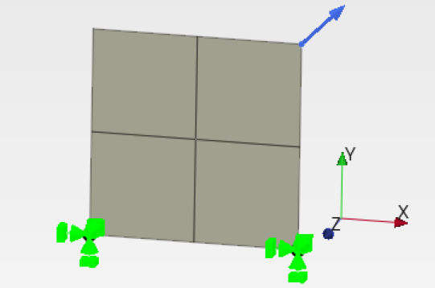
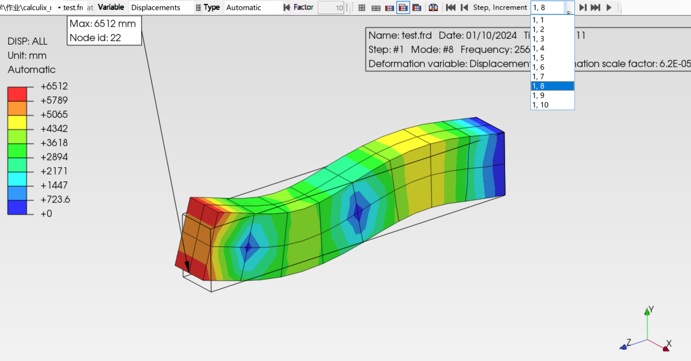

---
output:
  word_document:
    pandoc_args: ["--reference-doc=custom-reference.docx"]
---

# 补充

## 有限元建模方法

有限元分析过程可分为三个阶段： 前处理、计算和后处理。

前处理(Pre-processing)
★ 前处理的任务就是建立有限元模型，故又称建模(modeling)。
★ 它的任务是将实际问题或设计方案抽象为能为数值计算提供所有输入数据的有限元模型，该模型定量反映了分析对象 的几何、材料、载荷、约束等各个方面的特性。
★ 建模的中心任务是离散。

计算(solving)
★计算的任务是基于有限元模型完成有关的数值计算，并输 出需要的计算结果。
★主要工作：单元的和总体矩阵的形成、边界条件的处理和 特性方程的求解。

后处理(Post-processing)
★后处理的任务是对计算输出的结构进行必要的处理，并按 一定的方式显示或打印出来，以便对分析对象的性能或设计 的合理性进行分析、评估，以做出相应的改进或优化，这是 进行有限元分析的目的所在。





## 网格

**非结构网格和结构网格**

非结构网格的优势

- 适用于不规则和复杂几何形状
- 可以自动生成
- 更好的局部适应性，允许局部细化

结构网格的优势

- 结构简单，处理高效，减少内存和计算要求
- 某些情况下，在数值上更稳定
- 精度更高

**三角形单元和四边形单元**


一阶三角形单元（S3）是常应变单元，所以精度不高。

三角形单元计算得到的固有频率，相比四边形单元更高。

三角形单元网格密度更大，计算开销大

四边形网格在拐角处产生畸变，可能有奇异性

## inp 脚本部分文档

### `*Node`

第一行：
- `*NODE`
- 根据需要输入可选参数。

下面几行：
- 节点号。
- 第一个全局直角坐标的值。
- 第二个全局直角坐标的值。
- 第三个全局直角坐标的值。

例子

```
*NODE,NSET=Nall
1,0.,0.,0.
2,1.,0.,0.
3,0.,1.,0.
```

### `*Nset`

此选项用于将节点分配给节点集。必须包含集合名称的参数。

### `*ELEMENT`

一个必需参数TYPE和一个可选参数ELSET

**梁**- B21(2节点2D梁单元)- B31(2节点3d梁单元)- B31R(简化集成的B31单元)- B32(3节点梁单元)- B32R(简化集成的B32单元)

**板壳**- S3(3节点三角形壳元)- S4(4节点二次壳元)- S4R(简化积分的S4单元)- S6(6节点三角形壳元)- S8(8节点二次壳元)- S8R(简化积分的S8单元)

**一般三维实体**- C3D4(4节点线性四面体单元)- C3D6(6节点线性三角棱柱单元)- C3D8 (3D 8节点线性六面体单元)- C3D8I (3D 8节点不兼容模式线性六面体单元)- C3D8R(简化积分的C3D8单元)- C3D10(10节点二次四面体单元)- C3D10T(初始温度线性插值的10节点二次四面体单元)- C3D15(15节点二次三角棱柱单元)- C3D20 (3D 20节点)二次六面体单元)- C3D20R(降低积分的C3D20单元)

第一行：
- `*ELEMENT`
- 根据需要输入可选参数。

下面几行：
- 元素号。
- 组成元素的节点号，元素周围节点的顺序为同顺同逆。

### `*Boundary`

对于结构:- 1:局部x方向的平移- 2:局部y方向的平移- 3:局部z方向的平移- 4:围绕局部x轴旋转(仅适用于属于梁或壳的节点)- 5:围绕局部y轴旋转(仅适用于属于梁或壳的节点)- 6:围绕局部z轴旋转(仅适用于属于梁或壳的节点)

例

```
*BOUNDARY
FIX, 1
```

节点集FIX在 1 方向固定


```
*BOUNDARY
FIX, 1,6,0
```

123456 全部固定，ccx中最后的 0 可以省略

### 设置材料

例

```
*MATERIAL,NAME=EL
*ELASTIC
210000, 0.3
*DENSITY
7.8E-9
```

表示 (mm, t, s) 单位制下的钢铁，此时衍生单位为 MPa, N, t/mm3

### `*Sections`

例

```
*Sections
*Shell section, Elset=Internal_Selection-1_Shell_Section-1, Material=S185, Offset=0
10
```


## inp 脚本示例

### S8 静态载荷



```bash
*Heading
Hash: OIMK2iJ7, Date: 01/10/2024, Unit system: MM_TON_S_C

*Node
1, 0, 1000, 0
2, 0, 0, 0
3, 1000, 0, 0
4, 1000, 1000, 0
5, 0, 500, 0
6, 500, 0, 0
7, 1000, 500, 0
8, 500, 1000, 0
9, 500, 500, 0
10, 0, 750, 0
11, 250, 500, 0
12, 500, 750, 0
13, 250, 1000, 0
14, 0, 250, 0
15, 250, 0, 0
16, 500, 250, 0
17, 750, 0, 0
18, 1000, 250, 0
19, 750, 500, 0
20, 1000, 750, 0
21, 750, 1000, 0

*Element, Type=S8, Elset=Shell_part-1
1, 1, 5, 9, 8, 10, 11, 12, 13
2, 5, 2, 6, 9, 14, 15, 16, 11
3, 6, 3, 7, 9, 17, 18, 19, 16
4, 7, 4, 8, 9, 20, 21, 12, 19

*Nset, Nset=Internal_Selection-1_Fixed-1
3
*Nset, Nset=Internal_Selection-1_Fixed-2
2
*Nset, Nset=Internal_Selection-1_Concentrated_Force-1
4

*Elset, Elset=Internal_Selection-1_Shell_Section-1
1, 2, 3, 4

*Boundary
Internal_Selection-1_Fixed-1, 1, 6, 0
*Boundary
Internal_Selection-1_Fixed-2, 1, 6, 0


*Material, Name=S185
*Density
7.8E-09
*Elastic
210000, 0.28

*Sections
*Shell section, Elset=Internal_Selection-1_Shell_Section-1, Material=S185, Offset=0
10


*Step
*Static

*Output, Frequency=1

*Loads
*Cload
Internal_Selection-1_Concentrated_Force-1, 1, 10000
Internal_Selection-1_Concentrated_Force-1, 2, 10000

*Node file
RF, U

*End step
```

### 固有频率分析



```bash
*HEADING
Model: beam     Date: 10-Mar-1998

*INCLUDE, INPUT=beam.inp

*BOUNDARY
CN7, 1
*BOUNDARY
CN7, 2
*BOUNDARY
CN7, 3

*ELSET,ELSET=EALL,GENERATE
1,32

*MATERIAL,NAME=EL
*ELASTIC
210000.0, 0.3
*DENSITY
7.8E-9

*SOLID SECTION,MATERIAL=EL,ELSET=EALL

*NSET,NSET=N1
100
*NSET,NSET=LAST
5,6,7,8,21,22,23,24,25,26,27,28,29,
30,31,32,98,99,100,101,102

*STEP
*FREQUENCY,SOLVER=ARPACK,STORAGE=YES
10,0.01
*NODE FILE
U
*END STEP
```

### 动态分析

```bash
**
**   Structure: cantilever beam.
**   Test objective: dynamic response to a constant impact; 
**                   no damping.
**
*HEADING
Model: beam     Date: 10-Mar-1998

*INCLUDE, INPUT=beam.inp

*BOUNDARY
CN7, 1
*BOUNDARY
CN7, 2
*BOUNDARY
CN7, 3

*ELSET,ELSET=EALL,GENERATE
1,32

*MATERIAL,NAME=EL
*ELASTIC
210000.0, 0.3
*DENSITY
7.8E-9

*SOLID SECTION,MATERIAL=EL,ELSET=EALL

*NSET,NSET=N1
100
*NSET,NSET=LAST
5,6,7,8,21,22,23,24,25,26,27,28,29,
30,31,32,98,99,100,101,102

*AMPLITUDE,NAME=A1
0.,1.,5.E-4,1.
*AMPLITUDE,NAME=A2
0.,0.,2.E-5,1.,4.E-5,2.,5.E-5,3.,
6.E-5,.5,8.E-5,4.,10.E-5,2.


*STEP
*FREQUENCY,SOLVER=ARPACK,STORAGE=YES
10,0.01
*NODE FILE
U
*END STEP

*STEP
*MODAL DYNAMIC
1.E-5, 5.E-4

*NODE FILE
U
*NODE PRINT,NSET=N1
U

*EL PRINT,ELSET=Eall,TOTALS=ONLY
ELSE,ELKE,EVOL
*CLOAD,AMPLITUDE=A1
LAST, 2, -1.
*END STEP
```