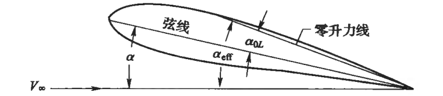
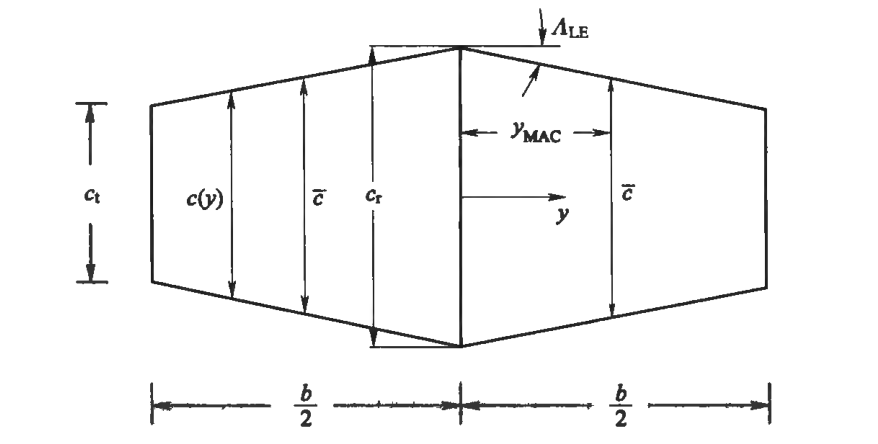
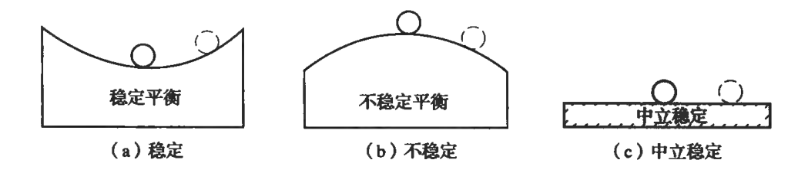

<!-- # 飞行器飞行动力学总结 

https://www.cnblogs.com/cjyyx/p/18264499
-->

## 基本空气动力学原理

- 标准大气压 101325 Pa = 1 atm
- 海平面大气密度 1.225 Kg/m3
- 标准情况下的大气 R = 287 J/(kg·K)

### 引言

**影响飞机性能、稳定性、操纵性的关键参数**

**雷诺数**  $Re=\dfrac{\rho V_{\infty} L}{\mu}$ ：惯性力与粘性力的比值

**牛顿流体**指的是满足牛顿内摩擦定律的流体，即切应力和速度梯度之间是线性关系，也即黏度不随剪切速率或剪切应力的变化而变化的流体，如水、汽油、空气等低分子量的流体。**非牛顿流体**指的是不满足牛顿内摩擦定律的流体。剪切增稠流体、剪切稀化流体。

**马赫数**  $Ma=\dfrac{V_{\infty}}{a}$ ：惯性力和弹性力之比

音爆：当飞行速度超过声速时，飞机比声波更快，飞机对空气的压缩无法迅速传播，逐渐在飞机的前面压缩积累犹如一道墙，当突破这道墙时能量高度集中，这些能量传到耳朵里时就会让人感觉到短暂而强烈的爆炸声，这就是音爆形成的原因。

雷诺数对气动系数的影响通常称为尺度效应，而马赫数对气动系数的影响则称为压缩效应。

### 流过机翼和机身的流体介质

**理想流体**：没有黏性，流体紧贴物体表面，物体表面流速非零，物体表面是流线的一部分（流体流过后没有能量损失）。

对于理想流体的圆柱绕流问题，净升力和阻力都为0，速度的最大值出现在圆柱最大厚度处，大小为自由来流速度的2倍。

实际流动：有黏性，物体表面流速为0。

**边界层**： 沿着垂直物面方向很小的一段距离 $\delta$ 内速度很快增加到当地速度 $V_1$ ，这层薄层称为边界层。

$$
\delta^{*} = \frac{1}{V_{1}}\int_{0}^{\infty}\left[ V_{1} - V(y) \right]\mathrm{d}y
$$

有黏流动的效果等价于物面边界向上移动一段很小的边界层位移厚度后的无黏流动。

一旦流体从物体表面发生分离，物体表面的压力分布将发生改变，特别是在分离区。

### 阻力

表面摩擦阻力和压差阻力源于飞机暴露于空气中的部分，诱导阻力仅来源于升力面。对于流线型物体，飞机，表面摩擦力是阻力的主要组成部分。对于钝性物体如圆柱体，摩擦阻力很小，而压差阻力占总阻力的绝大部分。

**表面摩擦阻力**系数

$$
C_f=\frac{D_f}{q_{\infty} S}
$$

对于层流

$$
C_{f}=\frac{1.328}{\sqrt{Re}}
$$

对于湍流

$$
C_{f}=\frac{0.455}{(\mathrm{lg}Re)^{2.58}}
$$

$Re$ 是基于平板长度的雷诺数。

**压差阻力**的产生是因为绕流物体时要发生边界层分离，在分离点后会形成一些旋涡，因而会使物体后部压强大为降低，这样在物体前后形成较大的压强差，即为压差阻力。飞机压差阻力与迎风面积、形状和迎角有关。迎风面积大，压差阻力大。迎角越大，压差阻力也越大。

飞机的各个部件，如机翼、机身、尾翼的单独阻力之和小于把它们组合成一个整体所产生的阻力。这种由于各部件气流之间的相互干扰而产生的额外阻力，称为**干扰阻力**。飞机各部件之间的平滑过渡和整流包皮，可以有效地减小干扰阻力的大小。

**升致阻力**(诱导阻力)是法向力在来流方向的一个分量，并非直接由黏性引起的。

高速情况下还有激波阻力。

### 升阻特性

升力、阻力和力矩： $L$ ，$D$  和  $M$ 。$M$ 方向为迎角增大的方向。

升力系数  $C_{l}=\dfrac{L}{q_{\infty} S}$

阻力系数  $C_{d}=\dfrac{D}{q_{\infty} S}$

力矩系数  $C_{m}=\dfrac{M}{q_{\infty} S \bar{c}}$

$q_{\infty}=\dfrac{1}{2}\rho_{\infty}V_{\infty}^2$

注意 $C_l$ 和 $C_d$ 通常定义为翼型（二维机冀）的升力系数和阻力系数，而 $C_L$ 和 $C_D$ 通常定义为有限展长机翼的升力系数和阻力系数。

$$
C_L=C_{L\alpha}(\alpha+\alpha_{0L})
$$

$$
C_D=\underbrace{C_{D0}}_{\text{零升阻力系数}}+\underbrace{C_{D\mathrm{i}}}_{\text{升至阻力系数}}=C_{D0}+k C_L^2
$$

### 机翼参数

<!--  -->

迎角(攻角) $\alpha$ ：气流方向与固定于飞机上的一条参考线之间的夹角

$c(y)$ 是当地的弦长，$y$ 是展向坐标，$b$ 是展长。

翼面积  $\displaystyle S=2\int_{0}^{\frac{b}{2}}c(y)\mathrm{d}y$

展弦比  $A=\dfrac{b^{2}}{S}$

平均气动弦长 $\displaystyle \bar{c}=\frac{2}{S}\int_{0}^{\frac{b}{2}}c^{2}(y)\mathrm{d}y$

平均气动弦长的展向位置 $\displaystyle y_{\mathrm{MAC}}=\frac{2}{S}\int_{0}^{\frac{b}{2}}c(y)y\mathrm{d}y$

厚弦比：翼型的最大厚度和弦长的比

对一般的直机翼

$\Lambda_{\mathrm{LE}}$ 是前缘后掠角，$c_{\mathrm{t}}$ 是翼尖的弦长，$c_\mathrm{r}$ 是翼根的弦长。

梢根比 $\lambda=\dfrac{c_t}{c_\mathrm{r}}$

$$
S=\frac{b}{2}c_{\mathrm{r}}(1+\lambda)
$$

$$
A=\frac{2b}{c_{\mathrm{r}}(1+\lambda)}
$$

$$
\bar{c}=\frac{2}{3}c_{\mathrm{r}}\Big(\frac{1+\lambda+\lambda^{2}}{1+\lambda}\Big)
$$

$$
y_{\mathrm{MAC}}=\frac{b}{6}\Big(\frac{1+2\lambda}{1+\lambda}\Big)
$$

为了获得理想的机翼沿展向的气动载荷与失速模式分布，通常会将机翼截面扭转一定的角度，该角度称为扭转角。如果机翼翼根到翼尖的扭转角分布使得机翼截面沿展向迎角逐渐增大，这种扭转称为"洗入"。反之，扭转角从翼根到翼尖逐渐减小，这种扭转称为"洗出"。

在后掠机翼上，通常是将翼梢剖面相对根部剖面向下扭转，使翼梢剖面迎角减小（负扭转）。这样，使翼梢部分升力降低，可防止翼梢先开始失速，称为**几何扭转**。在有的机翼上，虽然各剖面翼弦在同一平面上（无几何扭转），但是沿展向采用了不同弯度的非对称翼型。从空气动力的角度来看，它实际上与几何扭转的作用相同，也起控制机翼展向升力分布的作用。这种情况称为**气动扭转**。

### 机翼截面的气动性能

**压力中心**：气动力合力作用点。

**气动中心(焦点)**：在一定雷诺数下，当翼型迎角改变时，翼型所受到的空气动力对于此点的合力矩不变。通常假设它在 1/4 弦长处。

在亚声速和超声速条件下，气动中心和压力中心都将后移。

假定 $O$ 点是力矩参考点，在这点获得 $C_l$、$C_d$、$C_m$，$x_{\mathrm{ac}}$ 是气动中心到 $O$ 点的距离(向后为正)。$C_{m,\mathrm{ac}}$是对气动中心的俯仰力矩系数。

$$
C_{m}=C_{m,\mathrm{ac}}-\bar{x}_{\mathrm{ac}}C_{l}=-\bar{x}_{\mathrm{cp}}C_l
$$

式中 $\bar{x}=x/c$

$$
\bar{x}_{\mathrm{ac}}=-\frac{\mathrm{d}C_m}{\mathrm{d}C_l}
$$

$$
C_{m}=C_{m0}+\frac{\mathrm{d}C_m}{\mathrm{d}C_l} C_{l}
$$

**翼型的失速**

在小迎角下，**流动通常在接近后缘的位置分离**。随着迎角的增加，分离点逐渐向前缘移动。在这个过程中，升力系数将逐渐增加，在某一点达到最大值。更大的迎角将会使得升力开始下降，在这种情况下我们说翼型开始失速。这种类型的失速通常发生在厚翼型上，升力的失速特性比较平缓，如图中曲线a所示。

对于薄翼型来说，其前缘曲率变化通常比较剧烈，因此失速将以另外一种不同的方式出现。从前缘点到压力的最小点，存在一段很长的顺压梯度段，它促使了层流边界层的存在。在最小压力点之后，逆压梯度一直延伸至后缘。由于薄翼型前缘曲率变化剧烈，逆压梯度较强，导致流动分离。如果雷诺数较小，流动就此分离（没有随后的流动再附着），因此翼型将失速。由于流动的分离发生在靠近翼型前缘的地方，这种类型的失速通常比较突然，如图曲线b所示，在最大升力点之后升力会有一个急剧的损失。

如果来流的雷诺数较高，这将会增加分离后的边界层发生转捩变为湍流的趋势，流动将会重新附着在上表面，形成一个类似于圆柱绕流的"分离泡"。再附着的湍流边界层相对层流边界层来说含有更高的能量，因此更能抵抗逆压梯度。这种再附着的边界层流动通常在更接近于后缘的地方分离。随着迎角的增加，流动可能出现两种形态：(1) 分离气泡继续增大，再附点向后缘移动直到流动不再附着，这时翼型失速；(2) 分离气泡变短，再附点向上游的前缘移动，直到某一点分离气泡突然破裂，导致翼型失速。第一种由长气泡导致的失速类型叫做薄翼型失速（见图曲线c）；而第二种由短气泡破裂导致的失速叫做前缘失速（见图曲线d）。前缘失速通常伴随着升力的急剧损失，这通常是设计人员所不希望发生的。

**增升装置——襟翼(flap)**

飞机提升升力：**增加机翼面积，改变机翼的弯度，增加一条或几条缝隙供气流通过**。

襟翼是安装在机翼后缘靠近机身的翼面，可以绕轴向后下方偏转，主要是靠增大机翼的弯度来获得升力增加的一种增升装置。主要作用：提高失速迎角使飞机更不容易失速；使飞机获得更大的升力。襟翼一般在起飞和降落等低速的情况下才会放下使用，如果在高速巡航阶段，强行放下襟翼，会增加飞行阻力和飞机的油耗，甚至会对飞机结构造成损伤。

### 有限翼展机翼的气动性能

有限展机翼的翼梢旋涡会在机翼周围产生一个小的向下的诱导速度  $w$ ，称之为**下洗速度**。定义翼型弦线与来流  $V_{\infty}$  的夹角  $\alpha$  为**几何迎角**；当地相对来流的方向定义为来流下偏一个角度  $\alpha_{\mathrm{i}}$  后所得的方向，并称  $\alpha_{\mathrm{i}}$  为**下洗角**。当地翼型剖面真正感受到的迎角是翼型弦线与当地相对来流之间的夹角，定义为**有效迎角** $\alpha_{\text{eff}}=\alpha-\alpha_{\mathrm{i}}$ 。升力方向在与来流垂直向上的基础上又向后偏转了一个  $\alpha_{\mathrm{i}}$  角，所以在来流方向上会产生一个分量  $D_{\mathrm{i}}$ ，这个分量就是由于下洗存在而产生的阻力，称为**诱导阻力**。

$$
\alpha_{\mathrm{i}}=\frac{C_{L}}{\pi Ae}
$$

$$
\begin{aligned}
C_{L}&=a_{0}(\alpha+\alpha_{0L}-\alpha_{\mathrm{i}}) \\
&=a(\alpha+\alpha_{0L})
\end{aligned}
$$

$$
a=\frac{a_{0}}{1+\dfrac{a_{0}}{\pi Ae}}
$$

$$
C_{D\mathrm{i}}=C_{L}\alpha_{\mathrm{i}}=\frac{C_{L}^2}{\pi Ae}
$$

影响诱导阻力的因素：

- 机翼平面形状，椭圆形机翼的诱导阻力最小。
- 展弦比越大，诱导阻力越小。
- 升力越大，诱导阻力越大。
- 平直飞行中，诱导阻力与飞行速度平方成反比。

### 气动布局

### 面积律

面积律是最小化飞机跨声速／超声速波阻的系统方法，这种方法的基本假设如下：在 Ma 接近 1 且距机身较远处，扰动批和激波仅仅是纵向横截面面积变化率的函数，与飞机的形状无关。换句话说，一个翼身组合体的波阻和一个纵向横截面面积变化与之相等机身的的波阻是一样的。

## 飞行性能

### 引言

飞行性能的定义：飞机最基本的一些定常或非定常直线运动的性能。可将飞机视为一个可控质点。飞行性能包括平飞、上升、下滑、起落四个方面的续航、性能。

升阻比(气动效率) $E=\dfrac{C_L}{C_D}$

最大升阻比 $E_m=\dfrac1{2\sqrt{kC_{D0}}}$ 对应的升力系数 $C_L^* = \sqrt{\dfrac{C_{D0}}{k}}$

**涡轮喷气发动机**

单个流道内靠喷管喷出高速燃气产生推力的燃气涡轮发动机。

> 涡轮风扇发动机压气机前装有风扇，由喷管排出燃气和风扇排出空气共同产生推力，是内外二个涵道构成的燃气涡轮发动机。大涵道比(外涵道大)发动机排气速度低、推进效率高、经济性好，适用于大型客机，因风扇迎风面积大，不宜超声速飞行。军用作战飞机采用小涵道比风扇发动机。

给定高度下，产生的推力基本不随速度变化，故以**推力**进行性能分析。

四个性能指标：台架推力 $T_\mathrm{i}$ ，可用推力 $T_\mathrm{a}$ ，推重比 $\gamma_{\mathrm{TW}}=T_{\mathrm{a}}/W_{\mathrm{e}}$ ，耗油率 $C_f$ (单位时间产生单位推力所消耗的油量)

加力状态：在加力状态时加力燃烧室喷嘴喷出补充燃料，燃烧后进一步提高燃气温度，增加喷气速度，从而增大发动机推力。一般，使用加力状态后，推力大约可增加 25% 。起飞时使用。为避免发动机损坏，飞行高度小于6000m时，不允许超过6min；飞行高度大于6000m时，不允许超过10min。

最大状态：发动机处于最大许用转速的状态。发动机的推力仅次于加力状态，推力为非加力时的最大值，只能连续工作5-10min，常用于起飞、短时加速、爬升、空中机动等。

额定状态：对应于最大转速97%，推力为最大状态的85-90%，可较长时间工作（半小时~1小时），用于平飞、爬升、远航飞行等。

巡航状态：90%额定状态转速，80%额定状态推力，耗油率最小，连续工作时间不限，用于巡航。

慢车状态：30%额定状态转速，推力很小，连续工作时间不允许超过10-15min，用于下滑、着陆。

**涡轮螺旋桨发动机**

功率式发动机。由螺旋桨提供拉力，也靠喷气反作用(约10%，常被忽略)提供推力的燃气涡轮发动机，油耗低。使用速度不超过800千米/小时。低空、低速军(民)运输机。

给定高度下，产生的功率基本不随速度变化，故以**功率**作为性能分析。

### 铅垂平面内的飞机运动方程

- $\gamma$ 航迹角，速度方向与水平面的夹角
- $\theta$ 飞机参考线或零升力线与当地水平面的来角
- $\varepsilon$ 飞行速度和推力的夹角
- $R$ 铅垂平面内飞行轨迹曲率半径

$$
T\cancel{\mathrm{cos}\varepsilon} - D - W\mathrm{sin}\gamma = \cancel{\frac{W}{g} \frac{\mathrm{d}V}{\mathrm{d}t}}
$$

$$
\cancel{T\mathrm{sin}\varepsilon} + L - W\mathrm{cos}\gamma = \cancel{\frac{W}{g} \frac{V^{2}}{R}}
$$

无量纲推力 $z=\dfrac{TE_{\mathrm{m}}}W$

过载 $n=\dfrac LW$

参考速度 $V_{\mathrm{R}}=\sqrt{\dfrac{2W}{\rho S}}\left(\dfrac{k}{C_{D0}}\right)^{1/4}$

推重比 $T_w=\dfrac TW$

无量纲速度 $u=\dfrac V{V_{\mathrm{R}}}$

$$
D = \frac12\rho V^2S\Big(C_{D0} + \frac{4kW^2}{\rho^2V^4S^2}\Big)=\frac{W}{2E_{\mathrm{m}}}\Big( u^{2} + \frac{n^{2}}{u^{2}}\Big)
$$

$$
2zu^{2} - u^{4} - n^{2} - 2E_{m}u^{2}\sin\gamma = 0
$$

$$
n - \cos\gamma = 0
$$

### 滑翔

无推力

$$
\dot{x} = V \qquad \dot{h} = V\gamma
$$

航程 $R=E \Delta h$

$\Delta h=h_\mathrm{i}-h_\mathrm{f}$ ，$h_\mathrm{i}$ 和 $h_\mathrm{f}$ 分别为初始高度和最终高度。

下滑率 $\dot{h}_{\mathrm{s}} = - V\gamma=\sqrt{\dfrac{2W}{\rho S}}\Big(\dfrac{C_{D}}{C_{L}^{3/2}}\Big)$

以最大升阻比滑翔时，滑翔角最小，滑翔轨迹最平缓，航程最大。此时 $C_L=C_L^*$ ，$V=V_R$ 。

最小下滑率，最大滑翔时间，对应 $C_{L,m}=\sqrt{3}C_{L}^{*}$

$$
\dot{h}_{\mathrm{s,min}} = 4 \sqrt{\frac{2W}{\rho S}} \sqrt[4]{\frac{k^{3}C_{D0}}{27}}
$$

最小下滑率在需用功率最小时达到，最平缓滑翔在阻力最小时达到。

### 水平飞行

$\gamma=0$

零升阻力等于诱导阻力时总阻力最小

平飞需用功率

$$
P_{R} = DV = \frac{1}{2}\rho V^{3}SC_{D0} + \frac{2kW^{2}}{\rho VS}
$$

克服零升阻力的需用功率 $P_{R0}=\frac{1}{2}\rho V^{3}SC_{D0}$

克服诱导阻力的需用功率 $P_{Ri}=\Big(\dfrac{2kW^{2}}{\rho VS}\Big)$

螺旋桨飞机需用功率曲线与可用功率有两个交点，喷气式飞机需用推力与可用推力有两个交点。

同样燃油消耗量和同样的功率（螺旋桨飞机）或推力（喷气式飞机）下，飞机可以以两者任意一个速度平飞。在 $V_{\min}$下，可用功率（螺旋桨飞机）或可用推力（喷气式飞机）主要用于克服诱导阻力。在 $V_{\max}$ 下，则主要用于平衡零升阻力。

需用功率取最小值时

$$
V_{\mathrm{mp}} = \frac{1}{\sqrt[4]{3}}V_{\mathrm{R}}
$$

$$
P_{\mathrm{R,min}} = \frac{8}{3} \frac{kW^{2}}{\rho SV_{\mathrm{mp}}} = \frac{WV_{\mathrm{mp}}}{0. 866E_{\mathrm{m}}}
$$

**螺旋桨飞机**

可用功率

$$
P_{\mathrm{a}} = \eta_{\mathrm{p}}P
$$

等效空速

$$
V_{\mathrm{e}} = V\sqrt{\sigma}
$$

式中 $\sigma=\rho/\rho_{0}$ 为密度比，$\rho_{0}$ 为海平面空气密度。

**喷气式飞机的解析解**

假设在给定高度处，喷气发动机产生的推力与飞行速度无关

$$
u_{\substack{\max\\\min}}=\sqrt{z\pm\sqrt{z^{2}-1}}
$$

$$
V_{\substack{\max\\\min}}=u_{\substack{\max\\\min}}V_{\mathrm{R}}
$$

当 $z=1$ 时，$u_{\min}=u_{\max}$ ，飞机处于静升限，此时阻力最小。

飞机最小速度还取决于失速速度

$$
V_{\mathrm{stall}}= \sqrt {\frac {2W}{\rho SC_{L\max}}}
$$

### 爬升飞行

- 上升(爬升)角：飞机上升轨迹与水平面之间的夹角。
- 最佳上升角：指飞行最稳定上升的上升轨迹与水平面之间的夹角。
- 上升率：爬升率、爬高率。飞机在单位时间内上升的高度。以米/秒或米/分计算。通常用最大上升率来表示飞机上升性能。

飞机刚起飞时，高度低，低空障碍物众多，多使用最大爬升角速度进行爬升越障，此时飞机的俯仰角和爬升角度较大；迅速的上升高度，也可以避免很多低空可能遇到的危险情况，例如鸟击和其他障碍物等；大中型干线和支线机场都有降噪程序，所以飞机需要尽快上高度以减小对地面居民区和生活区的影响；另外机场附近低高度区域航空器众多，冲突的可能性也更大，所以也是需要尽快上高度并离开该区域；对于转场航班而言，飞机也是需要尽快上到巡航高度，高空阻力小，更利于航空器的经济性和时效性考虑。

定常爬升

$$
\sin\gamma = \frac{T-D}{W}
$$

爬升率

$$
\mathrm{R/C} = \dot{h} = V\sin\gamma = \frac{P_{\mathrm{a}} - P_{\mathrm{R}}}{W} = P_{\mathrm{s}}
$$

$P_{\mathrm{s}}$ 为每单位重力的剩余功率，称为单位剩余功率。

爬升时间

$$
t = \int_{h_\mathrm{i}}^{h_\mathrm{f}}\frac{\mathrm{d}h}{P_{\mathrm{s}}}
$$

若要爬升时间最短，飞机需要沿着各个高度下单位剩余功率最大的轨迹飞行。

### 航程

巡航航程：飞机耗尽给定燃油量可达到的水平距离，不包含爬升和下降的飞行距离。

最大航程：巡航速度与单位时间耗油量之比最大时的航程。

航时：飞机在耗尽给定燃油量在空中持续飞行的总时间。

最大航时：单位时间耗油量最小时的航行时间。

## 静稳定性与操纵性

### 引言

飞机的稳定性：飞机设计中衡量飞行品质的重要参数，它表示飞机在受到扰动之后是否具有回到原始状态的能力。如果飞机受到扰动（例如突风）之后，在飞行员不进行任何操纵的情况下能够回到初始状态，则称飞机是稳定的，反之则称飞机是不稳定的。

飞机的操纵性：又可以称为飞机的操纵品质，是指飞机对操纵的反应特性。操纵是飞行员通过驾驶机构改变飞机的飞行状态的行为。操纵通过驾驶杆和脚蹬来实现。

### 纵向静稳定性

根据通常的符号规定，抬头力矩为正，低头力矩为负。因此，纵向或俯仰稳定性准则

$$
\frac{\mathrm{d}C_m}{\mathrm{d}\alpha}<0
$$

俯仰平衡状态通常被称为配平状态。对于俯仰配平，重心处的俯仰力矩为 0。对于一架可以飞行的飞机，在允许的迎角范圉内，必须在所有的迎角值上都能配平。

- 对称翼型：迎角为 0 时，$C_l=C_m=0$
- 正弯翼型：迎角为 0 时，$C_l>0$，$C_{m0}<0$
- 负弯翼型：迎角为 0 时，$C_l<0$，$C_{m0}>0$

$L_{\mathrm{w}}$ 是机翼升力，$x_{\mathrm{a}}$ 是机翼气动中心与重心 (cg) 之间的距离，$M_{\text{ac,w}}$ 是机翼在其气动中心处的俯仰力矩，$M_\mathrm{f}$ 是机身在重心处引起的俯仰力矩，$L_\mathrm{t}$ 是平尾升力，$l_\mathrm{t}$ 是重心与平尾气动中心间的距离，$M_{\mathrm{ac},\mathrm{t}}$ 是平尾在其气动中心处的俯仰力矩。

根据假设，重心位置处的俯仰力矩为

$$
M_{\mathrm{cg}} = \underbrace{M_{\mathrm{f}}}_{\text{机身贡献}} +\underbrace{M_{\mathrm{ac},\mathrm{w}} + L_{\mathrm{w}}x_{\mathrm{a}}}_{\text{机翼贡献}} + \underbrace{M_{\mathrm{ac},\mathrm{t}} - L_{\mathrm{t}}l_{\mathrm{t}}}_{\text{平尾贡献}}
$$

- 假设推力矢量通过重心，并忽略动力的影响
- 将下标“cg”去掉，令 $C_m$ 表示重心处的俯仰力矩
- 假设全机的升力系数大致等于机翼的升力系数
- $\overline{x}_{\mathrm{a}}=\overline{x}_{\mathrm{cg}}-\overline{x}_{\mathrm{ac}}$

**平尾贡献**

机翼与平尾的迎角分别为

$$
\alpha_{\mathrm{w}} = \alpha+i_{\mathrm{w}}
$$

$$
\alpha_{\mathrm{t}} = \alpha+i_{\mathrm{t}}-\varepsilon
$$

$i_{\mathrm{w}}$ 与 $i_{\mathrm{t}}$ 分别是机翼与平尾相对于飞机参考线的安装角。$\varepsilon$ 为平尾气动中心处的下洗角。

平尾的升力

$$
L_{\mathrm{t}} = q_{\mathrm{t}}S_{\mathrm{t}}C_{L,\mathrm{t}}
$$

$$
C_{L,\mathrm{t}} = a_{\mathrm{t}}( \alpha_{\mathrm{w}}-i_{\mathrm{w}} + i_{\mathrm{t}} - \varepsilon )
$$

$$
C_{m,\mathrm{t}}=- C_{L,\mathrm{t}}\overline{V}_{1}\eta_{\mathrm{t}}
$$

平尾处的动压比 $\eta_{\mathrm{t}}=q_{\mathrm{t}}/q$ ，平尾的容积比 $\overline{V}_{1}=\dfrac{S_{\mathrm{t}}l_{\mathrm{t}}}{S \bar{c}}$

**全机纵向稳定性**

$$
\frac{\mathrm{d}C_{m}}{\mathrm{d}C_{L}} = \overline{x}_{\mathrm{cg}} - \overline{x}_{\mathrm{ac}} + \Big(\frac{\mathrm{d}C_{m}}{\mathrm{d}C_{L}}\Big)_{\mathrm{f}} - \frac{a_{t}}{a_{\mathrm{w}}}\Big( 1 - \frac{\mathrm{d}\varepsilon}{\mathrm{d}\alpha}\Big)\overline{V}_{1}\eta_{\mathrm{t}}
$$

当 $\mathrm{d}C_m/\mathrm{d}C_L=0$ 时飞机变得中性稳定，此时重心位置用 $N_0$ 表示，称为**握杆中性点**，“握杆”表示飞机受到迎角扰动时，升降舵是固定的。

$$
\frac{\mathrm{d}C_m}{\mathrm{d}C_L} = \overline{x}_\mathrm{cg} - N_0
$$

在中性点，由于迎角变化产生的全机升力增量均作用在中性点上，因此中性点是全机的气动中心。

**静裕度**

$$
H_\mathrm{n} = N_0 - \overline{x}_\mathrm{cg} = - \left(\frac{\mathrm{d}C_m}{\mathrm{d}C_L}\right)_\mathrm{fix}
$$

稳定飞机静裕度为正。随着重心位置前移，静稳定度逐渐增加。

**配平升力**

$$
C_{m}= C_{L,\mathrm{w}} \overline{x}_{\mathrm{a}} + C_{m,\mathrm{ac},\mathrm{w}} + C_{m,\mathrm{f}} - C_{L,\mathrm{t}}\overline{V}_{1}\eta_{\mathrm{t}}=0
$$

当气动中心位于重心之前，$\overline{x}_{a}>0$，$C_{L,\mathrm{t}}>0$

当气动中心位于重心之后(下图所示)，$\overline{x}_{a}<0$，$C_{L,\mathrm{t}}<0$

平尾升力系数为负，造成配平阻力。降低平尾配平阻力损失的措施有增加鸭翼、采用放宽静稳定度的布局。

优点：鸭式布局具有较小的机翼、较低的结构重量、更小的配平阻力，极高的抗失速性。缺点：遇强向上的突风时，可能鸭翼机翼同时失速；着陆下滑时可能失速使飞机突然低头，并对起落架造成强烈冲击。

对于静不稳定飞机，飞机处于静不稳定配平状态，开环状态不能抵抗突风或大气扰动的干扰，必须使用闭环控制使飞机稳定。

**纵向操纵**

指在允许的升力系数范围内，改变平衡(或配平)升力系数的能力。

方法：改变机翼弯度；改变重心位置；升降舵控制，改变平尾力矩。

$$
C_{L,\mathrm{t}}= a_{\mathrm{t}}( \alpha_{\mathrm{t}}+\tau\delta_{\mathrm{e}})
$$

$$
\delta_{e}=\delta_{e,0}-\frac{\left(\frac{\mathrm{d}C_{m}}{\mathrm{d}C_{L}}\right)_{\mathrm{fix}}}{C_{m\delta}}C_{L}
$$

$$
\delta_{e,0} = \frac{C_{m,\mathrm{ac},\mathrm{w}} + C_{m \mathrm{f},0} - a_{t}( \alpha_{\mathrm{w},0L} - i_{\mathrm{w}} + i_{\mathrm{t}})\overline{V}_{1}\eta_{\mathrm{t}}}{-C_{m\delta}}
$$

- 升降舵效率 $\tau = \mathrm{d}\alpha_{\mathrm{t}} / \mathrm{d}\delta_{\mathrm{e}}$
- 升降舵操纵效能 $C_{m\delta} =- a_{t}\overline{V}_{1}\eta_{t}\tau$
- 机翼的零升迎角 $\alpha_{\mathrm{w},0L}$
- 平尾安装角 $i_{\mathrm{t}}$

给定重心位置，对于静稳定度飞机，较高升力系数配平时需要升降舵上偏(负偏)，较低的升力系数配平时需要升降舵下偏(正偏)。

**重心前限**

升降舵最大上偏和最大下偏角受平尾气流分离及失速的影响。重心越靠前，所需升降舵上偏角越大。升降舵最大上偏恰好能配平最大升力系数对应的重心位置，称为重心前限。

$$
\overline{x}_{\mathrm{cg,f}} = N_{0} - ( \delta_{\mathrm{e,max}} - \delta_{\mathrm{e,0}} ) \frac{C_{m\delta}}{C_{L\mathrm{max}}}
$$

从稳定性的角度来说，是期望重心位置尽可能多地位于握杆中性点之前。从纵向操纵的角度来说，重心位置应尽可能位于重心前限之后。

**地面效应**

飞机与地面接近时，由于地面的阻挡，与空中飞行相比，降低了翼尖涡强度，减小了下洗角，提高了平尾的升力线斜率(允许的舵偏减小)。

**松杆纵向稳定性**

松杆：升降舵在气动力的作用下可以自由浮动。

铰链力矩：作用在升降舵上的力产生的相对于铰链轴的力矩。

松杆纵向稳定性：当升降舵自由浮动时，铰链力矩为 0。

松杆中性点：$(\mathrm{d}C_m/\mathrm{d}C_L)_{\mathrm{~free}}=0$ 时对应的重心位置

松杆裕度

$$
H_{\mathrm{n}}^{\prime}= N_{0}^{\prime}- \overline{x}_{\mathrm{cg}}=-(\mathrm{d}C_m/\mathrm{d}C_L)_{\mathrm{~free}}
$$

对于静稳定飞机，松杆裕度为正，重心位于松杆中性点之前。

调整片的偏转改变了升降舵的松浮特性；调整片的偏转不会改变松杆中性点的位置，只会影响铰链力矩。

### 机动飞行中的稳定性

过载超过 1 的飞行轨迹称为机动。

在拉升机动中，飞机在垂直平面有一个稳态的转动速度，相当于对 $y$ 体轴的俯仰角速度。由于这一俯仰角速度的存在，飞机的纵向静稳定性相比定常平飞时有明显的提高，需要额外的升降舵偏角。与相同高度及前飞速度下的平飞相比，为了在机动中得到更高的过载，需要更大的升降舵上偏角。

松杆机动稳定性比平飞中的松杆稳定性要高，松杆机动点位于松杆中性点之后。

### 航向稳定性

- 航向角 $\psi$ ：运动角，飞机机头指向相对于地轴系的变化
- 侧滑角 $\beta$ ：气流角，飞机速度矢量与飞机对称面的夹角，右正左负

<!-- 定直平飞的飞机，在遭遇横向突风 $V_w$ 后会产生侧滑，随后迎着相对风的方向 $V_R$ 飞行。这时，侧滑速度为 0，但飞机的方向发生了改变。注意，飞机仍是以同样的速度 $V$ 移动，如果扰动消失，飞机的方向将恢复。

 -->

如果一架飞机在定直平飞中受到扰动后，有迎着相对风方向飞行的能力，则该飞机具有航向稳定性。

**航向稳定性判据**

$$
C_{n\beta}=\frac{\partial C_{n}}{\partial\beta}>0
$$

$$
C_n=\frac N{qSb}
$$

- $N$ 偏航力矩
- $C_n$ 偏航力矩系数
- $C_{n\beta}$ 偏航力矩导数

对于带上反的后掠机翼，我们可以假设机翼的贡献为

$$
\left(\begin{matrix}{C_{n\beta}}\\\end{matrix}\right)_{W} = \left(\begin{matrix}{C_{n\beta}}\\\end{matrix}\right)_{\Gamma,W} + \left(\begin{matrix}{C_{n\beta}}\\\end{matrix}\right)_{\Lambda,W}
$$

假设飞机的 $C_{n\beta}$ 也是机身、机翼和尾翼等几部分的贡献之和。

- 机身对航向稳定性的贡献通常是降低稳定性，并受机翼形状和机翼相对机身的位置的影响。
- 机冀**上反角对航向稳定性起的是失稳作用**，在小迎角时该作用比较小，但是在大迎角或高升力系数时该作用非常显著。
- **后掠角对航向静稳定性起的是增稳作用**，该增稳作用随迎角的增大而增大。
- 平尾对航向静稳定性的影响可以忽略。
- 垂尾是航向静稳定性最大的提供者。

**片条理论**

把机翼分为若干个展向元素或片条。每个片条上的气动力，通过将片条视为具有等翼型剖面的二维机翼来计算。

忽略了诱导下洗角的影响，忽略了诱导阻力，高估了升力线斜率。

**方向舵** $\delta_\mathrm{r}$ 是航向操纵的主要操纵面，向左侧偏转时为正，产生的是正的侧力和负的偏航力矩；向右侧偏转时为负，产生的是负的侧力和正的偏航力矩。$C_{n\delta_\mathrm{r}}$ 通常为负。

航向静稳定性越高，为产生一定的侧滑角需要的方向舵偏角越大。

**侧风起飞**，具有正航向静稳定性的飞机具有迎着相对风方向的趋势从而消除侧滑。起飞过程中，如果飞机以这样的方向在地面滑跑，将引起安全问题。为防止安全问题的发生，方向舵所产生的偏航力矩，应能抵消由航向稳定性引起的偏航力矩，以便使飞机沿着跑道方向滑跑。

**航向操纵**

对于多发飞机，一个或多个发动机失效时产生偏航力矩，方向舵的设计应能保证在这种情况下具有足够的操纵权限，保证飞机可控。

### 横向稳定性

横向稳定性是飞机抵抗滚转角扰动的固有能力。

飞机产生滚转后，由于重力的展向分量而在滚转方向产生侧滑。由侧滑导致滚转力矩的产生，被称为**上反效应**。如果飞机由于侧滑而产生恢复滚转力矩，则称该飞机具有正的或稳定的上反效应。因此，横向稳定的飞机具有正的上反效应。

**横向稳定性判据**

$$
C_{l\beta}=\frac{\partial C_{l}}{\partial\beta}<0
$$

$$
C_{l}=\frac{L}{qSb}
$$

滚转力矩 $L$ 方向，沿前进方向右手法则。

- 机身的贡献直接影响可忽略，考虑翼身干扰。
- 上单翼会产生增稳效果，而下单翼则会产生不稳定或失稳效果。如果机翼位于机身中部，则干扰效果很小，诱发的滚转力矩基本为0。
- 机翼上反的作用是增加横向稳定性的，且直接正比于机翼上反角及二维升力线斜率的大小。
- 后掠起的是增加横向稳定性的作用。
- 平尾的贡献可忽略，垂尾的贡献通常是增稳的。

**横向操纵**

对于多数飞机，副翼通常是主要的滚转操纵机构。副冀是位于机翼外侧后缘的小襟冀。副翼是通过差动偏转实现滚转操纵的。当右副翼下偏而左副翼上偏时，$\delta_{\mathrm{a}}$ 为正，产生的滚转力矩为负，因此 $C_{l\delta_{\mathrm{a}}}<0$ 。

无尾飞机，升降舵与副翼为一体，称为升降副翼。部分飞机引入了扰流板。

## 运动方程与稳定性导数估算

两个基本的假设

- 作用在飞机上的瞬时气动力与力矩仅与当时瞬时的运动参数有关。
- 气动力与力矩随运动参数是线性变化的。

### 坐标轴系

**基本旋转矩阵**

$$
R_z(\theta)=\begin{bmatrix}\cos\theta&-\sin\theta&0\\\sin\theta&\cos\theta&0\\0&0&1\end{bmatrix}
$$

$$
R_y(\theta)=\begin{bmatrix}\cos\theta&0&\sin\theta\\0&1&0\\-\sin\theta&0&\cos\theta\end{bmatrix}
$$

$$
R_x(\theta)=\begin{bmatrix}1&0&0\\0&\cos\theta&-\sin\theta\\0&\sin\theta&\cos\theta\end{bmatrix}
$$

**惯性系** $Ox_\mathrm{i}y_\mathrm{i}z_\mathrm{i}$

仅当加速度是在惯性系中衡量时牛顿运动定理才成立。

**地面固定坐标系** $Ox_\mathrm{E}y_\mathrm{E}z_\mathrm{E}$

原点为地球中心随地球一起转动的坐标系。$Ox_\mathrm{E}y_\mathrm{E}z_\mathrm{E}$ 坐标系的转动角速度 $\Omega_{\mathrm{e}}$ 指向 $Oz_\mathrm{i}$ 轴或$Oz_\mathrm{E}$ 轴。

令 $t=0$ 时刻这两个坐标系重合

$$
X_{\mathrm{i}}=R_z(\Omega_{\mathrm{e}}t)X_{\mathrm{E}}
$$

**航迹坐标系** $Ox_\mathrm{e}y_\mathrm{e}z_\mathrm{e}$

坐标原点位于地面，$Oz_\mathrm{e}$ 轴指向地球球心位置，$Ox_\mathrm{e}$ 通常指向北，$Oy_\mathrm{e}$ 指向东以构建右手系。通常坐标原点选取为 $t=0$ 时刻飞行器的位置。该坐标系用于获取飞行器相对于发射点的位置与速度。

**机体轴系** $Ox_\mathrm{b}y_\mathrm{b}z_\mathrm{b}$

质心为坐标原点，飞行器对称平面为 $Ox_\mathrm{b}z_\mathrm{b}$ 平面。$Ox_\mathrm{b}$ 轴平行于飞行器的纵向中心线或零升力线并指向运动方向，$Oy_\mathrm{b}$ 轴垂直于$Ox_\mathrm{b}z_\mathrm{b}$ 平面并指向飞行器右侧，$Oz_\mathrm{b}$ 轴构成右手系。

地面固定坐标系从给定位置按 $\psi$ (方位角/偏航角)、$\theta$ (俯仰角)和 $\phi$ (倾斜角/滚转角)的顺序进行 3 次旋转才能与机体坐标系重合。

<!-- **稳定性轴系** $Ox_\mathrm{s}y_\mathrm{s}z_\mathrm{s}$

机体坐标系的一个特例。该坐标系广泛用于定常飞行的飞机受到小扰动后运动特性的研究。$Ox_\mathrm{s}$ 轴位于对称平面，如果受扰动前是无侧滑飞行($\beta=0$)，则指向风速方向的反向，如果 $\beta\neq0$ 则 $Ox_\mathrm{s}$ 轴与速度在对称面内的投影重合。因此，速度在 $Oz_\mathrm{s}$ 方向的分量等于 0 。$Oy_\mathrm{s}$ 垂直于对称面指向右方，$Oz_\mathrm{s}$ 构成右手系。$Ox_\mathrm{b}$ 轴与 $Ox_\mathrm{s}$ 轴之间的夹角或 $Oz_\mathrm{b}$ 轴与 $Oz_\mathrm{s}$ 轴之间的夹角等于飞行器的迎角。 -->

**风轴系** $Ox_\mathrm{w}y_\mathrm{w}z_\mathrm{w}$

质心为坐标原点，$Ox_\mathrm{w}$ 轴指向相对风速的反方向，$Oz_\mathrm{w}$ 轴位于对称面内构成右手系，$Oy_\mathrm{w}$ 轴垂直于 $Ox_\mathrm{w}z_\mathrm{w}$ 平面，指向右方。

风轴系相对于机体轴系 $Ox_\mathrm{b}y_\mathrm{b}z_\mathrm{b}$ 相差侧滑角 $\beta$ 和迎角 $\alpha$ ，阻力 $D$ 与升力 $L$ 分别指向 $Ox_\mathrm{w}$ 与 $Oz_\mathrm{w}$ 的反方向。

### 动轴定理

令 $A_\mathrm{b}$ 是动轴系 $Ox_\mathrm{b}y_\mathrm{b}z_\mathrm{b}$ 中观察到的一个矢量，$(\mathrm{d}A/\mathrm{d}t)_\mathrm{b}$ 是这个矢量在动轴系中随时间的变化率，$\omega_\mathrm{ib}^\mathrm{b}$ 是动轴系相对于惯性轴系的角速度且其分量投影在动轴系中。下标 i 和下标 b 表示体轴系相对于惯性轴系，上标 b 表示投影到体轴系中。矢量 $A$ 在惯性轴系 $Ox_\mathrm{i}y_\mathrm{i}z_\mathrm{i}$ 中的变化率为

$$
\Big(\frac{\mathrm{d}A}{\mathrm{d}t}\Big)_{\mathrm{i}}=\Big(\frac{\mathrm{d}A}{\mathrm{d}t}\Big)_{\mathrm{b}}+\omega_{\mathrm{i,b}}^{\mathrm{b}}\times A_{\mathrm{b}}
$$

定义

$$
\omega_{\mathrm{i,b}}^{\mathrm{b}}=\begin{bmatrix}p&q&r\end{bmatrix}^{\mathrm{T}}
$$

### 动力学方程

飞机左右对称 $I_{xy}=I_{yz}=0$

$$
F_{x} = m( \dot{U}+qW-rV)
$$

$$
F_{y} = m( \dot{V}+rU-pW)
$$

$$
F_{z} = m( \dot{W}+pV-qU)
$$

$$
L=\dot{p}I_{x}-I_{xz}(pq+\dot{r}) +qr(I_{z}-I_{y})
$$

$$
M=\dot{q}I_{y}+rp(I_{x}-I_{z}) + (p^{2}-r^{2})I_{xz}
$$

$$
N=\dot{r}I_{z}-I_{xz}(\dot{p}-qr) +pq(I_{y}-I_{x})
$$

$F_x, F_y, F_z, U, V, W$ 都是惯性轴系的量。

$L, M, N$、惯性矩、惯性积都是体轴系的量。

### 小扰动运动方程

采用稳定性轴系，方向取决于受扰动前的平衡飞行状态。

定义

$$
u = \frac{\Delta U}{U_{0}}\quad v = \frac{\Delta V}{U_{0}}\approx\Delta\beta \quad w = \frac{\Delta W}{U_{0}}\approx\Delta\alpha
$$

$$
\Delta C_{x} = \frac{\Delta F_{x}}{\frac{1}{2}\rho U_{0}^{2}S}\quad\Delta C_{y} = \frac{\Delta F_{y}}{\frac{1}{2}\rho U_{0}^{2}S}\quad\Delta C_{z} = \frac{\Delta F_{z}}{\frac{1}{2}\rho U_{0}^{2}S}
$$

$$
\Delta C_{l} = \frac{\Delta L}{\frac{1}{2}\rho U_{0}^{2}Sb}\quad\Delta C_{m} = \frac{\Delta M}{\frac{1}{2}\rho U_{0}^{2}S\bar{c}}\quad\Delta C_{n} = \frac{\Delta N}{\frac{1}{2}\rho U_{0}^{2}Sb}
$$

小扰动运动方程

$$
\Delta C_{x} = \frac{mU_{0}}{\frac{1}{2}\rho U_{0}^{2}S}\dot{u}
$$

$$
\Delta C_y = \frac{mU_{0}}{\frac{1}{2}\rho U_{0}^{2}S}( \Delta\dot{\beta}+r)
$$

$$
\Delta C_{z} = \frac{mU_{0}}{\frac{1}{2}\rho U_{0}^{2}S}( \Delta\dot{\alpha} - q)
$$

$$
\Delta C_{l} = \frac{1}{\frac{1}{2}\rho U_{0}^{2}Sb}( \dot{p}I_{x} - \dot{r}I_{xz})
$$

$$
\Delta C_{m}=\frac{I_{y}}{\frac{1}{2}\rho U_{0}^{2}S\bar{c}}\dot{q}
$$

$$
\Delta C_{n} = \frac{1}{\frac{1}{2}\rho U_{0}^{2}Sb}( \dot{r}I_{z} - \dot{p}I_{xz} )
$$

- $\delta_{\mathrm{e}}$ 为升降舵偏转角
- $\delta_{\mathrm{a}}$ 是副翼偏转角
- $\delta_{\mathrm{r}}$ 是方向舵偏转角
- $\delta_{\mathrm{t}}$ 是发动机操纵参数

### 气动力与力矩估算

$\partial C_x/\partial u,\partial C_x/\partial u,\partial C_m/\partial u$ 等项为稳定性导数，$\partial C_m/\partial\delta_e$和$\partial C_m/\partial\delta_t$ 等为操纵性导数。

**符号速记**

$$
C_{xu} = \frac{\partial C_{x}}{\partial u}\quad C_{x\alpha} = \frac{\partial C_{x}}{\partial\alpha}\quad C_{m\alpha} = \frac{\partial C_{m}}{\partial\alpha}
$$

$$
C_{y\beta} = \frac{\partial C_{y}}{\partial\beta}\quad C_{l\beta} = \frac{\partial C_{l}}{\partial\beta}\quad C_{n\beta} = \frac{\partial C_{n}}{\partial\beta}
$$

$$
C_{L\dot{\alpha}} = \frac{\partial C_{L}}{\partial\Big(\dfrac{\dot{\alpha}\bar{c}}{2U_{0}}\Big)} \quad C_{Lq} = \frac{\partial C_{L}}{\partial\Big(\dfrac{q\bar{c}}{2U_{0}}\Big)} \quad C_{mq} = \frac{\partial C_{m}}{\partial\Big(\dfrac{q\bar{c}}{2U_{0}}\Big)}
$$

$$
C_{y\dot{\beta}} = \frac{\partial C_{y}}{\partial\Big(\dfrac{\dot{\beta}b}{2U_{0}}\Big)} \quad C_{l\dot{\beta}} = \frac{\partial C_{L}}{\partial\Big(\dfrac{\dot{\beta}b}{2U_{0}}\Big)} \quad C_{n\dot{\beta}} = \frac{\partial C_{n}}{\partial\Big(\dfrac{\dot{\beta}b}{2U_{0}}\Big)}
$$

$$
C_{yp} = \frac{\partial C_{y}}{\partial\Big(\dfrac{pb}{2U_{0}}\Big)} \quad C_{lp} = \frac{\partial C_{l}}{\partial\Big(\dfrac{pb}{2U_{0}}\Big)} \quad C_{np} = \frac{\partial C_{n}}{\partial\Big(\dfrac{pb}{2U_{0}}\Big)}
$$

$$
C_{yr} = \frac{\partial C_{y}}{\partial\Big(\dfrac{rb}{2U_{0}}\Big)} \quad C_{lr} = \frac{\partial C_{l}}{\partial\Big(\dfrac{rb}{2U_{0}}\Big)} \quad C_{nr} = \frac{\partial C_{n}}{\partial\Big(\dfrac{rb}{2U_{0}}\Big)}
$$

### 纵向小扰动运动方程

$$
\Big(m_{1} \frac{\mathrm{d}}{\mathrm{d}t} - C_{xu}\Big)u - \Big( C_{x\alpha}c_{1} \frac{\mathrm{d}}{\mathrm{d}t} + C_{x\alpha}\Big)\Delta\alpha - \Big( C_{xq}c_{1} \frac{\mathrm{d}}{\mathrm{d}t} + C_{x\theta}\Big)\Delta\theta = \\[0.25em]
C_{x\delta_{\mathrm{e}}}\Delta\delta_{\mathrm{e}} + C_{x\delta_{\mathrm{t}}}\Delta\delta_{\mathrm{t}}
$$

$$
- C_{zu}u + \Big[ \Big(m_{1} \frac{\mathrm{d}}{\mathrm{d}t} - C_{z\dot{\alpha}}c_{1} \frac{\mathrm{d}}{\mathrm{d}t}\Big)-C_{m}\Big]\Delta\alpha - \Big( m_{1} \frac{\mathrm{d}}{\mathrm{d}t} + C_{zq}c_{1} \frac{\mathrm{d}}{\mathrm{d}t} + C_{z\theta}\Big)\Delta\theta = \\[0.25em]
C_{z\delta_{\mathrm{e}}}\Delta\delta_{\mathrm{e}} + C_{z\delta_{\mathrm{t}}}\Delta\delta_{\mathrm{t}}
$$

$$
- C_{Mu}u - \Big( C_{M\dot{\alpha}}c_{1} \frac{\mathrm{d}}{\mathrm{d}t} + C_{M\alpha}\Big)\Delta\alpha - \frac{\mathrm{d}}{\mathrm{d}t}\Big(I_{y1} \frac{\mathrm{d}}{\mathrm{d}t} - C_{Mq}c_{1}\Big)\Delta\theta = \\[0.25em]
C_{m\delta_{e}}\Delta\delta_{e}+C_{m\delta_{t}}\Delta\delta_{t}
$$

其中

$$
c_{1}=\frac{\overline{c}}{2U_{0}}
$$

$$
m_{1}=\frac{2m}{\rho U_{0}S}
$$

$$
I_{y1}=\frac{I_{y}}{\dfrac{1}{2}\rho U_{0}^{2}S\overline{c}}
$$

## 飞机响应

自由响应：给定初始状态、输入为 0 的响应。反应系统的瞬态特性和动稳定性，初始状态等效于突然施加的扰动。

强迫响应：初始状态为 0 、给定输入下的响应。反应系统的稳态特性。

### 纵向响应

纵向运动方程，写成状态空间形式

$$
\dot{X}=AX+BU
$$

$$
X=\begin{bmatrix}u&\Delta\alpha&q&\Delta\theta\end{bmatrix}^{\mathrm{T}}
$$

$$
U=\delta_e
$$

对于自由响应

$$
\dot{X}=AX
$$

特征方程

$$
\mid\lambda I-A\mid=0
$$

- 单调收敛，对应负实根
- 单调发散，对应正实根
- 等幅振荡，虚轴上的点
- 阻尼振荡，实部为负数复数根
- 发散振荡，实部为正的复数根

静稳定性飞机有两组共轭复根。

**短周期近似**

短周期模态是高频率、大阻尼的振荡运动，迎角、俯仰角、俯仰角速率急剧变化，速度基本不变。响应快，坐在飞机上就像一个冲击，无需驾驶员采取操纵措施。

$$
u=\dot{u}=0
$$

- 重心前移，静稳定导数 $C_{m\alpha}$ 减小，短周期模态频率增大
- 平尾的容积增大，俯仰导数 $C_{mq}$ 和加速度导数 $C_{{m\dot{\alpha}}}$ 增加，短周期模态阻尼比增高

**长周期近似**

长周期模态是沉浮运动，响应慢，驾驶员可进行操纵并消除它。速度大小和俯仰角周期性变化，迎角基本不变。

$$
\Delta\alpha=\Delta\dot{\alpha}=0
$$

$$
\dot{q}=\ddot{\theta}=0
$$

- 周期与速度成正比
- 阻尼比与升阻比成反比

**纵向频率响应**

- 飞行员带宽 ≈ 4 rad/s
- 自动驾驶仪 ≈ 20~25 rad/s

前向速度幅值截止频率（幅值为 0 dB 的频率）大约为 0.5 rad/s。这表示频率大于该值的升降舵输入对速度影响很少或者没有影响。

缓慢的升降舵输入能影响速度，且相位没有延迟。而快速的偏转对速度影响很小，且相位延迟增加。

$G_\alpha$ 和 $G_\theta$ 幅值在低频时基本恒定。

$G_\alpha$ 在 $\omega_\mathrm{ph}$ 附近表现出相当复杂的行为。这样的响应是在传递函数 $G_\alpha$ 中零极点抵消(零极点非常接近)造成的。

$G_\theta$ 的频率响应在长周期模态频率附近也有相似的复杂的行为，显示出小阻尼系统的特征。

在短周期频率附近，相角 $\angle G_{\theta}$ 接近 90°，这是二阶系统的典型特点。对于二阶系统，当 $\omega=\omega_n$ 时， 无论 $\zeta$ 是多少，相角都是 90°。

$G_{\alpha}$ 和 $G_{\theta}$ 的幅值截止频率约为 2 rad/s。所以，带宽为 4rad/s 的人类驾驶员能很好地控制迎角和俯仰角。

### 横航向响应

状态空间的形式

$$
\dot{X}=AX+BU
$$

$$
X=\begin{bmatrix}\Delta\beta&\Delta\phi&p&\Delta\psi&r\end{bmatrix}^{\mathrm{T}}
$$

$$
U=\begin{bmatrix}\Delta\delta_{\mathrm{a}}&\Delta\delta_{\mathrm{r}}\end{bmatrix}^{\mathrm{T}}
$$

**偏航中性稳定**（零根，偏航扰动时中性稳定）

受扰动后，偏航角收敛到一个非零值。

**滚转收敛模态**（绝对值大的负实根）

- 其特征是衰减很快的非周期运动，其振幅衰减一半的时间仅为零点几秒
- 受横侧扰动后，飞机绕机体 $x$ 轴的单自由度滚转，收敛过程很快。运动变量是滚转角速度和滚转角 $p, \phi$
- 由于绕 $Ox$ 轴的惯性矩最小，具有较大的横向阻尼 $C_{lp}$ (来源机翼)，运动衰减快，一般均能满足品质要求

近似时忽略侧力和偏航力矩方程，剩滚转力矩方程。

**螺旋模态**（一个小实根，可能正或负）

- 弱衰减或弱发散的非周期运动，时间较长，运动变量为偏航角和滚转角 $\psi, \phi$
- 允许其特征根为一小的正根，由于运动不稳定时呈螺旋状而得名
- 运动缓慢，半幅或倍幅时间长，约上百秒，易于纠正，对其模态特性要求不高

侧滑角变化缓慢，$\Delta\beta\approx 0$ ，侧力方程可忽略。

**荷兰滚模态**（一对共轭复根）

- 飞机横航向运动中最重要的模态
- 振荡运动，侧滑角、偏航角、滚转角发生明显的周期变化，量级相同 $\beta, \phi, \psi$
- 飞行路线近似蛇形路线，偏航运动略超前滚转，即左偏航时右滚转，飞机重心沿直线轨迹前进，颇似荷兰人的滑冰动作而得名
- 模态频率高，周期约为数秒至十几秒，介于纵向长、短周期之间。品质规范对其特性有严格要求

近似时假设滚转运动很小并可忽略，$\Delta\phi=p=0$ ，忽略滚转力矩方程。

### 飞行品质

衡量飞行员在给定的飞行阶段操纵飞机完成任务的难易程度。

Cooper-Harper 评分方法：

- 等级一：飞行品质能确保顺利完成各项飞行任务；
- 等级二：飞行品质适合于完成各项飞行任务，但飞行员的工作负担有所增加，或完成任务的效果有所降低，或两者兼有；
- 等级三：飞行品质能满足安全地操纵飞机，但飞行员的工作负担过重，或完成任务的效果不好，或两者兼有。

