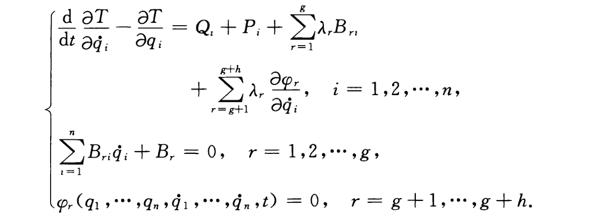

# 约束

## 动力学系统的空间描述

位形空间 $C$，事件空间 $E$，状态空间 $S$，状态时间空间 $T$

一般性的状态轨道，不一定是完全协调轨道。力学系统的任何一个现实运动，其状态轨道必然是完全协调轨道。

状态空间轨道的变分，可分为等时变分和非等时变分，运算符分别记为 $\delta$ 和 $\Delta$

在状态空间里，两条相邻轨迹之间变元在相等时刻的差，称为状态等时变分

$$
\begin{cases}\delta u_i=u_i^2(t)-u_i^1(t)\\[2ex]
\delta v_i=v_i^2(t)-v_i^1(t)\end{cases}
$$

两条相邻轨迹之间变元在不同时刻的差，称为状态非等时变分

$$
\begin{cases}\Delta u_i=u_i^2(t+\Delta(t))-u_i^1(t)\\[2ex]
\Delta v_i=v_i^2(t+\Delta(t))-v_i^1(t)\end{cases}
$$

**定理**：若原轨和变轨都是完全协调轨道，那么其等时交分满足 $\mathrm{d}\delta$ 普遍交换性。

$$
\delta v_{i}=\frac{\mathrm{d}}{\mathrm{d}t}(\delta u_{i})
$$

## 约束

**一般性的一阶约束**

$$
\Phi_r(u_s\cdots,\dot{u}_s\cdots,t)=0
$$

其中 $r=1,2,\cdots,L<N$

**一阶线性约束**

积分形式

$$
\sum_s A_{rs}(u_s\cdots,t)\dot{u}_s+A_{s}(u_s\cdots,t)=0
$$

微分形式

$$
\sum_s A_{rs}(u_s\cdots,t)\mathrm{d}u_s+A_{s}(u_s\cdots,t)\mathrm{d}t=0
$$

定常**几何约束**

$$
f(u_s\cdots)=0
$$

非定常几何约束

$$
f(u_s\cdots,t)=0
$$

完整约束可以表示为积分形式。

等价的约束数学方程组有着相同的约束流形。约束流形刻画约束的本质特性，而约束数学方程组只不过是它外在的表达形式，这种表达形式不是唯一的。

## 虚位移和虚速度

在所研究的一阶线性约束范围内，定义虚位移是两组在同一给定时刻、同一给定位形，且在相等时间间隔内完成的可能位移之差，并记之为 $[\delta_\mathrm{v}u_s\cdots]^\mathrm{T}$

虚位移空间 $\varepsilon^{\mathrm{v}}$，满足约束

$$
\sum_s A_{rs}(u_s\cdots,t)\delta_\mathrm{v}u_s=0
$$

虚速度

$$
\delta_\mathrm{v}\dot{u}_s=\frac{\mathrm{d}}{\mathrm{d}t}(\delta_\mathrm{v}u_s)
$$

代入一阶线性约束有

$$
\sum_{s} A_{rs}\delta_\mathrm{v}\dot{u}_s +
\sum_{s} \Big(\sum_{j}\frac{\partial A_{rs}}{\partial u_{j}}\dot{u}_{j}+\frac{\partial A_{rs}}{\partial t}\Big)\delta_\mathrm{v}u_s=0
$$

## 微变线性空间

由于独立约束的数目恒少于位形分量的数目，因此在给定时刻情况下，系统的可能位形有很多组。同一时刻情况下，任意的两组可能位形之差称为可能位形的有限变更，记为 $[\Delta_\mathrm{L}u_s\cdots]^\mathrm{T}$。仅考虑在系统某一可能位形的无限小邻近，那么"可能位形的有限变更"蜕化为"可能位形的微变更"，记为 $[\delta_\mathrm{L}u_s\cdots]^\mathrm{T}$。可能位形微变空间 $\varepsilon^{\mathrm{L}}$。

可能速度，定义为是在给定时刻、给定位形情况下——亦即给定事件情况下，任一组满足约束方程的速度。任意两组可能速之差称为可能速度的有限变更，记为 $[\Delta_\mathrm{J}\dot{u}_s\cdots]^\mathrm{T}$。同理有可能速度的微变更 $[\delta_\mathrm{J}\dot{u}_s\cdots]^\mathrm{T}$，可能速度的微变空间 $\varepsilon^{\mathrm{J}}$。

一阶线性约束下，与虚位移空间一致

$$
\sum_{s}A_{rs}\delta_{\mathrm{J}}\dot{u}_{s}=0
$$

同理定义可能加速度，可能加速度的有限变更 $[\Delta_\mathrm{G}\ddot{u}_s\cdots]^\mathrm{T}$，可能加速度的微变更 $[\delta_\mathrm{G}\ddot{u}_s\cdots]^\mathrm{T}$，可能加速度的微变空间 $\varepsilon^{\mathrm{G}}$。

(1) 如果系统的约束是一般性的一阶约束，那么 $\varepsilon^\mathrm{J}$ 和 $\varepsilon^\mathrm{G}$ 都有定义，并且在除去元素的记号有区别之外，限制方程是完全一致的；

(2) 如果系统的约束是一阶线性约束，那么 $\varepsilon^\mathrm{v},\varepsilon^\mathrm{J},\varepsilon^\mathrm{G}$ 三者全有定义，除去在元
素的记号有区别之外，其他的性质是完全一致的；

(3) 如果系统的约束是几何约束组，那么 $\varepsilon^\mathrm{v},\varepsilon^\mathrm{L},\varepsilon^\mathrm{J},\varepsilon^\mathrm{G}$ 四者全有定义，除去在元素的记号有区别之外，其他的性质是完全一致的。

## 约束力的性质

按牛顿力学的观点，一切影响系统机械运动的因素都可以归结为力。约束的作用也可以归结为力，约束给予系统以作用力来强迫系统的运动符合约束条件。对于带约束的动力学系统，把力区分为给定力 $F$ 和约束力 $R$，两者的本质区别在于给定力并不与约束条件相联系，而每一个约束力都有与之对应的约束条件。由于约束力非常复杂，一般研究时采取分类处理，其中满足某种性质的力，称之为理想约束力，而其他约束力，则是非理想约束力。那么理想约束力满足什么性质呢？需要引入约束力的虚功概念。

$$
m_s \ddot{u}_s=F_s+R_s
$$

约束力的虚功定义为约束力系在虚位移下所作功的总和

$$
\delta A=\sum_s R_s \delta_{\mathrm{v}}u_s
$$

实际的约束都是非理想的，处理办法是把约束力分为两部分，一部分是符合理想约束假定的，称为理想约束力部分 $R$；另一部分是不符合理想约束假定的，称为非理想约束力部分 $\widetilde{R}$。虽然是非理想的，但往往却是理想约束力部分的函数，例如摩擦力是由正压力所决定的。

第一类Lagrange方程

$$
m_s\ddot{u}_s=F_s+R_s+\Psi_s\left(R_s\cdots\right)
$$

$$
R_s=\sum_{r=1}^LA_{rs}\lambda_r
$$

# 非完整系统

## 动力学基本方程

第一类Lagrange方程结合虚功原理

$$
\sum_s\left(m_s\ddot{u}_s-F_s-\widetilde{R}_s\right)\delta_s^{\mathrm{C}}=0
$$

$\delta_s^{\mathrm{C}}$ 是约束微变空间的任意矢量。

或者

$$
\sum_{i=1}^n\left(\frac{\mathrm{d}}{\mathrm{d}t}\frac{\partial T}{\partial\dot{q}_i}-\frac{\partial T}{\partial q_i}-Q_i-P_i\right)\delta_i^q=0
$$

方案一：乘子方程

方案二：寻找微变空间在附加约束限制条件下独立的基。如果附加约束限制方程都是独立的，那么微变空间 $\varepsilon^{q}$ 独立的基是由 $n-(g+h)=m$ 个自由微变量组成。记这组基为 $[ε_1,ε_2,\cdots,ε_m]^\mathrm{T}$，显然有如下表达式

$$
\delta_i^q=\sum_{j=1}^mM_{ij}\varepsilon_j\:,\quad i=1,2,\cdots,n
$$

## 准速度与准坐标

准速度 $\dot{\pi}_i$，对应准坐标 $\pi_i$

$$
\dot{\pi}_i=\sum_{k=1}^na_{ik}\dot{q}_k+a_i
$$

其中系数 $a_{ik},a_i$ 等都是广义坐标和时间 $t$ 的函数。

$$
\delta\pi_i=\sum_{k=1}^na_{ik}\delta q_k
$$

## Gibbs-Appell 方程

$$
\dot{q}_i=\sum_{j=1}^nh_{ij}\dot{\pi}_j+h_i,\quad i=1,2,\cdots,n.
$$

$$
P_{j}=\sum_{i=1}^{n}Q_{i}h_{ij}=\sum_{i=1}^{n}\sum_{s=1}^{3N}F_{s}\frac{\partial u_{s}}{\partial q_{i}}h_{ij}\:,\quad j\:=\:1,2,\cdotp\cdotp\cdotp,m\:,
$$

$$
\frac{\partial S}{\partial\ddot{\pi}_j}=P_j,\quad j=1,2,\cdots,m.
$$

系统的加速度能量函数，即Gibbs函数

$$
S=\sum_{s=1}^{3N}\frac12m_s\ddot{u}_s^2
$$
