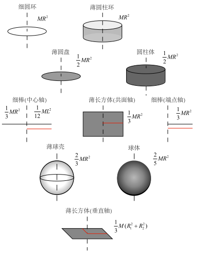
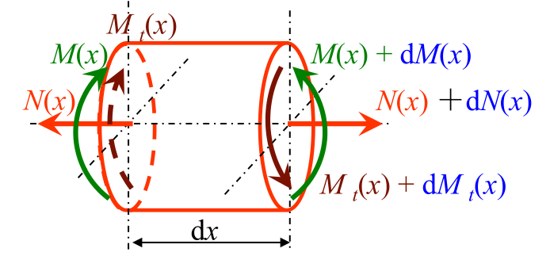

# 拉格朗日方程

$$
\frac{\mathrm{d}}{\mathrm{d}t}\left(\frac{\partial L}{\partial\dot{q}_j}\right)-\frac{\partial L}{\partial q_j}=Q_j ,\quad L=T-V
$$

上面方程成立，当满足条件：

(1) 完整约束，包括几何约束和可转化成几何约束的运动约束。

(2) 理想约束，即约束力不做虚功。

虚功：力在虚位移上所作的功。

$$
\delta W=\boldsymbol{F}_i\cdot\delta \boldsymbol{r}_i=\sum_{j=1}^k\left(\boldsymbol{F}_i\cdot\frac{\partial \boldsymbol{r}_i}{\partial q_j}\right)\delta q_j
$$

其中 $Q_j = \boldsymbol{F}_i \cdot (\partial \boldsymbol{r}_i / \partial q_j)$，称为力 $\boldsymbol{F}_i$ 相应于广义坐标 $q_j$ 的广义力。

(3) 广义坐标和广义速度的独立性。

非完整约束形式

$$
\sum_j a_{ij}(q, t) \dot{q}_j + b_i(q, t) = 0, \quad i = 1, \dots, m
$$

拉格朗日乘子法

$$
\frac{\mathrm{d}}{\mathrm{d}t}\left(\frac{\partial L}{\partial \dot{q}_j}\right) - \frac{\partial L}{\partial q_j} = Q_j + \sum_{i=1}^m \lambda_i a_{ij}
$$

广义速度表示的动能

$$
T=T_2+T_1+T_0
$$

$$
\begin{aligned}
T_{2}=\frac{1}{2}\sum_{i=1}^{k}\sum_{j=1}^{k}a_{ij}\dot{q}_{i}\dot{q}_{j}&,\quad a_{ij}=\sum_{l=1}^{n}m_{l}\frac{\partial\boldsymbol{r}_{l}}{\partial q_{i}}\cdot\frac{\partial\boldsymbol{r}_{l}}{\partial q_{j}} \\
T_1=\sum_{i=1}^kb_i\dot{q}_i&,\quad b_i=\sum_{l=1}^nm_l\frac{\partial\boldsymbol{r}_l}{\partial q_i}\cdot\frac{\partial\boldsymbol{r}_l}{\partial t} \\
T_{0}=c&=\frac{1}{2}\sum_{l=1}^{n}m_{l}\frac{\partial \boldsymbol{r}_l}{\partial t}\cdot\frac{\partial\boldsymbol{r}_l}{\partial t}
\end{aligned}
$$

系数矩阵 $[a_{ij}]$ 对称正定

# 哈密顿方程

由广义坐标构成的 $k$ 维空间称为位形空间。但系统的动力学状态取决于广义坐标和广义速度，由此 $2k$ 个变量构成的空间称为状态空间或相空间。

广义动量

$$
p_i=\frac{\partial L}{\partial\dot{q}_i}
$$

哈密顿方程以广义动量和广义坐标作为描述系统的状态变量。对于保守系统

$$
H=\Big(\sum_{i=1}^kp_i\dot{q}_i-L\Big)_{q_i\to p_i}
$$

$$
\dot{q}_i=\frac{\partial H}{\partial p_i},\quad\dot{p}_i=-\frac{\partial H}{\partial q_i},\quad i=1,2,\cdots,k
$$

由 $L=T_2+T_1+T_0-V$，得

$$
H=T_2+V-T_0
$$

对于非保守系统

$$
\frac{\mathrm{d}}{\mathrm{d}t}\left(\frac{\partial L}{\partial\dot{q}_i}\right)-\frac{\partial L}{\partial q_i}=\tilde{Q}_i
$$

$$
\dot{q}_i=\frac{\partial H}{\partial p_i},\quad\dot{p}_i=-\frac{\partial H}{\partial q_i}+\tilde{Q}_i
$$

# 首次积分定理

拉格朗日函数不显含时间 $t$，有能量积分

$$
\sum_{j=1}^{k}\frac{\partial L}{\partial\dot{q}_{j}}\dot{q}_{j}-L=h
$$

不显含某个广义坐标 $q_r$，有循环积分

$$
\frac{\partial L}{\partial \dot{q}_r} = \frac{\partial T}{\partial \dot{q}_r} = p_r
$$

保守系统的哈密顿函数不显含时间 $t$，有能量积分

$$
H=h
$$

不显含某个广义坐标 $q_r$，有循环积分

$$
p_r=\alpha
$$

泊松（Poisson）建立了泊松括号的运算规则，并由此提出利用哈密顿方程的若干首次积分进一步求得其他首次积分的一般性方法。

$$
\left[\varphi,\psi\right]=\sum_{i=1}^k
\begin{vmatrix}
\dfrac{\partial\varphi}{\partial q_i} & \dfrac{\partial\psi}{\partial q_i} \\\\
\dfrac{\partial\varphi}{\partial p_i} & \dfrac{\partial\psi}{\partial p_i}
\end{vmatrix}
$$

哈密顿方程

$$
\dot{q}_i=
\begin{bmatrix}
q_i,H
\end{bmatrix},\quad\dot{p}_i=
\begin{bmatrix}
p_i,H
\end{bmatrix}+\tilde{Q}_i
$$

保守系统状态变量的任意函数关于时间 $t$ 的全导数

$$
\frac{\mathrm{d}f}{\mathrm{d}t}=\begin{bmatrix}
f,H
\end{bmatrix}+\frac{\partial f}{\partial t}
$$

**泊松定理：**

$\varphi=C_{1}$ 与 $\psi=C_{2}$ 是哈密顿方程的首次积分，若泊松括号 $[\varphi,\psi]$ 是状态变量 $q_i$ 与 $p_i$ 的函数，则 $[\varphi,\psi]=C_3$ 也是哈密顿方程的首次积分。

**定理：**

某保守系统的哈密顿函数具有形式

$$
H=H(\varphi_{1}(q_{1},p_{1}),\cdots,\varphi_{k}(q_{k},p_{k}))
$$

则 $\varphi_{i}=C_{i} (i=1,2,\cdots,k)$ 都是哈密顿方程的首次积分。

# 积分泛函与欧拉方程

函数 $x(t)$

- 微分 $\mathrm{d}x=\dot{x}\mathrm{~d}t$，因时间的无限小变化产生的函数的相应无限小改变。
- 变分 $\delta x$，时间 $t$ 不变时，函数 $x(t)$ 形式的无限小变更。

虚位移是位移函数的一个变分。

(Ⅰ) $\displaystyle \delta(c_{1}x_{1}+c_{2}x_{2})=c_{1}\delta x_{1}+c_{2}\delta x_{2}$

(Ⅱ) $\displaystyle \delta(x_{1}x_{2})=x_{1}\delta x_{2}+x_{2}\delta x_{1}$

(Ⅲ) $\displaystyle \delta\dot{x}_{1}=\frac{\mathrm{d}}{\mathrm{d}t}(\delta x_{1})$

(Ⅳ) $\displaystyle \delta\int_{t_{1}}^{t_{2}}x_{1}\mathrm{d}t=\int_{t_{1}}^{t_{2}}\delta x_{1}\mathrm{d}t$

积分泛函

$$
J[x] = \int_{t_0}^{t_1} F(x, \dot{x}, t) \mathrm{~d}t
$$

边界条件确定且取驻值 $\delta J=0$，有欧拉方程

$$
\frac{\partial F(x, \dot{x}, t)}{\partial x} - \frac{\mathrm{d}}{\mathrm{d}t}\left(\frac{\partial F(x, \dot{x}, t)}{\partial \dot{x}}\right) = 0
$$

哈密顿原理

$$
\delta S = \delta \int_{t_1}^{t_2} L(q, \dot{q}, t) \, dt = 0
$$

# 应变能

组合变形下，杆件的应变能计算

$$
V_{\varepsilon}=\int_{l} \dfrac{N^{2}(x)}{2 E A} \mathrm{~d} x+\int_{l} \dfrac{M^{2}(x)}{2 E I} \mathrm{~d} x+\int_{l} \dfrac{M_{t}^{2}(x)}{2 G I_{p}} \mathrm{~d} x
$$

