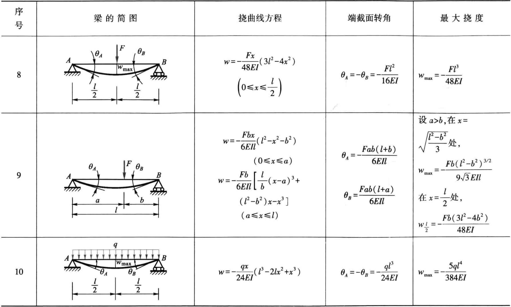

# 弯曲变形

## 挠曲线

发生弯曲变形时，变形前为直线的梁轴线，变形后成为一条连续且光滑的曲线，称为**挠曲线**。讨论弯曲变形时，以变形前的梁轴线为 $x$ 轴，垂直向上的轴为 $y$ 轴，$x-y$ 平面为梁的纵向对称面。

挠度 $y_{C}$ (或 $w$)：坐标为 $x$ 的横截面的形心沿 $y$ 方向的位移。

转角 $\theta_{C}$ (或 $\theta$)：坐标为 $x$ 的横截面对其原来位置转过的角度。

向上的挠度和逆时针的转角为正。

$$
\tan \theta=\frac{\mathrm{d} w}{\mathrm{~d} x}
$$

取微分弧段 $\mathrm{d} s$，有

$$
\mathrm{d} s=\rho \mathrm{d} \theta
$$

其中 $\rho$ 为曲率半径，又由横力弯曲变形的基本方程

$$
\frac{1}{\rho}=\frac{M}{E I}
$$

和微分弧段的性质

$$
\frac{\mathrm{d} \theta}{\mathrm{d} s}=\frac{\dfrac{\mathrm{d}^{2} w}{\mathrm{~d} x^{2}}}{\left[1+\left(\dfrac{\mathrm{d} w}{\mathrm{~d} x}\right)^{2}\right]^{3 / 2}}
$$

得**挠曲线的微分方程**

$$
\frac{\dfrac{\mathrm{d}^{2} w}{\mathrm{~d} x^{2}}}{\left[1+\left(\dfrac{\mathrm{d} w}{\mathrm{~d} x}\right)^{2}\right]^{3 / 2}}=\frac{M}{E I}
$$

在小变形的情况下，$\left(\dfrac{\mathrm{d} w}{\mathrm{~d} x}\right)^{2}<<1$，可将方程线性化

$$
\frac{\mathrm{d}^{2} w}{\mathrm{~d} x^{2}}=\frac{M}{E I}
$$

这是挠曲线的近似微分方程。

## 用积分法求弯曲变形

边界条件：在固定端，挠度和转角都为零；在铰支座上，挠度为零。

连续条件：在挠曲线的任意点上，有唯一确定的挠度和转角。

积分得

$$
\theta=\frac{\mathrm{d} w}{\mathrm{~d} x}=\int \frac{M}{E I} \mathrm{~d} x+C
$$

$$
w=\iint\left(\frac{M}{E I} \mathrm{~d} x\right) \mathrm{d} x+C x+D
$$

梁的刚度条件

$$
\begin{array}{l}
|w|_{\max } \leqslant[w] \\
|\theta|_{\max } \leqslant[\theta]
\end{array}
$$

## 用叠加法求弯曲变形

在弯曲变形很小，且材料服从胡克定律的情况下，挠曲线的微分方程是线性的。因此可以采用叠加法。

## 简单超静定梁

pass

