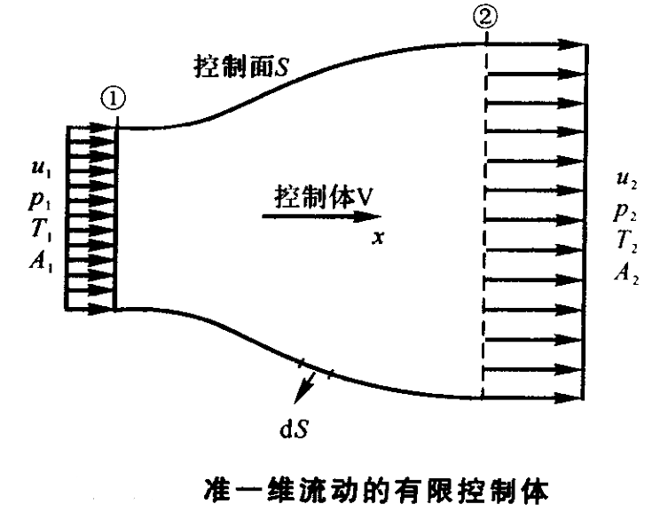
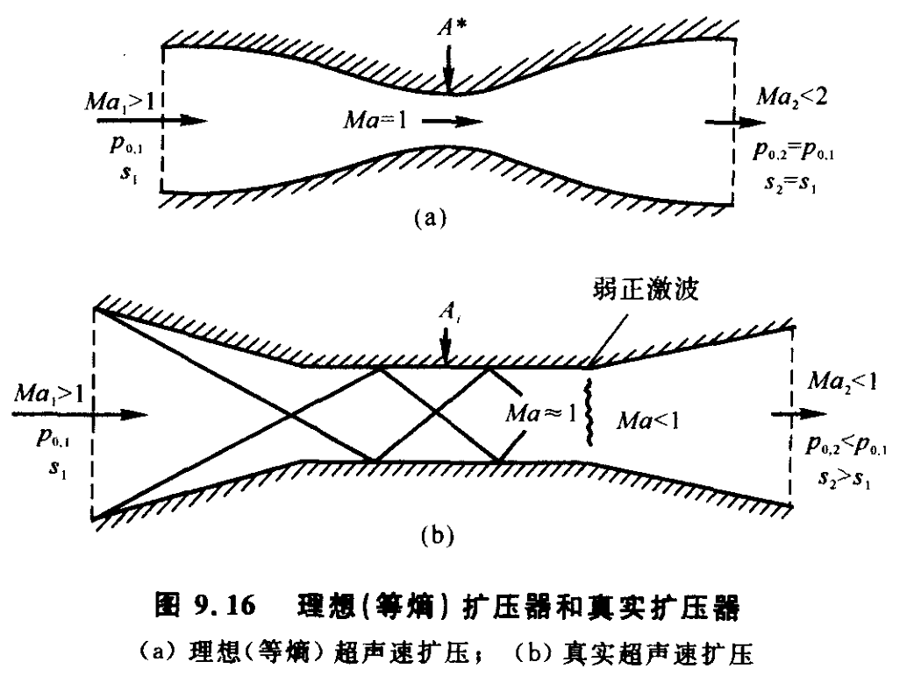
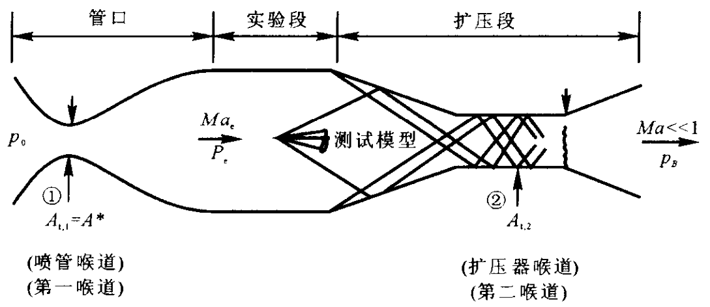

# 准一维流动理论

## 准一维流的控制方程

流管面积变化不太剧烈, $y$、$z$  方向的速度分量与  $x$  方向相比很小, 这样的流场变量可被假设为只是  $x$  的函数，被定义为准一维流动。

连续性方程

$$
\rho_{1} u_{1} A_{1}=\rho_{2} u_{2} A_{2}
$$

动量方程

$$
\rho_{1} u_{1}^{2} A_{1}+p_{1} A_{1}+\int_{A_{1}}^{A_{2}} p \mathrm{~d} A=\rho_{2} u_{2}^{2} A_{2}+p_{2} A_{2}
$$

能量方程

$$
h_{1}+\frac{u_{1}^{2}}{2}=h_{2}+\frac{u_{2}^{2}}{2}
$$

微分形式

$$
\mathrm{d}(\rho u A)=0
$$

$$
\mathrm{d} p=-\rho u \mathrm{d} u
$$

$$
\mathrm{d} h+u \mathrm{d} u=0
$$

状态方程

$$
p=\rho R T
$$

对于量热完全气体

$$
h=c_{p} T
$$

准一维流是绝热等熵的，因此总温 $T_{0}$、总压 $p_{0}$、总密度 $\rho_{0}$ 和滞止音速 $a_{0}$ 为常数。

## 面积-速度关系式

$$
\frac{\mathrm{d} A}{A}=\left(M^{2}-1\right) \frac{\mathrm{d} u}{u}
$$

$M=1$  只能对应于管道面积最小处——拉瓦尔管

## 面积-马赫数关系式

考虑如图所示的管道，假设气流在喉道处达到音速

在等熵流中有

$$
\frac{\rho_{0}}{\rho}=\left(1+\frac{\gamma-1}{2} M^{2}\right)^{1 /(\gamma-1)}
$$

$$
\left(\frac{a_{0}}{a}\right)^{2}=1+\frac{\gamma-1}{2} M^{2}
$$

得

$$
\left(\frac{A}{A^{*}}\right)^{2}=\frac{1}{M^{2}}\left[\left(\frac{2}{\gamma+1}\right)\left(1+\frac{\gamma-1}{2} M^{2}\right)\right]^{(\gamma+1) /(\gamma-1)}
$$

$$
\left(\frac{A}{A^{*}}\right)^{2}=\frac{\gamma-1}{2} \frac{\left(\frac{2}{\gamma+1}\right)^{(\gamma+1) /(\gamma-1)}}{\left[1-\left(\frac{p}{p_{0}}\right)^{(\gamma-1) / \gamma}\right]\left(\frac{p}{p_{0}}\right)^{2 / \gamma}}
$$

考虑一给定截面积分布的收缩-扩张管道

- 总压（入口压强）和总温分别为  $p_{0}$  和  $T_{0}$ ;
- 因为管道的截面积分布  $A=A(x)$  是已知的, 所以, 在任意位置的  $A / A^{*}$  值均为已知; 喉道面积由  $A^{*}$  表示, 出口处的面积由  $A_{e}$  表示, 出口处的马赫数和静压分别由  $M_{e}$  和表示  $p_{e}$  。
- 假设气流等熵地通过喷管加速, 在扩张段膨胀为超音速流。此时的出口马赫数与压强分别为  $M_{e}=M_{e, 6}, p_{e}=p_{e, 6}$  。对于这种情况, 㬋道处的流动为音速, 且  $A_{t}=A^{*}$  。通过管道的流动特性由  $A / A$  * 确定。
- 只有入口与出口存在压力差，才会存在通过喷管的流动  $p_{e}<p_{0}$

如果出口压力  $p_{e}\ne p_{e, 6}$，则把出口下游的环境压力定义为反压(背压,back pressure)，用  $p_{B}$  表示。

当总压（入口压强）和总温分别为  $p_{0}$  和  $T_{0}$  给定时, 对于给定面积分布得收缩-扩张管道，其内部流动由出口反压  $p_{B}$  决定。

如果 $p_{B}=p_{0}$ , 喷管入口与出口不存在压力差，那么喷管内没有流动发生

当  $p_{e, 3} \leq p_{B}<p_{0}$  时,管内流动对应无数多个亚音速等熵解，每个不同的解与一个不同的反压  $p_{B}$  相联系。

> 随着出口压力的继续降低, 在喉道处的速度增加, 质量流量增加。当  $p_{B}=p_{e, 3}$  时, **气流在喉道处达到了音速**。如果进一步降低出口压力, 使  $p_{B}<p_{e, 3}$ , 喉道处的流动参数保持不变。喉道处的马赫数不能超过 1 , 一旦流动在喉道达到音速, 不管  $p_{B}$  降低到多少, 质量流量仍然保持不变, 这种流动称为 “**雍塞**” 流 (choked flow)。这是可压缩流流过管道的一个重要特征。扰动就不能向喉道之前的收缩段逆向传播。在喷管收缩段的流动不再与出口压力相联系。

当  $p_{e, 5}<p_{B}<p_{e, 3}$  时, 管内流动对应无数多个非等熵解, 喉道下游存在一道位置 (强度) 由出口反压  $p_{B}$  决定的正激波。

当  $p_{e, 6}<p_{B}<p_{e, 5}$  时,管内流动除出口处外对应超音速等熵解，喷管出口处存在强度由出口反压  $p_{B}$  决定的斜激波。

当  $p_{B}=p_{e, 6}$  时, 只有一种可能的超音速等熵流动。

当  $p_{B}<p_{e, 6}$  时，管内流动和  $p_{B}=p_{e, 6}$  时完全相同，但出口处存在膨胀波。

## 喷管流量计算

喉道处参数表示喷管流量计算公式

$$
\begin{aligned}
\dot{m} & =\rho_{t} u_{t} A_{t}=\rho_{0}\left(1+\frac{\gamma-1}{2} M_{t}^{2}\right)^{-\frac{1}{\gamma-1}} M_{t} a_{t} A_{t} \\
& =\frac{p_{0}}{R T_{0}}\left(1+\frac{\gamma-1}{2} M_{t}^{2}\right)^{-\frac{1}{\gamma-1}} M_{t} a_{0}\left(1+\frac{\gamma-1}{2} M_{t}^{2}\right)^{-\frac{1}{2}} A_{t} \\
& =\frac{p_{0}}{R T_{0}}\left(1+\frac{\gamma-1}{2} M_{t}^{2}\right)^{-\frac{1}{\gamma-1}-\frac{1}{2}} M_{t} \sqrt{\gamma R T_{0}} A_{t} \\
& =\frac{p_{0} A_{t}}{\sqrt{T_{0}}} M_{t} \sqrt{\frac{\gamma}{R}\left(1+\frac{\gamma-1}{2} M_{t}^{2}\right)^{-\frac{\gamma+1}{\gamma-1}}}
\end{aligned}
$$

当喉道处  $M_{t}=1$ , 则  $A_{t}=A^{*}$ , 流量达到最大值。

$$
\begin{aligned}
\dot{m}_{\max } & =\frac{p_{0} A^{*}}{\sqrt{T_{0}}} \cdot 1 \cdot \sqrt{\frac{\gamma}{R}\left(1+\frac{\gamma-1}{2} \cdot 1\right)^{-\frac{\gamma+1}{\gamma-1}}} \\
& =\frac{p_{0} A^{*}}{\sqrt{T_{0}}} \sqrt{\frac{\gamma}{R}\left(\frac{2}{\gamma+1}\right)^{\frac{\gamma+1}{\gamma-1}}}
\end{aligned}
$$

## 扩压器

扩压器是将入流速度在其出口处降低的任意管道。

## 超音速风洞

- 收缩-扩张喷管在喷管扩张段产生超音速流，流入与喷管出口连接的称之为实验段的等截面段，然后流入与实验段相连的扩压器以使超音速来流减速。收缩-扩张的喷管、等截面的实验段和收缩-扩张的扩压器就构成了超音速风洞的基本布局。
- 实验模型被置于实验段，模型产生的激波传播至下游与扩压器内多反射波相互作用。超音速风洞中总压损失的主要来源是扩压器。

对于绝热流动，临界参数  $a^{*}, T^{*}$ 为常数

$$
\frac{A_{t, 2}}{A_{t, 1}}=\frac{\rho_{1} *}{\rho_{2} *}=\frac{p_{0,1}}{p_{0,2}}
$$

## 摩擦管流

- 没有能量增加
- 没有传质
- 管道截面积不变

湿周  $l_{w}$ : 过流断面上流体与固体壁面接触的周界线长度

定义水力直径

$$
D_{H} = \frac{4A}{l_{w}}
$$

定义摩阻系数

$$
f=\frac{\tau_{w}}{0.5 \rho u^{2}}
$$

连续性方程

$$
\mathrm{d} (\rho u)=0
$$

能量方程

$$
\frac{\mathrm{d} T}{T}+(\gamma-1) Ma^{2} \frac{\mathrm{d} u}{u}=0
$$

解得

$$
\frac{\mathrm{d} \rho}{\rho}=-\frac{\gamma M a^{2}}{2\left(1-M a^{2}\right)} \frac{4 f \mathrm{d} x}{D_{H}}
$$

$$
\frac{\mathrm{d} p}{p}=-\frac{\gamma M a^{2}\left(1+(\gamma-1) M a^{2}\right)}{2\left(1-M a^{2}\right)} \frac{4 f \mathrm{d} x}{D_{H}}
$$

$$
\frac{\mathrm{d} u}{u}=\frac{\gamma M a^{2}}{2\left(1-M a^{2}\right)} \frac{4 f \mathrm{d} x}{D_{H}}
$$

$$
\frac{\mathrm{d} T}{T}=-\frac{\gamma(\gamma-1) M a^{4}}{2\left(1-M a^{2}\right)} \frac{4 f \mathrm{d} x}{D_{H}}
$$

$$
\frac{\mathrm{d} s}{c_{p}}=\frac{(\gamma-1) M a^{2}}{2} \frac{4 f \mathrm{d} x}{D_{H}}
$$

$$
\frac{\mathrm{d} Ma}{Ma}=\frac{\gamma M a^{2}\left(1+\frac{\gamma-1}{2} M a^{2}\right)}{2\left(1-M a^{2}\right)} \frac{4 f \mathrm{d} x}{D_{H}}
$$

- 流动为亚声速时，摩阻使速度、马赫数、熵增加，密度、压力、静温和总压减小
- 流动为超声速时，摩阻使密度、压力、静温、熵增加，速度马赫数和总压减小

记

$$
\lambda^{2}=\frac{(\gamma+1) M a^{2}}{2\left(1+\dfrac{\gamma-1}{2} M a^{2}\right)}
$$

$$
X(\lambda)=\frac{1}{\lambda^{2}}-1-\ln \frac{1}{\lambda^{2}}
$$

有

$$
\frac{2 \gamma}{\gamma+1} \frac{4 \bar{f} L_{\max }}{D_{H}}=X\left(\lambda_{i}\right)-X\left(\lambda_{e}\right)
$$

平均摩阻系数  $\displaystyle\bar{f}=\frac{1}{L_{\max }} \int_{0}^{L_{\max }} f \mathrm{~d} x$

对于亚声速流动，入口马赫数越高最大管长  $L_{\max}$  越短。管长超过最大管长  $L_{\max}$ ，会发生**摩擦壅塞**。出现壅塞时，扰动会传播到入口处，迫使气流发生溢流，减小流量，减小马赫数，从而使得最大管长等于实际管长。

