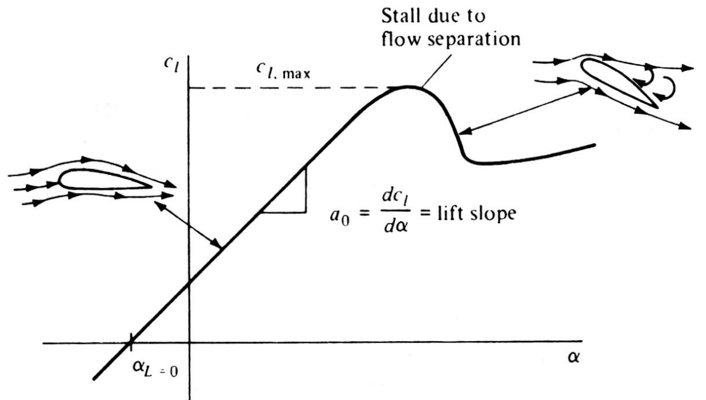
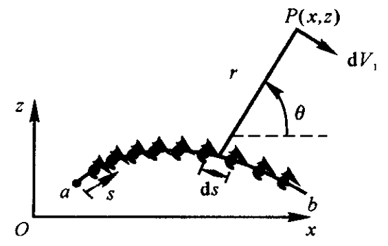
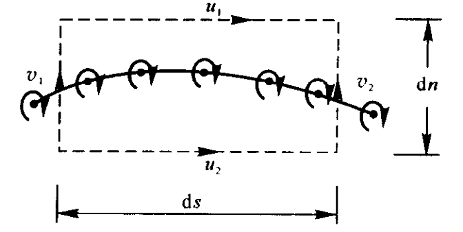
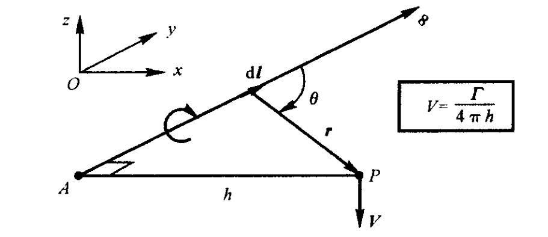

# 绕二维翼型不可压流动

## 二维翼型

### 几何描述

**中弧线**为翼型上、下表面的中点连线，中弧线上各点到上、下翼型表面的距离以该点处垂直于中弧线的方向进行测量。翼型的最前点和最后点分别为翼型的**前缘**和**后缘**，前、后缘的连线被定义为翼型的**弦线**。弦线的长度为翼型的**弦长**。在垂直于弦线方向上，中弧线与弦线间的最大距离为翼型的**弯度**。在垂直于弦线方向上，翼型上、下表面间的最大距离为翼型的**厚度**。翼型的弯度和厚度都被表述为以翼型弦长为基准的相对值。对大多数翼型剖面，特别是低速翼型剖面，在其前缘都是一段近似的圆弧，圆弧与前缘相切，圆心在中弧线上。

### 气动性质

升力: 与重力方向相反的气动力分量

升力系数

$$
c_{l}=\frac{F_{l}}{\dfrac{1}{2} \rho_{\infty} V_{\infty}^{2} c}
$$

阻力系数

$$
c_{d}=\frac{F_{d}}{\dfrac{1}{2} \rho_{\infty} V_{\infty}^{2} c}
$$

- 升力线斜率:  $a_{0}$
- 最大升力系数：  $c_{l, \text { max }}$
- 攻角（迎角），来流与翼型弦线的夹角:  $\alpha$
- 零升力攻角:  $\alpha_{L=0}$

气动力矩不随迎角变化的点，叫做翼型的**气动中心**(焦点)

## 面涡理论

令  $s$  为沿面涡侧视图的曲线坐标, 定义  $\gamma=\gamma(s)$  为沿  $s$  单位长度上面涡的强度。设流场中点  $P$  到的距离为  $r$ ; 点  $P$  在直角坐标系中的坐标为  $(x, z)$  。由面涡上无穷小段  $\mathrm{d} s$  对点  $P$  产生的无穷小诱导速度为

$$
\mathrm{d} V=-\frac{\gamma \mathrm{d} s}{2 \pi r}
$$

无穷小速度势为

$$
\mathrm{d} \phi=-\frac{\gamma \mathrm{d} s}{2 \pi} \theta
$$

整个面涡对点  $P$  产生的速度势为

$$
\phi(x, z)=-\frac{1}{2 \pi} \int_{a}^{b} \theta \gamma \mathrm{d} s
$$

包围整个面涡的封闭曲线上的环量应该等于面涡上所有微元面浴的强度之和, 即

$$
\Gamma=\int_{a}^{b} \gamma \mathrm{d} s
$$

面涡两侧沿面涡切线方向上的速度分量是不连续的，但法向速度分量在面涡两侧是相同的，穿过面涡的当地切向速度改变量等于当地面涡强度。

$$
\gamma=u_{1}-u_{2}
$$

## 库塔条件

对于给定环量的物体绕流，只有一个确定的流动同时满足远场和物面边界条件。如果环量不确定，远场边界条件和物体形状不能唯一确定流动形态。

库塔条件：
（1）对于给定形状且给定迎角的翼型，绕翼型的环量大小恰好使得流体光滑流过后缘点；
（2）如果翼型后缘夹角为有限大小，则后缘点为驻点；
（3）如果翼型后缘夹角为零,则沿上、下表面流过翼型后缘的速度为相等的有限值。

$$
\gamma_{\mathrm{TE}}=\gamma(a)=V_{1}-V_{2} = 0
$$

## 薄翼理论

小厚度、小弯度翼型

翼型可以用在中弧线上分布的面涡来代替。只需求出能够使中弧线为流线，且满足后缘库塔条件的面涡强度分布。

面涡在中弧线上所诱导的速度在中弧线法线上的分量

$$
w=-\frac{1}{2 \pi} \int_{0}^{c} \frac{\gamma(\xi) \mathrm{d} \xi}{x-\xi}
$$

匀直流在面涡法线方向的速度

$$
V_{\infty, n}=V_{\infty}\left[\alpha-\frac{\mathrm{d} z}{\mathrm{~d} x}\right]
$$

由

$$
V_{\infty, n}+w=0
$$

得

$$
\frac{1}{2 \pi} \int_{0}^{c} \frac{\gamma(\xi) \mathrm{d} \xi}{x-\xi}=V_{\infty}\left[\alpha-\frac{\mathrm{d} z}{\mathrm{~d} x}\right]
$$

称为**薄翼理论基本公式**, 是中弧线为流线的数学描述。

### 对称翼型

对称翼型的中弧线与弦线重合，其弯度为零

$$
\frac{1}{2 \pi} \int_{0}^{c} \frac{\gamma(\xi) \mathrm{d} \xi}{x-\xi}=V_{\infty}\alpha
$$

称为**绕平板无黏不可压缩有迎角流动的基本方程**

解

$$
\gamma(\theta)=2 \alpha V_{\infty} \frac{(1+\cos \theta)}{\sin \theta}
$$

$$
x=\frac{c}{2}\left(1-\cos \theta\right)
$$

计算对称薄翼型的升力系数

$$
\Gamma= \int_{0}^{c} \gamma(\xi) \mathrm{d} \xi=\pi \alpha c V_{\infty}
$$

$$
F_{l}=\rho_{\infty} V_{\infty} \Gamma
$$

$$
c_{l}=\frac{F_{l}}{\dfrac{1}{2} \rho_{\infty} V_{\infty}^{2} c}=2 \pi \alpha
$$

1/4 弦线点同时为翼型的压力中心和气动中心

### 有弯度薄翼

$$
\gamma(\theta)=2 V_{\infty}\left(A_{0} \frac{1+\cos \theta}{\sin \theta}+\sum_{n=1}^{\infty} A_{n} \sin n \theta\right)
$$

$$
A_{0}=\alpha-\frac{1}{\pi} \int_{0}^{\pi} \frac{\mathrm{d} z}{\mathrm{~d} x} \mathrm{~d} \theta_{0}
$$

$$
A_{n}=\frac{2}{\pi} \int_{0}^{\pi} \frac{\mathrm{d} z}{\mathrm{~d} x} \cos n \theta_{0} \mathrm{~d} \theta_{0}
$$

$$
c_{l}=2 \pi\left[\alpha+\frac{1}{\pi} \int_{0}^{\pi} \frac{\mathrm{d} z}{\mathrm{~d} x}\left(\cos \theta_{0}-1\right) \mathrm{d} \theta_{0}\right]
$$

气动中心在距前缘 1/4 弦长点处。压力中心随升力系数的变化而移动。

# 绕有限翼展机翼不可压缩流动

**对气动参数的符号进行说明**：分析二维物体时, 物体单位展长上受到的升力、阻力和力矩分别用带有撤号的大写字母注明, 即  $L^{\prime}$, $D^{\prime}$  和  $M^{\prime}$ ; 对应的升力系数、阻力系数和力矩系数分别用小写字母表示, 即  $c_{l}$, $c_{d}$  和  $c_{m}$  。而三维物体 (如有限翼) 上作用的升力、阻力和力矩分别用不带撇号的大写字母表示, 即  $L$, $D$  和  $M$ ; 对应的升力系数、阻力系数和力矩系数分别用大写字母表示, 即  $C_{L}$, $C_{D}$  和  $C_{M}$  。

## 几何参数

展弦比

$$
AR=\frac{b^{2}}{S}
$$

## 下洗和诱导阻力

机翼的翼梢旋浴会在机翼周围产生一个小的向下的诱导速度。这一由尾旋浴诱导出一个很小的向下的速度分量, 我们称之为**下洗速度**, 用  $w$  表示。下洗速度与来流速度叠加后, 在机翼的各剖面附近形成了相对下偏的当地相对速度。

定义翼型弦线与来流  $V_{\infty}$  的夹角  $\alpha$  为迎角, 也叫**几何迎角**; 当地相对来流的方向定义为来流  $V_{\infty}$  下偏一个角度  $\alpha_{i}$  后所得的方向,并称  $\alpha_{i}$  为**下洗角**。下洗的存在, 以及下洗使得相对来流向下偏转的效应, 对当地翼型剖面具有以下两个重要的影响:

(1) 当地翼型剖面真正感受到的迎角是翼型弦线与当地相对来流之间的夹角  $\alpha_{\mathrm{eff}}$ , 定义为**有效迎角**

$$
\alpha_{\text {eff }}=\alpha-\alpha_{i}
$$

(2) 各翼型剖面的当地升力方向与当地相对来流方向垂直, 即升力方向在与来流垂直向上的基础上又向后偏转了一个  $\alpha_{i}$  角。所以, 当地升力矢量在来流方向上会产生一个分量  $D_{i}$ , 这个分量就是由于下洗存在而产生的阻力, 称为**诱导阻力**。

通过上面的分析,可以发现,作用在有限展长机翼上的下洗减小了机翼每个翼型剖面所感受到的迎角, 并且产生了一个阻力分量一一诱导阻力  $D_{i}$  。

## 线涡及其诱导速度

线涡是可以弯曲的。线涡会在周围的空间中产生诱导流场。如果沿包围线涡的任意封闭路径计算环量, 就会得到一个常值  $\Gamma$ , 定义为线涡的强度。在线涡上取一有向微段  $\mathrm{d} \boldsymbol{l}$。设从微段  $\mathrm{d} \boldsymbol{l}$  到空间任意点  $P$  的矢径为  $\boldsymbol{r}$ , 则微段  $\mathrm{d} \boldsymbol{l}$  在点  $P$  的诱导速度为

$$
\mathrm{d} \boldsymbol{V}=\frac{\Gamma}{4 \pi} \frac{\mathrm{d} \boldsymbol{l} \times \boldsymbol{r}}{|\boldsymbol{r}|^{3}}
$$

半无限长线涡的诱导速度

## 经典升力线理论

单个马蹄涡

附着涡上坐标为  $y$  点处由尾涡引发的下洗速度为

$$
w(y)=-\frac{\Gamma}{4 \pi} \frac{b}{(b / 2)^{2}-y^{2}}
$$

沿升力线无穷多马蹄涡叠加

$$
w\left(y_{0}\right)=-\frac{1}{4 \pi} \int_{-b / 2}^{b / 2} \frac{(\mathrm{d} \Gamma / \mathrm{d} y) \mathrm{d} y}{y_{0}-y}
$$

诱导迎角

$$
\alpha_{i}\left(y_{0}\right)=\arctan\left(-\frac{w\left(y_{0}\right)}{V_{\infty}}\right)
$$

$$
\alpha_{\text {eff }}=\alpha-\alpha_{i}
$$

当地翼型的升力系数

$$
c_{l}=a_{0}\left[\alpha_{\mathrm{eff}}\left(y_{0}\right)-\alpha_{L=0}\right]=2 \pi\left[\alpha_{\mathrm{eff}}\left(y_{0}\right)-\alpha_{L=0}\right]
$$

又有升力的两种求法

$$
L^{\prime}=\frac{1}{2} \rho_{\infty} V_{\infty}^{2} c\left(y_{0}\right) c_{l}=\rho_{\infty} V_{\infty} \Gamma\left(y_{0}\right)
$$

可推出**普朗特升力线理论基本方程**

$$
\alpha\left(y_{0}\right)=\frac{\Gamma\left(y_{0}\right)}{\pi V_{\infty} c\left(y_{0}\right)}+\alpha_{L=0}\left(y_{0}\right)+\frac{1}{4 \pi V_{\infty}} \int_{-b / 2}^{b / 2} \frac{(\mathrm{d} \Gamma / \mathrm{d} y) \mathrm{d} y}{y_{0}-y}
$$

求解出环量  $\Gamma=\Gamma(y)$

升力分布

$$
L^{\prime}\left(y_{0}\right)=\rho_{\infty} V_{\infty} \Gamma\left(y_{0}\right)
$$

总升力

$$
L=\int_{-b / 2}^{b / 2} L^{\prime}(y) d y=\rho_{\infty} V_{\infty} \int_{-b / 2}^{b / 2} \Gamma(y) \mathrm{d} y
$$

升力系数

$$
C_{L}=\frac{L}{q_{\infty} S}=\frac{L}{\dfrac{1}{2} \rho_{\infty} V_{\infty}^{2} S}=\frac{2}{V_{\infty} S} \int_{-b / 2}^{b / 2} \Gamma(y) \mathrm{d} y
$$

单位展长诱导阻力

$$
D_{i}^{\prime}=L^{\prime} \alpha_{i}
$$

总诱导阻力

$$
D_{i}=\int_{-b / 2}^{b / 2} D^{\prime}(y) \mathrm{d} y=\rho_{\infty} V_{\infty} \int_{-b / 2}^{b / 2} \Gamma(y) \alpha_{i}(y) \mathrm{d} y
$$

诱导阻力系数

$$
C_{D, i}=\frac{D_{i}}{q_{\infty} S}=\frac{2}{V_{\infty} S} \int_{-b / 2}^{b / 2} \Gamma(y) \alpha_{i}(y) \mathrm{d} y
$$

**椭圆型翼载分布**

$$
\Gamma(y)=\Gamma_{0} \sqrt{1-\left(\frac{2 y}{b}\right)^{2}}
$$

下洗速度沿展向为常数

$$
w=-\frac{\Gamma_{0}}{2 b}
$$

升力

$$
L=\rho_{\infty} V_{\infty} \Gamma_{0} \frac{b}{4} \pi
$$

升力系数

$$
C_{L} = \frac{\pi b \Gamma_0}{2 V_\infty S}
$$

诱导攻角

$$
\alpha_{i}=\frac{\Gamma_{0}}{2 b V_{\infty}}=\frac{C_{L}}{\pi \mathrm{AR}}
$$

诱导阻力系数

$$
C_{D, i}=\frac{C_{L}^{2}}{\pi A R}
$$

弦长沿展向以椭圆规律分布

$$
c(y)=\frac{L^{\prime}(y)}{q_{\infty} c_{l}}
$$