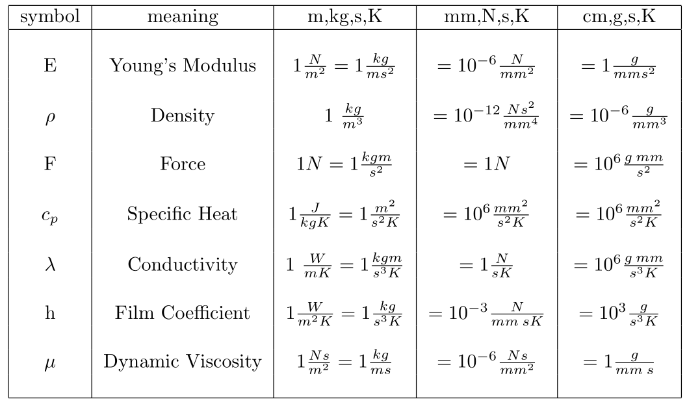

---
output:
  word_document:
    pandoc_args: ["--reference-doc=custom-reference.docx"]
---

# 飞行器结构动力学总结

@import "1234总结.md"
@import "6总结.md"

## 有限元软件使用

### 单位制换算



### 总体指导

检查网格质量：在CalculiX GraphiX或其他预处理器中检查网格质量。一个高质量的网格是获得准确结果的关键。
非线性问题的线性化版本：对于非线性问题，首先运行一个线性化版本可以帮助你验证边界条件、载荷和其他非线性因素是否设置正确。
使用二次元素：除了显式动态计算之外，建议使用二次元素（如C3D10、C3D15、C3D20(R)、S8、CPE8、CPS8、CAX8、B32）。标准形状函数对于二次元素是非常好的。大多数有限元程序都使用这些标准函数。对于线性元素，情况并非如此，因为线性元素可能会出现各种奇怪行为，如剪切锁定和体积锁定。因此，大多数有限元程序会修改线性元素的形状函数以缓解这些问题。然而，没有标准的方法来做这件事，所以每个供应商都创建了自己的修改,这导致使用线性元素时结果差异较大。由于CalculiX也使用线性元素的标准形状函数，因此必须谨慎考虑结果。
Shell和Beam元素的输出设置：如果使用壳元素或梁元素， *NODE FILE应该使用OUTPUT=3D选项（这是默认设置）。这样，你可以在.frd文件中获得这些元素的展开形式。你可以轻松验证你指定的厚度是否正确，并获得3D应力分布。这是1D/2D应力分布和内部梁力的基础。如果前者不正确，后者也会不正确。
接触问题中的二次元素：如果你在计算中包含接触，并且使用二次元素，建议使用面-对面接触方法或mortar方法（默认是面-对面的方法）。一般来说，对于面之间的接触，面-对面的方法和mortar方法比节点-对面的方法收敛得更好。接触类型必须在*CONTACT PAIR上声明。请注意，CalculiX中的mortar方法只能用于静态计算。
显式动力学计算：线性元素：使用C3D4、C3D8或C3D6等线性元素。节点-面对接触：使用节点-面对的接触方式。质量缩放：当你指定最小时间增量（*DYNAMIC下面的第三个条目）时，它会自动激活。
内存不足的问题：如果你没有足够的空间来运行问题，检查编号。运行问题所需的内存取决于最大的节点和元素编号（计算时间则不依赖于此）。因此，如果你注意到编号之间有很大的差距，消除它们，你将需要更少的内存。在某些问题中，通过选择迭代解算方法可以节省内存。迭代缩放方法（参见*STATIC）需要的内存比迭代Cholesky方法少，后者需要的内存比SPOOLES或PARDISO少。

### 报错与解决方法

查看屏幕输出：非线性计算中的收敛信息可以指示问题的根源。
查看.sta文件：该文件包含每个增量中所需迭代次数的信息，以获得收敛。
查看.cvg文件：该文件是屏幕输出的摘要，它提供了每次迭代中的接触元素数量、残余力和解的最大变化（无论是否收敛）。
使用“最后迭代”选项：在*NODE FILE或类似的卡片上使用此选项，可以生成一个名为ResultsForLastIterations.frd的文件，其中包含所有非收敛迭代从最后一个收敛增量开始之后的变形（对于机械计算）和温度（对于热计算）。
查看接触定义：如果在输入文件中定义了接触，可以使用*NODE FILE或类似的卡片上的“接触元素”选项。这会生成一个名为jobname.cel的文件，其中包含在激活的增量中所有迭代中的所有接触元素。在CalculiX GraphiX中读取此文件，可以可视化每个迭代中的所有接触元素，并可能找到问题的根源。
处理段错误：如果遇到段错误，可以在终端窗口中键入“export CCX LOG ALLOC=1”来设置环境变量CCX LOG ALLOC为1。运行CalculiX时，将获得有关在代码的哪一行分配、重新分配或释放哪个字段的信息（默认为0）。
专家使用：如果遇到不同方程之间的依赖性问题，可以通过删除ccx 2.21.c中writeboun调用前的注释并重新编译来在每个步骤开始时打印SPC。可以通过取消cascade.c开头writempc调用前的循环注释并重新编译来打印每次设置时MPC。

### 输入文件简单示例

#### *STATIC

```
*HEADING  （这一行定义了一个标题块，为问题提供一个标题或描述）
Model: beam Date: 10−Mar−1998（模型的名称和创建的时间）
*NODE （开始定义一些节点）
1, 0.000000, 0.000000, 0.000000
2, 1.000000, 0.000000, 0.000000
3, 1.000000, 1.000000, 0.000000
...
260, 0.500000, 0.750000, 7.000000
261, 0.500000, 0.500000, 7.500000
*ELEMENT, TYPE=C3D20R , ELSET=Eall  （元素定义 二十节点三维 元素集是Eall）
1, 1, 10, 95, 19, 61, 105, 222, 192, 9, 93,
94, 20, 104, 220, 221, 193, 62, 103, 219, 190 (像这样的一组节点就是描述一个元素)
2, 10, 2, 13, 95, 105, 34, 134, 222, 11, 12,
96, 93, 106, 133, 223, 220, 103, 33, 132, 219
...
32, 258, 158, 76, 187, 100, 25, 7, 28, 259, 159,
186, 260, 101, 26, 27, 102, 261, 160, 77, 189
*NSET, NSET=FIX （这是一个节点集在后续BOUNDARY中被固定）
97, 96, 95, 94, 93, 20, 19, 18, 17, 16, 15,
14, 13, 12, 11, 10, 9, 4, 3, 2, 1
*BOUNDARY
FIX, 1   （节点集FIX在1,2,3方向 ccx中定义为x y z方向固定）
*BOUNDARY
FIX, 2
*BOUNDARY
FIX, 3
*NSET,NSET=Nall,GENERATE （生成一个名为Nall的节点集）
1,261
*MATERIAL,NAME=EL （定义一个材料属性）
*ELASTIC （弹性材料属性）
210000.0, .3 （杨氏模量泊松比这里是mm t s 单位所以是Mpa）
*SOLID SECTION,ELSET=Eall,MATERIAL=EL  (定义了一个名为Eall的元素集(类型是实体)，指定使用材料为EL)
*NSET,NSET=LOAD （定义名为LOAD的节点集）
5,6,7,8,22,25,28,31,100 （节点编号）
**  （只是一个分隔符）
*STEP （定义分析步）
*STATIC （静力）
*CLOAD （集中载荷）
LOAD,2,1. （在节点集LOAD上y方向施加大小为1的力注意是每个节点上都有大小为1的力）
*NODE PRINT,NSET=Nall  （指示输出Nall节点集的所有节点的结果）
U       （输出节点位移）
*EL PRINT,ELSET=Eall  （输出Eall元素集合所有元素的结果）
S  （所有元素的应力）
*NODE FILE 
U
*EL FILE
S
（两个输出文件（扩展的.dat），分别输出节点信息和元素信息，需要特别注意的是元素信息是插值后存储在节点上的）
*END STEP  （这个分析步骤结束了）
如果要继续增加分析步要用*STEP ... *END STEP 的形式
```

#### *FREQUENCY

```
相同的部分不再赘述
** 
** Structure: beam under compressive forces. 
** Test objective: Frequency analysis; the forces are that 
** high that the lowest frequency is nearly 
** zero, i.e. the buckling load is reached. 
** 
*HEADING 
Model: beam Date: 10-Mar-1998 
*NODE 
1, 0.000000, 0.000000, 0.000000 
... 
*ELEMENT, TYPE=C3D20R 
1, 1, 10, 95, 19, 61, 105, 222, 192, 9, 93, 
94, 20, 104, 220, 221, 193, 62, 103, 219, 190 
... 
*BOUNDARY (一样的在几个不同的方向上限制位移) 
CN7, 1 
*BOUNDARY 
CN7, 2 
*BOUNDARY 
CN7, 3 
*ELSET,ELSET=EALL,GENERATE 
1,32 
*MATERIAL,NAME=EL 
*ELASTIC 
210000.0, .3 
*DENSITY 
7.8E-9 
*SOLID SECTION,MATERIAL=EL,ELSET=EALL 
*NSET,NSET=LAST 
5, 
6, 
... 
*STEP 
*STATIC 
*CLOAD 
LAST,3,-48.155 （z方向施加了载荷）
*END STEP
*STEP,PERTURBATION（扰动分析步）
*FREQUENCY
10  （前十阶模态）
*NODE FILE
U
*EL FILE
S
*END STEP
```

### 理论部分

#### 节点类型

有三种节点类型：
**一维流体节点**：属于一维网络元素的节点（以D开头的元素标签）强制对流类型的*FILM中的参考节点（标签：F*FC)。*DLOAD中的参考节点（标签：P*NP）。
**三维流体节点**：这些节点是属于三维流体元素（以F开头的元素标签）的结构节点。
**结构化的节点**：不属于一维和三维，都不是一维流体节点或三维流体节点。

注意不允许在不同类型的节点之间创建公式。

#### 单元类型

**C3D8和F3D8**
八节点块元件（C3D8和F3D8）C3D8元件是一个通用的线性元素。
注意C3D8在泊松系数或塑性行为值高时，该元素的行为会变差。在弯曲时，该元素往往过于刚硬，例如对于细长的梁或薄板在弯曲时。
F3D8元素是相应的流体元素。
**C3D8R**
是一种通用的线性块元素，具有简化积分（1个积分点）。其形状函数与C3D8元素相同。由于C3D8R元件的积分点位于元件的中间。因此，需要小的元素来捕获结构边界上的应力集中
**C3D8I**
不兼容模式八节点砖元素（C3D8I）不兼容八节点单元是C3D8元素（节点上的值为0）
**C3D20 /C3D20R**
C3D20R是C3D20的积分点选取减少版（2*2*2）
**C3D4和F3D4**
四节点四面体单元 C3D4是一个通用的四面体单元（1个积分点）。不适合用于结构计算，除非使用了许多这些元素（该元素太硬）。F3D4单元是相应的流体单元。
**C3D10**
10节点四面体单元
**C3D10T**
改性的十节点四面体元件对初始温度进行线性插值
**C3D6和F3D6**
六节点楔形元件(C3D6和F3D6）除非使用了许多这些元素，否则它可能不是很适合进行结构计算
**C3D15**
十五节点楔形元件C3D15元件是一个通用的楔形元件 尽管C3D20R元素在相同数量的自由度下仍然能产生更好的结果。在“自动”六面体啮合器中，楔形元素经常被用作填充元素
**S3 S6**
三节点壳元素（S3）这是一个通用的线性三角形壳元素。对于节点编号和法向曲面的方向，二次六节点壳元素（S6）。
**S4 S4R S8**
四节点壳体元件（S4和S4R）中间节点的插值就是S8
**M3D3**
三节点膜单元该单元与S3壳体单元相似，只是它不能维持弯曲。这是通过在元素的每个节点中建模铰链来获得的。
**M3D4和M3D4R**
四节点膜单元 这些单元分别与S4和S4R壳层单元相似。
**M3D6 M3D8 M3D8R**
可以参考对应的壳体单元
分别为六节点膜单元 八节点膜单元和减小积分点的八节点膜单元
**CPS 平面应力单元**
**CPS3 CPS6 三角形单元**
**CPS4 CPS4R**
**CPS8 CPS8R 四边形单元**
**CPE 平面应变单元**
**几何上与平面应力单元相同**
**CAX 轴对称单元**
**CAX3 CAX6**
**CAX4 CAX4R**
**CAX8 CAX8R**
**B21 二节点二维梁单元**
（ccx中内部使用B31来处理B21）
**B31 B31R 二节点三维梁单元**
与三节点梁元素非常相似只要删除中间的点。B31和B31R元件分别扩展为C3D8I和C3D8R元件。由于C3D8R元素在元素中间只有一个积分点，因此不能考虑弯曲效应。
**B32 B32R 三节点三维梁单元**
通过截面延伸张成三维单元
**T2D2 双节点二维桁架单元**
**T3D2 双节点三维桁架单元**
**T3D3 三节点三维桁架单元**
桁架单元除了不能承受弯曲其余特性与梁单元相同
**D 三节点网络元件**
流体动态网格的分析 几何上和B32相同
**GAPUNI双节点单向间隙单元**
**DASHPOTA二节点三维阻尼单元**
**SPRING1 单节点三维弹簧**
**SPRING2 双节点三维弹簧**
**SPRINGA 双节点三维弹簧（约束方程不同）**
**DCOUP3D单节点耦合单元**
**MASS 单节点质量单元**
**UXX 用户单元**

#### 梁截面类型
**Pipe**
管道部分为圆形，其特征为其外半径和厚度
（按此顺序）。有8个积分点均匀分布
**Box**
**General** 用户自己定义

#### 边界条件
**SPC 单点约束**
其约束类型如下 
1 2 3 x y z
4 5 6 rotate x y z
例如 *BOUNDARY  Point,1 
对节点限制x方向的运动
**MPC 多点约束**
多点约束在一个或多个节点的自由度之间建立了一种关系。默认的是线性关系如果有需要引入非线性关系需要自定义。
**Kinematic and Distributing Coupling**
运动分布耦合
**Mathematical description of a knot**
**Node-to-Face Penalty Contact**
界面之间的无穿透非线性作用关系
**Face-to-Face Penalty Contact**

#### 材料
需要开启实体选项
材料属性选项的关键字 一个单元只能有一个值！
*ELASTIC
*EXPANSION,
*DENSITY,
*HYPERELASTIC, 
*HYPERFOAM,
*DEFORMATION PLASTICITY,
*PLASTIC,
*CREEP  
*USER MATERIAL. 
使用方法如下

Example1:
```
*MATERIAL,NAME=EL
*ELASTIC 
210000.0, .3
*SOLID SECTION,ELSET=Eall,MATERIAL=EL
Example 2:
** Materials
*MATERIAL, NAME=Aluminum_6061-T6
*DENSITY
5.26338
*ELASTIC, TYPE=ISO
1.4256e+09, 0.33
*EXPANSION, TYPE=ISO
1.3e-05
```

#### 分析步类型
**Static analysis**
**Frequency analysis**
*FREQUENCY STORAGE=YES
可以把特征值特征频率刚度矩阵存储在xxx.eig里面用于后续分析
**Complex frequency analysis**
*FREQUENCY *DLOAD 加入科里奥利力
**Buckling analysis** *BUCKLE  屈曲分析
**Modal dynamic analysis** 模态动力学
```
*MODAL DYNAMIC
*AMPLITUDE 将加载定义为分段线性函数如下：
*AMPLITUDE,NAME=A1
0.,1.,5.E-4,1.
*AMPLITUDE,NAME=A2
0.,0.,2.E-5,1.,4.E-5,2.,5.E-5,3.,
6.E-5,.5,8.E-5,4.,10.E-5,2.
注意定义（时间1），（幅值1），（时间2），（幅值2），……
*INITIAL CONDITIONS 如果有初始条件则需要添加反之如果是扰动分析则不需要
*MODAL DAMPING 模态阻尼选项
```
**Steady state dynamics**
*STEADY STATE DYNAMICS
**Direct integration dynamic analysis**

#### 加载
关键字只对非线性静态、非线性动态、模态动态和稳态动力学程序有意义。
**point**
点载荷通过*CLOAD关键字应用于网格的节点。*CLOAD卡上的参数OP=NEW将删除所有以前的点加载。它只对第一个*CLOAD生效。屈曲步骤(Buckling)总是会删除所有以前的负载。
**Facial distributed loading**
分布式加载是由*DLOAD卡触发的。表面分布载荷作为压力载荷输入到元素表面一下分别为块，四面体，楔形体的表面载荷施加情况，等效节点力分布。
**Centrifugal distributed loading**
离心加载由*DLOAD卡选择，连同中心标签。离心载荷的特征是其大小（定义为旋转速度的平方ω 2）和旋转轴上的两个点。为了得到单位体积的力，离心载荷乘以密度。因此，需要材料密度。*DLOAD卡上的参数OP=NEW将删除所有以前的分布式负载。它只对第一个*DLOAD生效。
**Gravity distributed loading**
已知重力矢量的重力加载由*DLOAD卡选择，连同GRAV标签。它的特征是表示加速度的向量。要求使用材料密度。如果元件设置和/或载荷方向不同，则在同一步骤中可以出现多个重力载荷卡。*DLOAD卡上的参数OP=NEW将删除所有以前的分布式负载。
**Forces obtained by selecting RF**
反作用力导致的力，外力可以看作是载荷力和反作用力的总和。. 
假设用户已经在加载方向上固定了属于该面的所有节点。在节点1中，应用尺寸为P的外部点加载。由于该节点在加载方向上固定，因此将产生大小为R=P的反作用力。总力的大小，即点载荷加上反作用力为零。
上表面加载的压力大小为1。仅使用一个C3D20R元件，并且压力负载的等效点力如图所示。假设在板的边界上的所有节点都在加载方向上是固定的（在这种情况下，这意味着所有的节点，因为所有的节点都位于边界上）。因此，在每个节点中，都会产生一个等于加载力的反作用力。同样，每个节点上的总力为零。 
表面被4个二次元素网格化。板的所有边界都是固定的，节点上的数字代表大小为1的均匀压力对应的节点力。外力是反作用力和载荷力的总和。总反作用力为-1。边界节点处的加载力是图中的非圈圈力，合计为5/12。因此，在边界节点处的外力之和为-7/12。

#### 输出变量

输出信息可以通过不同的命令在.frd和.dat文件中获取，包括NODE FILE和EL FILE（ASCII格式），NODE OUTPUT和ELEMENT OUTPUT（二进制格式），以及NODE PRINT和EL PRINT（ASCII格式）。节点变量始终存储在节点上，而元素变量在.dat文件中存储在积分点上，在.frd文件中存储在节点上。元素变量在积分点上更准确，而节点上的值是外推值，可能不太准确。

变量	含义
HCRI	通道网络中的临界深度
HER	温度误差估计器
HFL	结构中的热通量
HFLF	3D流体中的热通量
KEQ	应力强度因子
MACH	可压缩3D流体中的马赫数
MAXE	最差主应变
MAXS	最差主应力
MAXU	最差位移
ME	机械应变
MF	网络中的质量流量
NT	结构温度
PCON	相对接触位移和接触应力的幅值和相位
PEEQ	等效塑性应变
PHS	应力幅值和相位
PN	网络压力 (通用术语)
PNT	温度幅值和相位
POT	电势
PRF	外力幅值和相位
PSF	3D流体中的静压
PTF	3D流体中的总压
PU	位移幅值和相位
RF	总力
RFL	总通量
S	(结构)的柯西应力
STRESSI	(结构的)柯西应力
SDV	内部变量
SEN	敏感性节点
SF	(3D流体)的总应力
STRESS	(3D流体)的总应力
SMID	(壳体)的柯西应力
STRMID	(壳体)的柯西应力
SNEG	(壳体)的柯西应力
STRNEG	(壳体)的柯西应力
SOAREA	截面面积表面
SOF	截面力表面
SOM	截面力矩表面
SPOS	(壳体)的柯西应力
STRPOS	(壳体)的柯西应力
SVF	(3D流体)的粘性应力
VSTRES	(3D流体)的粘性应力
THE	热应变节点
THSTRAIN	热应变节点
TS	网络中的静温度
STTEMP	网络中的静温度
TSF	3D流体中的静温度
TS3DF	3D流体中的静温度
TT	气体网络中的总温度
TOTEMP	气体网络中的总温度
TTF	3D流体中的总温度
TT3DF	3D流体中的总温度
TURB	3D流体中的湍流变量
TURB3DF	3D流体中的湍流变量
U	位移节点
DISP	位移节点
V	结构的速度节点
VELO	结构的速度节点
VF	3D流体中的速度节点
V3DF	3D流体中的速度节点
