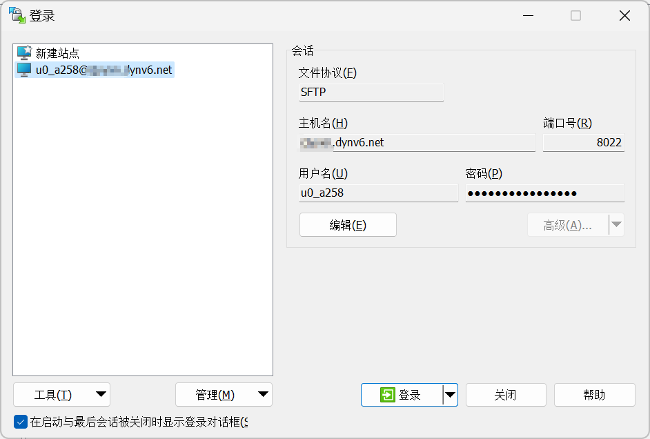

<!-- #! https://zhuanlan.zhihu.com/p/665711668
# 基于 Termux 和 ipv6 把手机打造成公网服务器


 -->

## Termux 安装与配置

### 安装

从这下载： <https://f-droid.org/en/packages/com.termux/>

### 初始化

**授权读写手机储存**

```bash
termux-setup-storage
```

**换源**

参考 <https://mirrors.tuna.tsinghua.edu.cn/help/termux/>

**安装基础软件**

```bash
pkg update && pkg upgrade
pkg install tsu wget git python3 openssh termux-auth -y
```

- tsu：Termux版的su(sudo)
- wget：下载工具
- git：版本控制器
- python3：不多说了
- openssh：用于 ssh 和 sftp
- termux-auth：Termux的一个认证模块，用于在Android设备上提供安全的身份验证机制
- -y：自动确认安装以上软件

**设置用户**

获取用户名，比如 `u0_a258`

```bash
whoami
```

设置密码

```bash
passwd
```

### 获取 ipv6 地址

首先确保连入的网络支持 ipv6。最简单的方法是访问 <http://www.test-ipv6.com/> 查看 ipv6 连接情况。

**方法1**

查看手机状态信息，然后 ping 一下试试能不能通

**方法2**

运行以下指令，获取 ipv6 地址

```bash
curl https://ipv6.ddnspod.com
```

> 注意：由于安卓权限问题，不能用 `ip a`、`ifconfig` 等命令直接获取 ipv6 地址。

### 开启 ssh

termux 输入

```bash
sshd -p 8022
```

电脑上输入以下命令以连接

```bash
ssh <用户名>@<ipv6 地址> -p 8022
```

## 登录 dynv6 获取域名

参考这篇文章

Termux解析公网ipv6——从全世界各地连接你的Termux, <https://blog.csdn.net/YiBYiH/article/details/127550607>

向 dnyv6 传递 ipv6 地址命令如下

```bash
curl 'http://dynv6.com/api/update?hostname=<域名>&token=<令牌>&ipv6='$(curl --silent https://ipv6.ddnspod.com)
```

之后可以直接用域名而不是 ipv6 地址访问服务器了

## 启动后自动完成配置

首先编辑 .bashrc 文件 `nano ~/.bashrc`

在文件最后添加以下代码

```bash
user_name=$(whoami)
echo "User name: $user_name"

ip_address=$(curl --silent https://ipv6.ddnspod.com)
echo "IP address: $ip_address"

hostname=xxxxx.dynv6.net
echo "hostname: $hostname"
token=xxxxxxxxxx

curl --silent "http://dynv6.com/api/update?hostname=$hostname&token=$token&ipv6=$ip_address"
echo ""

sshd -p 8022

echo "Please run the following command to establish an ssh connection with Termux:"
echo "ssh $user_name@$ip_address -p 8022"
echo "ssh $user_name@$hostname -p 8022"
```

按 `ctrl+x` 保存。

## sftp 服务器

在安装 openssh 后，也自动安装了 sftp 服务，因此可以直接在电脑上打开 sftp 客户端进行连接。

图中用的是 WinSCP 软件




## qemu 运行虚拟机

在 Termux 中使用 proot-distro 安装的 linux 系统，是以 chroot（更改根目录）的形式运行的，而不是作为一个独立的虚拟机或容器，因此功能非常受限。

想要使用真正的 linux 虚拟机，需要使用 qemu。

## 性能基准测试

<!-- ```bash
wget https://github.com/kdlucas/byte-unixbench/archive/v5.1.3.tar.gz
tar -zxvf v5.1.3.tar.gz
cd byte-unixbench-5.1.3/UnixBench
make
./Run
``` -->

采用如下 python 脚本进行跑分

```python
import time

def doubleFact(x):
    ans = 1
    for i in range(1, x + 1):
        if i % 2 == x % 2:
            ans *= i
    return ans

def asin(x, t):
    answer = 0
    for k in range(0, t + 1):
        a = (doubleFact(2 * k - 1) / doubleFact(2 * k)) * (
            pow(x, 2 * k + 1) / (2 * k + 1)
        )
        # print("k=%d,a=%s" % (k, a))
        answer += a

    return answer

start_time = time.time()
print(asin(1, 1666) * 2)
print("--- %s seconds ---" % (time.time() - start_time))
```

## 参考资料

- Termux-Ubuntu22.0.4项目部署（手机服务器实操！！）, <https://blog.csdn.net/m0_56349886/article/details/129758123>
- Termux 公网ipv6 域名 ssh访问, <https://blog.csdn.net/YiBYiH/article/details/127697310>
- 基于ipv6实现几乎零成本的内网穿透方案, <https://zhuanlan.zhihu.com/p/638004070>
- 在Termux（非root的安卓Linux模拟器）中安装和使用ftp服务器, <https://www.cnblogs.com/-fresh/p/10328331.html>
- Termux解析公网ipv6——从全世界各地连接你的Termux, <https://blog.csdn.net/YiBYiH/article/details/127550607>
- Termux和Linux Deploy的性能测试, <https://zhuanlan.zhihu.com/p/162121013>
