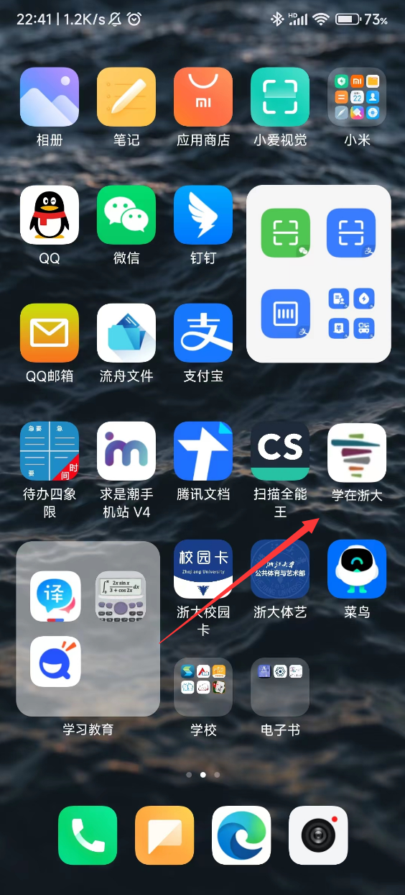
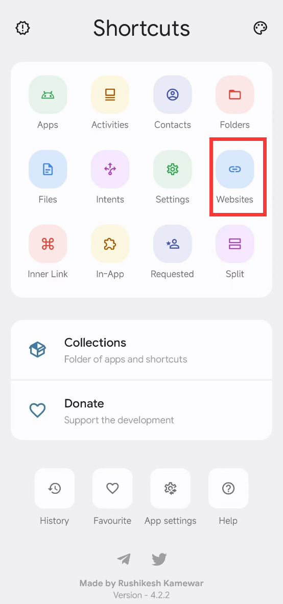
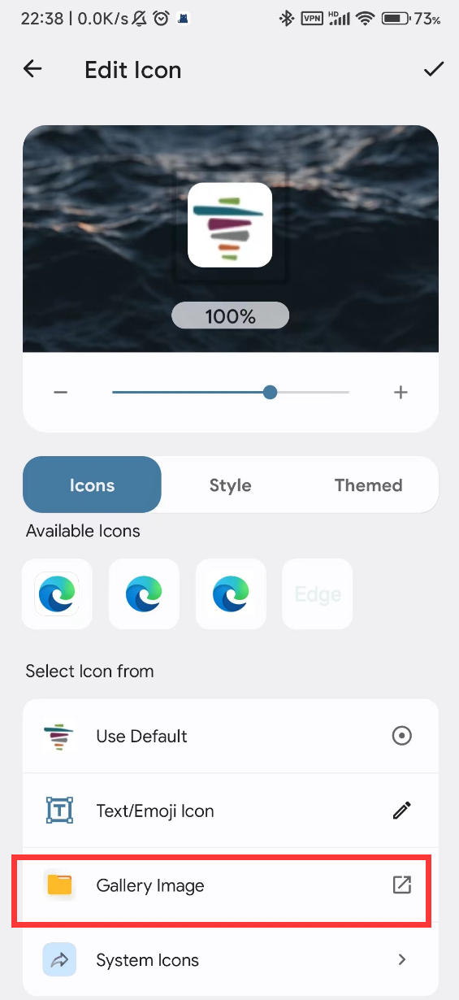
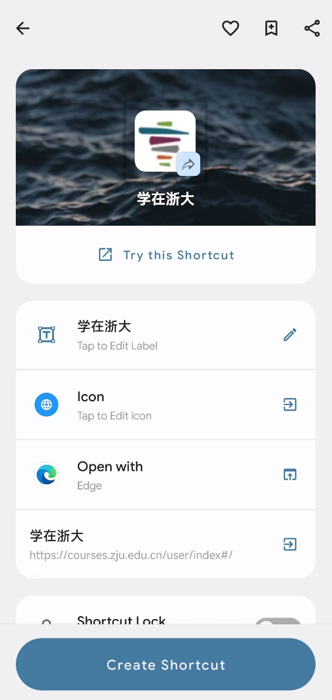
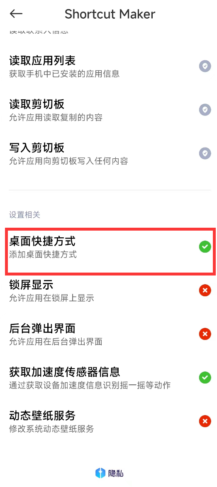

# 创建学在浙大手机桌面图标

## 效果

## 准备

下载 Shortcut Maker 应用。谷歌play商店可以下载，我这里也提供了安装包，

链接：https://pan.baidu.com/s/1eHr4fPczoHwSdsmeGErlNA?pwd=1234 

## 过程

打开 Shortcut Maker ，点击 website，设置链接为 https://courses.zju.edu.cn/user/index，再修改图标

我这里也提供了学在浙大的图标

最后修改为用 Edge打开，方便自动填充密码。当然要给好权限

