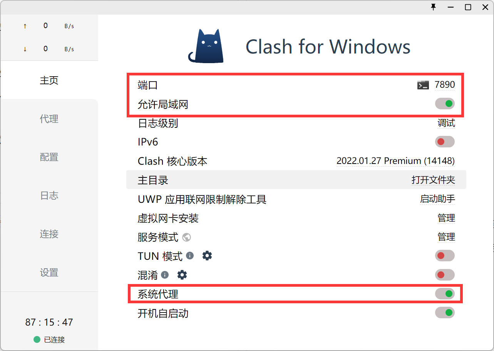

# 换源

https://mirrors.tuna.tsinghua.edu.cn/help/ubuntu/


22.04LTS 2023-1-28
```bash
sudo sed -i "s@http://.*archive.ubuntu.com@https://mirrors.tuna.tsinghua.edu.cn@g" /etc/apt/sources.list
sudo sed -i "s@http://.*security.ubuntu.com@https://mirrors.tuna.tsinghua.edu.cn@g" /etc/apt/sources.list
```

# vim

https://missing-semester-cn.github.io/2020/editors/

```vim FileName```
开始进入正常模式。

按`i`进入插入模式，跟正常编辑器一样使用。按`Esc`返回正常模式。

按`:`进入命令行模式。`:w`保存，`:q`退出，`:wq`保存然后退出。


# 终端设置代理



```bash
export all_proxy="socks5://192.168.0.106:7890"
```


## 权限设置

```
chmod -R +x <path>
```

## 删除

```bash
rm -rf <foldername>
```

## 查看系统资源

1. `top`：显示实时的系统资源使用情况，包括CPU、内存、进程等信息。按下`q`键可以退出。

2. `htop`：类似于`top`命令，但提供了更友好的用户界面和交互功能。可以通过包管理器安装`htop`。

3. `free`：显示系统内存的使用情况，包括总内存、已使用内存、空闲内存等。使用`free -h`可以以人类可读的方式显示内存大小。

4. `df`：显示磁盘空间的使用情况，包括每个挂载点的磁盘使用情况。使用`df -h`可以以人类可读的方式显示磁盘大小。

5. `du`：用于查看指定目录或文件的磁盘使用情况。使用`du -h`可以以人类可读的方式显示文件和目录的大小。

6. `vmstat`：显示系统的虚拟内存、进程、CPU使用情况等。使用`vmstat 1`可以每秒更新一次显示。

7. `sar`：系统活动报告工具，可以显示系统资源的历史数据，如CPU使用率、内存使用率、磁盘IO等。可以使用`sar -u`查看CPU使用情况，`sar -r`查看内存使用情况，`sar -d`查看磁盘IO情况。


