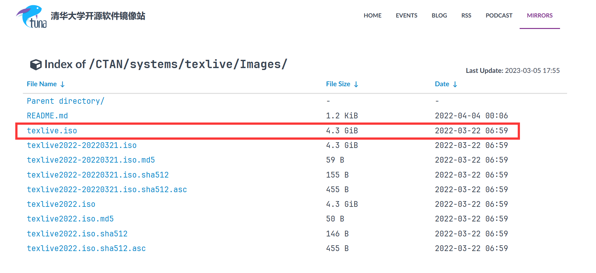
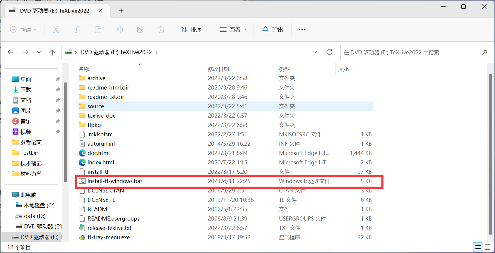
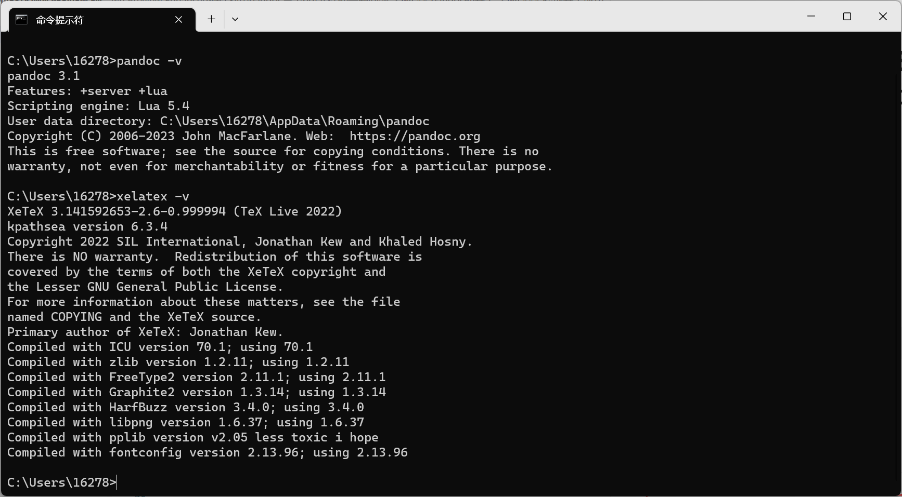

#! https://zhuanlan.zhihu.com/p/611580213
# VS Code 中 Markdown Preview Enhanced 插件利用 pandoc 导出 pdf 文件的一些问题

## pandoc的安装

[官网教程(点击访问)](https://pandoc.org/installing.html)

### windows系统

在windows系统中，直接在cmd运行
```bash
winget install pandoc
```

此外还要安装texlive，[下载地址(点击访问)](https://mirrors.tuna.tsinghua.edu.cn/CTAN/systems/texlive/Images/)





### linux系统

略

### 验证安装成功

下载完成后记得重启，更新环境变量。

```bash
pandoc -v
xelatex -v
```



## 导出中文pdf

在md文件开头加上

```yaml
---
output: 
    pdf_document: 
        latex_engine: xelatex
classoption: UTF8
CJKmainfont: Microsoft YaHei
CJKmonofont: FangSong
CJKoptions: ItalicFont=KaiTi
---
```

`latex_engine: xelatex`表明采用`xelatex`进行渲染，该引擎支持中文字符。`CJKxxx`命令表示设置中文字体。

## 不要使用 \bm

不要使用`\bm`，会报错`! Extended mathchar used as mathchar (14799973)`。

## 不要使用 \mathbf

渲染有问题

## 不要在同一行使用多个行内公式

会识别成一个行内公式，然后渲染有问题

总之，bug一堆


## 设置文档

附上我觉得比较合适的设置

```yaml
---
title: My Document
author: xxx
date: 2023-1-1

output: 
    pdf_document: 
        latex_engine: xelatex
        toc: true
        number_sections: true
        pandoc_args: []

classoption: UTF8
fontsize: 10pt
documentclass: article
geometry: margin=2cm
colorlinks: true

header-includes:
  - \usepackage{graphicx}
  - \setkeys{Gin}{width=0.8\textwidth}
  - \usepackage{amsmath}
  - \allowdisplaybreaks

mainfont: SimSun
sansfont: SimHei
monofont: Consolas
CJKmainfont: SimSun
CJKsansfont: SimHei
CJKmonofont: Consolas
CJKoptions: BoldFont
---
```