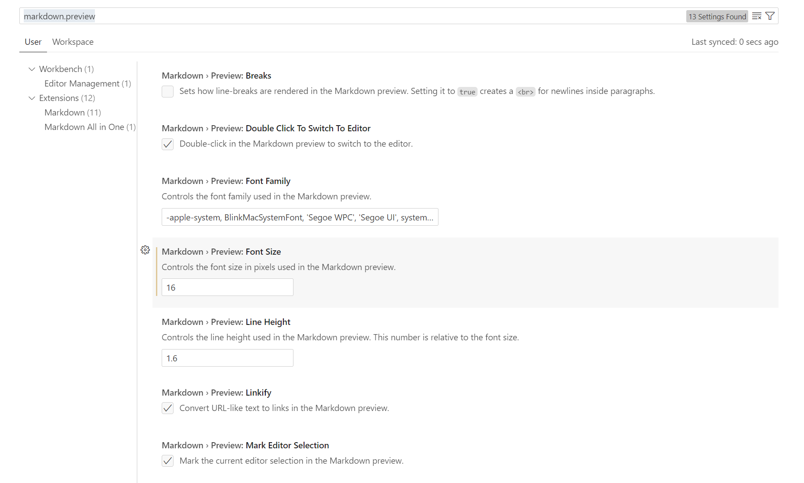
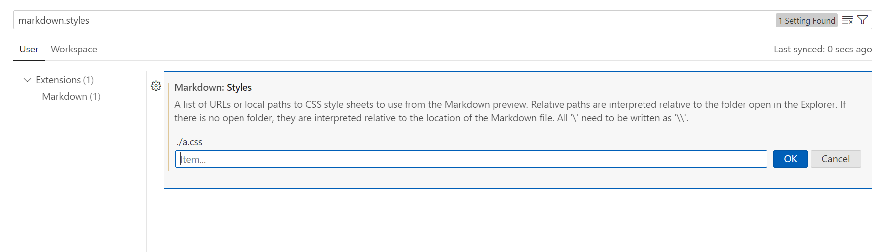
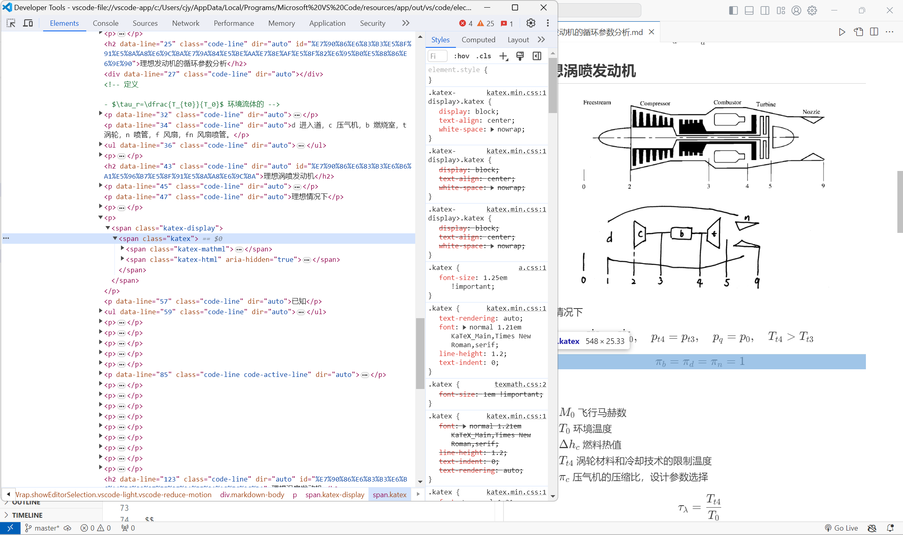
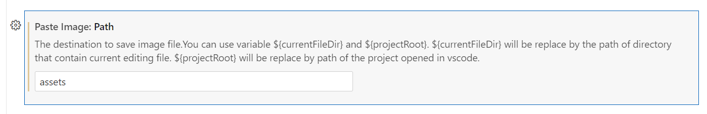
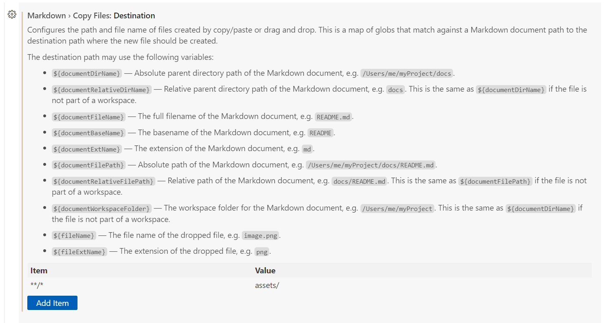

<!-- 在 VSCode 中编写 Markdown 的进阶指南

 -->

最新版的 Visual Studio Code 对 Markdown 的支持已显著提升，其在预览方面的体验甚至可以与 Markdown Preview Enhanced 插件相比。本文将介绍一些优化方法，帮助用户提升在 VSCode 中编写 Markdown 文档的体验。

官方使用说明：<https://code.visualstudio.com/docs/languages/markdown>

# 预览常规设置

打开 VSCode 的 `markdown.preview` 设置，可以看到一些设置选项，如字体、字号、行高等。



# 使用 CSS

VSCode中Markdown 预览实际上是一个网页，因此可以通过自定义 CSS 来优化其显示效果。



打开 `markdown.styles` 设置，可以添加 CSS 文件路径。支持两种文件路径：

1. 相对路径。相对路径是相对于资源管理器中打开的文件夹进行解释的。如果没有打开的文件夹，则相对于 Markdown 文件的位置解释它们。
2. CSS 文件的 HTTPS URL。

# 数学公式预览优化

打开 vscode 自带的开发者工具，可以看到所有数学公式都有 `class="katex"` 。



目前存在的问题是数学公式太小，于是可以在工作区本地创建 CSS 文件，内容为：

```css
.katex {
    font-size: 1.25em !important;
}
```

然后将该文件路径添加到 `markdown.styles` 设置中，即可优化公式显示效果。

我也创建了该 CSS 文件的 HTTPS URL：<https://blog-static.cnblogs.com/files/blogs/825243/vscode-markdown-style.css>。

# 图片大小调整

一种方案是使用 HTML 标签：

```html

```

另一种方案是通过 CSS 设置：

```css
img{
    width: 80%;
    padding-left: 10%;
}
```

这段代码将所有图片的宽度设置为段落宽度的 80%，并向右移动 10%，从而实现居中显示。基于此，可以进一步细化设置，如下所示：

```css
img[src*="#w100"] {
width: 100%;
}

img[src*="#w80"] {
width: 80%;
}

img[src*="#w60"] {
width: 60%;
}

img[src*="#w50"] {
width: 50%;
}

img[src*="#w30"] {
width: 30%;
}

img[src*="#w20"] {
width: 20%;
}

img[src*="#w10"] {
width: 10%;
}
```

此时，可以通过在 Markdown 中使用特定格式来调整图片大小：

```markdown

```

# 编辑器体验优化

为了优化在 VSCode 中编写 Markdown 的体验，在用户 `settings.json` 中使用如下配置：

```json
"[markdown]": {
    "editor.minimap.enabled": false, // 关闭编辑器右侧的小地图以减少视觉干扰
    "editor.glyphMargin": false, // 关闭字形边距以获得更简洁的编辑界面
    "editor.renderWhitespace": "all" // 显示所有空白字符，方便查看和编辑空格、制表符等
}
```

# 图片粘贴

VSCode 的 `Paste Image` 插件和内置的 copyFiles 功能可以简化图片粘贴操作。

`Paste Image` 插件设置如下。此时使用 `Ctrl+Shift+V` 可以把剪切板上的图片保存到工作区的 `assets` 文件夹中，并在 md 文件中插入图片路径。



VSCode 的 `markdown.copyFiles` 设置如下。



此时使用 `Ctrl+V` 快捷键也可以保存剪切板上的图片到工作区的 `assets` 文件中，并在 md 文件中插入路径。区别在于：

1. VSCode 内置的 copyFiles 功能还可以粘贴图片和音频文件。
2. `Paste Image` 插件保存的图片可以自动生成 `Y-MM-DD-HH-mm-ss` 的文件名，而 copyFiles 功能则不行。

因此建议这两种方法配合使用。

# 格式化

`markdownlint` 插件提供了格式化 Markdown 代码功能，并会对不规范的 markdown 代码进行警告。建议在用户 `settings.json` 中使用如下配置

```json
"[markdown]": {
    "editor.defaultFormatter": "DavidAnson.vscode-markdownlint",
    "editor.formatOnSave": true,
},
"markdownlint.config": {
    "MD012": false,
    "MD018": false,
    "MD024": false,
    "MD025": false,
    "MD033": false,
    "MD036": false,
    "MD041": false,
    "MD045": false,
},
```

`Pangu-Markdown` 插件补充了格式化功能，如在中英字符之间插入空格。使用方法为右键点击 Pangu Format。

# 代码补全与快捷功能

`Markdown All in One` 插件可以补全 markdown 代码，包括 LaTeX  函数代码。同时也提供了一些编辑 Markdown 的快捷功能。

`Better Markdown & Latex Shortcuts` 插件提供了一些编辑 LaTeX  公式的快捷键。

# 功能拓展

`Markdown Footnotes` 插件让 VSCode 的 markdown 预览支持脚注功能，例如：

```markdown
这是一个脚注 [^1]

[^1]: 脚注 1
```

`Markdown Image Size` 插件提供了调整图片大小的拓展语法。但是该语法应用并不普遍，因此不推荐使用。

# 导出 PDF 和 Word 文档

[`Markdown Preview Enhanced` 插件](https://shd101wyy.github.io/markdown-preview-enhanced/#/zh-cn/)支持导出为 PDF 和 Word 文档。其利用 Chrome (Puppeteer) 导出 PDF 文件使用说明为 <https://www.cnblogs.com/cjyyx/p/18272365>。

`Markdown Preview Enhanced` 插件导出的 PDF 显示效果并不好，因此我更推荐使用 Typora 软件导出。

# 博客写作

`博客园 cnblogs 客户端` 和 `Zhihu On VSCode` 插件都提供了比较好的博客写作体验。

[`Markdown Publisher For CSDN/JIANSHU/ZHIHU/JUEJIN/WECH` 插件](https://blog.csdn.net/qq_21197033/article/details/132297182)支持 Markdown 文档多平台一键发布，但目前使用体验较差。
