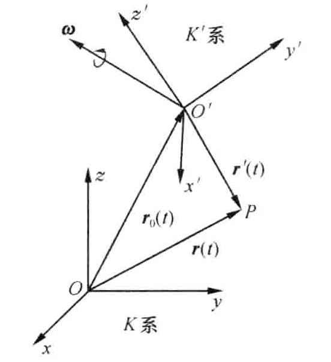

## 滚动摩阻

$$
M_{\max }=\delta F_{\mathrm{N}}
$$

## 二维运动合成

- 动点相对于定参考系的运动，称为**绝对运动**
- 动点相对于动参考系的运动，称为**相对运动**
- 动参考系相对于定参考系的运动，称为**牵连运动**

在动参考系上与动点相重合的那一点(牵连点)的速度和加速度称为动点的牵连速度和牵连加速度。

**点的速度合成定理**：动点在某瞬时的绝对速度等于它在该瞬时的牵连速度与相对速度的矢量和

$$
\boldsymbol{v}_{\mathrm{a}}=\boldsymbol{v}_{\mathrm{e}}+\boldsymbol{v}_{\mathrm{r}}
$$

牵连运动为平移时点的加速度合成定理：当牵连运动为平移时，动点在某瞬时的绝对加速度等于该瞬时它的牵连加速度与相对加速度的矢量和。

**点的加速度合成定理**：当动系作定轴转动时，动点在某瞬时的绝对加速度等于该瞬时它的牵连加速度、相对加速度与科氏加速度的矢量和。

$$
\boldsymbol{a}_{\mathrm{a}}=\boldsymbol{a}_{\mathrm{e}}+\boldsymbol{a}_{\mathrm{r}}+\boldsymbol{a}_{\mathrm{C}}
$$

$$
\boldsymbol{a}_{\mathrm{C}}=2 \boldsymbol{\omega} \times \boldsymbol{v}_{\mathrm{r}}
$$

## 二维运动合成2

通常，把相对观察者静止的参考系称为**定参考系**或静参考系，把相对观察者运动的参考系称为**动参考系**；把物体相对于动参考系的运动称为**相对运动**(相应的有相对速度和相对加速度)，物体相对静参考系的运动称为**绝对运动**(相应的有绝对速度和绝对加速度)动参考系  $K^{\prime}$  相对静参考系  $K$  的运动称为**牵连运动**(相应的有牵连速度和牵连加速度)。

考虑动参考系  $K^{\prime}$  相对于静参考系  $K$  做平动，还绕着通过其原点  $O^{\prime}$  的某根转轴转动，角速度矢量为  $\boldsymbol{\omega}$ 。随着时间  $t$  的变化， $\boldsymbol{\omega}$  的大小和方向都可能发生改变，但转轴始终通过原点  $O^{\prime}$ 。

在时刻  $t$ ，一质点位于空间的  $P$  点，它相对于  $K$  系的位矢为  $\boldsymbol{r}(t)$ ，相对于  $K^{\prime}$  系的位矢为  $\boldsymbol{r}^{\prime}(t)$ ，而  $K^{\prime}$  系的原点相对于  $K$  系的位矢为  $\boldsymbol{r}_{0}(t)$ ，则有

$$
\boldsymbol{r}(t)=\boldsymbol{r}_{0}(t)+\boldsymbol{r}^{\prime}(t)
$$

设  $P$  点相对于  $K$  系的速度为  $\boldsymbol{v}(t)$ ，加速度为  $\boldsymbol{a}(t)$ ，我们称其为**绝对速度**和**绝对加速度**；相对于  $K^{\prime}$ 系的速度为  $\boldsymbol{v}^{\prime}(t)$ ，加速度为  $\boldsymbol{a}^{\prime}(t)$ ，称其为**相对速度**和**相对加速度**；而  $K^{\prime}$  系的原点  $O^{\prime}$  相对于  $K$  系的速度为  $\boldsymbol{v}_{0}(t)$ ，加速度为  $\boldsymbol{a}_{0}(t)$ ，称其为**牵连速度**和**牵连加速度**。

在静参考系  $K$  中对时间的微商称为**绝对微商**，用  $\dfrac{\mathrm{D}}{\mathrm{D} t}$  表示；在动参考系  $K^{\prime}$  中对时间的微商称为**相对微商**，用  $\dfrac{\mathrm{d}}{\mathrm{d} t}$  表示。它们之间的差别表现在对坐标系的坐标基矢作用不同。

$K$  系

$$
\boldsymbol{v}=\frac{\mathrm{D} \boldsymbol{r}}{\mathrm{D} t}, \quad \boldsymbol{a}=\frac{\mathrm{D} \boldsymbol{v}}{\mathrm{D} t}
$$

$K^{\prime}$  系

$$
\boldsymbol{v}^{\prime}=\frac{\mathrm{d} \boldsymbol{r}^{\prime}}{\mathrm{d} t}, \quad \boldsymbol{a}^{\prime}=\frac{\mathrm{d} \boldsymbol{v}^{\prime}}{\mathrm{d} t}
$$

对  $K^{\prime}$  系中任意随时间变化的矢量  $\boldsymbol{b}^{\prime}$

$$
\frac{\mathrm{D} \boldsymbol{b}^{\prime}}{\mathrm{D} t}=\frac{\mathrm{d} \boldsymbol{b}^{\prime}}{\mathrm{d} t}+\boldsymbol{\omega} \times \boldsymbol{b}^{\prime}
$$

## 刚体

作平面运动的刚体的动能，等于随质心平移的动能与绕质心转动的动能的和