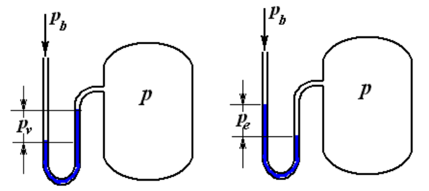
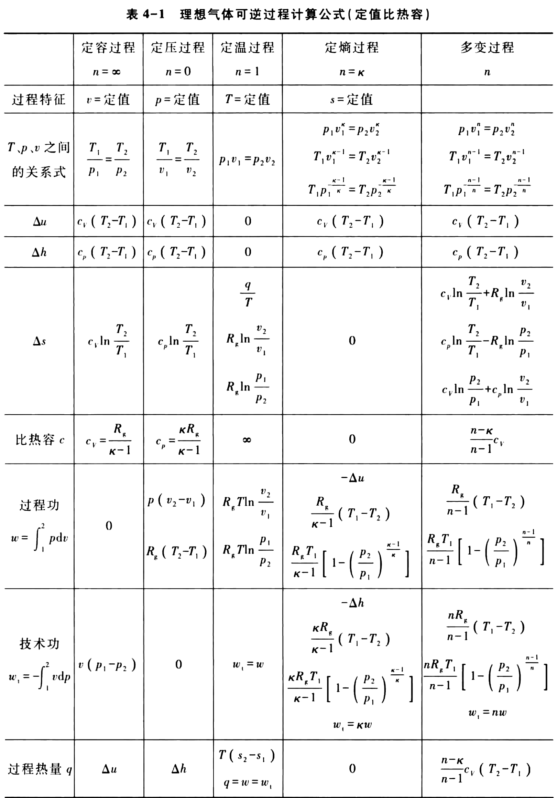
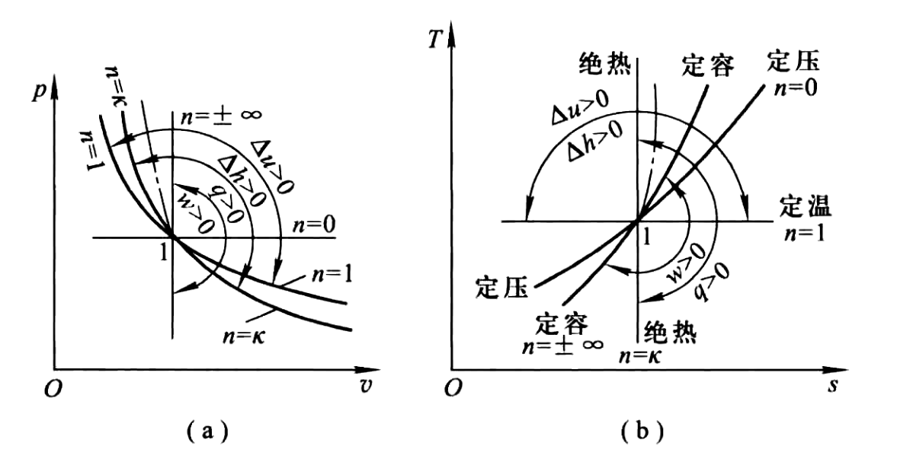
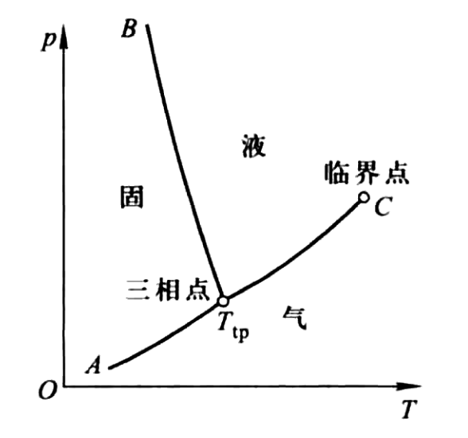
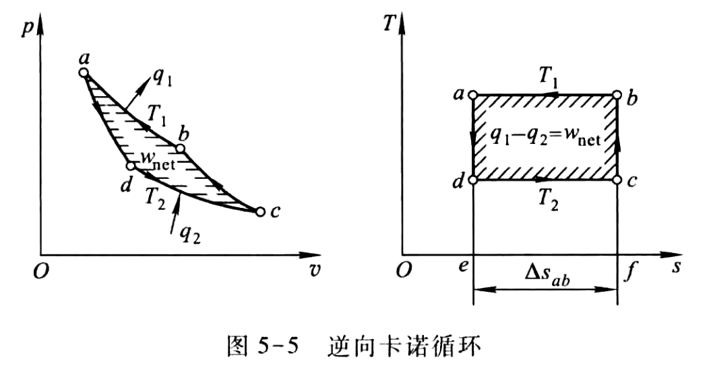

#! https://zhuanlan.zhihu.com/p/638534525
# 工程热力学总结

## 热力学系统

热力学状态：某一瞬间系统所呈现的宏观物理状况
状态参数：描述物系所处平衡状态的宏观物理量

状态参数是宏观量，是大量粒子的统计平均效应，只有平衡态才有状态参数。状态参数是热力系统状态的单值函数，物理上与过程无关，数学上其微量是全微分。状态参数分类有：强度量 (与系统质量多少无关的参数), 广延量(与系统质量成正比的参数, 有可加性)。广延量的比性质具有强度量特性。

可逆过程：系统可经原路径恢复至原来状态而在外界不留下任何变化的过程。

不可逆过程的因素

- 耗散效应：摩擦、电阻
- 非准平衡过程：温差传热、自由膨胀、混合

自然过程中凡是能够独立、无条件地自动进行的过程, 称为自发过程。不能独立地自动进行而需要外界帮助作为补充条件的过程, 称为非自发过程。自发过程的反向过程是非自发过程。不可逆是自发过程的重要特征和属性。

## 状态参数

- $T$：温度
- $p$：压力
- $v = V/m$：比体积
- $u = U/m$：比热力学能
- $e=u+\frac{1}{2} c_{\mathrm{f}}^{2}+g z$：比总能
- $h = u + pv$：比焓，随着工质的移动而转移的能量等于焓
- $s$：比熵，其定义为  $\mathrm{d} s=\dfrac{\delta q_{\mathrm{rev}}}{T}$，$\delta q_{\mathrm{rev}}$  为  $1 \mathrm{~kg}$  工质在微元可逆过程中与热源交换的热量

### 压力

绝对压力, 也称真实压力  $p$

真空度  $p_{\mathrm{v}}$

表压力  $p_{\mathrm{e}}$

当地大气压  $p_{\mathrm{b}}$

$$
p=p_{\mathrm{b}}-p_{\mathrm{v}} \left(p<p_{\mathrm{b}}\right)
$$

$$
p=p_{\mathrm{b}}+p_{\mathrm{e}} \left(p>p_{\mathrm{b}}\right)
$$

### 熵

选择基准状态  $p_{0}=101325 \mathrm{~Pa}$ 、 $T_{0}=0 \mathrm{~K}$ , 规定这时  $s_{0 \mathrm{~K}}^{0}=0$  (上标 “ $0$ ” 表示压力为 $1$ 标准大气压), 任意状态  ($T$, $p$)  时  $s$  值为

$$
s=s_{0 \mathrm{~K}}^{0}+\int_{T_{0}}^{T} c_{p} \frac{\mathrm{d} T}{T}-R_{\mathrm{g}} \ln \frac{p}{p_{0}}=\int_{T_{0}}^{T} c_{p} \frac{\mathrm{d} T}{T}-R_{\mathrm{g}} \ln \frac{p}{p_{0}}
$$

选定基准状态  $\left(T_{0} 、 p_{0}\right)$  后, 状态  $\left(T 、 p_{0}\right)$  的值  $s^{0}$  为

$$
s^{0}=\int_{T_{0}}^{T} c_{p} \frac{\mathrm{d} T}{T}-R_{\mathrm{g}} \ln \frac{p_{0}}{p_{0}}=\int_{T_{0}}^{T} c_{p} \frac{\mathrm{d} T}{T}
$$

$s^{0}$  数值仅取决于温度  $T$ , 可依温度排列制表

$$
\Delta s_{1-2}=s_{2}^{0}-s_{1}^{0}-R_{\mathrm{g}} \ln \frac{p_{2}}{p_{1}}
$$

## 过程量

### 体积变化功

$$
\delta W=p \mathrm{~d} V
$$

$$
\delta w=p \mathrm{~d} v
$$

### 过程热量

可逆过程中

$$
\delta q=T \mathrm{~d} s
$$

可逆过程的热力学第一定律

$$
\delta q=\mathrm{d} u+p \mathrm{~d} v, \quad \delta q=\mathrm{d} h-v \mathrm{~d} p
$$

### 比热容

$$
c=\frac{\delta q}{\mathrm{~d} T} 
$$

比定压热容和比定容热容，分别以  $c_{p}$  和  $c_{V}$  表示。

定容时  $(\mathrm{d} v=0)$ 

$$
c_{V}=\left(\frac{\partial u}{\partial T}\right)_{v}
$$

定压时  $(\mathrm{d} p=0)$ 

$$
c_{p}=\left(\frac{\partial h}{\partial T}\right)_{p}
$$

## 理想气体

### 状态方程

$$
p v=R_{\mathrm{g}} T
$$

$$
R_{\mathrm{g}}=\frac{R}{M}=\frac{8.3145 \mathrm{~J} /(\mathrm{mol} \cdot \mathrm{K})}{M}
$$

### 比热容

迈耶公式

$$
c_{p}-c_{V}=R_{\mathrm{g}}
$$

比值  $c_{p} / c_{V}$  称为比热容比, 以  $\gamma$  表示。

$$
c_{p}=\frac{\gamma}{\gamma-1} R_{\mathrm{g}}, \quad c_{V}=\frac{1}{\gamma-1} R_{\mathrm{g}}
$$

可以看作是定值，此时有

$$
\gamma=\frac{i+2}{i}
$$

- $i$：分子运动的自由度

### 热力学能、焓、熵

由分子运动理论可导出，$1 \mathrm{~mol}$  理想气体的热力学能 $U_{\mathrm{m}}=\dfrac{i}{2} R T$，实际上，理想气体的热力学能是温度的复杂函数。

理想气体的热力学能、焓仅由温度决定。

$$
\mathrm{d} u=c_{V} \mathrm{~d} T
$$

$$
\mathrm{d} h=c_{p} \mathrm{~d} T
$$

$$
\mathrm{d} s=\frac{\mathrm{~d} h-v \mathrm{~d} p}{T}=c_{p} \frac{\mathrm{d} T}{T}-R_{\mathrm{g}} \frac{\mathrm{d} p}{p}
$$

$$
\mathrm{d} s=\frac{\mathrm{d} u+p \mathrm{~d} v}{T}=c_{V} \frac{\mathrm{d} T}{T}+R_{\mathrm{g}} \frac{\mathrm{d} v}{v}
$$

### 可逆过程

$\kappa$  称为绝热指数。理想气体绝热指数等于比热容比, 即  $\gamma=\kappa$  。

$$
\frac{\partial p}{\partial v}=-n \frac{p}{v}
$$

$$
\frac{\partial T}{\partial s}=\frac{T}{c_{n}}
$$

<!--  -->

## 蒸气

- 饱和状态：当汽化速度等于液化速度时，系统处于动态平衡，宏观上气、液两相保持一定的相对数量。此时饱和温度  $t_{\mathrm{s}}$  , 饱和压力  $p_{\mathrm{s}}$ ，一一对应 
- 未饱和液：温度低于所处压力下饱和温度的液体，  $t<t_{\mathrm{s}}$
- 饱和液：处于饱和状态的液体:  $t=t_{\mathrm{s}}$
- 湿饱和蒸汽：饱和液和饱和蒸汽的混合物，  $t=t_{\mathrm{s}}$
- 干饱和蒸汽：处于饱和状态的蒸汽，  $t=t_{\mathrm{s}}$
- 过热蒸汽：温度高于饱和温度的蒸汽，  $t>t_{s}, t-t_{\mathrm{s}}=d$  称过热度
- 干度：湿蒸汽中干饱和蒸汽的质量分数，用  $w$  或  $x$  表示
- 湿度：$y=1-x$

$$
x\left\{\begin{array}{ll}
0 & \text { 饱和液 } \\
\downarrow & \text { 湿饱和蒸汽 } \\
1 & \text { 干饱和蒸汽 }
\end{array}\right.
$$

- 饱和液：$v^{\prime}, h^{\prime}, s^{\prime}, u^{\prime}$
- 干饱和蒸汽：$v^{\prime \prime}, h^{\prime \prime}, s^{\prime \prime}, u^{\prime \prime}$

对于湿饱和蒸汽

$$
v_{x}=x v^{\prime \prime}+(1-x) v^{\prime}=v^{\prime}+x\left(v^{\prime \prime}-v^{\prime}\right)
$$

$$
h_{x}=x h^{\prime \prime}+(1-x) h^{\prime}=h^{\prime}+x \gamma
$$

$$
s_{x}=x s^{\prime \prime}+(1-x) s^{\prime}=s^{\prime}+x\left(s^{\prime \prime}-s^{\prime}\right)=s^{\prime}+x \frac{\gamma}{T_{\mathrm{s}}}
$$

$$
u_{x}=h_{x}-p_{\mathrm{s}} v_{x}
$$

- $\gamma = h^{\prime \prime}-h^{\prime}$：汽化潜热
- $T_{\mathrm{s}}, p_{\mathrm{s}}$：饱和温度, 饱和压力

## 热力学第一定律

### 闭口系能量方程式

忽略宏观动能和位能

$$
\delta Q=\mathrm{d} U+\delta W
$$

$$
\delta q=\mathrm{d} u+\delta w
$$

系统吸热  $Q$  为正, 对外作功  $W$  为正

闭口系完成一个循环后, 它在循环中与外界交换的净热量等于与外界交换 的净功量，即

$$
Q_{\text {net }} =W_{\text {net }}
$$

$$
q_{\text {net }} =w_{\text {net }}
$$

### 开口系统能量方程式

开口系统 CV

- 在  $\mathrm{d} \tau$  时间内进行一个微元过程
- 流入质量为  $\delta m_{1}$  (体积为  $\mathrm{d} V_{1}$)  的微元工质
- 流出质量为  $\delta m_{2}$  (体积为  $\mathrm{d} V_{2}$)  的微元工质
- 系统从外界接受热量  $\delta Q$ , 对机器设备作功  $\delta W_{\mathrm{i}}$ (内部功)
- 完成该微元过程后系统内工质质量增加了  $\mathrm{d} m$ , 系统的总能量增加了  $\mathrm{d} E_{\mathrm{CV}}$  。

考察该微过程中的能量平衡，应有

$$
\delta Q=\mathrm{d} E_{\mathrm{CV}}+\left(h_{2}+\frac{c_{\mathrm{f}, 2}^{2}}{2}+g z_{2}\right) \delta m_{2}-\left(h_{1}+\frac{c_{\mathrm{f}, 1}^{2}}{2}+g z_{1}\right) \delta m_{1}+\delta W_{\mathrm{i}}
$$

上式两边均除以  $\mathrm{d} \tau$  即得单位时间内系统能量关系

$$
\Phi=\frac{\mathrm{d} E_{\mathrm{CV}}}{\mathrm{d} \tau}+\left(h_{2}+\frac{c_{\mathrm{f}, 2}^{2}}{2}+g z_{2}\right) q_{m2}-\left(h_{1}+\frac{c_{\mathrm{f}, 1}^{2}}{2}+g z_{1}\right) q_{m1}+P_{\mathrm{i}}
$$

- $\Phi=\dfrac{\delta Q}{\mathrm{~d} \tau}$：单位时间内的热流量
- $q_{m1}=\dfrac{\delta m_{1}}{\mathrm{~d} \tau}, q_{m2}=\dfrac{\delta m_{2}}{\mathrm{~d} \tau}$：质量流量
- $P_{\mathrm{i}}=\dfrac{\delta W_{\mathrm{i}}}{\mathrm{d} \tau}$：内部功率

**稳定流动能量方程**

$$
\delta Q=\mathrm{d} H+\frac{1}{2} m \mathrm{~d} c_{\mathrm{f}}^{2}+m g \mathrm{~d} z+\delta W_{\mathrm{i}}
$$

$$
\delta q=\mathrm{d} h+\frac{1}{2} \mathrm{~d} c_{\mathrm{f}}^{2}+g \mathrm{~d} z+\delta w_{\mathrm{i}}
$$

改写为

$$
q-\Delta u=w_{\mathrm{i}}+\left(p_{2} v_{2}-p_{1} v_{1}\right)+\frac{1}{2}\left(c_{\mathrm{f} 2}^{2}-c_{\mathrm{f} 1}^{2}\right)+g\left(z_{2}-z_{1}\right)
$$

- 热能转变成功部分：$q-\Delta u$
- 内部功：$w_{\mathrm{i}}$
- 流动功：$\left(p_{2} v_{2}-p_{1} v_{1}\right)$
- 机械能增量：$\dfrac{1}{2}\left(c_{\mathrm{f} 2}^{2}-c_{\mathrm{f} 1}^{2}\right)+g\left(z_{2}-z_{1}\right)$
- 技术功 $w_{\mathrm{t}}=w_{\mathrm{i}}+\dfrac{1}{2}\left(c_{\mathrm{f} 2}^{2}-c_{\mathrm{f} 1}^{2}\right)+g\left(z_{2}-z_{1}\right)$

$$
q=\Delta h+w_{\mathrm{t}}
$$

## 热力学第二定律

### 卡诺定理与卡诺循环

定理一：在相同温度的高温热源和相同温度的低温热源之间工作的一切可
逆循环,  其热效率都相等,  与可逆循环的种类无关，与采用哪一种工质也无关。

定理二：在温度同为  $T_{1}$  的热源和同为  $T_{2}$  的冷源间工作的一切不可逆循环,  其热效率必小于可逆循环。

卡诺循环的热效率

$$
\eta_{\mathrm{c}}=\frac{w_{\mathrm {net }}}{q_{1}}=1-\frac{T_{2}}{T_{1}}
$$

逆向卡诺制冷循环的制冷系数为

$$
\varepsilon_{\mathrm{c}}=\frac{q_{2}}{w_{\mathrm {net }}}=\frac{T_{2}}{T_{1}-T_{2}}
$$

逆向卡诺热泉循环的供暖系数为

$$
\varepsilon_{c}^{\prime}=\frac{q_{1}}{w_{\mathrm {net }}}=\frac{T_{1}}{T_{1}-T_{2}}
$$

- $w_{\mathrm {net}}$：循环净功
- $q_{1}, q_{2}$：分别与高温热源和低温热源的热交换量

### 熵方程

**闭口系(控制质量)熵方程**

闭口系统的熵变可归结为换热和过程不可逆

$$
\mathrm{d} S=\frac{\delta Q}{T_{\mathrm{r}}}+\delta S_{\mathrm{g}}=\delta S_{\mathrm{f}}+\delta S_{\mathrm{g}}
$$

- $\delta S_{\mathrm{f}}=\dfrac{\delta Q}{T_{\mathrm{r}}}$：热熵流 (简称熵流), 表明系统与外界换热 (无论可逆与否) 引起的系统熵变, 系统吸热为正, 系统放热为负, 过程绝热为零
- $\delta S_{\mathrm{g}}$：熵产, 是不可逆因素造成的系统熵增加, 熵产只可能是正值, 极限情况 (可逆过程) 为零
- $T_{\mathrm{r}}$：热源温度

**开口系(控制体积)熵方程**

$$
\mathrm{d} S_{\mathrm{CV}}=\sum_{i} s_{i} \delta m_{i}-\sum_{j} s_{j} \delta m_{j}+\sum_{l} \frac{\delta Q_{l}}{T_{\mathrm{r}, l}}+\delta S_{\mathrm{g}}
$$

### 㶲

热力学中定义: 在环境条件下, 能量中可转化为有用功的最高份额称为该能量的㶲。或者,热力系只与环境相互作用, 从任意状态可逆地变化到与环境相平衡的状态时, 作出的最大有用功称为该热力系的拥。

在温度为  $T_{0}$  的环境条件下, 系统  $\left(T>T_{0}\right)$  所提供的热量中可转化为有用功的最大值是热量㶲, 用  $E_{\mathrm{x}, Q}$  表示。

$$
E_{\mathrm{x}, Q}=\left(1-\frac{T_{0}}{T}\right) Q=Q-T_{0} \Delta \mathrm{S}
$$

工程上把与温度低于环境温度  $T_{0}$  的物体  $\left(T<T_{0}\right)$  交换的热量叫做冷量, 温度低于环境温度的系统, 吸入热量  $Q_{c}$  (即冷量) 时作出的最大有用功称为冷量㶲, 用  $E_{\mathrm{x}, Q_{\mathrm{c}}}$  表示。

$$
E_{\mathrm{x}, Q_{\mathrm{c}}}=\left(\frac{T_{0}}{T}-1\right) Q_{\mathrm{c}}=T_{0} \Delta S-Q_{\mathrm{c}}
$$

最大有用功 (热力学能㶲)，是状态参数

$$
w_{\mathrm{u}, \max }=u-u_{0}-T_{0}\left(s-s_{0}\right)+p_{0}\left(v-v_{0}\right)
$$

系统的㶲损失

$$
I = T_{0} S_{\mathrm{g}}
$$

## 气体与蒸汽的流动

### 稳定流动的基本方程式

**连续性方程**

$$
q_{m 1}=q_{m 2}=q_{m}=\frac{A_{1} c_{\mathrm{f} 1}}{v_{1}}=\frac{A_{2} c_{\mathrm{f} 2}}{v_{2}}=\frac{A c_{\mathrm{f}}}{v}
$$

**稳定流动能量方程**

$$
h_{1}+\frac{c_{\mathrm{f}1}^{2}}{2}=h_{2}+\frac{c_{\mathrm{f} 2}^{2}}{2}=h+\frac{c_{\mathrm{f}}^{2}}{2}
$$

**可逆绝热过程方程**

$$
p_{1} v_{1}^{\kappa}=p_{2} v_{2}^{\kappa}=p v^{\kappa}
$$

结合理想气体状态方程，有

$$
pT^{-\frac{\kappa}{\kappa-1}} = \text{Const}
$$

**声速方程**

声波传播近似看做定熵过程

$$
c=\sqrt{(\partial p / \partial \rho)_{\mathrm{s}}}=\sqrt{-v^{2}(\partial p / \partial v)_{\mathrm{s}}}=\sqrt{\kappa p v}
$$

对于理想气体

$$
c=\sqrt{\kappa R_{\mathrm{g}} T}
$$

马赫数定义

$$
{M\!a}=\frac{c_{\mathrm{f}}}{c}
$$

### 滞止参数

气体在绝热流动过程中,  因受到某种物体的阻碍,  而流速降低为零的过程称为绝热滞止过程。

滞止参数用下标 $0$ 表示。

$$
h_{0}=h+\frac{c_{\mathrm{f}}^{2}}{2}
$$

对于理想气体，有

$$
c_{p} T_{0}=c_{p} T+\frac{c_{\mathrm{f}}^{2}}{2}
$$

$$
p_{0}=p\left(\dfrac{T_{0}}{T}\right)^{\frac{\kappa}{\kappa-1}}
$$

### 促使流速改变的条件

力学条件

$$
c_{\mathrm{f}} \mathrm{d} c_{\mathrm{f}}=-v \mathrm{~d} p
$$

$$
\frac{\mathrm{d} p}{p}=-\kappa {M\!a}^{2} \frac{\mathrm{d} c_{\mathrm{f}}}{c_{\mathrm{f}}}
$$

如要使气流的速度增加, 必须使气流有机会在适当条件下膨胀以减低其压力。反之, 如要获得高压气流, 则必须使高速气流在适当条件下降低其流速。

几何条件

$$
\frac{\mathrm{d} v}{v}={M\!a}^{2} \frac{\mathrm{d} c_{\mathrm{f}}}{c_{\mathrm{f}}}
$$

$$
\frac{\mathrm{d} A}{A}=\left({M\!a}^{2}-1\right) \frac{\mathrm{d} c_{\mathrm{f}}}{c_{\mathrm{f}}}
$$

### 临界参数

截面上  ${M\!a}=1$ 、 $c_{\mathrm{f}}=c$ , 称临界截面。用下标 cr 表示。

临界压力比

$$
\nu_{\mathrm{cr}}=\frac{p_{\mathrm{cr}}}{p_{0}}=\left(\frac{2}{\kappa+1}\right)^{\frac{\kappa}{\kappa-1}}
$$

对于空气 $\nu_{\mathrm{cr}}=0.528$

### 喷管计算

$$
c_{\mathrm{f}}=\sqrt{2\left(h_{0}-h\right)}=\sqrt{2\left(h_{1}-h\right)+c_{\mathrm{f} 1}^{2}}
$$

$$
c_{\mathrm{f}}=\sqrt{2 \frac{\kappa p_{0} v_{0}}{\kappa-1}\left[1-\left(\frac{p}{p_{0}}\right)\right]^{\frac{\kappa-1}{\kappa}}}
$$

背压  $p_{\mathrm{b}}$：喷管出口截面外工作环境的压力。对于渐缩喷管，喷管出口压力  $p_{2}=\max \left\{ p_{\mathrm{b}}, p_{\mathrm{cr}} \right\}$。

设计喷管时，应使  $p_{2}=p_{\mathrm{b}}$。

### 有摩擦的绝热流动

喷管速度系数

$$
\varphi=\frac{c_{\mathrm{f} 2}}{c_{\mathrm{f} 2_{\mathrm{s}}}}
$$

- $c_{\mathrm{f} 2}$：气流在喷管出口截面上实际流速
- $c_{\mathrm{f} 2_{\mathrm{s}}}$：理想可逆流动时的流速

能量损失系数

$$
\zeta=\frac{c_{\mathrm{f} 2_{s}}^{2}-c_{\mathrm{f} 2}^{2}}{c_{\mathrm{f} 2_{s}}^{2}} = 1-\varphi^{2}
$$

喷管效率

$$
\eta_{N}=\frac{c_{\mathrm{f} 2}^{2}}{c_{\mathrm{f} 2_{s}}^{2}}=\varphi^{2}
$$

### 绝热节流

由于局部阻力，使流体压力降低的现象。

1)  $p_{2}<p_{1}$

2) 强烈不可逆,  $s_{2}>s_{1}$, $I=T_{0} s_{\mathrm{g}}$

3)  $h_{1}=h_{2}$  ， 但节流并非等焓过程

4)  $T_{2}$  可能大于等于或小于  $T_{1}$ , 理想气体  $T_{2}=T_{1}$