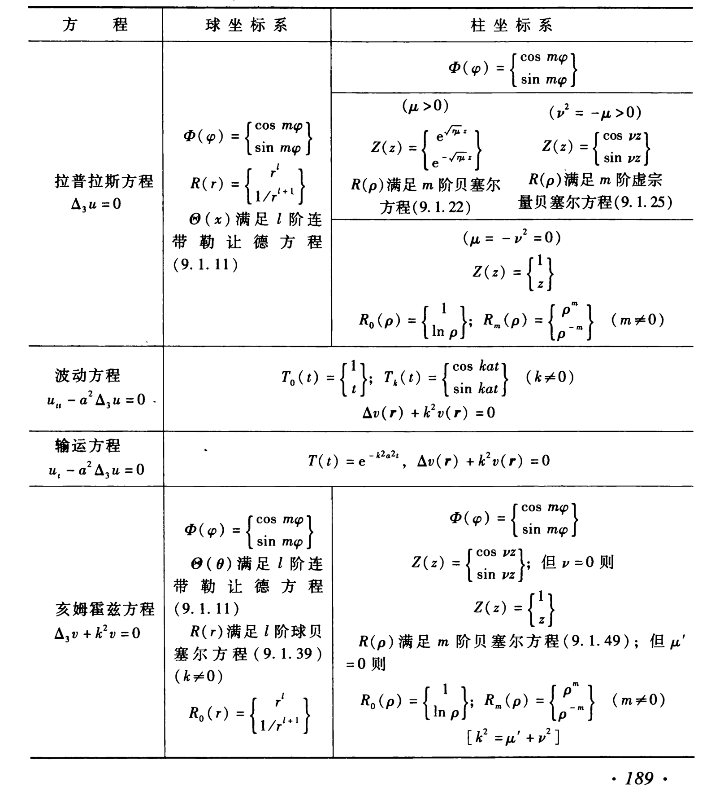

# 复杂坐标分离变数与特殊函数

## 拉普拉斯方程

$$
\Delta u=0
$$

### 球坐标

球坐标系下
$$
\frac{1}{r^{2}} \frac{\partial}{\partial r}\left(r^{2} \frac{\partial u}{\partial r}\right)+\frac{1}{r^{2} \sin \theta} \frac{\partial}{\partial \theta}\left(\sin \theta \frac{\partial u}{\partial \theta}\right)+\frac{1}{r^{2} \sin ^{2} \theta} \frac{\partial^{2} u}{\partial \varphi^{2}}=0
$$

分离变数
$$
u(r, \theta, \varphi)=R(r) \mathrm{Y}(\theta, \varphi)
$$

分解为
$$
\frac{\mathrm{d}}{\mathrm{d} r}\left(r^{2} \frac{\mathrm{d} R}{\mathrm{~d} r}\right)-l(l+1) R=0 \tag{a}
$$

$$
\frac{1}{\sin \theta} \frac{\partial}{\partial \theta}\left(\sin \theta \frac{\partial \mathrm{Y}}{\partial \theta}\right)+\frac{1}{\sin ^{2} \theta} \frac{\partial^{2} \mathrm{Y}}{\partial \varphi^{2}}+l(l+1) \mathrm{Y}=0 \tag{b}
$$

常微分方程(a)解为
$$
R(r)=C r^{l}+D \frac{1}{r^{l+1}}
$$

偏微分方程(b)叫**球函数方程**。进一步分离变数
$$
\mathrm{Y}(\theta, \varphi)=\Theta(\theta) \Phi(\varphi)
$$

得
$$
\Phi^{\prime \prime}+\lambda \Phi=0 \tag{a}
$$

$$
\sin \theta \frac{\mathrm{d}}{\mathrm{d} \theta}\left(\sin \theta \frac{\mathrm{d} \Theta}{\mathrm{d} \theta}\right)+\left[l(l+1) \sin ^{2} \theta-\lambda\right] \Theta=0 \tag{b}
$$

常微分方程(a)有自然周期条件
$$
\Phi(\varphi+2 \pi)=\Phi(\varphi)
$$
得本征值
$$
\lambda=m^{2} \quad(m=0,1,2,3, \cdots)
$$
本征函数
$$
\Phi(\varphi)=A \cos m \varphi+B \sin m \varphi
$$

用代换
$$
\theta=\arccos x
$$
得
$$
\left(1-x^{2}\right) \frac{\mathrm{d}^{2} \Theta}{\mathrm{d} x^{2}}-2 x \frac{\mathrm{d} \Theta}{\mathrm{d} x}+\left[l(l+1)-\frac{m^{2}}{1-x^{2}}\right] \Theta=0
$$

上面方程为$l$阶**连带勒让德方程**。其$m=0$的特例，即
$$
\left(1-x^{2}\right) \frac{\mathrm{d}^{2} \Theta}{\mathrm{d} x^{2}}-2 x \frac{\mathrm{d} \Theta}{\mathrm{d} x}+l(l+1) \Theta=0
$$
则叫作$l$阶**勒让德方程**。

### 柱坐标

$$
\frac{1}{\rho} \frac{\partial}{\partial \rho}\left(\rho \frac{\partial u}{\partial \rho}\right)+\frac{1}{\rho^{2}} \frac{\partial^{2} u}{\partial \varphi^{2}}+\frac{\partial^{2} u}{\partial z^{2}}=0 
$$

分离变数
$$
u(\rho, \varphi, z)=R(\rho) \Phi(\varphi) Z(z)
$$

得
$$
\Phi^{\prime \prime}+\lambda \Phi=0 \tag{a}
$$

$$
Z^{\prime \prime}-\mu Z=0 \tag{b}
$$

$$
\frac{\mathrm{d}^{2} R}{\mathrm{~d} \rho^{2}}+\frac{1}{\rho} \frac{\mathrm{d} R}{\mathrm{~d} \rho}+\left(\mu-\frac{m^{2}}{\rho^{2}}\right) R=0 \tag{c}
$$

其中式(a)与球坐标的相同。

$$\lambda =m^{2}$$

(1) $\mu =0$

$$
Z(z)=C+D z
$$

$$
R(\rho)=\left\{\begin{array}{ll}
E+F \ln \rho & (m=0), \\
E \rho^{m}+F / \rho^{m} & (m=1,2,3, \cdots)
\end{array}\right.
$$

(2) $\mu >0$

$$
Z(z)=C \mathrm{e}^{\sqrt{\mu} z}+D \mathrm{e}^{-\sqrt{\mu} z}
$$

作代换$x=\sqrt{\mu} \rho$，式(c)化为
$$
x^{2} \frac{\mathrm{d}^{2} R}{\mathrm{~d} x^{2}}+x \frac{\mathrm{d} R}{\mathrm{~d} x}+\left(x^{2}-m^{2}\right) R=0
$$
称为$m$阶**贝塞尔方程**。

(3) $\mu <0$

记$\nu^{2}=-\mu>0$，则有
$$
Z(z)=C \cos \nu z+D \sin \nu z
$$

作代换$x=\nu \rho$，式(c)化为
$$
x^{2} \frac{\mathrm{d}^{2} R}{\mathrm{~d} x^{2}}+x \frac{\mathrm{d} R}{\mathrm{~d} x}-\left(x^{2}+m^{2}\right) R=0
$$
称为$m$阶**虚宗量贝塞尔方程**。

## 波动方程

$$u_{t}-a^{2} \Delta u=0$$

分离变数
$$u(\bm r, t)=T(t) v(\bm r)$$

