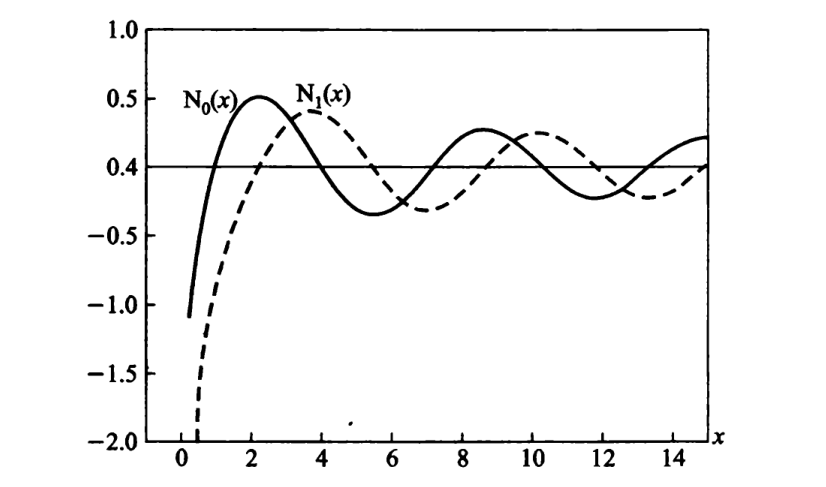

# 柱函数

贝塞尔方程
$$
x^{2} \frac{\mathrm{d}^{2} R}{\mathrm{~d} x^{2}}+x \frac{\mathrm{d} R}{\mathrm{~d} x}+\left(x^{2}-m^{2}\right) R=0 \quad(x=\sqrt{\mu} \rho)
$$

虚宗量贝塞尔方程
$$
x^{2} \frac{\mathrm{d}^{2} R}{\mathrm{~d} x^{2}}+x \frac{\mathrm{d} R}{\mathrm{~d} x}-\left(x^{2}+m^{2}\right) R=0 \quad(x=\nu \rho)
$$

球贝塞尔方程
$$
r^{2} \frac{\mathrm{d}^{2} R}{\mathrm{~d} r}+2 r \frac{\mathrm{d} R}{\mathrm{~d} r}+\left[k^{2} r^{2}-l(l+1)\right] R=0
$$

$m$指整数阶，$l+1/2$指半奇数阶，$\nu$统指一般的阶

## 三类柱函数

贝塞尔函数、诺伊曼函数、汉克尔函数又分别称为第一类、第二类、第三类柱函数。

### $x \rightarrow 0$和$x \rightarrow \infty$时的行为

当$x \rightarrow 0$，有
$$
\begin{array}{l}
\mathrm{J}_{0}(x) \rightarrow 1, \quad \mathrm{~J}_{\nu}(x) \rightarrow 0, \quad \mathrm{~J}_{-\nu}(x) \rightarrow \infty, \\
\mathrm{N}_{0}(x) \rightarrow-\infty, \quad \mathrm{N}_{\nu}(x) \rightarrow \pm \infty \\
(\nu \neq 0)
\end{array}
$$

这样，在研究圆柱内部问题时，“解在圆柱轴上($\rho=0$亦即$x=0$)应为有限”这个要求就成为自然的边界条件，按照这个条件，应舍弃诺伊曼函数和负阶的贝塞尔函数，只要零阶和正阶的贝塞尔函数

当$x \rightarrow \infty$，有
$$
\begin{array}{l}
\mathrm{H}_{\nu}^{(1)}(x) \sim \sqrt{\frac{2}{\pi x}} \mathrm{e}^{\mathrm{i}(x-\nu \pi / 2-\pi / 4)} \\
\mathrm{H}_{\nu}^{(2)}(x) \sim \sqrt{\frac{2}{\pi x}} \mathrm{e}^{-\mathrm{i}(x-\nu \pi / 2-\pi / 4)} \\
\mathrm{J}_{\nu}(x) \sim \sqrt{\frac{2}{\pi x}} \cos (x-\nu \pi / 2-\pi / 4) \\
\mathrm{N}_{\nu}(x) \sim \sqrt{\frac{2}{\pi x}} \sin (x-\nu \pi / 2-\pi / 4)
\end{array}
$$

当$x \rightarrow \infty$，它们全都$\rightarrow 0$ 这样，在研究圆柱外部问题时，两个线性独立特解，如$\mathrm{J}_{\nu}(x)$和$\mathrm{N}_{\nu}(x)$，或$\mathrm{H}_{\nu}^{(1)}(x)$和$\mathrm{H}_{\nu}^{(2)}(x)$，都要保留，不可任意舍弃两者之一，因为它们都满足“解在无限远处($\rho \rightarrow \infty$亦即$x \rightarrow \infty$)为有限”

### 递推公式

$$
\frac{\mathrm{d}}{\mathrm{d} x}\left[\frac{\mathrm{J}_{\nu}(x)}{x^{\nu}}\right]=-\frac{\mathrm{J}_{\nu+1}(x)}{x^{\nu}}
$$

$$
\frac{\mathrm{d}}{\mathrm{d} x}\left[x^{\nu} \mathrm{J}_{\nu}(x)\right]=x^{\nu} \mathrm{J}_{\nu-1}(x)
$$

如用$\mathrm{Z}_{\nu}(x)$代表$\nu$阶的第一或第二或第三类柱函数，总是有

$$
\frac{\mathrm{d}}{\mathrm{d} x}\left[\mathrm{Z}_{\nu}(x) / x^{\nu}\right] =-\mathrm{Z}_{\nu+1}(x) / x^{\nu}
$$

$$
\frac{\mathrm{d}}{\mathrm{d} x}\left[x^{\nu} \mathrm{Z}_{\nu}(x)\right] =x^{\nu} \mathrm{Z}_{\nu-1}(x)
$$

可改写为

$$
\mathrm{Z}_{\nu}^{\prime}(x)-\nu \mathrm{Z}_{\nu}(x) / x=-\mathrm{Z}_{\nu+1}(x)
$$

$$
\mathrm{Z}_{\nu}^{\prime}(x)+\nu \mathrm{Z}_{\nu}(x) / x=\mathrm{Z}_{\nu-1}(x)
$$

可得

$$
\mathrm{Z}_{\nu-1}(x)-\mathrm{Z}_{\nu+1}(x)=2 \mathrm{Z}_{\nu}^{\prime}(x)
$$

$$
\mathrm{Z}_{\nu+1}(x)-2 \nu \mathrm{Z}_{\nu}(x) / x+\mathrm{Z}_{\nu-1}(x)=0
$$

## 贝塞尔方程的本征值问题

拉普拉斯方程在柱坐标系下，分离变数有三种情况$\mu<0, \mu=0, \mu>0$。

对于**圆柱内部**的问题，如果**柱侧有齐次的边界条件**，则只需考虑$\mu \geqslant 0$，即求解贝塞尔方程（对于$\mu<0$，若$m>0$，不满足有限值条件，$m=0$，是平凡解）。

本征函数
$$
R(\rho)=\mathrm{J}_{m}(x)=\mathrm{J}_{m}(\sqrt{\mu} \rho) \quad(m \geqslant 0)
$$

柱侧的齐次边界条件决定$\mu$的可能值，这就是本征值。

### 不同边界条件下的本征值

第一类齐次边界条件$R(\rho_{0})=0$，则有$\mathrm{J}_{m}\left(\sqrt{\mu} \rho_{0}\right)=0$

用$x_{n}^{(m)}$表示方程$\mathrm{J}_{m}\left(x_{0}\right)=0$的第$n$个正根

则第一类齐次边界条件的本征值$\mu_{n}^{(m,1)}=\left(x_{n}^{(m)} / \rho_{0}\right)^{2}$（$\mu=0$是平凡解）

零点的一些结论
1. 正负成对，绝对值相等$\mathrm{J}_{m}(-x)=(-1)^{m} \mathrm{~J}_{m}(x)$
2. 无穷多个零点
3. $\mathrm{J}_{m}(x)$和$\mathrm{J}_{m+1}(x)$的零点两两相间
4. $\mathrm{J}_{m}(x)$绝对值最小的零点比$\mathrm{J}_{m+1}(x)$的更接近于0

第二类齐次边界条件$R^{\prime}\left(\rho_{0}\right)=0$

记$x_{n}^{(m, 2)}$是方程
$$
\frac{x_{0}}{\rho_{0}} J_{m}^{\prime}\left(x_{0}\right)=0
$$

的第$n$个正根

则本征值$\mu_{n}^{(m, 2)}=\left(x_{n}^{(m, 2)} / \rho_{0}\right)^{2}$，注意$\mu=0$也是本征值

$$\mathrm{J}_{0}^{\prime}(x)=-\mathrm{J}_{1}(x)$$

$$\mathrm{J}_{m}^{\prime}(x)=\frac{1}{2}\left[\mathrm{J}_{m-1}(x)-\mathrm{J}_{m+1}(x)\right]$$

第三类齐次边界条件$R\left(\rho_{0}\right)+H R^{\prime}\left(\rho_{0}\right)=0$

记$x_{n}^{(m, 3)}$为方程
$$
\mathrm{J}_{m}\left(x_{0}\right)=\frac{x_{0}}{h+m} \mathrm{J}_{m+1}\left(x_{0}\right)
$$

的第$n$个正根

则本征值$\mu_{n}^{(m, 3)}=\left(x_{n}^{(m, 3)} / \rho_{0}\right)^{2}$，注意$\mu=0$是否为本征值需要考虑

### 一些性质

$$
\int_{0}^{\rho_{0}} \mathrm{~J}_{m}\left(\sqrt{\mu_{n}} \rho \right)\mathrm{J}_{m}\left(\sqrt{\mu_{l} }\rho \right) \rho \mathrm{~d} \rho=0 \quad(n \neq l)
$$

$$
\begin{aligned}
\left[N_{n}^{(m)}\right]^{2} & =\int_{0}^{\rho_{0}}\left[\mathrm{~J}_{m}\left(\sqrt{\mu_{n}^{(m)}} \rho\right)\right]^{2} \rho \mathrm{~d} \rho \\
& = \frac{1}{2}\left(\rho_{0}^{2}-\frac{m^{2}}{\mu_{n}^{(m)}}\right)\left[\mathrm{~J}_{m}\left(\sqrt{\mu_{n}^{(m)}} \rho_{0}\right)\right]^{2}+\frac{1}{2} \rho_{0}^{2}\left[\mathrm{~J}_{m}^{\prime}\left(\sqrt{\mu_{n}^{(m)}} \rho_{0}\right)\right]^{2}
\end{aligned}
$$

$$
\begin{array}{l}
\int x^{-m} \mathrm{~J}_{m+1}(x) \mathrm{d} x=-x^{-m} \mathrm{~J}_{m}(x)+C \\
\int \mathrm{J}_{1}(x) \mathrm{d} x=-\mathrm{J}_{0}(x)+C \\
\int x^{m} \mathrm{~J}_{m-1}(x) \mathrm{d} x=x^{m} \mathrm{~J}_{m}(x)+C
\end{array}
$$

对于$\rho_{0} \rightarrow \infty$的情况，则有傅里叶-贝塞尔积分
$$
\left\{\begin{array}{l}
f(\rho)=\int\limits_{0}^{\infty} F(\omega) \mathrm{J}_{m}(\omega \rho) \omega \mathrm{d} \omega \\
F(\omega)=\int\limits_{0}^{\infty} f(\rho) \mathrm{J}_{m}(\omega \rho) \rho \mathrm{d} \rho
\end{array}\right.
$$

### 诺伊曼函数

### 汉克尔函数

$\mathrm{H}_{m}^{(1)}$对应于会聚波，$\mathrm{H}_{m}^{(2)}$对应于发散波，$\mathrm{J}_{m}$和$\mathrm{N}_{m}$对应于驻波。

研究波发射问题，用汉克尔函数比较方便。
