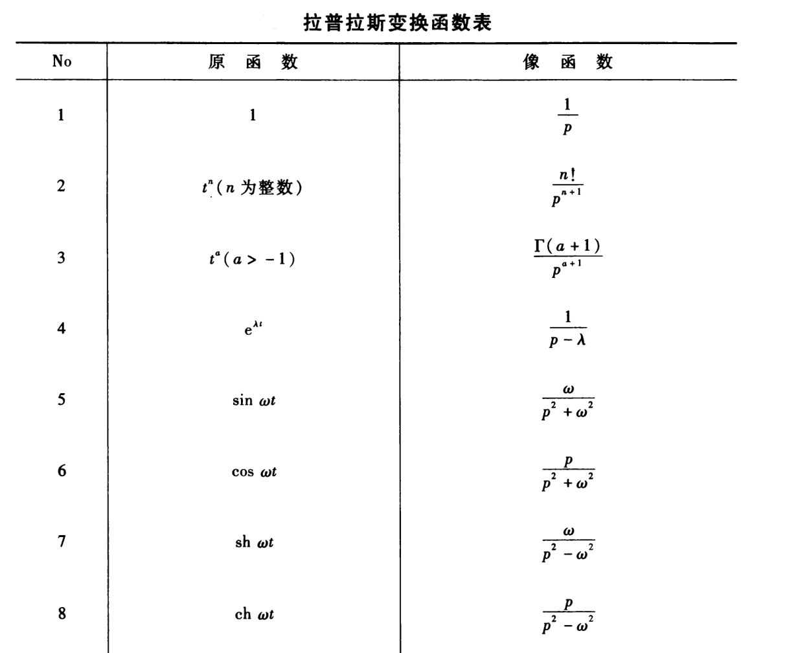
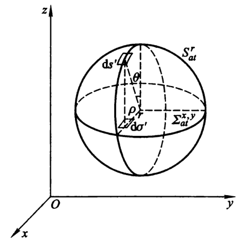

#! https://zhuanlan.zhihu.com/p/627068881
# 积分变换法

## 前置知识

### 傅里叶变换

$$
F(\omega)=\frac{1}{2 \pi} \int_{-\infty}^{\infty} f(x) \mathrm{e}^{-\mathrm{i} \omega x} \mathrm{~d} x
$$

$$
f(x)=\int_{-\infty}^{\infty} F(\omega) \mathrm{e}^{\mathrm{i} \omega x} \mathrm{~d} \omega
$$

**导数定理**

$$
\mathscr{F}\left[f^{\prime}(x)\right]=\mathrm{i} \omega F(\omega)
$$

$$
\mathscr{F}\left[f^{(n)}(x)\right]=(\mathrm{i} \omega)^{n} F(\omega)
$$

**积分定理**

$$
\mathscr{F}\left[\int^{(x)} f(\xi) \mathrm{d} \xi\right]=\frac{1}{\mathrm{i} \omega} F(\omega)
$$

**相似性定理**

$$
\mathscr{ F }[f(a x)]=\frac{1}{a} F\left(\frac{\omega}{a}\right)
$$

**延迟定理**

$$
\mathscr{F}\left[f\left(x-x_{0}\right)\right]=\mathrm{e}^{-\mathrm{i} \omega x_{0}} F(\omega)
$$

**位移定理**

$$
\mathscr{F}\left[\mathrm{e}^{\mathrm{i} \omega_{0} x} f(x)\right]=F\left(\omega-\omega_{0}\right)
$$

**卷积定理**

$$
\mathscr{F}\left[f_{1}(x) * f_{2}(x)\right]=2 \pi F_{1}(\omega) F_{2}(\omega)
$$

### 三重傅里叶变换

$$
F(\boldsymbol{k})=\frac{1}{(2 \pi)^{3}} \iiint_{-\infty}^{\infty} f(\boldsymbol{r})\left[\mathrm{e}^{\mathrm{i} k \cdot r}\right]^{*} \mathrm{~d} \boldsymbol{r}
$$

$$
f(\boldsymbol{r})=\iiint_{-\infty}^{\infty} F(\boldsymbol{k}) \mathrm{e}^{\mathrm{i} k \cdot r} \mathrm{~d} \boldsymbol{k}
$$

### 拉普拉斯变换

$$
\bar{f}(p)=\int_{0}^{\infty} f(t) \mathrm{e}^{-p t} \mathrm{~d} t
$$

$$
f(t)=\frac{1}{2 \pi} \int_{-\infty}^{\infty} \bar{f}(\sigma+\mathrm{i} \omega) \mathrm{e}^{(\sigma+i \omega)} \mathrm{d} \omega = \frac{1}{2 \pi \mathrm{i}} \int_{\sigma-\mathrm{i} \infty}^{\sigma+\mathrm{i} \infty} \bar{f}(p) \mathrm{e}^{\mathrm{i} p} \mathrm{d} p
$$

**线性定理**

若  $f_{1}(t) \fallingdotseq \bar{f}_{1}(p), f_{2}(t) \fallingdotseq \bar{f}_{2}(p)$ , 则

$$
c_{1} f_{1}(t)+c_{2} f_{2}(t) \fallingdotseq c_{1} \bar{f}_{1}(p)+c_{2} \bar{f}_{2}(p)
$$

**导数定理**

$$
f^{\prime}(t) \fallingdotseq p \bar{f}(p)-f(0)
$$

$$
f^{(n)}(t) \fallingdotseq p^{n} \bar{f}(p)-p^{n-1} f(0)-p^{n-2} f^{\prime}(0)-\cdots-p f^{(n-2)}(0)-f^{(n-1)}(0)
$$

**积分定理**

$$
\int_{0}^{t} \psi(\tau) \mathrm{d} \tau \fallingdotseq \frac{1}{p} \mathscr{L}[\psi(t)]
$$

**相似性定理**

$$
f(a t) \fallingdotseq \frac{1}{a} \bar{f}\left(\frac{p}{a}\right)
$$

**位移定理**

$$
\mathrm{e}^{-\lambda t} f(t) \fallingdotseq \bar{f}(p+\lambda)
$$

**延迟定理**

$$
f\left(t-t_{0}\right) \fallingdotseq \mathrm{e}^{-p t_{0}} \bar{f} (p)
$$

**卷积定理**

若  $f_{1}(t) \fallingdotseq \bar{f}_{1}(p), f_{2}(t) \fallingdotseq \bar{f}_{2}(p)$ ，则

$$
f_{1}(t) * f_{2}(t) \fallingdotseq \bar{f}_{1}(p) \bar{f}_{2}(p)
$$

### 误差函数

误差函数

$$
\mathrm{erf} (x) = \frac{2}{\sqrt{\pi}} \int_{0}^{x} \mathrm{e}^{-z^{2}} \mathrm{~d} z
$$

余误差函数

$$
\mathrm{erfc} (x) = 1 - \mathrm{erf} (x)
$$

### 二阶非齐次线性方程的通解

有二阶非齐次线性方程

$$
y^{\prime \prime}+a_{1}(x) y^{\prime}+a_{2}(x) y=f(x)
$$

设  $y_{1}(x), y_{2}(x)$  是对应的二阶齐次线性方程

$$
y^{\prime \prime}+a_{1}(x) y^{\prime}+a_{2}(x) y=0
$$

的基本解组，则该二阶非齐次线性方程的通解为

$$
y(x)=c_{1} y_{1}(x)+c_{2} y_{2}(x)+\int_{x_{0}}^{x} \frac{y_{1}(x)\left(-y_{2}(\xi)\right)+y_{2}(x) y_{1}(\xi)}{y_{1}(\xi) y_{2}^{\prime}(\xi)-y_{2}(\xi) y_{1}^{\prime}(\xi)} f(\xi) d \xi
$$

## 傅里叶变换法

对于**无界空间**的定解问题，傅里叶变换是一种很适用的求解方法。

### 无限长弦的自由振动

$$
\left\{\begin{aligned}
& u_{t}-a^{2} u_{x x}=0 \quad (-\infty<x<\infty) \\
& \left.u\right|_{t=0}=\varphi(x),\quad \left.u_{t}\right|_{t=0}=\psi(x)
\end{aligned}\right.
$$

傅里叶变换

$$
\left\{\begin{aligned}
& U^{\prime \prime}+k^{2} a^{2} U=0 \\
& \left.U\right|_{t=0}=\Phi(k),\left.\quad U^{\prime}\right|_{t=0}=\Psi(k)
\end{aligned}\right.
$$

解为

$$
\begin{aligned}
U(t, k)= & \frac{1}{2} \Phi(k) \mathrm{e}^{\mathrm{i} k a t}+\frac{1}{2 a} \frac{1}{\mathrm{i} k} \Psi(k) \mathrm{e}^{\mathrm{i} k a t} \\
& +\frac{1}{2} \Phi(k) \mathrm{e}^{-\mathrm{i} k a t}-\frac{1}{2 a} \frac{1}{\mathrm{i} k} \Psi(k) \mathrm{e}^{-\mathrm{i} k a t}
\end{aligned}
$$

逆傅里叶变换，得**达朗贝尔公式**

$$
u(x, t)=\frac{1}{2}[\varphi(x+a t)+\varphi(x-a t)]+\frac{1}{2 a} \int_{x-a t}^{x+a t} \psi(\xi) \mathrm{d} \xi
$$

### 无限长细杆的热传导问题

$$
\left\{\begin{aligned}
& u_{t}-a^{2} u_{x x}=0 \quad(-\infty<x<\infty) \\
& \left.u\right|_{t=0}=\varphi(x)
\end{aligned}\right.
$$

傅里叶变换

$$
\left\{\begin{aligned}
& U^{\prime}+k^{2} a^{2} U=0 \\
& \left.U\right|_{t=0}=\Phi(k)
\end{aligned}\right.
$$

解为

$$
U(t, k)=\Phi(k) \mathrm{e}^{-k^{2} a^{2} t}
$$

逆傅里叶变换，得

$$
u(x, t)=\int_{-\infty}^{\infty} \varphi(\xi)\left[\dfrac{1}{2 a \sqrt{\pi t}} \exp\{-\dfrac{(x-\xi)^{2}}{4 a^{2} t}\}\right] \mathrm{d} \xi
$$

### 三维无界空间的自由振动

$$
\left\{\begin{aligned}
& u_{t}-a^{2} \Delta_{3} u=0 \\
& \left.u\right|_{t=0}=\varphi(\boldsymbol{r}),\quad \left.u_{t}\right|_{t=0}=\psi(\boldsymbol{r})
\end{aligned}\right.
$$

其解为**泊松公式**

$$
u(\boldsymbol{r}, t)=\frac{1}{4 \pi a} \frac{\partial}{\partial t} \iint_{S_{a t}^{r}} \frac{\varphi\left(\boldsymbol{r}^{\prime}\right)}{a t} \mathrm{~d} S^{\prime}+\frac{1}{4 \pi a} \iint_{S_{a t}^{r}} \frac{\psi\left(\boldsymbol{r}^{\prime}\right)}{a t} \mathrm{~d} S^{\prime}
$$

其中  $S_{a t}^{r}$  是球心为  $\boldsymbol{r}$，半径为  $a t$  的球面；$\mathrm{d} S^{\prime}$  是球面  $S_{a t}^{r}$  的面积元。

### 三维无界空间的受迫振动

$$
\left\{\begin{aligned}
& u_{t t}-a^{2} \Delta_{3} u=f(\boldsymbol{r}, t) \\
& \left.u\right|_{t=0}=0,\quad \left.u_{t}\right|_{t=0}=0
\end{aligned}\right.
$$

其解为**推迟势**

$$
u(\boldsymbol{r}, t)=\frac{1}{4 \pi a^{2}} \iiint_{T_{a t}^{r}} \frac{f\left(\boldsymbol{r}^{\prime}, t-\left|\boldsymbol{r}-\boldsymbol{r}^{\prime}\right| / a\right)}{\left|\boldsymbol{r}-\boldsymbol{r}^{\prime}\right|} \mathrm{d} V^{\prime}
$$

其中  $T_{a t}^{r}$  是球心为  $\boldsymbol{r}$，半径为  $a t$  的球体；$\mathrm{d} V^{\prime}$  是球体  $T_{a t}^{r}$  的体积元。

### 二维无界空间的自由振动

$$
\left\{\begin{aligned}
& u_{t}-a^{2} \Delta_{2} u=0 \\
& \left.u\right|_{t=0}=\varphi(x, y),\quad \left.u_{t}\right|_{t=0}=\psi(x, y)
\end{aligned}\right.
$$

二维空间即的波动其实还是在三维空间中传播的波动，只是该波动跟坐标 $z$ 无关而已。因此三维波动的泊松公式，消除了坐标 $z$ ，就成为二维波动的公式，这称为**降维法**。

对于二维问题，球面  $S_{a t}^{r}$  上的积分应代之以  $x y$  平面的圆  $\Sigma_{a t}^{x, y}$  上的积分。

$$
\begin{aligned}
\mathrm{d} \sigma^{\prime} & =\mathrm{d} S^{\prime} \cos \theta=\mathrm{d} S^{\prime} \frac{\sqrt{a^{2} t^{2}-\rho^{2}}}{a t} \\
& =\mathrm{d} S^{\prime} \frac{\sqrt{a^{2} t^{2}-\left(x^{\prime}-x\right)^{2}-\left(y^{\prime}-y\right)^{2}}}{a t}
\end{aligned}
$$

泊松公式在二维问题中成为

$$
\begin{aligned}
u(x, y, t)= & \frac{1}{2 \pi a} \frac{\partial}{\partial t} \iint_{\Sigma_{a t}^{x, y}} \frac{\varphi\left(x^{\prime}, y^{\prime}\right)}{\sqrt{a^{2} t^{2}-\left(x^{\prime}-x\right)^{2}-\left(y^{\prime}-y\right)^{2}}} \mathrm{~d} x^{\prime} \mathrm{d} y^{\prime} \\
& +\frac{1}{2 \pi a} \iint_{\Sigma_{a t}^{x, y}} \frac{\psi\left(x^{\prime}, y^{\prime}\right)}{\sqrt{a^{2} t^{2}-\left(x^{\prime}-x\right)^{2}-\left(y^{\prime}-y\right)^{2}}} \mathrm{~d} x^{\prime} \mathrm{d} y^{\prime}
\end{aligned}
$$

## 拉普拉斯变换法

拉普拉斯变换法方法适于求解**初值问题**，不管方程及边界条件是否为齐次的。

