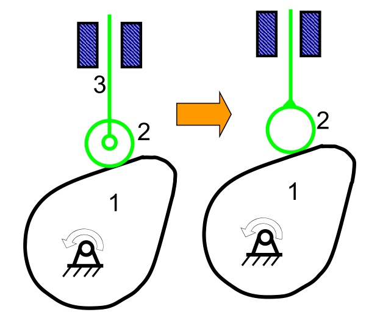
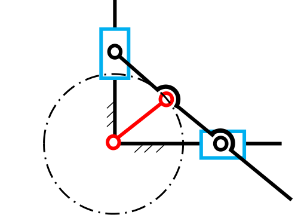
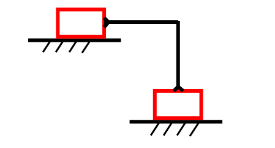
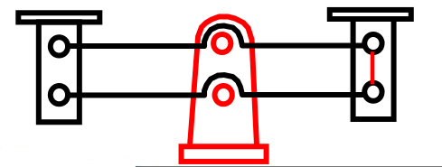
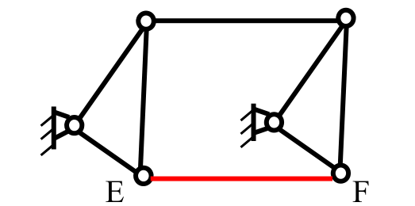
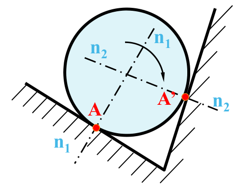

## 运动副

**构件**：独立的运动单元

**运动副**：两个构件直接接触组成的仍能产生某些相对运动的联接

按运动副元素分类
1. 高副：点、线接触，应力高
2. 低副：面接触，应力低

**运动链**：两个以上的构件通过运动副的联接而构成的系统

**机构**：在运动链中，如果以某一个构件作为参考坐标系，当其中另一个（或少数几个）构件相对于该坐标系按给定的运动规律运动时，其余所有的构件都能得到确定的运动，那么，该运动链便成为机构。

机架：作为参考系的构件，如机床床身、车辆底盘、飞机机身。

原（主）动件：按给定运动规律运动的构件。

从动件：其余可动构件

机构 ＝ 机架 ＋ 原动件 ＋ 从动件

## 运动简图

机构运动简图： 用以说明复杂机械或机构中各构件之间的相对运动关系的简单图形（一些简单线条和规定符号）。

机构示意图：不按比例绘制的简图

## 自由度

所有运动构件都在同一平面或在相互平行的平面内运动,这种机构称为平面机构。

如前所述,机构是由若干构件用运动副相联接并具有确定相对运动的组合体;我们把若干构件用运动副联成的系统称为运动链,其中有一个构件为固定构件(机架),只有当给定运动链中一个(或若干个)构件作为主动构件以独立运动,其余构件随之作确定的相对运动,这种具有确定相对运动的运动链才成为机构。

运动构件数$n$，低副数$P_{L}$，高副数$P_{H}$。

自由度的计算
$$F=3 n-2 P_{L}-P_{H}$$

三个或三个以上构件在同一轴线上用间转副相联接构成复合铰链。若有$m$个构件构成同轴复合铰链，则应具有$m-1$个回转副。

### 局部自由度

不影响机构中输出与输人关系的个别构件的独立运动称为**局部自由度**(或多余自由度)$F_{P}$，在计算机构自由度时应予排除。

一般出现在加装滚子的场合。

滚子的作用，将滑动摩擦转变为滚动摩擦。

### 虚约束

在运动副引入的约束中，有些约束对机构自由度的影响与其他约束重复，这些重复的约束称为**虚约束**(或消极约束)，在计算机构自由度时也应除去不计。

出现虚约束的场合
1. 两构件联接前后，联接点的轨迹重合
2. 两构件构成多个移动副，且导路平行
3. 两构件构成多个转动副，且同轴
4. 运动时，两构件上的两点距离始终不变
5. 对运动不起作用的对称部分
6. 两构件构成高副，两处接触，且法线重合

虚约束的作用
1. 改善构件的受力情况，如多个行星轮
2. 增加机构的刚度，如轴与轴承、机床导轨
3. 使机构运动顺利，避免运动不确定，如车轮