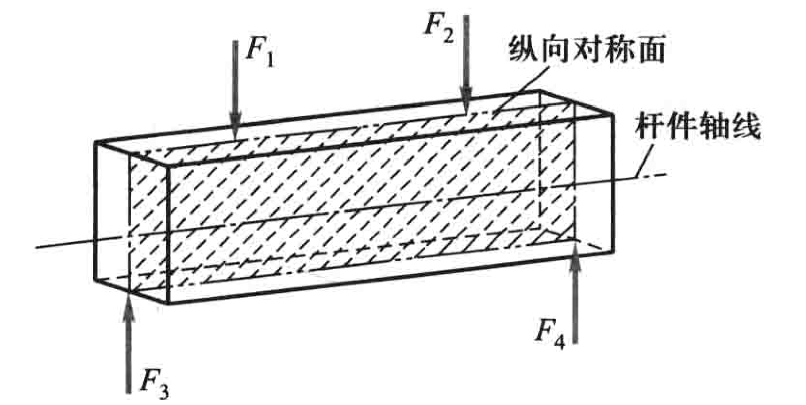

# 弯曲内力

## 对称弯曲 (Symmetric bending)

- 具有纵向对称面
- 外力都作用在此面内
- 弯曲变形后轴线变成对称面内的平面曲线

## 受弯杆件的简化

略

## 剪力和弯矩

截面法可求得内力。弯曲构件内力可分解为剪力和弯矩。

剪力 $Q$(或 $F_{\mathrm{s}}$)：构件受弯时，横截面上其作用线平行于截面的内力。绕研究对象顺时针转为正剪力；反之为负。

弯矩 $M$：构件受弯时，横截面上其作用面垂直于截面的内力偶矩。使梁变成凹形的为正弯矩；使梁变成凸形的为负弯矩。

剪力方程 $Q=Q(x)$

弯矩方程 $M=M(x)$

相应的图线表示，称为剪力图和弯矩图。