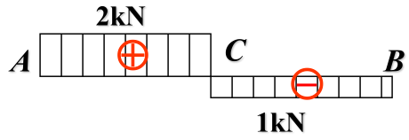

# 拉伸、压缩与剪切
Tension, Compression & Direct Shear

## 轴向拉伸与压缩
Axial Tension and Compression

作用于杆件两端的外力合力的作用线与杆件轴线重合，杆件变形是沿轴线方向的伸长或缩短。

### 轴力

为了显示拉(压)杆横截面上的内力，沿横截面m-m假想地把杆件分成两部分。杆件左右两段在横截面m-m上相互作用的内力是一个分布力系，其合力为轴力$F_{N}$。

$$F_{N}=F$$

若选取一个坐标系，其横坐标表示横截面的位置，纵坐标表示相应截面上的轴力，便可用图线表示出沿活塞杆轴线轴力变化的情况。这种图线即为**轴力图(Axial force diagram)**。

例如

### 横截面上的应力

$$F_{\mathrm{N}}=\int_{A} \sigma \mathrm{d} A$$

平面假设(Plane cross-section assumption)：如果横截面最初为平面，则变形后仍保持平面，并垂直于轴线。

应变相同，应力也相同。因此横截面上应力相同，即
$$\sigma=\frac{F_{N}}{A}$$

若以集中力作用于杆件端截面上，则集中力作用点附近区域内的应力分布比较复杂，上式只能计算这个区域内横截面上的平均应力，不能描述作用点附近的真实情况。

Saint-Venant原理：如用与外力系静力等效的合力来代替原力系，则除在原力系作用区域内有明显差别外，在离外力作用区域略远处(例如距离约等于横截面尺寸处)，上述代替的影响就非常微小，可以不计。

### 斜截面上的应力

$$
p_{\alpha}=\frac{F}{A} \cos \alpha=\sigma \cos \alpha
$$

$$
\sigma_{\alpha}=\sigma \cos ^{2} \alpha
$$

$$
\tau_{\alpha}=\frac{\sigma}{2} \sin 2 \alpha
$$

当$\alpha=45^{\circ}$时，切应力最大。因此材料受压断裂面与轴线夹角往往为$45^{\circ}$。