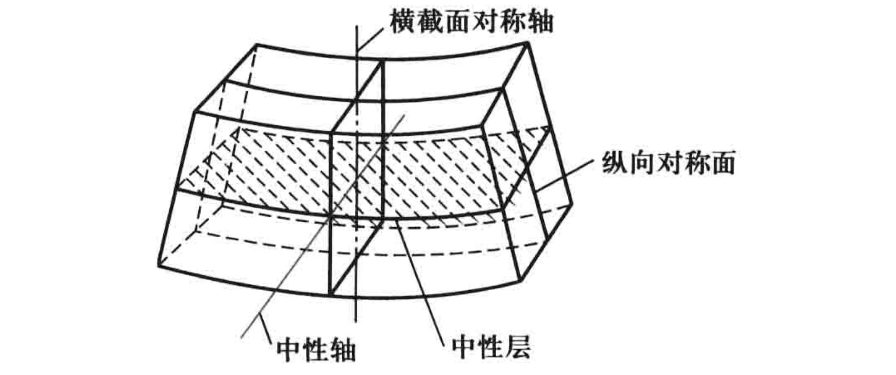

#! https://zhuanlan.zhihu.com/p/630770263
# 杆件拉压、剪切、扭转、弯曲模型

## 拉伸与压缩

拉为正，压为负。

轴向拉压 $N$ 产生正应力 $\sigma$ ，与轴向线应变 $\varepsilon$ (杆件长度) 和横向应变 $\varepsilon^{\prime}$ (横向尺寸)

$$
\sigma=E \varepsilon
$$

$$
\mu=-\frac{\varepsilon^{\prime}}{\varepsilon}
$$

- $E$：弹性模量
- $\mu$：泊松比

产生单位体积应变能

$$
v_{\varepsilon}=\frac{\sigma^{2}}{2 E}=\frac{1}{2} \sigma \varepsilon
$$

对于长为 $l$ 的杆，若轴向力为 $F$，有

$$
\Delta l=\frac{F \, l}{E A}
$$

$$
V_{\varepsilon}=\frac{F^{2} l}{2 E A}
$$

## 剪切

对杆的矩，顺时针为正，逆时针为负。

剪力 $Q$ 产生切应力 $\tau$。

实用计算

$$
\tau = \frac{Q}{A}
$$

## 扭转

按右手法则表示为矢量，与外法线方向一致为正，反之为负。

### 圆轴的扭转

平面假设：圆轴扭转变形前原为平面的横截面，变形后仍保持为平面，形状和大小不变，半径仍保持为直线；且相邻两截面间的距离不变。

距圆心为 $\rho$ 处的切应力

$$
\tau_{\rho}=\frac{T \, \rho}{I_{\mathrm{p}}}
$$

- $I_{\mathrm{p}}=\int_{A} \rho^{2} \mathrm{~d} A$：极惯性矩

对于实心圆轴，$I_{\mathrm{p}}=\int_{0}^{2 \pi} \int_{0}^{R} \rho^{3} \mathrm{~d} \rho \mathrm{d} \theta=\dfrac{\pi R^{4}}{2}$

相距为 $\mathrm{d} x$ 的两个横截面之间的相对转角

$$
\frac{\mathrm{d} \varphi}{\mathrm{d} x}=\frac{T}{G I_{p}}
$$

- $G$：切变模量

$$
G=\frac{E}{2(1+\mu)}
$$

$\mathrm{d} x$ 上的应变能

$$
\mathrm{d} V_{\varepsilon}=\frac{T^{2} \mathrm{d} x}{2 G I_{\mathrm{p}}}
$$

### 矩形截面杆的扭转

$$
\tau_{\max }=\frac{T}{\alpha h b^{2}}
$$

$$
\tau_{1}=\nu \tau_{\max }
$$

$$
\mathrm{d} \varphi=\frac{T \mathrm{d} x}{G I_{\mathrm{t}}}
$$

- $G I_{\mathrm{t}} = G \beta h b^{3}$：抗扭刚度

特别地，当 $h/b > 10$ 时，截面成为狭长矩形。这时 $\alpha=\beta \approx \dfrac{1}{3}$。如以 $\delta$ 表示狭长矩形的短边的长度，则有

$$
\tau_{\max }=\frac{3 T}{h \delta^{2}}
$$

$$
\mathrm{d} \varphi=\frac{3 T \mathrm{d} x}{G h \delta^{3}}
$$

在狭长矩形截面上，沿长边各点的切应力实际上变化不大，接近相等，在靠近短边处才迅速减小为零。

### 开口薄壁杆件的扭转

开口薄壁杆件横截面，可以看作是由若干个狭长矩形组成的。中线为曲线的开口薄璧杆件，计算时可将截面展直，作为狭长矩形截面处理。

假设横截面在其本身平面内形状不变，则整个横截面和组成截面的各部分的扭转角 $\varphi$ 相等。

$$
\mathrm{d} \varphi=\frac{T \mathrm{d} x}{G I_{\mathrm{t}}}
$$

- $G I_{\mathrm{t}}$：开口薄壁杆件的抗扭刚度

$$
I_{\mathrm{t}}=\sum \frac{1}{3} h_{i} \delta_{i}^{3}
$$

长边各点的切应力

$$
\tau_{i}=\frac{T \delta_{i}}{I_{\mathrm{t}}}
$$

当各狭长矩形连接处有圆角，翼缘内侧有斜度时

$$
I_{\mathrm{t}}=\eta \cdot \frac{1}{3} \sum h_{i} \delta_{i}^{3}
$$

- $\eta$：修正因数

## 弯曲

在截面处弯曲变形凸向下时，截面上的弯矩规定为正，反之为负。

概念

- 中性层：梁内一层纤维既不伸长也不缩短，因而纤维不受拉应力和压应力，此层纤维称中性层
- 中性轴：中性层与横截面的交线

假设

- 平面假设：横截面变形后仍为平面，只是绕中性轴发生转动，距中性轴等高处，变形相等
- 纵向纤维之间无正应力（纤维内部有）

纵向纤维的应变

$$
\varepsilon = \frac{y}{\rho}
$$

- $y$：中性层向下位置坐标
- $\rho$：曲率半径

### 弯曲正应力

#### 横截面有对称轴

中性轴应通过截面形心。

以梁横截面的对称轴为 $y$ 轴，且向下为正，以中性轴为 $z$ 轴，以通过原点的横截面的法线为 $x$ 轴。

正应力

$$
\sigma=\frac{M y}{I_{z}}
$$

- $I_{z} = \int_{A} y^{2} \mathrm{~d} A$：横截面对 $z$ 轴的惯性矩

- 截面是高为  $h$  、宽为  $b$  的矩形，$I_{z}=\dfrac{b h^{3}}{12}$
- 截面是直径为  $d$  的圆形，$I_{z}=\dfrac{\pi d^{4}}{64}$

一般情况下，最大正应力发生于弯矩最大的截面上

$$
\sigma_{\max}=\frac{M_{\max}}{W}
$$

- $W$：抗弯截面系数，单位为  $\mathrm{m}^{3}$

- 截面是高为  $h$  、宽为  $b$  的矩形，$W=\dfrac{b h^{2}}{6}$
- 截面是直径为  $d$  的圆形，$W=\dfrac{\pi d^{3}}{32}$

### 弯曲切应力

#### 矩形截面梁

截面高度 $h$ 大于宽度 $b$ 的情况下，假设

- 切应力与剪力平行
- 切应力沿截面宽度均匀分布（沿 $z$ 轴）

则切应力为

$$
\tau=\frac{Q S_{z}^{*}}{I_{z} b}
$$

- $S_{z}^{*}=\int_{A_{1}} y \mathrm{~d} A=\dfrac{b}{2}\left(\dfrac{h^{2}}{4}-y^{2}\right)$：截面上距中性轴为 $y$ 的横线以下部分的面积（记为 $A_{1}$）对中性轴的静矩
- $I_{z}=\dfrac{b h^{3}}{12}$：横截面对 $z$ 轴的惯性矩

最大切应力发生于中性轴上

$$
\tau_{\max }=\frac{3}{2} \frac{Q}{b h}
$$

对于工字形截面梁，腹板几乎负担了截面上的全部剪力，而且腹板上的切应力接近于均匀分布。（翼缘负担了截面上的大部分弯矩）

### 弯曲变形

横力弯曲变形的基本方程

$$
\frac{1}{\rho}=\frac{M}{E I}
$$

- $E I$：抗弯刚度

发生弯曲变形时，变形前为直线的梁轴线，变形后成为一条连续且光滑的曲线，称为挠曲线。

以变形前的梁轴线为 $x$ 轴，垂直向上的轴为 $y$ 轴，$x-y$ 平面为梁的纵向对称面。

- 挠度 $w$：坐标为 $x$ 的横截面的形心沿 $y$ 方向的位移
- 转角 $\theta$：坐标为 $x$ 的横截面相对其原来位置转过的角度

小变形的情况下

$$
\mathrm{d} w = \theta \mathrm{~d} x
$$

$$
\frac{\mathrm{d}^{2} w}{\mathrm{~d} x^{2}}=\frac{M}{E I}
$$

弯曲应变能

$$
\mathrm{d} V_{\varepsilon}=\frac{M^{2} \mathrm{d} x}{2 E I}
$$

- 边界条件：在固定端，挠度和转角都为零；在铰支座上，挠度为零
- 连续条件：在挠曲线的任意点上，有唯一确定的挠度和转角

积分得

$$
\theta=\frac{\mathrm{d} w}{\mathrm{~d} x}=\int \frac{M}{E I} \mathrm{~d} x+C
$$

$$
w=\iint\left(\frac{M}{E I} \mathrm{~d} x\right) \mathrm{d} x+C x+D
$$

在弯曲变形很小，且材料服从胡克定律的情况下，挠曲线的微分方程是线性的。因此可以采用叠加法。

