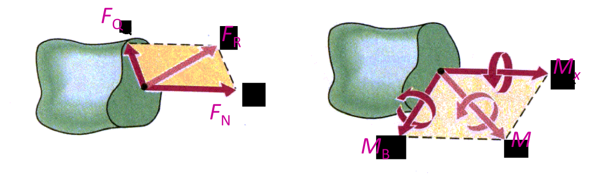
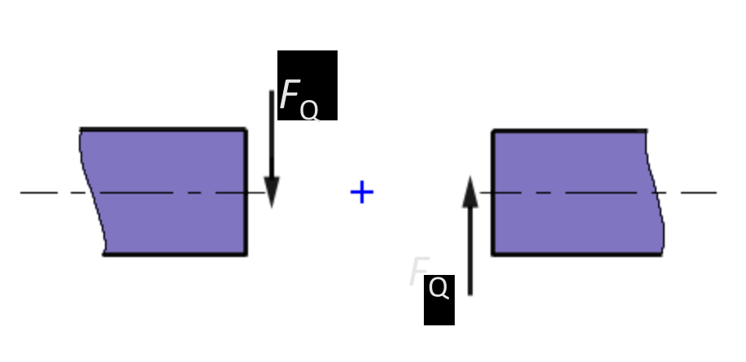
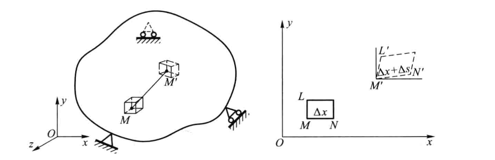

## 材料力学的目标

Strength, Rigidity & Stability

强度、刚度和稳定性

## 材料力学基本假设

1. Continuity 连续性
2. Homogeneity 均匀性
3. Isotropy 各向同性
4. Small deformation 微小变形（结构不变）

这些假设不适用于微观

## 外力(External Force)

Forces exerted by surrounds is defined as external force.

Acting modes:
1. Surface force (distribution force & Concentration force)
2. Body force (self-weight & inertia force)

按外力的作用方式可分为表面力和体积力。表面力是作用于物体表面的力，又可分为分布力和集中力。分布力是连续作用于物体表面的力；集中力是作用于一点的力。体积力是连续分布于物体内部各点的力，例如物体的自重和惯性力等。

Loading vs. time:
1. Static load
2. Dynamic load (Alternating load & impact load)

## 内力与应力(Internal Force & Stress)

### 内力

物体因受外力作用而变形，其内部各部分之间因相对位置改变而引起的相互作用就是内力。

所以内力是分布于截面上的一个分布力系。把这个分布内力系向截面上某一点(通常选取截面的形心)简化后得到的主矢$F_{R}$和主矩$M$，称为截面上的内力。

主矢$F_{R}$可分解为剪切力(shear force)$F_{Q}$和轴向力(axial force)$F_{N}$，主矩$M$可分解为扭转力矩(torsional moment)$M_{X}$和弯矩(bending moment)$M_{B}$。

在同一位置，两侧横截面上的内力具有相同的符号。拉为正，压为负；扭转力矩方向与截面法线相同；剪切力和弯矩方向相对物体顺时针。

### 应力

内力集度。如图，围绕$C$点取微小面积$\Delta A$，$\Delta A$上分布内力的合力为$\Delta F$。$\Delta F$的大小和方向与$C$点的位置和$\Delta A$的大小有关。记平均应力
$$
p_{\mathrm{m}}=\frac{\Delta F}{\Delta A}
$$

在$C$点的应力
$$
p=\lim _{\Delta A \rightarrow 0} p_{\mathrm{m}}=\lim _{\Delta A \rightarrow 0} \frac{\Delta F}{\Delta A}
$$

$p_{\mathrm{m}},p$都是矢量。$p$垂直截面的的分量$\sigma$称为正应力(normal stress)，切于截面的分量$\tau$称为切应力(shear stress)。

拉为正，压为负。顺为正，逆为负。

## 变形与应变(Deformation & Strain)

线应变
$$
\varepsilon=\lim _{\overline{M N} \rightarrow 0} \frac{\overline{M^{\prime} N^{\prime}}-\overline{M N}}{\overline{M N}}=\lim _{\Delta x \rightarrow 0} \frac{\Delta s}{\Delta x}
$$

长为正，短为负。

角应变(切应变)
$$
\gamma=\lim _{\substack{\overline{MN} \rightarrow 0 \\ \overline{ML} \rightarrow 0}}\left(\frac{\pi}{2}-\angle L^{\prime} M^{\prime} N^{\prime}\right)
$$

锐为正，钝为负。

## Basic Types of Deformation

1. Tension,Compression 拉伸压缩
2. Direct Shear 剪切
3. Torsion 扭转
4. Bending 弯曲
5. Combined loading 组合变形
