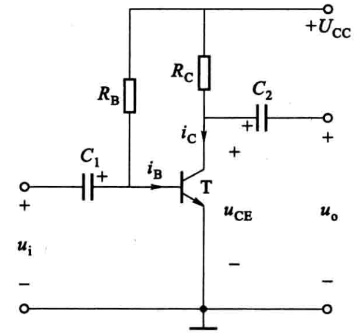
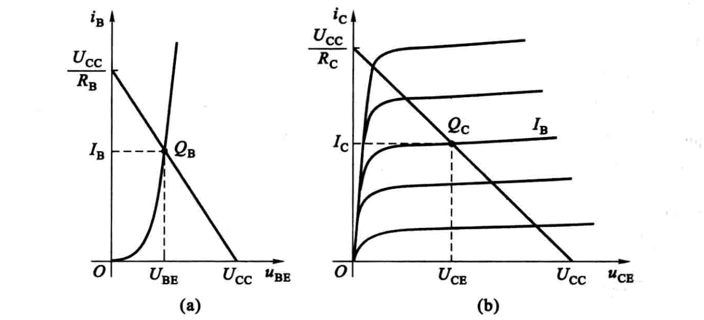
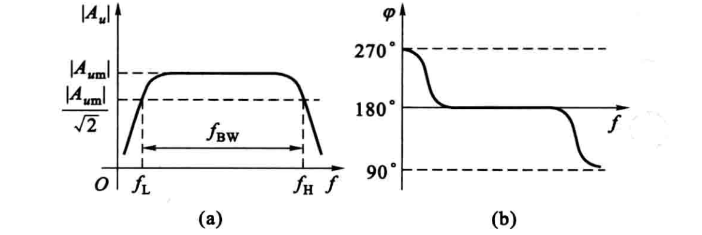
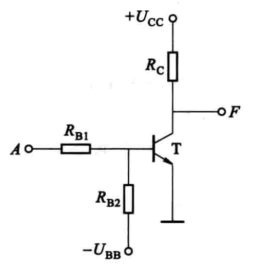
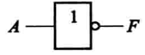

# 分立元件基本电路

## 共发射极放大电路

### 静态分析

当放大器没有输入信号（$u_{i}=0$）时，电路中各处的电压、电流都是直流恒定值，称为直流工作状态或静止状态，简称静态。

在静态时，由于电容 $C_{1},C_{2}$ 的隔直作用，因此只要考虑 $C_{1},C_{2}$ 之间的电路。

对输入电路，其电压方程为

$$
U_{\mathrm{BE}}=U_{\mathrm{CC}}-R_{\mathrm{B}} I_{\mathrm{B}}
$$

该式描述的 $I_{\mathrm{B}}$ 和 $U_{\mathrm{BE}}$ 的关系是一条直线(称为偏置线)。另一方面，$I_{\mathrm{B}}$ 和 $U_{\mathrm{BE}}$ 的关系又要符合晶体管的输入特性曲线。故偏置线和输入特性曲线的交点 $Q_{\text {B }}$ 就称为输入电路的静态工作点，静态工作点对应的基极电流为 $I_{\mathrm{B}}$。

输出电路的电压方程式为

$$
U_{\mathrm{CE}}=U_{\mathrm{CC}}-R_{\mathrm{C}} I_{\mathrm{C}}
$$

式中描述的  $I_{\mathrm{C}}$  和  $U_{\mathrm{CE}}$  的关系也是一条直线(称为负载线)。负载线与基极电流  $I_{\mathrm{B}}$  所对应的晶体管输出特性曲线交点  $Q_{c}$  就是输出电路的静态工作点。

但由于晶体管的输入特性比较陡直，故可近似地认为发射结导通后的电压 $U_{\mathrm{BE}}$ 基本上为一定值（硅管约为0.7V,错管约为0.3V）。

### 动态分析

无输入信号时，晶体管的电流、电压都是直流量。当放大电路输入信号电压后，$i_{B}$、$i_{C}$ 和 $u_{CE}$ 都在原来静态值的基础上叠加了一个交流量。虽然 $i_{B}$、$i_{C}$ 和 $u_{CE}$ 的瞬时值是变化的，但它们的方向始终是不变的。

$$
u_{\mathrm{BE}}=U_{\mathrm{BE}}+u_{\mathrm{i}}
$$

$$
i_{\mathrm{B}}=I_{\mathrm{B}}+i_{\mathrm{b}}
$$

$$
i_{\mathrm{C}}=I_{\mathrm{C}}+i_{\mathrm{c}}
$$

$$
u_{\mathrm{CE}}=U_{\mathrm{CE}}+u_{\mathrm{ce}}
$$

输出电压

$$
u_{\mathrm{o}}=u_{\mathrm{CE}}-U_{\mathrm{CE}}=u_{\mathrm{ce}}
$$

如果忽略耦合电容 $C_{1}, C_{2}$ 对交流分量的容抗和直流电源的内阻,即认为耦合电容和直流电源对交流信号不产生压降，可视为短路，就可以画出只考虑交流分量传递路径的交流通路

晶体管集电极-发射极电压的交流分量

$$
u_{\mathrm{ce}}=-R_{\mathrm{C}} i_{\mathrm{c}}
$$

输出电压 $u_{o}$ 为与 $u_{i}$ 同频率的正弦波，且输出电压的幅度比输入电压，大得多。

电流 $i_{b}$、$i_{c}$ 与输入电压 $u_{i}$ 同相，而输出电压 $u_{o}$ 与输入电压反相，即共发射极放大电路具有倒相作用。

静态工作点的选择必须合适。若选得过高，晶体管很快进入饱和区，输出波形就产生失真，这种失真称为饱和失真；若选得过低，则在输入信号的负半周，$i_{B}$ 波形出现失真，因而晶体管进入截止区，输出波形也产生失真，如图中的订和波形，这种失真称为截止失真。为了得到最大不失真输出，静态工作点应选择在适当的位置，而且输入信号 $u_{i}$ 的大小亦要合适。当输入信号幅度不大时，为了降低直流电源的能量消耗及降低噪声，在保证不产生截止失真和保证一定的电压放大倍数的前提下，可把 $Q$ 点选择得低一些。

### 微变等效电路分析法

当放大电路的输入信号较小，且静态工作点选择合适时，晶体管的工作情况接近于线性状态，电路中各电流、电压的波形基本上是正弦波，因而可以把晶体管这个非线性元件组成的电路当做线性电路来处理，这就是微变等效电路分析法。

(1) 电压放大倍数。电压放大倍数是衡量放大电路对输入信号放大能力的主要指标。它定义为输出电压变化量与输入电压变化量之比

$$
A_{u}=\frac{\Delta U_{\mathrm{o}}}{\Delta U_{\mathrm{i}}}
$$

放大电路输人正弦信号时，可表示为

$$
A_{u}=\frac{\dot{U}_{\mathrm{o}}}{\dot{U}_{\mathrm{i}}}
$$

对于共发射极放大电路

$$
A_{u}=-\frac{\beta R_{\mathrm{c}}}{r_{\mathrm{be}}}
$$

负号表示输出电压与输入电压反相。

(2) 输入电阻。当输入信号电压加到放大电路的输入端时，放大电路就相当于信号源的一个负载电阻，这个负载电阻就是放大电路本身的输入电阻。它
定义为放大电路输入电压变化量与输入电流变化量之比，用符号 $r_{\mathrm{i}}$ 表示。在输入正弦信号时

$$
r_{\mathrm{i}}=\frac{\dot{U}_{\mathrm{i}}}{\dot{I}_{\mathrm{i}}}
$$

对于共发射极放大电路

$$
r_{\mathrm{i}}=R_{\mathrm{B}} / / r_{\mathrm{be}}=\frac{R_{\mathrm{B}} r_{\mathrm{be}}}{R_{\mathrm{B}}+r_{\mathrm{be}}}
$$

(3) 输出电阻。对负载来说，放大电路的输出端相当于一个信号源，此信号源的内阻就是放大电路的输出电阻

对于共发射极放大电路

$$
r_{\mathrm{o}}=R_{\mathrm{C}}
$$

### 静态工作点的稳定

要使放大电路正常而稳定地工作，除了必须选取合适的静态工作点外，还应保持所选的静态工作点基本不变，即要求静态工作点稳定。然而，由于晶体管的参数会随着环境温度而变，电路其他参数也会随着温度或其他因素而变，电路的静态工作点是不稳定的，往往会移动，甚至移到不合适的位置而使放大电路无法正常工作。

图中是一种常用的静态工作点稳定的放大电路

分压式电流负反馈偏置电路

$$
I_{\mathrm{C}} \uparrow \Rightarrow I_{\mathrm{E}} \uparrow \Rightarrow U_{E}=R_{E} I_{\mathrm{E}} \uparrow \Rightarrow U_{B E}=U_{B}-U_{E} \downarrow \Rightarrow I_{\mathrm{B}} \downarrow \Rightarrow I_{\mathrm{C}} \downarrow
$$

### 频率特性

放大电路的输入信号往往不是单一频率的，而是在一段频率范围内。例如语言和音乐信号等都含有丰富的频率成分。这样，放大电路中各种电抗性元件对各种不同频率的信号所呈现的电抗值就不相同，因而放大电路对不同频率信号的放大倍数和相位移也就不完全一样，使得输出信号不能重现输入信号的波形，造成信号的频率失真。放大电路的放大倍数和相位移随频率的变化关系称为放大电路的频率特性。

电压放大倍数是复数，故频率特性又可分为幅频特性和相频特性。前者描述了电压放大倍数  $\left|A_{u}\right|$  与频率  $f$  之间的关系，即  $\left|A_{u}\right|=F(f)$ ；后者反映了输出电压和输人电压之间相位移  $\varphi$  和频率  $f$  之间的关系，即  $\varphi=F^{\prime}(f)$。

## 共集电极放大电路

与共发射极放大电路相比，射极输出器输入电阻较大，说明对输入信号的衰减较少，常用于多级放大电路的输入级。射极输出器输出电阻较小，说明带负载能力较强，常用于小功率多级放大电路的输出级。

## 分立元件组成的基本门电路

门电路是一种开关电路，其输入和输出之间存在一定的因果关系即逻辑关系。

### 二极管或门电路

$$
F=A \cdot B
$$

### 二极管与门电路

$$
F=A+B
$$

### 晶体管及场效晶体管非门电路

- 输入  $U_{A}$  为低电平 $0$ 时,  $U_{B E}<0$ , 晶体管发射结反偏，管子截止， 输出端F为高电平 $1$;
- 输入  $U_{A}$  为高电平时, 管子饱和, 输出端  $F$  为低电平  $0$ .

$$
F=\bar{A}
$$