#! https://zhuanlan.zhihu.com/p/638896936
# 电工电子学复习重点整理

## 电路和电路元件

### 晶体管

**晶体管简化的小信号模型**

$$
r_{\mathrm{be}}=r_{\mathrm{b}}+(\beta+1) \frac{26}{\{I_{\mathrm{E}}\}_{\mathrm{mA}}}
$$

其中，$r_{\mathrm{b}}$为基区电阻。当$I_{E} < 5 \text{mA}$，$r_{\mathrm{b}}=200 \Omega$。

## 电路分析基础

### 电路定律

**基尔霍夫电流定律(KCL)**：在任何电路中，任何结点上的所有支路电流的代数和在任何时刻都等于零

$$
\sum i=0
$$

**基尔霍夫电压定律(KVL)**：在任何电路中，形成任何一个回路的所有支路沿同一循行方向电压的代数和在任何时刻都等于零

$$
\sum u=0
$$

**叠加定理**：对于一个线性电路来说，由几个独立电源共同作用所产生的某一支路的电流或电压，等于各个独立电源单独作用时分别在该支路所产生的电流或电压的代数和。当其中某一个独立电源单独作用时，其余的独立电源应除去(电压源予以短路，电流源予以开路)。

在含有受控源的电路中，因受控源不是独立电源，不能单独作用。在某个独立电源单独作用而除去其余独立电源时，受控源不能除去，仍要保留在电路中。

**等效电源定理**

具有两个接线端的部分电路，称为**二端网络**。二端网络还视其内部是否包含电源而分为有源二端网络和无源二端网络。

以 $N_{A}$ 表示有源二端网络，$N_{P}$ 表示无源二端网络。

对于无源二端网络，一般情况下，等效电路为一条无源支路，可用一等效电阻表示。

戴维宁定理：对外电路来说，一个线性有源二端网络可用一个电压源和一个电阻串联的电路来等效，该电压源的电压等于此有源二端网络的开路电压 $U_{OC}$，串联电阻等于此有源二端网络除去独立电源后在其端口处的等效电阻$R_{0}$。

诺顿定理：对外电路来说，一个线性有源二端网络可用一个电流源和一个电阻并联的电路来等效，该电流源的电流等于此有源二端网络的短路电流$I_{SC}$，并联电阻等于此有源二端网络除去独立电源后在其端口处的等效电阻$R_{0}$。

$$
R_{0}=\frac{U_{\mathrm{OC}}}{I_{\mathrm{SC}}}
$$

当有源二端网络中含有受控源时，除去独立电源以后，受控源仍保留在网络中，这时应该用上式计算等效电阻 $R_{0}$，而不能用电阻的串、并联化简的方法求出。

### 正弦交流电路

#### 用相量表示正弦量

随时间按正弦规律变化的电压和电流称为正弦交流电，可以表示为

$$
\left.\begin{array}{c}
u=U_{\mathrm{m}} \sin \left(\omega t+\varphi_{u}\right) \\
i=I_{\mathrm{m}} \sin \left(\omega t+\varphi_{i}\right)
\end{array}\right\}
$$

最大值、角频率、初相位称为正弦量的三要素。

与周期、频率的关系

$$
\omega=\frac{2 \pi}{T}=2 \pi f
$$

有效值的计算

$$
I=\frac{I_{\mathrm{m}}}{\sqrt{2}} ,\quad U=\frac{U_{\mathrm{m}}}{\sqrt{2}}
$$

设有个正弦电压为$u=\sqrt{2} U \sin \left(\omega t+\varphi_{u}\right)$，那么表示该正弦电压的复数就是

$$
\dot{U}=U e^{\mathrm{j} \varphi_{u}}=U \angle \varphi_{u}
$$

同样，若正线电流为$i=\sqrt{2} I \sin \left(\omega t+\varphi_{i}\right)$，那么表示该正弦电流的复数就是

$$
\dot{I}=I e^{\mathrm{j} \varphi_{i}}=I \angle \varphi_{i}
$$

注意这是表示正弦量的复数，而不是普通的复数。表示正弦量的复数$\dot{U}, \dot{I}$称为**相量**。相量法适用于**同频率**的正弦量计算。只有在各个正弦量均为同一频率时，各正弦量变换成相量进行运算才有意义。

#### 各元件上电压与电流关系的相量形式

**电阻**

电阻两端的电压 $u$ 与流过该电阻的电流$i$ 是同频率正弦量

$u$ 与$i$ 同相位

其瞬时值、有效值和相量均服从欧姆定律

**电感**

电感两端的电压$u$ 与电流$i$ 是同频率正弦量

$$\varphi_{u}=\varphi_{i}+90^{\circ}$$

$$U=\omega L I$$

即

$$
\dot{U} =\mathrm{j} X_{L} \dot{I}
$$

其中

$$
X_{L}=\omega L=2 \pi f L
$$

称为电感抗，简称感抗，具有电阻的量纲，单位也是欧($\Omega$)

**电容**

电容两端的电压$u$ 与电流$i$ 是同频率正弦量

$$
\dot{U}=-\mathrm{j} X_{C} \dot{I}
$$

其中

$$
X_{C}=\frac{1}{\omega C}=\frac{1}{2 \pi f C}
$$

称为电容抗，简称容抗，具有电阻的量纲，单位也是欧($\Omega$)

感抗和容抗都等于电源与电流有效值之比。

#### 简单正弦交流电路的计算

**基尔霍夫定律的相量形式**

KCL的相量形式为

$$
\sum \dot{I}=0
$$

KVL的相量形式为

$$
\sum \dot{U}=0
$$

**阻抗(复阻抗)**

电阻、电感、电容串联时，产生阻抗

$$
Z=R+\mathrm{j} X=R+\mathrm{j}\left(X_{L}-X_{C}\right)
$$

是一个复数，$X$ 称电抗。

阻抗的模$|Z|$称为阻抗模，辐角$\varphi$ 称为阻抗角

$$
|Z|=\sqrt{R^{2}+X^{2}}=\sqrt{R^{2}+\left(X_{L}-X_{C}\right)^{2}}
$$

$$
\varphi=\arctan \left(\frac{X}{R}\right)=\arctan \left(\frac{X_{L}-X_{C}}{R}\right)
$$

当 $X > 0$，$\varphi > 0$，$i$ 滞后于$u$，电路为电感性；
当 $X < 0$，$\varphi < 0$，$i$ 超前于$u$，电路为电容性；
当 $X = 0$，$\varphi = 0$，$i$ 与$u$ 同相位，电路为电阻性或处于(串联)谐振状态。

电压与电流的有效值之比等于阻抗模，电压与电流之间的相位差等于阻抗角
$$
\dot{U} = Z \dot{I}
$$

由于在串联电路中流过R、L、C 的电流相同，通常画相量图时先画$\dot{I}$ 相量(因其初相位$\varphi_{i}$ 没有给定，故可设$\varphi_{i} = 0$,然后依次画出$\dot{U}_{R}$(和$\varphi_{i}$ 同相)、$\dot{U}_{L}$(超前$\varphi_{i}$ $90^{\circ}$)、$\dot{U}_{C}$(滞后$\varphi_{i}$ $90^{\circ}$)，最后根据矢量求和的关系，将画出$\dot{U}$。

**阻抗的串联和并联**

阻抗串联或并联后，其等效阻抗的计算公式和电阻串联或并联后等效电阻的计算公式是相似的，但计算时必须按复数运算的方法进行运算。

当$n$个阻抗相串联时，等效阻抗$Z$ 为

$$
Z=\sum_{i=1}^{n} Z_{i}=\sum_{i=1}^{n} R_{i}+\mathrm{j} \sum_{i=1}^{n} X_{i}
$$

当$n$个阻抗相并联时，等效阻抗$Z$ 为

$$
\frac{1}{Z}=\frac{1}{Z_{1}}+\frac{1}{Z_{2}}+\cdots+\frac{1}{Z_{n-1}}+\frac{1}{Z_{n}}=\sum_{k=1}^{n} \frac{1}{Z_{k}}
$$

在正弦交流电路中应用相量法之后，直流电路的分析方法都可采用。直流电路的计算公式中，只要把电阻、电压和电流改为阻抗、电压相量和电流相量，就成为正弦交流电路的计算公式。

**交流电路的功率**

**瞬时功率**

$$
p = u i
$$

电路在电流变化一个周期内负载吸收功率的平均值称为平均功率或**有功功率**

$$
P=\frac{1}{T} \int_{0}^{T} p \mathrm{~d} t
$$

对于正弦电路

$$
P=U I \cos \varphi
$$

$\varphi$ 为电压与电流的相位差。$\cos \varphi$ 称为功率因数(用$\lambda$ 表示)，$\varphi$ 称为功率因数角，两者都由负载的性质决定。

电路中的电感和电容并不消耗功率，只是起能量吞吐作用。电路中的平均功率等于电阻所消耗的功率，因此平均功率又称为有功功率。

电路的电压有效值与电流有效值的乘积，称为电路的**视在功率**

$$
S=U I
$$

有功功率、无功功率、视在功率三者关系

$$
P=S \cos \varphi,\quad Q=S \sin \varphi,\quad S=\sqrt{P^{2}+Q^{2}}
$$

功率因数

$$
\lambda = \frac{P}{S}
$$

由于工业上大量的设备均为感性负载，因此常采用并联电容器的方法来提高功率因数。

### 三相交流电路

#### 三相电源

三相电源 —— 由三个幅值相等、频率相同、相位互差 120 ° 的单相交流电源构成。

三相电路 —— 由三相电源供电的电路。

三相电源一般来自发电机(自供电情况)或变压器二次侧的三个**绕组**，如图所示。图中所标 $U_1, V_1, W_1$ 为三个绕组的**始端**，$U_2, V_2, W_2$ 为绕组的**末端**。若将三个绕组的末端连接在一起，便形成星形联结。三个绕组的连接点称为**中性点**或零点。从中性点引出的导线，称为**中性线**或零线，有时中性线接地。中性线用字母 $N$ 表示。三相绕组的三个始端引出的线称为**相线**或端线，又称为火线，分别用字母 $L_1, L_2, L_3$ 表示。引出中性线的电源称为三相四线制电源，其供电方式称为三相四线制。不引出中性线的供电方式，称为三相三线制。

三相电源**相电压**的瞬时值表达式为

$$
\begin{array}{l}
u_{\mathrm{U}}=\sqrt{2} U_{\mathrm{P}} \sin \omega t \\
u_{\mathrm{V}}=\sqrt{2} U_{\mathrm{P}} \sin \left(\omega t-120^{\circ}\right) \\
u_{\mathrm{W}}=\sqrt{2} U_{\mathrm{P}} \sin \left(\omega t-240^{\circ}\right)
\end{array}
$$

相量表示

$$
\begin{array}{l}
\dot{U}_{\mathrm{U}}=U_{\mathrm{P}} \angle(0^{\circ}) \\
\dot{U}_{\mathrm{V}}=U_{\mathrm{P}} \angle(-120^{\circ}) \\
\dot{U}_{\mathrm{W}}=U_{\mathrm{P}} \angle(-240^{\circ})
\end{array}
$$

$U_{\mathrm{P}}$ 为相电压有效值。

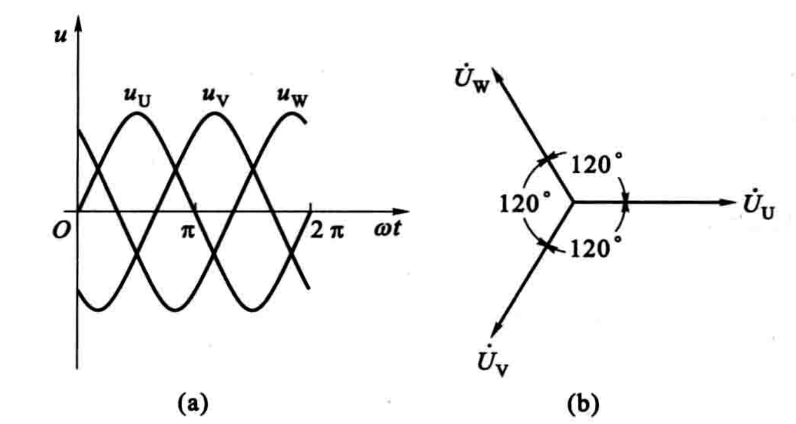

相线之间的电压  $\dot{U}_{\mathrm{UV}}$ 、 $\dot{U}_{\mathrm{VW}}$ 、 $\dot{U}_{\mathrm{WV}}$  称为**线电压**, 它们的有效值用  $U_{\mathrm{L}}$  表示，$U_{\mathrm{L}}=\sqrt{3} U_{\mathrm{P}}$。

$$
\begin{array}{l}
\dot{U}_{\mathrm{UV}}=\sqrt{3} U_{\mathrm{P}} \angle(30^{\circ}) \\
\dot{U}_{\mathrm{VW}}=\sqrt{3} U_{\mathrm{P}} \angle(-90^{\circ}) \\
\dot{U}_{\mathrm{WU}}=\sqrt{3} U_{\mathrm{P}} \angle(-210^{\circ})
\end{array}
$$

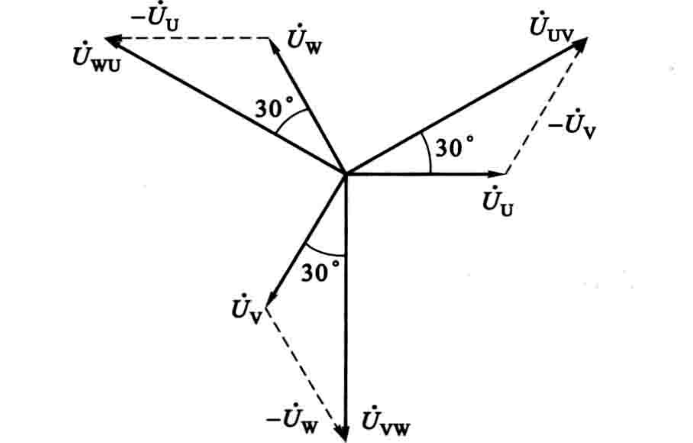

#### 三相电路的计算

- 三相电路的有功功率  $P$  等于各相有功功率之和
- 相负载的无功功率  $Q$  也等于各相无功功率之和
- 三相负载的视在功率 $S=\sqrt{P^{2}+Q^{2}}$

### 一阶电路的瞬态分析

#### 换路定律

电路与电源的接通、断开，或电路参数、结构的改变统称为**换路**。

在电路分析中，通常规定换路在瞬间完成。

换路定律：

（1）换路前后，电容上的电压不能突变
（2）换路前后，电感上的电流不能突变

换路定律的依据是能量不能突变，否则功率会无穷大

#### RC 电路的瞬态分析

时间常数

$$
\tau=R C
$$

则物理量随时间变化

$$
f(t)=f(\infty)+\left[f\left(0^{+}\right)-f(\infty)\right] \mathrm{e}^{-\frac{t}{\tau}} \quad(t>0)
$$

#### RL 电路的瞬态分析

时间常数

$$
\tau=\frac{L}{R}
$$

## 分立元件基本电路

### 共发射极放大电路

当放大器没有输入信号（$u_{i}=0$）时，电路中各处的电压、电流都是直流恒定值，称为直流工作状态或静止状态，简称静态。无输入信号时，晶体管的电流、电压都是直流量。当放大电路输入信号电压后，$i_{B}$、$i_{C}$ 和 $u_{CE}$ 都在原来静态值的基础上叠加了一个交流量。虽然 $i_{B}$、$i_{C}$ 和 $u_{CE}$ 的瞬时值是变化的，但它们的方向始终是不变的。

静态工作点  $Q$  的选择必须合适。选得过高，饱和失真；选得过低，截止失真。当输入信号幅度不大时，为了降低直流电源的能量消耗及降低噪声，在保证不产生截止失真和保证一定的电压放大倍数的前提下，可把 $Q$ 点选择得低一些。

电压放大倍数

$$
A_{u}=\frac{\Delta U_{\mathrm{o}}}{\Delta U_{\mathrm{i}}}
$$

对于共发射极放大电路

$$
A_{u}=-\frac{\beta R_{\mathrm{c}}}{r_{\mathrm{be}}}
$$

输入电阻

$$
r_{\mathrm{i}}=\frac{\dot{U}_{\mathrm{i}}}{\dot{I}_{\mathrm{i}}}
$$

对于共发射极放大电路

$$
r_{\mathrm{i}}=R_{\mathrm{B}} / / r_{\mathrm{be}}=\frac{R_{\mathrm{B}} r_{\mathrm{be}}}{R_{\mathrm{B}}+r_{\mathrm{be}}}
$$

输出电阻

对于共发射极放大电路

$$
r_{\mathrm{o}}=R_{\mathrm{C}}
$$

### 共集电极放大电路

$$
R_{\mathrm{L}}^{\prime}=R_{\mathrm{E}} / / R_{\mathrm{L}}
$$

$$
A_{u}=\frac{(1+\beta) R_{\mathrm{L}}^{\prime}}{r_{\mathrm{be}}+(1+\beta) R_{\mathrm{L}}^{\prime}}
$$

$$
r_{\mathrm{i}}=R_{\mathrm{B}} / /\left[r_{\mathrm{be}}+(1+\beta) R_{\mathrm{L}}^{\prime}\right]
$$

$$
R_{\mathrm{S}}^{\prime}=R_{\mathrm{S}} / / R_{\mathrm{B}}
$$

$$
r_{\mathrm{o}}=R_{\mathrm{E}} / / \frac{r_{\mathrm{be}}+R_{\mathrm{S}}^{\prime}}{1+\beta}
$$

与共发射极放大电路相比，射极输出器输入电阻较大，说明对输入信号的衰减较少，常用于多级放大电路的输入级。射极输出器输出电阻较小，说明带负载能力较强，常用于小功率多级放大电路的输出级。

## 数字集成电路

### 逻辑代数运算规则

逻辑代数有三种基本的逻辑运算：与运算、或运算和非运算，其他的各种逻辑运算都可以由这三种基本运算组成。

### 集成门电路

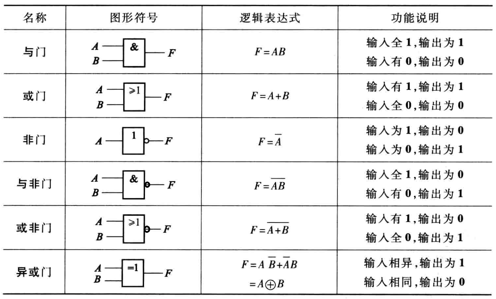

**TTL三态与非门电路**

在 (a) 图中  $\overline{E N}=1$  时,  $F$  为高阻态, 在  $\overline{E N}=0$  时  $F=\overline{A B}$  ，故称为控制端低电平时有效的三态与非门。

在 (b) 图中  $E N=0$  时,  $F$  为高阻态, 在  $E N=1$  时  $F=\overline{A B}$ , 故称为控制端高电平时有效的三态与非门。

### 集成触发器

**正边沿触发的 D 触发器**

边沿触发是指触发器的次态仅由时钟脉冲的**上升沿**或**下降沿**来到时的输入信号决定，在此以前或以后输入信号的变化不会影响触发器的状态。

边沿触发器分为正边沿（上升沿）触发器和负边沿（下降沿）触发器两类。

图为正边沿 D 触发器的图形符号。注意图中方框内 C1 处有一个符号 “^”,表示 C1 的输入由 0 变 1 (上升沿)时, 1D 的输入起作用。

$\bar{S}_{\mathrm{d}}$ 、 $\bar{R}_{\mathrm{d}}$  不受  CP  的控制和  $S$ 、 $R$  的影响, 称为异步输入端, 可以使触发器直接置位或复位。当  $\bar{S}_{\mathrm{d}}=0$ 、 $\bar{R}_{\mathrm{d}}=1$  时,  $Q=1$ , 直接置位; 当  $\bar{S}_{\mathrm{d}}=   1$ 、 $\bar{R}_{\mathrm{d}}=0$  时,  $Q=0$ , 直接复位。所以  $\bar{S}_{\mathrm{d}}$  和  $\bar{R}_{\mathrm{d}}$  分别称为直接置位输入端和直接复位输入端, 它们都是低电平或负脉冲时有效。  $\bar{S}_{\mathrm{d}}$  、  $\bar{R}_{\mathrm{d}}$  常用来设置所需要的初始状态, 一般应在时钟脉冲到来之前设定触发器的初始状态。不作用时,  $\bar{S}_{\mathrm{d}}$  和  $\bar{R}_{\mathrm{d}}$  都应设置成高电平。

特性方程

$$
Q^{n+1}=D
$$

**负边沿触发的 JK 触发器**

图中是负边沿  JK  触发器的图形符号, 其中图  (b) 中的  J 、 K  各有两个输入端 (也可能为多个输入端), 它们之间是与逻辑关系, 即  $J=J_{1} J_{2}$, $K=   K_{1} K_{2}$  。图中  $\bar{S}_{\mathrm{d}}$  是直接置位端,  $\bar{R}_{\mathrm{d}}$  是直接复位端,  CP  是时钟脉冲输入端。  CP  端靠近方框处有一小圆圈, 加上方框内的符号 “^”, 表示  CP  信号从高电平到低电平时有效, 即属负边沿(下降沿)触发。

特性方程为

$$
Q^{n+1} =J \bar{Q}^{n}+\bar{K} Q^{n}
$$

### 时序逻辑电路

- 输出方程：组合逻辑电路对外输出的逻辑表达式
- 驱动方程：各个触发器输入端的逻辑函数表达式
- 状态方程：各个触发器的驱动方程代入触发器的特性方程得到

根据状态方程和输出方程，列出逻辑状态转换表，画出波形图，确定该时序电路的状态变化规律和逻辑功能。

## 集成运算放大器

### 电压传输特性

一个线性区和两个饱和区

在线性区工作时

$$
u_{0}=A_{0} u_{\mathrm{i}}=A_{0}\left(u_{+}-u_{-}\right)
$$

线性工作区模型, 即为电压控制电压源的模型

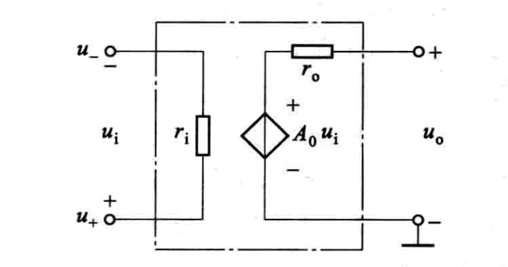

$r_{i}$  为输入电阻,  $r_{o}$  为输出电阻,  $A_{0}$  为开环差模电压放大倍数。

### 理想特性

- 开环电压增益  $A_{0} \rightarrow \infty$ 
- 输入电阻  $r_{i} \rightarrow \infty$ 
- 输出电阻  $r_{o} \rightarrow 0$ 
- 共模抑制比  $K_{\text {CMR }} \rightarrow \infty$ 

由于输入电阻很大,  $i_{+}=i_{-} \approx 0$ 

工作在线性区时，由于开环电压增益很大，而输出电压为有限值，  $u_{+} \approx u_{-}$

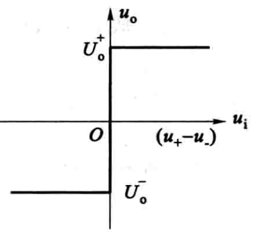

- 开环工作-饱和区
- 闭环正反馈-饱和区
- 闭环负反馈-线性区

### 放大电路中的负反馈

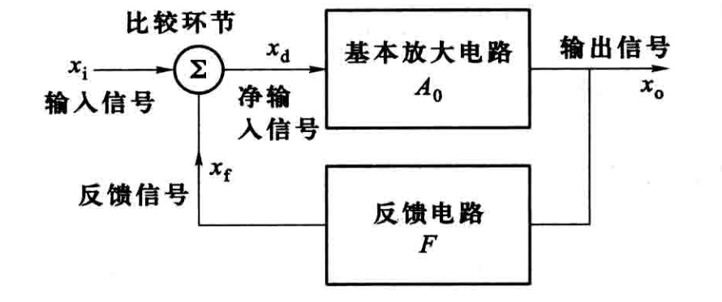

- 对于负反馈  $x_{d}=x_{i}-x_{f}$ 
- 反馈系数  $F=\dfrac{x_{f}}{x_{o}}$ 
- 开环放大倍数  $A_{0}=\dfrac{x_{o}}{x_{d}}$ 
- 闭环放大倍数  $A_{f}=\dfrac{x_{o}}{x_{i}}=\dfrac{A_{0} x_{d}}{x_{d}\left(1+F A_{0}\right)}=\dfrac{A_{0}}{1+F A_{0}}$ 
- 当  $\left|1+F A_{0}\right| \gg 1$  (深度负反馈)  $A_{f}=\dfrac{A_{0}}{1+F A_{0}} \approx \dfrac{A_{0}}{F A_{0}}=\dfrac{1}{F}$ 

**电压串联负反馈**

输入回路  $u_{d}=u_{i}-u_{f}$ 

反馈电压  $u_{f}=\dfrac{R}{R+R_{f}} u_{o}$ 

**电流并联负反馈**

输入回路  $i_{d}=i_{i}-i_{f}$ 

反馈电流  $i_{f}=\dfrac{R}{R+R_{f}} i_{o}$ 

**电压并联负反馈**

输入回路  $i_{d}=i_{i}-i_{f}$  

反馈电流  $i_{f}=\dfrac{u_{-}-u_{o}}{R_{f}}$ 

**电流串联负反馈**

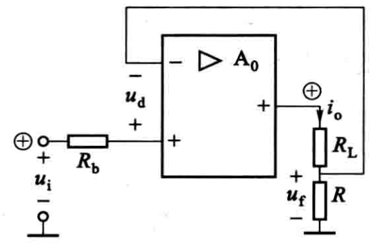

输入回路  $u_{d}=u_{i}-u_{f}$  

反馈电压  $u_{f} \approx R i_{o}$ 

**负反馈对放大电路性能的影响**

- 提高放大倍数的稳定性
- 减小非线性失真
- 扩展通频带
- 改变输入电阻和输出电阻

串联反馈 输入电阻增大
并联反馈 输入电阻减小
电压反馈 输出电阻减小
电流反馈 输出电阻增大

### 集成运放在模拟信号运算方面的应用

pass

## 波形产生与变换

波形产生电路的共同特点

- 自激（不需要任何输入信号）
- 必须在电路中引入足够强的正反馈

(1) 相位平衡条件  $\varphi_{A}+\varphi_{F}=2 n \pi, \quad n=0,1,2, \cdots$ 

(2) 幅值平衡条件  $\quad|A F|=1$ 

相位平衡条件保证反馈极性为正反馈，而幅值平衡条件保证反馈有足够的
强度。

正弦波振荡电路应包含放大、反馈、选频、稳幅四个环节。

### RC 正弦波振荡电路

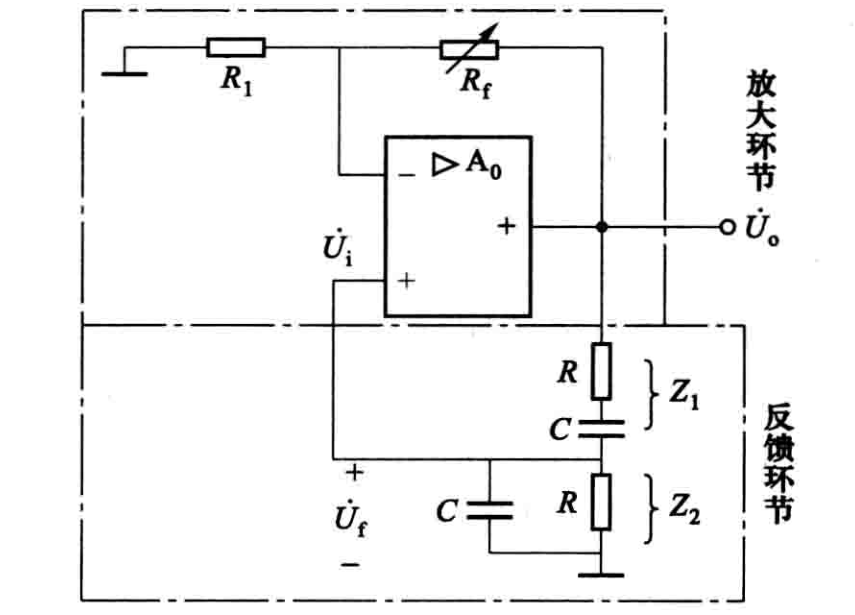

$R C$  串并联网络既控制着集成运放正反馈量的大小, 又决定了电路的振荡频率, 当信号频率为

$$
f_{0}=\frac{1}{2 \pi R C}
$$

时, 满足自激振荡的相位平衡条件

- $Z_{2}$  的电压  $U_{\mathrm{f}}=\dfrac{1}{3} U_{\mathrm{o}}$
- $\dot{U}_{\mathrm{f}}=\dot{U}_{\mathrm{i}}$  与  $\dot{U}_{\mathrm{o}}$  同相

当反馈系数

$$
F=\frac{U_{\mathrm{f}}}{U_{\mathrm{o}}}=\frac{1}{3}
$$

时, 能够满足幅值平衡条件。

电压放大倍数

$$
A=1+\frac{R_{\mathrm{f}}}{R_{1}}=3
$$

$$
R_{\mathrm{f}}=2 R_{1}
$$

### 用集成运放构成的多谐振荡器

当电路接通电源瞬间, 电容电压  $u_{c}=0$ , 集成运放处于正饱和还是负饱和纯属偶然。假设因双向稳压管的正、负向稳定电压均为  $U_{\mathrm{Z}}$ , 这时  $u_{0}= \pm U_{Z}$  .

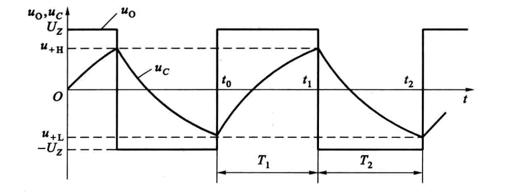

$$
T_{1}=R C \ln \left(1+\frac{2 R_{1}}{R_{2}}\right)
$$

$$
T_{2}=R C \ln \left(1+\frac{2 R_{1}}{R_{2}}\right)
$$

$$
T=2 R C \ln \left(1+\frac{2 R_{1}}{R_{2}}\right)
$$

定义矩形波高电平的时间与周期之比的百分值为矩形波的**占空比**。

$$
T_{1}=R_{P}^{\prime} C \ln \left(1+\frac{2 R_{1}}{R_{2}}\right)
$$

$$
T_{2}=R_{P}^{\prime \prime} C \ln \left(1+\frac{2 R_{1}}{R_{2}}\right)
$$

$$
T=R_{P} C \ln \left(1+\frac{2 R_{1}}{R_{2}}\right)
$$

### 555集成定时器

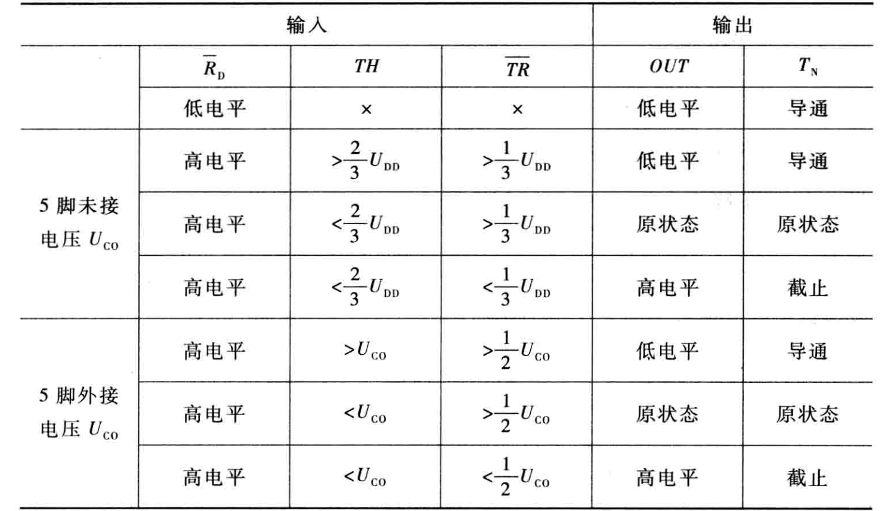

#### 用 555 集成定时器构成的多谐振荡器

$$
T_{1}=\left(R_{1}+R_{2}\right) C \ln 2 \approx 0.693\left(R_{1}+R_{2}\right) C
$$

$$
T_{2}=R_{2} C \ln 2 \approx 0.693 R_{2} C
$$

#### 用555集成定时器构成的单稳态触发器

- 多谐振荡器没有稳定状态， 属无稳触发器。
- 双稳态触发器，有两个稳定状态，从一个稳态翻转为另一个稳态必须靠脉冲信号触发，脉冲消失后，稳态一直保持。
- 单稳态触发器在脉冲信号未加之前，处于稳定状态，经信号触发后，触发器翻转到新的状态，经过一定延时后触发器又自动翻转到原来的稳定状。所以只有一种稳定状态。

$$
t_{\mathrm{w}}=R C \ln 3 \approx 1.1 R C
$$

####  用 555 集成定时器构成的施密特触发器

施密特触发器有两个稳定状态，是一种双稳态触发器

- 不具有记忆保持功能，其稳定状态依赖输入信号来维持
- 它属于电平触发，而不是脉冲触发
- 两种状态翻转时的输入电压(称阈值电压)不同

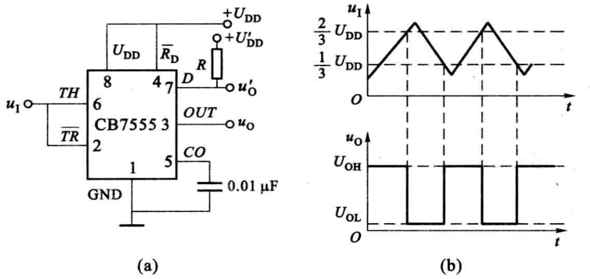

## 功率电子电路

### 功放电路中晶体管的工作状态

对功放电路的要求：

(1) 输出功率尽可能大, 即输出电流和输出电压都要尽可能大, 因此功率管通常工作在近于极限状态

(2) 非线性失真尽可能小，通常用负反馈等措施来实现

(3) 效率要高

$$
\eta=\frac{P_{O}}{P_{S}} \times 100 \%
$$

因此集电极功耗要尽可能小

$$
P_{C}=\frac{1}{T} \int_{0}^{T} u_{C E} i_{C} d t
$$

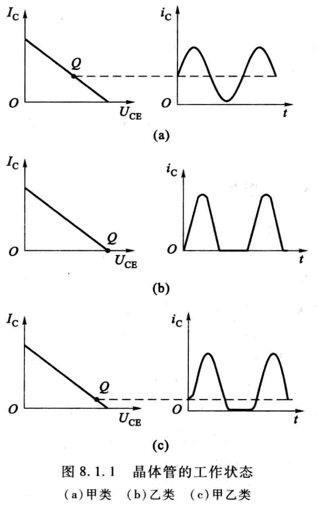

(a) 甲类：波形好，但管耗大， 效率低

(b) 乙类:  I_{C}  为零, 因此管耗小, 但波形严重失真

(c) 甲乙类：介于甲、乙类之 间, 可消除交越失真, 功放电路常用的工作状态

### 基本功放电路——互补对称电路

#### OCL 电路

输入信号足够大，$\mathrm{T}_{1}$、$\mathrm{~T}_{2}$  饱和，饱和压降  $U_{\mathrm{CES}}$。输出电压  $u_{\mathrm{o}}$  的最大值  $U_{\mathrm{om}}=U_{\mathrm{CC}}-U_{\mathrm{CES}}$。

最大输出功率

$$
P_{\text {omax }}=\frac{\left(U_{o m} / \sqrt{2}\right)^{2}}{R_{L}}=\frac{1}{2} \frac{\left(U_{C C}-U_{C E S}\right)^{2}}{R_{L}}
$$

直流电源功率

$$
P_{S}=2 \times \frac{1}{2 \pi} \int_{0}^{\pi} U_{C C} I_{c m} \sin \omega t d(\omega t)=\frac{2}{\pi} \frac{U_{C C}\left(U_{C C}-U_{C E S}\right)}{R_{L}}
$$

在输出达到最大功率时相应的效率为

$$
\eta_{\max }=\frac{P_{\text {omax }}}{P_{\mathrm{S}}} \times 100 \%=\frac{\pi}{4} \frac{U_{\mathrm{CC}}-U_{\mathrm{CES}}}{U_{\mathrm{CC}}} \times 100 \%
$$

忽略饱和压降

$$
\eta_{\max }=\frac{\pi}{4} \times 100 \%=78.5 \%
$$

**集成运放 + OCL 电路**

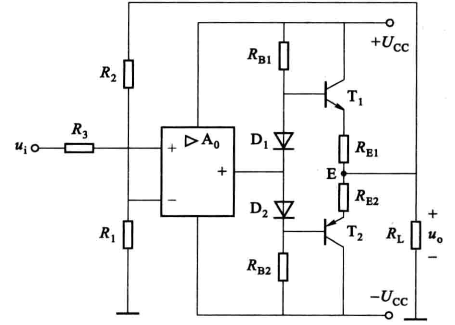

电压放大倍数

$$
A_{\mathrm{u}} \approx 1+\frac{R_{2}}{R_{1}}
$$

#### OTL 电路

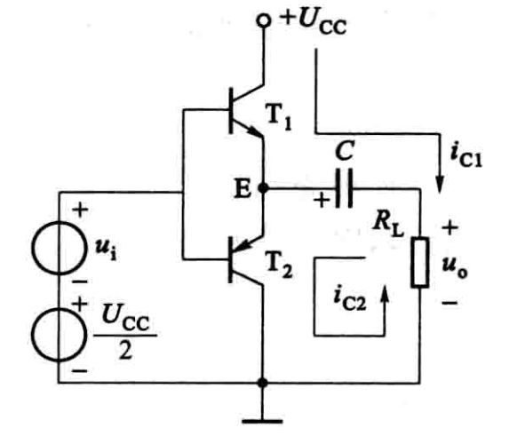

$$
U_{\mathrm{om}}=\frac{1}{2} U_{\mathrm{CC}}-U_{\mathrm{CES}}
$$

$$
P_{\mathrm{omax}}=\frac{\left(\frac{\frac{1}{2} U_{\mathrm{CC}}-U_{\mathrm{CES}}}{\sqrt{2}}\right)^{2}}{R_{\mathrm{L}}}=\frac{1}{8}\frac{\left(U_{\mathrm{CC}}-2 U_{\mathrm{CES}}\right)^{2}}{R_{\mathrm{L}}}
$$

$$
P_{\mathrm{s}}=\frac{1}{\pi} U_{\mathrm{CC}} I_{\mathrm{cm}}=\frac{1}{\pi} \frac{U_{\mathrm{CC}}\left(\frac{1}{2} U_{\mathrm{CC}}-U_{\mathrm{CES}}\right)}{R_{\mathrm{L}}}=\frac{1}{2 \pi} \frac{U_{\mathrm{CC}}\left(U_{\mathrm{CC}}-2 U_{\mathrm{CES}}\right)}{R_{\mathrm{L}}}
$$

$$
\eta_{\max }=\frac{P_{\mathrm{omax}}}{P_{\mathrm{s}}}=\frac{\pi}{4} \frac{U_{\mathrm{CC}}-2 U_{\mathrm{CES}}}{R_{\mathrm{L}}}
$$

**集成运放 + OTL 电路**

$$
A_{\mathrm{u}} \approx 1+\frac{R_{2}}{R_{1}}
$$

### 直流稳压电源

#### 单相桥式整流电路

负载电阻  $R_{\mathrm{L}}$  上所得单向脉动电压的平均值 (即直流分量)

$$
U_{\mathrm{L}}=\frac{1}{\pi} \int_{0}^{\pi} \sqrt{2} U_{2} \sin \omega t \mathrm{~d}(\omega t)=\frac{2 \sqrt{2}}{\pi} U_{2} \approx 0.9 U_{2}
$$

流过负载电阻  $R_{\mathrm{L}}$  的电流  $i_{\mathrm{L}}$  的平均值

$$
I_{\mathrm{L}}=\frac{U_{\mathrm{L}}}{R_{\mathrm{L}}}=0.9 \frac{U_{2}}{R_{\mathrm{L}}}
$$

通过每个二极管的电流平均值为负载电 流平均值的一半, 即

$$
I_{\mathrm{D}}=\frac{1}{2} I_{\mathrm{L}}=0.45 \frac{U_{2}}{R_{\mathrm{L}}}
$$

每个整流二极管所承受的最大反向电压为

$$
U_{\mathrm{DRM}}=\sqrt{2} U_{2}
$$

通过变压器二次侧的电流  $i_{2}$  仍为正弦波, 其有效值

$$
I_{2}=\frac{U_{2}}{R_{\mathrm{L}}}=\frac{U_{\mathrm{L}}}{0.9 R_{\mathrm{L}}}=1.11 I_{\mathrm{L}}
$$

电源变压器的容量 (即视在功率)

$$
S=U_{2} I_{2}
$$

#### 滤波电路

在  $R_{\mathrm{L}} C \geqslant(3 \sim 5) T / 2$  ( $T$  为  $u_{2}$  的周期) 时,负载电压的平均值可按下式估算

$$
U_{\mathrm{L}} \approx 1.2 U_{2}
$$

#### 稳压电路

**串联型稳压电路**

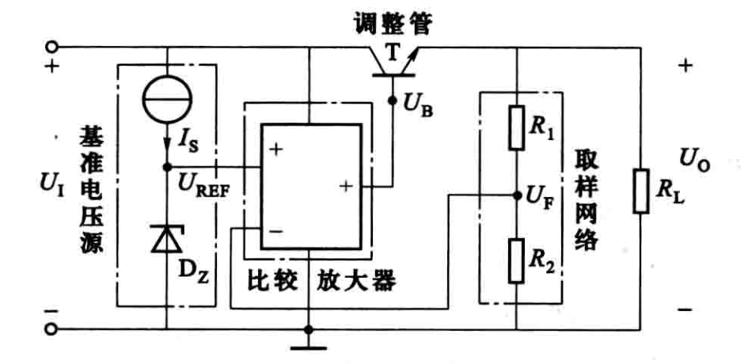

$$
U_{0}=\frac{R_{1}+R_{2}}{R_{2}} U_{\mathrm{REF}}
$$

**固定输出三端集成稳压器**

- 国家标准系列品种, 其中 CW7800 系列输出正电压, CW7900 系列输出负电压
- 对于具体器件, 符号中 “00” 用数字代替, 表示输出电压绝对值。
- 输入电压至少高于输出电压  $2 \sim 3 \mathrm{~V}$

**可调式三端集成稳压器**

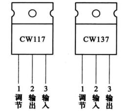

- CW117 的输入、输出为正电压, CW137 的输入、输出为负电压
- 在输出端与调节端之间具有 1.25 V (典型值) 基准电压
- 调节端电流极小

CW117 接成输出电压连续可调的基本电路

$$
U_{\mathrm{O}} \approx U_{21}+I_{1} R_{2}=1.25\left(1+\frac{R_{2}}{R_{1}}\right)
$$

## 变压器和电动机

### 变压器

$$
\frac{U_{1}}{U_{20}} \approx \frac{N_{1}}{N_{2}}=k
$$

式中,  $k$  称为变压比, 简称为变比。

$$
I_{1} \approx \frac{N_{2}}{N_{1}} I_{2}=\frac{1}{k} I_{2}
$$

$$
Z_{\mathrm{L}}^{\prime}=\left(\frac{N_{1}}{N_{2}}\right)^{2} Z_{\mathrm{L}}
$$

式说明, 接在二次绕组的负载阻抗  $Z_{\mathrm{L}}$  对一次侧的影响, 可以用一个接于一次绕组的等效阻抗  $Z_{\mathrm{L}}^{\prime}$  来代替, 等效阻抗  $Z_{\mathrm{L}}^{\prime}$  等于  $Z_{\mathrm{L}}$  的  $k^{2}$  倍。

#### 变压器的外特性

变压器一次电压  $U_{1}$  为额定值时,  $U_{2}=f\left(I_{2}\right)$  的关系曲线称为变压器的外特性。

#### 变压器的损耗和效率

变压器的输出功率  $P_{2}$  和输入功率  $P_{1}$  之比称为变压器的效率, 通常用百分数表示

$$
\eta=\frac{P_{2}}{P_{1}} \times 100 \%=\frac{P_{2}}{P_{2}+P_{\mathrm{Fe}}+P_{\mathrm{Cu}}} \times 100 \%
$$

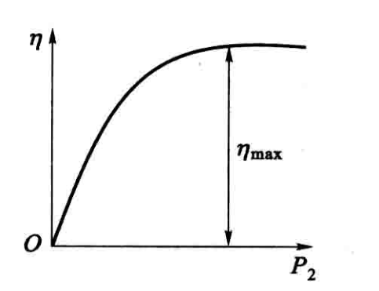

#### 变压器的额定值

额定电压  $U_{1 \mathrm{~N}} / U_{2 \mathrm{~N}}$

额定电流  $I_{1 \mathrm{~N}} / I_{2 \mathrm{~N}}$

额定容量  $S_{\mathrm{N}}$ , 额定容量即额定视在功率, 表示变压器输出电功率的能力

对于单相变压器

$$
S_{\mathrm{N}}=U_{2 \mathrm{~N}} I_{2 \mathrm{~N}}
$$

对于三相变压器

$$
S_{\mathrm{N}}=\sqrt{3} U_{2 \mathrm{~N}} I_{2 \mathrm{~N}}
$$

式中的  $U_{2 \mathrm{~N}}$ 、 $I_{2 \mathrm{~N}}$  为线电压和线电流。

### 三相异步电动机

合成磁场的转速，**同步转速**（转/分）

$$
n_{1}=\frac{60 f}{p}
$$

- $f$：电源频率
- $p$：磁极对数

异步电动机的转子转速  $n$  与旋转磁场的同步转速  $n_{1}$  之差是保证异步电动机工作的必要因素。这两个转速之差称为转差, 用  $\Delta n$  表示, 即

$$
\Delta n=n_{1}-n
$$

转差与同步转速之比称为**转差率**,  用  $s$  表示,即

$$
s=\frac{\Delta n}{n_{1}}=\frac{n_{1}-n}{n_{1}}
$$

常用的异步电动机, 在额定负载时的额定转速  $n_{\mathrm{N}}$  很接近同步转速, 额定转差率  $s_{\mathrm{N}}$  很小, 为  $0.01 \sim 0.07$。

