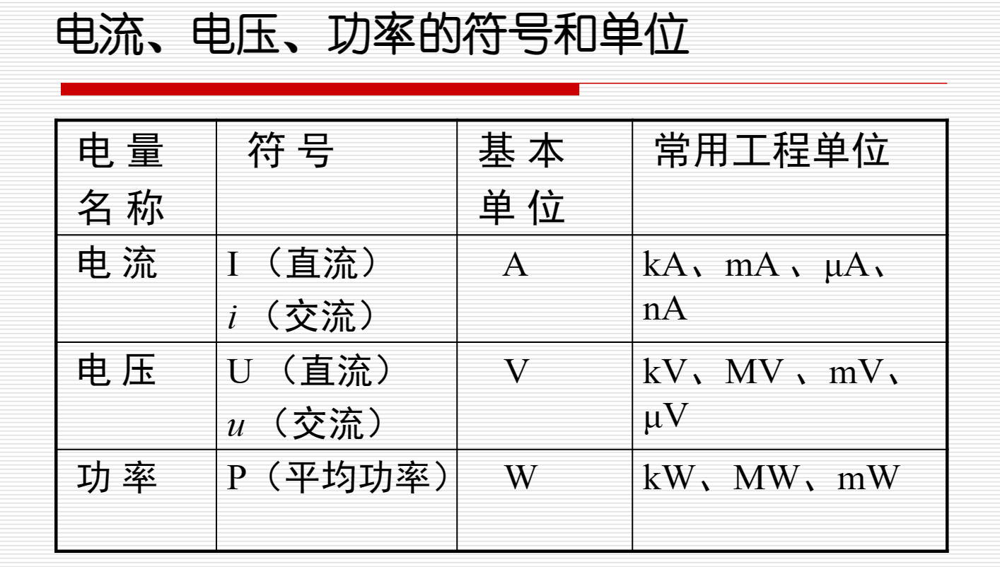
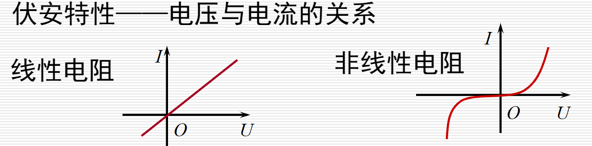
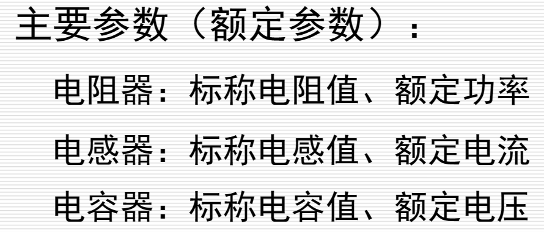
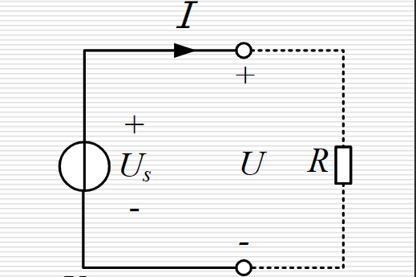
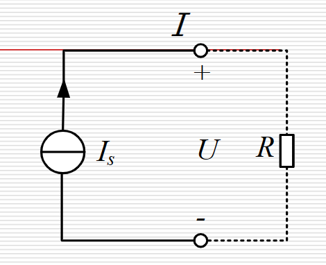
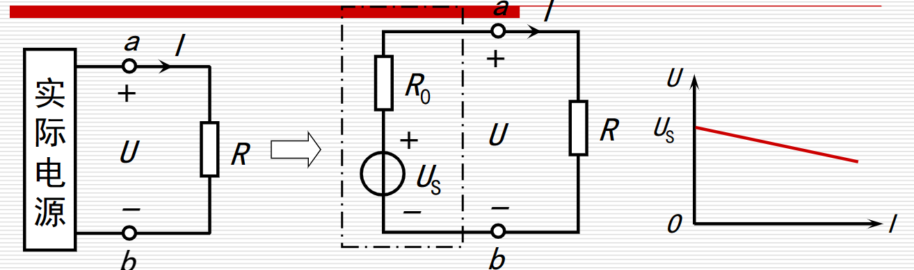
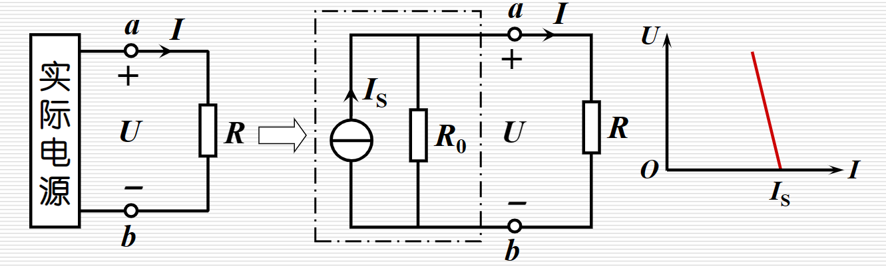
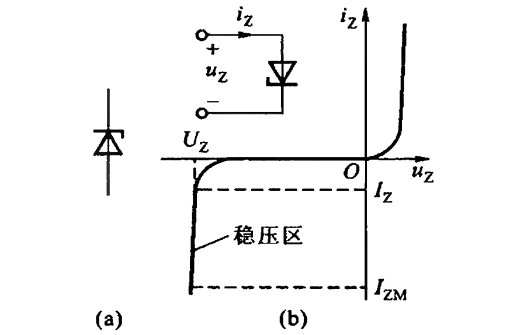

# 电路和电路元件

## 电路

### 电流与电压

电流方向：正电荷移动方向。

<!-- 电压定义
$$u=\frac{\mathrm{d} W}{\mathrm{d} q}$$

式中$\mathrm{d} q$为由电路的一点移到另一点的电荷量，$\mathrm{d} W$为转移过程中，电荷$\mathrm{d} q$所失去的能量。 -->

电压是由于两点间电位的高低差别而形成的，它的方向是从高电位指向低电位，是电位降低的方向。

$$U_{\mathrm{ab}}=V_{\mathrm{a}}-V_{\mathrm{b}}$$

### 关联参考方向

电压参考方向和电流参考方向可以分别加以假定。但在电路分析时**对电源以外**的元件(或电路)常假定电压参考方向与电流参考方向一致，即电流参考方向从电压参考方向的“+”端流向“-”端，称为关联参考方向。

即
$$u_{N}=u_{ab}$$

### 功率

功率$p=u i$。在电压和电流参考方向关联时，功率为正值表示该元件(或该段电路)吸收功率(即消耗电能或吸收电能)；若为负值则表示输出功率(即送出电能)。

## 电阻、电感与电容

### 电阻

### 电感

$$u=-e_{L}=L \frac{\mathrm{d} i}{\mathrm{d} t}$$

$e_{L}$为自感电动势。

线性电感，$L$为常数，特性方程为
$$N \Phi=L i$$

当时间由$0$到$t_{1}$，流过电感的电流$i$由$0$变到$I$时，电感所储存的磁场能为
$$
W_{L}=\int_{0}^{t_{1}} u i \mathrm{~d} t=\int_{0}^{I} L i \mathrm{~d} i=\frac{1}{2} L I^{2}
$$

### 电容

$$i=C \frac{\mathrm{d} u}{\mathrm{d} t}$$

在线性电容的情况下，电容元件的特性方程为
$$q=C u$$

当时间由$0$到$t_{1}$，电容的端电压$u$由$0$变到$U$时，电容所储存的电场能为
$$
W_{C}=\int_{0}^{t_{1}} u i \mathrm{~d} t=\int_{0}^{U} C u \mathrm{~d} u=\frac{1}{2} C U^{2}
$$

## 独立电源元件

### 理想电源

电压源、电流源

### 实际电源

<!-- 
 -->

#### 电压源

$$U=U_{\mathrm{s}}-R_{0} I$$

#### 电流源

$$I=I_{S}-\frac{U}{R_{0}}$$

## 二极管

二极管由一个PN结加电极引线和管壳构成。由P区一侧引出的电极称为阳极，N区一侧引出的电极称为阴极。二极管的图形符号如图(a)所示，伏安特性如图(b)

<!-- 

 -->

### 伏安特性

正向特性
- 死区，电压小，基本不导通。死区电压（导通电压），硅管约0.5V，锗管约0.1V
- 导通区（非线性区），硅管正向压降0.6~0.7V，锗管0.2~0.3V

反向特性
- 正常工作区 — 截止 — 反向电流很小
- 反向击穿区 — 反向电压过大，反向击穿

### 理想特性

(a) 考虑正向导通压降
(b) 忽略正向导通压降

### 主要参数

最大正向电流$I_{FM}$。二极管长期工作时允许通过的最大正向平均电流。

最高反向工作电压$U_{RM}$。二极管使用时实际承受的反向电压不应超过此值，否则发生反向击穿。

反向电流$I_{R}$。越小越好。$I_{R}$大说明二极管的单向导电性能差。

最高工作频率$f_{M}$。由于结电容影响，高频场合，二极管的单向导电性变差。

### 工作点

静态电阻
$$R_{\mathrm{D}}=\frac{U_{\mathrm{D}}}{I_{\mathrm{D}}}$$

动态电阻
$$
r_{\mathrm{D}}=\lim _{\Delta I_{\mathrm{D}} \rightarrow 0} \frac{\Delta U_{\mathrm{D}}}{\Delta I_{\mathrm{D}}}=\frac{\mathrm{d} U_{\mathrm{D}}}{\mathrm{d} I_{\mathrm{D}}}
$$

### 判断二极管是否导通

1）单个二极管时，阳极电位高于阴极电位足够大小

2）多个二极管时
- 阳极接于同一点（同电位），阴极电位最低的优先导通
- 阴极接于同一点（同电位），阳极电位最高的优先导通

### 稳压二极管

稳压二极管是一种特殊的二极管，工作在PN结的反向击穿状态。

在反向击穿状态下，反向电流在一定范围内变化时，稳压二极管两端的电压变化很小，利用这一特性可以起到稳定电压的作用。

#### 主要工作参数

稳定电压$U_{Z}$，稳定电流$I_{Z}$。

最大稳定电流$I_{ZM}$。允许通过的最大反向电流。

最大耗散功率$P_{ZM}$。最大允许的耗散功率。

动态电阻$r_{Z}$。稳压区内，电压变化量和电流变化量之比。

电压温度系数$\alpha_{UZ}$。温度每升高$1^{\circ} \mathrm{C}$时，稳定电压值的相对变化量。

### 发光二极管

发光二极管是一种能将电能转换成光能的器件，简称LED，正向导通后发光。

导通电压大于普通二极管，通常在1.4V以上。

### 光电二极管

光电二极管是一种将光能转换成电流的器件，其PN结封装在具有透明聚光窗的管壳内。光照射后导通，导通电流与光照强度相关。

注意：光电二极管使用时要反向接入电路中，即阳极接电源负极，阴极接电源正极。

## 双极晶体管

双极晶体管简称晶体管、三极管。

(a) NPN型，(b) PNP型

有恒等式
$$I_{E}=I_{B}+I_{C}$$

且有关系
$$I_{B} \ll I_{C} \approx I_{E}$$

### 特性曲线

上图为共发射极接法。

共发射极输人特性曲线是指以$u_{CE}$为参变量时，$i_{B}$和$u_{BE}$之间的关系。

输出特性曲线是以$i_{B}$为参变量时，$i_{C}$和$u_{CE}$之间的关系。

输入特性有一段死区。当$u_{BE}$超过某一数值后，$i_{B}$开始明显增大，该电压值称为导通电压。硅管的导通电压约为0.5 V，锗管约为0.1 V。

对应于某一个$I_{B}$值,就有一条相应的$i_{C}$-$u_{CE}$曲线，故输出特性是一族曲线。根据晶体管的工作状态，输出特性可分为三个区域。

在放大电路中，晶体管工作在放大区，以实现放大作用。而在开关电路，晶体管则工作在截止区或饱和区，相当于一个开关的断开或接通。

### 主要参数

穿透电流$I_{CEO}$。基极开路时的集电极电流。

电流放大系数

对直流
$$
\bar{\beta}=\frac{I_{C}-I_{C E O}}{I_{B}} \approx \frac{I_{C}}{I_{B}}
$$

对交流
$$
\beta=\frac{\Delta I_{C}}{\Delta I_{B}}
$$

集电极最大允许电流$I_{CM}$

集电极最大允许耗散功率$P_{CM}$

集电极-发射极反向击穿电压$U_{(BR)CEO}$。基极开路时，集电极和发射极之间允许施加的最大电压

### 简化的小信号模型

晶体管工作在放大状态时，如何用电路模型来表征它的特性？

#### 受控源

受控源，非独立电源，其输出电压或电流受电路中另一电压或电流的控制。

四种类型：
(a) 电压控制电压源（VCVS）
(b) 电压控制电流源（VCCS）
(c) 电流控制电压源（CCVS）
(d) 电流控制电流源（CCCS）

#### 晶体管简化的小信号模型

$$
r_{\text {be }}=\frac{\Delta U_{\mathrm{BE}}}{\Delta I_{\mathrm{B}}}
$$

$$
r_{\mathrm{be}}=r_{\mathrm{b}}+(\beta+1) \frac{26}{I_{\mathrm{E}}}
$$

其中，$r_{\mathrm{b}}$为基区电阻。当$I_{E} < 5 \text{mA}$，$r_{\mathrm{b}}=200 \Omega$。