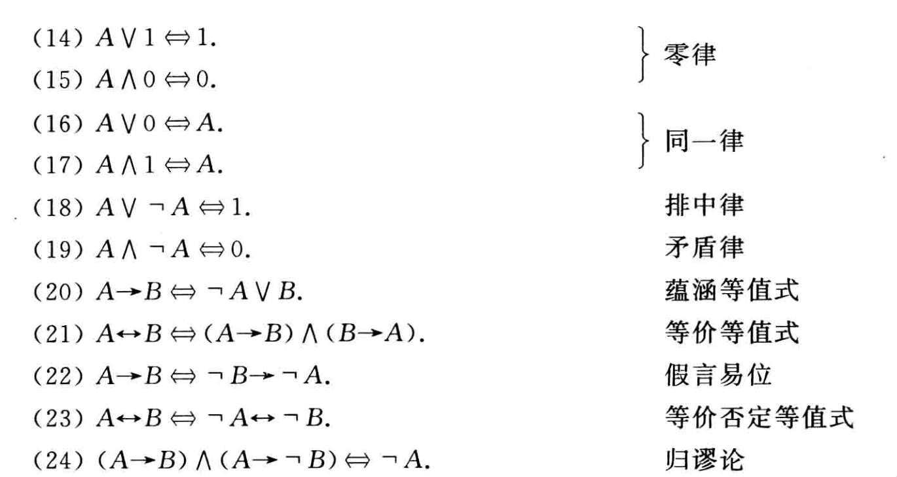

# 命题逻辑

## 命题逻辑基本概念

在数理逻辑中，称所表达的判断是真(正确)或假(错误)但不能可真可假的陈述句为**命题**。命题是推理的最基本的成分，命题是命题逻辑中最小的研究单位。

作为命题的陈述句所表达的判断结果称为命题的**真值**，真值只取两个值：真或假。真值为真的命题称为真命题，真值为假的命题称为假命题。任何命题的真值都是唯一的。

### 命题的符号化

在数理逻辑中，将命题和它的真值用抽象的符号表示，称为命题符号化。这里用小写的英文字母$p, q, r, \cdots, p_{i}, q_{i}, r_{i}, \cdots$表示命题，用数字1表示真，数字0表示假。

简单的陈述句构成的命题称为**简单命题或原子命题**。但在各种推理中，所出现的命题多数是由简单命题通过联结词的联结而成的陈述句，称这样的命题为**复合命题**。

### 联结词符号化

定义1：设$p$为命题，复合命题“非$p$”(或“$p$的否定”)称为$p$的**否定式**，记作$\neg p$，符号$\neg$称作否定联结词。并规定$\neg p$为真当且仅当$p$为假。

定义2：设$p,q$为两个命题，复合命题“$p$并且$q$”(或“$p$与$q$”)称为$p$与$q$的**合取式**，记作$p \wedge q$，$\wedge$称作合取联结词。并规定$p \wedge q$为真当且仅当$p$与$q$同时为真。

定义3：设$p,q$为两命题，复合命题“$p$或$q$”称作$p$与$q$的**析取式**，记作$p \vee q$，$\vee$称作析取联结词。并规定$p \vee q$为假当且仅当$p$与$q$同时为假。

注意区别相容或(用析取式)与排斥或。

定义4：设$p,q$为两命题，复合命题“如果$p$,则$q$”称作$p$与$q$的**蕴涵式**，记作$p \rightarrow q$，并称$p$是蕴涵式的前件，$q$为蕴涵式的后件，$\rightarrow$称作蕴涵联结词。并规定，$p \rightarrow q$为假当且仅当$p$为真$q$为假。

定义5：设$p,q$为两命题，复合命题“$p$当且仅当$q$”称作$p$与$q$的**等价式**，记作$p \leftrightarrow q$，$\leftrightarrow$称作等价联结词。并规定$p \leftrightarrow q$为真当且仅当$p$与$q$同时为真或同时为假。

$(p \rightarrow q) \wedge(q \rightarrow p)$与$p \leftrightarrow q$的逻辑关系完全一致。

### 命题公式

对命题进一步抽象，称真值可以变化的陈述句为**命题变项或命题变元**，也用$p, q, r, \cdots, p_{i}, q_{i}, r_{i}, \cdots$表示。

将命题变项用联结词和圆括号按一定的逻辑关系联结起来的符号串称为**合式公式或命题公式**。

命题公式的**层次**，就是公式转化成的表达式树的层数。

$p_{1}, p_{2}, \cdots, p_{n}$是出现在公式$A$中的全部的命题变项，给$p_{1}, p_{2}, \cdots, p_{n}$各指定一个真值，称为对$A$的一个赋值或解释。若指定的一组值使$A$的真值为1,则称这组值为$A$的成真赋值，若使$A$的真值为0，则称这组值为$A$的成假赋值。

将命题公式$A$在所有赋值下取值情况列成表，称作$A$的真值表。

设$A$为任一命题公式。
(1)若$A$在它的各种赋值下取值均为真，则称$A$是重言式或永真式。
(2)若$A$在它的各种赋值下取值均为假，则称$A$是矛盾式或永假式。
(3)若$A$不是矛盾式，则称$A$是可满足式。

## 命题逻辑等值演算

### 等值式

设$A,B$是两个命题公式，若$A,B$构成的等价式$A \leftrightarrow B$为重言式，则称$A$与$B$是**等值**的，记作$A \Leftrightarrow B$。

证明两个命题公式等值的方法是真值表法或等值演算。根据已知的等值式推演出与原命题公式等值的新的命题公式的过程称作**等值演算**。

等值演算不能直接验证两个公式不等值，需要举反例。

### 联结词完备集

定义：称$F:\{0,1\}^{n} \rightarrow\{0,1\}$为$n$**元真值函数**。$F$的自变量为$n$个命题変项，值域为$\{0,1\}$。

每一个命题公式对应于一个真值函数，每一个真值函数对应于无数个命题公式。

定义:设$S$是一个联结词集合，如果任何$n$元真值函数都可以由仅含$S$中的联结词构成的公式表示，则称$S$是**联结词完备集**。

以下联结词集都是完备集
$$
\begin{array}{l}
S_{0}=\{\neg, \wedge, \vee\} \\
S_{1}=\{\neg, \wedge, \vee, \rightarrow\} \\
S_{2}=\{\neg, \wedge, \vee, \rightarrow, \leftrightarrow\} \\
S_{3}=\{\neg, \wedge\} \\
S_{4}=\{\neg, \vee\} \\
S_{5}=\{\neg, \rightarrow\}
\end{array}
$$

### 复合联结词

与非式: $p \uparrow q \Leftrightarrow \neg(p \wedge q)$，$\uparrow$称作与非联结词

或非式: $p \downarrow q \Leftrightarrow \neg(p \vee q)$，$\downarrow$称作或非联结词

$\{\uparrow\},\{\downarrow\}$都是是联结词完备集

## 范式

> 本节通过等值演算将命题公式等值地化成联结词集$\{ \neg, \wedge, \vee \}$中两种规范化的形式，即主析取范式与主合取范式。这种规范形式能给出公式的真值表所给出的一切信息

### 析取范式与合取范式

命题变项及其否定统称作**文字**。仅由有限个文字构成的析取式称作**简单析取式**。仅由有限个文字构成的合取式称作**简单合取式**。

定理
- 一个简单析取式是重言式当且仅当它同时含某个命题变项及它的否定式
- 一个简单合取式是矛盾式当且仅当它同时含某个命题变项及它的否定式

由有限个简单合取式构成的析取式称为**析取范式**；由有限个简单析取式构成的合取式称为**合取范式**。析取范式与合取范式统称为**范式**。

定理
- 一个析取范式是矛盾式当且仅当它的每个简单合取式都是矛盾式
- 一个合取范式是重言式当且仅当它的每个简单析取式都是重言式

**任何公式都可以化成等值的析取范式或合取范式**

下面给出求给定公式范式的步骤
1. 消去联结词 $\rightarrow , \leftrightarrow$
2. 否定号的消去(利用双重否定律)或内移(利用德摩根律)
3. 利用分配律：利用$\wedge$对$\vee$的分配律求析取范式，$\vee$对$\wedge$的分配律求合取范式

### 主析取范式与主合取范式

公式的析取范式与合取范式是不唯一的，公式的唯一的范式形式是主析取范式与主合取范式。

在含有$n$个命题变项的简单合取式(简单析取式)中，若每个命题变项和它的否定式不同时出现，而二者之一必出现且仅出现一次，且第$i$个命题变项或它的否定式出现在从左算起的第$i$位上(若命题变项无角标,就按字典顺序排列)，称这样的简单合取式(简单析取式)为**极小项(极大项)**。

由于每个命题变项在极小项中以原形或否定式形式出现且仅出现一次，因而$n$个命题变项共可产生$2^{n}$个不同的极小项。其中每个极小项都有且仅有一个成真赋值。若成真赋值所对应的二进制数转化为十进制数为$i$，就将所对应极小项记作$m_{i}$。类似地，$n$个命题变项共可产生$2^{n}$个不同的极大项，每个极大项只有一个成假赋值，将其对应的十进制数$i$作极大项的角标，记作$M_{i}$。

说明
- $2^{n}$个极大项(极小项)互不等值
- $M_{i}$假，其它极大项真；$m_{i}$真，其它极小项假

设$m_{i}$与$M_{i}$是命题变项$p_{1}, p_{2}, \cdots, p_{n}$形成的极小项和极大项，则
$$\neg m_{i} \Leftrightarrow M_{i}, \quad \neg M_{i} \Leftrightarrow m_{i}$$

若由$n$个命题变项构成的析取范式(合取范式)中所有的简单合取式(简单析取式)都是极小项(极大项)，则称该析取范式(合取范式)为**主析取范式(主合取范式)**

下面介绍求与给定公式等值的主析取范式和主合取范式的方法

设所给定公式为含$n$个命题变项的公式$A$，求$A$的主析取范式，按下面步骤进行

(1) 求$A$的析取范式$A^{\prime}=B_{1} \vee B_{2} \vee \cdots \vee B_{s}$，其中$B_{j}$为简单合取式，$j=1,2, \cdots, s$

(2) 若$A^{\prime}$中的某简单合取式$B_{j}$中既不含命题变项$p_{i}$，又不含$\neg p_{i}$，则将$B_{j}$如下展开
$$
\begin{aligned}
B_{j} & \Leftrightarrow B_{j} \wedge 1 \Leftrightarrow B_{j} \wedge\left(p_{i} \vee \neg p_{i}\right) \\
& \Leftrightarrow\left(B_{j} \wedge p_{i}\right) \vee\left(B_{j} \wedge \neg p_{i}\right)
\end{aligned}
$$

继续这一过程，直到$B_{1}, B_{2}, \cdots, B_{s}$都被展成长度为$n$的极小项的析取式为止

(3) 将重复出现的命题变项、矛盾式、重复出现的极小项都按幂等律、同一律等“消去”。即用$p$代替$p \vee p$，$0$代替$p \wedge \neg p$，$m_{i}$代替$m_{i} \vee m_{i}$

(4) 将极小项按角标从小到大的顺序排列，并可以用$\sum$表示，如$m_{1} \vee m_{3} \vee m_{5}$记为$\sum(1,3,5)$

求$A$的主合取范式的步骤与求主析取范式的步骤类似，简单叙述如下

(1) 求$A$的合取范式$A^{\prime}=B_{1} \wedge B_{2} \wedge \cdots \wedge B_{r}$，其中$B_{j}$为简单析取式，$j=1,2, \cdots, s$

(2) 利用
$$
\begin{aligned}
B_{j}=B_{j} \vee 0 & \Leftrightarrow B_{j} \vee\left(p_{i} \wedge \neg p_{i}\right) \\
& \Leftrightarrow\left(B_{j} \vee p_{i}\right) \wedge\left(B_{j} \vee \neg p_{i}\right)
\end{aligned}
$$
将$B_{1}, B_{2}, \cdots, B_{r}$都转化成长度为$n$的极大项的合取式

(3) 将重复出现的命题变项、重言式、重复出现的极大项按幂等律、排中律等“消去”

(4) 将极大项按角标从小到大顺序排序，并可以用$\Pi$简单表示。例如$M_{0} \wedge M_{3} \wedge M_{7}$可简记为$\Pi(0,3,7)$

**任何命题公式都存在与之等值的主析取范式和主合取范式，并且是唯一的**

### 范式的用途

主析取范式的用途
1. 求公式的成真与成假赋值。若公式$A$中含$n$个命题变项，$A$的主析取范式含$s\left(0 \leqslant s \leqslant 2^{n}\right)$个极小项，则$A$有$s$个成真赋值，它们是所含极小项角标的二进制表示，其余$2^{n}-s$个赋值都是成假赋值
2. 判断公式的类型
3. 判断两个命题公式是否等值
4. 应用主析取范式分析和解决实际问题

由公式的主析取范式求主合取范式

设公式$A$含$n$个命题变项。$A$的主析取范式含$s\left(0<s<2^{n}\right)$个极小项，即
$$
A \Leftrightarrow m_{i_{1}} \vee m_{i_{2}} \vee \cdots \vee m_{i_{3}}, \quad 0 \leqslant i_{j} \leqslant 2^{n}-1, j=1,2, \cdots, s
$$

没出现的极小项为$m_{j_{1}}, m_{j_{2}}, \cdots, m_{j_{2^{n}-s}}$，它们的角标的二进制表示为$\neg A$的成真赋值

则有
$$
A \Leftrightarrow M_{j_{1}} \wedge M_{j_{2}} \wedge \cdots \wedge M_{j_{2^{n}-s}}
$$

即，主析取范式中没有出现的极小项的下标恰好是主合取范式中极大项的下标。于是，由公式的主析取范式，即可求出它的主合取范式。

真值表和主析取范式(主合取范式)是描述命题公式的**两种标准形式**。公式$A$的主析取范式(主合取范式)中的极小项(极大项)的下标的二进制表示恰好是$A$的成真赋值(成假赋值)，因而$A$的主析取范式(主合取范式)恰好对应于$A$的真值表。由公式$A$的主析取范式(主合取范式)可以立刻写出$A$的真值表；反之，由$A$的真值表也可以立刻写出$A$的主析取范式(主合取范式)。

## 推理

### 形式结构

命题公式$A_{1}, A_{2}, \cdots, A_{k}$推出$B$的推理**正确 | 有效**当且仅当蕴涵式

$$
\left(A_{1} \wedge A_{2} \wedge \cdots \wedge A_{k}\right) \rightarrow B
$$

为重言式(上式为推理的**形式结构**)，并记为

$$
\left(A_{1} \wedge A_{2} \wedge \cdots \wedge A_{k}\right) \Rightarrow B
$$

### 推理的证明

称永真的蕴涵式为**推理定律**

可以把一个公式换成任何与它等值的公式，称作**等值置换**，简称置换

设前提$A_{1}, A_{2}, \cdots, A_{k}$，结论$B$，如果一个公式序列的最后是B并且序列中的每一个公式或者是某个$A_{i}(1 \leqslant i \leqslant k)$，或者是前面公式的有效结论，则称这个序列是由前提$A_{1}, A_{2}, \cdots, A_{k}$推出结论$B$的**证明**。

构造证明，可以引入下述推理规则

(1) 前提引人规则：在证明的每一步都可以引入前提

(2) 结论引人规则：在证明的每一步都可以引人由前面的公式得到的有效结论

由前面给出的8条推理定律和等值置换，应用结论引人规则可以导出以下各条推理规则

(3) 置换规则：在证明的每一步可以引人前面公式的等值置换

(4) 假言推理规则(或称分离规则)：若证明的公式序列中已出现过$A \rightarrow B$和$A$，则由假言推理定律$((A \rightarrow B) \wedge A \Rightarrow B)$可知，$B$是$A \rightarrow B$和$A$的有效结论，由结论引入规则可知，可将$B$引人到命题序列中来。

剩余各条推理定律不再加以说明。

#### 附加前提证明法

对于形式结构如下的推理

$$
\left(A_{1} \wedge A_{2} \wedge \cdots \wedge A_{k}\right) \rightarrow(A \rightarrow B)
$$

只需证明如下

$$
\left(A_{1} \wedge A_{2} \wedge \cdots \wedge A_{k} \wedge A\right) \rightarrow B
$$

#### 归谬法

把推理证明

$$
\left(A_{1} \wedge A_{2} \wedge \cdots \wedge A_{k}\right) \rightarrow B
$$

转换成

$$
\left(A_{1} \wedge A_{2} \wedge \cdots \wedge A_{k} \wedge \neg B\right) \rightarrow 0
$$

### 归结证明法

方便推理在计算机上的实现。归结证明法又称消解法。

归结规则（归结定律）

$$
\left(L \vee C_{1}\right) \wedge\left(\neg L \vee C_{2}\right) \Rightarrow C_{1} \vee C_{2}
$$

其中，$L$是一个变元，$C_{1}$和$C_{2}$是简单析取式。

应用归结规则由两个含有相同变元(一个含变元，另一个含它的否定式)的简单析取式推出一个新的不含这个变元的简单析取式，对这个新的简单析取式又可以继续应用归结规则。

归结证明法的基本思想是采用归谬法，把结论的否定引人前提。如果推出空简单析取式，即推出$0$，则证明推理正确。其证明步骤如下：

(1) 把结论的否定引人前提

(2) 把所有前提，包括结论的否定在内，化成合取范式，并把得到的合取范式中的所有简单析取式作为前提

(3) 应用归结规则进行推理

(4) 如果推出空简单析取式，即推出$0$，则证明推理正确

注意，在推理中，有些简单析取式是一个文字，如$\neg q, s, \neg s$用归结规则时，将它们分别看成$\neg q \vee 0, s \vee 0, \neg s \vee 0$。

### 对证明方法的补充说明

关于间接证明法
$$
A \rightarrow B \Leftrightarrow \neg B \rightarrow \neg A
$$

关于分情况证明法
$$
\left(A_{1} \vee A_{2} \vee \cdots \vee A_{k}\right) \rightarrow B \\
\Leftrightarrow  \left(A_{1} \rightarrow B\right) \wedge\left(A_{2} \rightarrow B\right) \wedge \cdots \wedge\left(A_{k} \rightarrow B\right)
$$