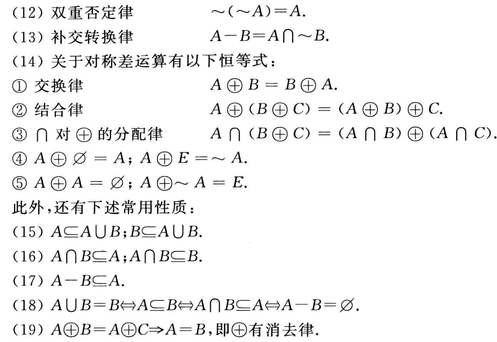

#! https://zhuanlan.zhihu.com/p/637076655
# 离散数学（一）数学基础

## 集合

**定义**

设  $A$  为一个集合, 称由  $A$  的所有子集组成的集合为  $A$  的幂集,记作  $P(A)$ , 即  $P(A)=\{x \mid x \subseteq A\}$ .

**定义**

设  $A, B$  为两个集合,

(1) 称由  $A$  与  $B$  的全体元素组成的集合为  $A$  与  $B$  的**并集**, 记作  $A \cup B$ , 即  $A \cup B=   \{x \mid x \in A \vee x \in B\}$ ;

(2) 称由  $A$  与  $B$  的公共元素组成的集合为  $A$  与  $B$  的**交集**, 记作  $A \cap B$ , 即  $A \cap B=   \{x \mid x \in A \wedge x \in B\}$ ;

(3) 称属于  $A$  而不属于  $B$  的元素组成的集合为  $B$  对  $A$  的**相对补集**, 记作  $A-B$ , 即  $A-B=\{x \mid x \in A \wedge x \notin B\}$ ;

(4) 称属于  $A$  而不属于  $B$ , 或属于  $B$  而不属于  $A$  的元素组成的集合为  $A$  与  $B$  的**对称差集**, 记作  $A \oplus B$ , 即  $A \oplus B=\{x \mid(x \in A \wedge x \notin B) \vee(x \in B \wedge x \notin A)\}$ ;

(5) 设  $E$  为全集,  $A \subseteq E$ , 称  $E-A$  为  $A$  的**绝对补集**, 记作  $\sim A$ , 即  $\sim A=\{x \mid x \notin A\}$ .

**定义**

设  $A, B$  为两个集合,若  $A \cap B=\varnothing$ ,则称  $A$  与  $B$  是不交的.

## 证明方法

证明的命题有三种形式

形式1：若A，则B。可表示成$A\Rightarrow B$。其中A是前提或已知条件，B是结论。

形式2：A的充分必要条件是B，或A当且仅当B。可表示成$A\Leftrightarrow B$。

形式3：B(即B恒真)。

后两种形式都可以归结为形式1。

**直接证明法**

命题 $P:A\Rightarrow B$

**归谬法(反证法)**

归谬法是从假设A为真、B为假，推出矛盾。

**间接证明法(逆否证法)**

记命题 $P^{\prime}:\neg B \Rightarrow \neg A$，则 $P^{\prime} \Leftrightarrow P$。

**数学归纳法**

设命题$P(n), n \in \mathbf{N} , n \geqslant n_{0}$.若

(1) $P\left(n_{0}\right)$为真

(2) $\forall n\left(n \in \mathbf{N}\right. , \left.n \geqslant n_{0}\right) $,假设$P(n)$为真,则$P(n+1)$为真

那么,$\forall n\left(n \in \mathbf{N}\right. ,\left.n \geqslant n_{0}\right)$,$P(n)$为真.

**第二数学归纳法**

设命题$P(n), n \in \mathbf{N} , n \geqslant n_{0}$.若

(1) $P\left(n_{0}\right)$为真

(2) $\forall n\left(n \in \mathbf{N}\right. , \left.n \geqslant n_{0}\right) $,假设$P(n_{0}),P(n_{0}+1),P(n_{0}+2),\cdots,P(n)$为真,则$P(n+1)$为真

那么,$\forall n\left(n \in \mathbf{N}\right. ,\left.n \geqslant n_{0}\right)$,$P(n)$为真.

**构造性证明法**

有时要证明存在一种具有某种性质的客体。对此有两种证明方法，一种是构造出具有所需性质的客体，从而证明了它的存在性，这种证明方法称作构造性。另一种是仅仅证明了它的存在，而没有具体的给出它，称这种证明方法为非构造性的。

**分情况证明法(穷举法)**

pass

## 递推方程的求解

**定义**

设递推方程满足

$$
\left\{\begin{aligned}
& H(n)-a_{1} H(n-1)-a_{2} H(n-2)-\cdots-a_{k} H(n-k)=f(n) \\
& H(0)=b_{0}, H(1)=b_{1}, H(2)=b_{2}, \cdots, H(k-1)=b_{k-1}
\end{aligned}\right.
$$

其中  $a_{1}, a_{2}, \cdots, a_{k}$  为常数,  $a_{k} \neq 0$ , 这个方程称为  $k$  阶常系数线性递推方程.  $b_{0}, b_{1}, \cdots, b_{k-1}$  为  $k$  个初值. 当  $f(n)=0$  时称这个递推方程为齐次方程.

### 常系数线性齐次递推方程的求解

**定义**

给定常系数线性齐次递推方程如下：

$$
\left\{\begin{aligned}
& H(n)-a_{1} H(n-1)-a_{2} H(n-2)-\cdots-a_{k} H(n-k)=0 \\
& H(0)=b_{0}, H(1)=b_{1}, H(2)=b_{2}, \cdots, H(k-1)=b_{k-1}
\end{aligned}\right.
$$

方程  $x^{k}-a_{1} x^{k-1}-\cdots-a_{k}=0$  称为该递推方程的**特征方程**, 特征方程的根称为递推方程的**特征根**.