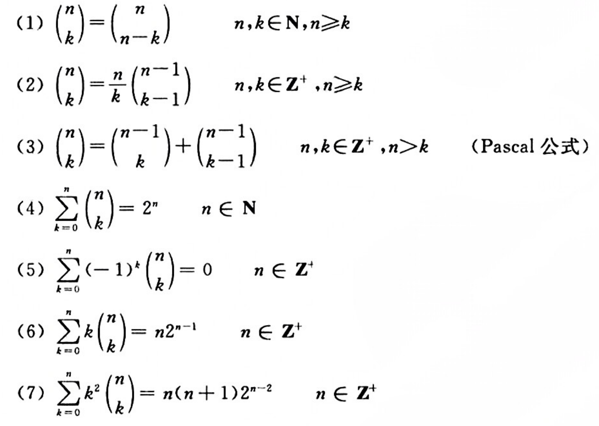

#! https://zhuanlan.zhihu.com/p/639255918
# 离散数学（五）组合计数

## 基本计数规则

- 加法法则
- 乘法法则
- 分类处理与分步处理

## 排列与组合

### 集合的排列与组合

从  $n$  元集  $S$  中有序、不重复选取的  $r$  个元素称为  $S$  的一个  $r$ -排列,  $S$  的所有  $r$ -排列的个数记作  $P(n, r)$ .

设  $n, r$  为自然数, 则

$$
P(n, r)=\left\{\begin{aligned}
& \frac{n !}{(n-r) !} & n \geqslant r \\
& 0 & n<r
\end{aligned}\right.
$$

从  $n$  元集  $S$  中无序、不重复选取的  $r$  个元素称为  $S$  的一个  $r$ -组合,  $S$  的所有  $r$ -组合的个数记作  $C(n, r)$ .

设  $n, r$  为自然数, 则

$$
C(n, r)=\left\{\begin{aligned}
& \frac{n !}{r !(n-r) !} & n \geqslant r \\
& 0 & n<r
\end{aligned}\right.
$$

设  $n, r$  为正整数, 则

(1)  $C(n, r)=\dfrac{n}{r} C(n-1, r-1)$

(2)  $C(n, r)=C(n, n-r)$

(3)  $C(n, r)=C(n-1, r-1)+C(n-1, r)$

### 多重集的排列与组合

设多重集  $S=\left\{n_{1} \cdot a_{1}, n_{2} \cdot a_{2}, \cdots, n_{k} \cdot a_{k}\right\}$ , 其中含有  $k$  种元素, 对于  $i=1,2, \cdots, k$, $n_{i}$  表示第  $i$  种元素  $a_{i}$  在  $S$  中出现的次数, 一般  $0<n_{i} \leqslant+\infty$ . 

多重集用于处理允许重复的选取问题, 当  $n_{i}=+\infty$  时表示有足够多的  $a_{i}$  以备选取.

设多重集  $S=\left\{n_{1} \cdot a_{1}, n_{2} \cdot a_{2}, \cdots, n_{k} \cdot a_{k}\right\}$ , 且  $n=n_{1}+n_{2}+\cdots+n_{k}$ , 称  $S$  的全体元素组成的排列为  $S$  的**全排列**.

**定理**

$S$  的  $r$ -排列在特殊情况下的一些结果.

(1) 当  $r=n$  时,  $S$  的全排列数

$$
N=\frac{n !}{n_{1} ! n_{2} ! \cdots n_{k} !}
$$

(2) 若  $r \leqslant n_{i}, i=1,2, \cdots, k$  时,  $S$  的  $r$ -排列数是  $k^{r}$ .

**定理**

当  $r \leqslant n_{i}, i=1,2, \cdots, k$  时,多重集  $S$  的  $r$-组合数  $N=C(k+r-1, r)$ .

## 二项式定理与组合恒等式

**二项式定理**

设  $n$  是正整数, 对一切  $x$  和  $y$ , 有

$$
\begin{aligned}
(x+y)^{n}=\sum_{k=0}^{n} \binom{n}{k} x^{k} y^{n-k}
\end{aligned}
$$

符号  $\dbinom{n}{k}$ , 当  $n$  与  $k$  都是自然数时, 它就等于组合数  $C(n, k)$ .

**组合恒等式**

## 非降路径问题

## 多项式定理

设  $n$  为正整数,  $x_{i}$  为实数,  $i=1,2, \cdots, t$ . 那么有

$$
\left(x_{1}+x_{2}+\cdots+x_{t}\right)^{n}=\sum\limits_{\substack{满足  n_{1}+\cdots+n_{t}=n \\ 的非负整数解 }} \dbinom{n}{n_{1} n_{2} \cdots n_{t}} x_{1}^{n_{1}} x_{2}^{n_{2}} \cdots x_{t}^{n_{t}}
$$

这里  $\dbinom{n}{n_{1} n_{2} \cdots n_{t}}=\dfrac{n !}{n_{1} ! n_{2} ! \cdots n_{t} !}$ , 称为**多项式系数**.

$$
\sum\limits_{\substack{满足  n_{1}+\cdots+n_{t}=n \\ 的非负整数解 }} \dbinom{n}{n_{1} n_{2} \cdots n_{t}} = t^{n}
$$

## 容斥原理

**定理**

设  $S$  为有穷集,  $P_{1}, P_{2}, \cdots, P_{m}$  是  $m$  种性质,  $A_{i}$  是  $S$  中具有性质  $P_{i}$  的元素构成的子集,  $\bar{A}_{i}$  是  $A_{i}$  相对于  $S$  的补集, 其中  $i=1,2, \cdots, m$ . 那么  $S$  中不具有性质  $P_{1}, P_{2}, \cdots, P_{m}$  的元素数为

$$
\begin{aligned}
& \left|\bar{A}_{1} \cap \bar{A}_{2} \cap \cdots \cap \bar{A}_{m}\right|=|S|-\sum_{i=1}^{m}\left|A_{i}\right|+\sum_{1 \leqslant i<j \leqslant m}\left|A_{i} \cap A_{j}\right| \\
& -\sum_{1 \leqslant i<j<k \leqslant m}\left|A_{i} \cap A_{j} \cap A_{k}\right|+\cdots+(-1)^{m}\left|A_{1} \cap A_{2} \cap \cdots \cap A_{m}\right|
\end{aligned}
$$

## 对称筛公式

在容斥原理的基础上, 令

$$
|S|=N, \quad N_{k}=\left|A_{i_{1}} \cap A_{i_{2}} \cap \cdots \cap A_{i_{k}}\right|
$$

其中,  $1 \leqslant i_{1}<i_{2}<\cdots<i_{k} \leqslant m, k=1,2, \cdots, m$ , 则容斥原理变成

$$
N_{0}=N-\binom{m}{1} N_{1}+\binom{m}{2} N_{2}-\cdots+(-1)^{m}\binom{m}{m} N_{m}=N+\sum_{t=1}^{m}(-1)^{t}\binom{m}{t} N_{t}
$$

对称筛公式是容斥原理的特殊表示, 只有性质在计数中具有对称性时才能使用. 这种对 称性的表现是：在  $m$  种性质中, 具有其中任何 1 条性质的元素数都等于  $N_{1}$ , 具有其中任何 2 条性质的元素数都等于  $N_{2}$ , 具有其中任何  $m-1$  条性质的元素数都等于  $N_{m-1}$ .

错位排列

棋盘布局问题

## 生成函数及其应用

定义

设  $r$  为实数,  $n$  为整数, 引入形式符号

$$
\binom{r}{n}=\left\{\begin{array}{ll}
0 & n<0 \\
1 & n=0 \\
\dfrac{r(r-1) \cdots(r-n+1)}{n !} & n>0
\end{array}\right.
$$

称为**牛顿二项式系数**.

**牛顿二项式定理**

设  $\alpha$  为实数, 则对一切实数  $x, y$, $|x / y|<1$ , 有

$$
(x+y)^{\alpha}=\sum_{n=0}^{\infty}\binom{\alpha}{n} x^{n} y^{\alpha-n}
$$

如

$$
\frac{1}{1-x}=1+x+x^{2}+\cdots
$$

$$
\frac{1}{(1-x)^{2}}=\sum_{n=0}^{\infty}(n+1) x^{n}
$$

**定义**

设序列  $\left\{a_{n}\right\}$ , 构造形式幂级数

$$
G(x)=a_{0}+a_{1} x+a_{2} x^{2}+\cdots+a_{n} x^{n}+\cdots
$$

称  $G(x)$  为序列  $\left\{a_{n}\right\}$  的**生成函数**.

下面给出生成函数的性质, 其中  $A(x), B(x), C(x)$  分别表示序列  $\left\{a_{n}\right\},\left\{b_{n}\right\},\left\{c_{n}\right\}$  的生成函数.

(1) 若  $b_{n}=\alpha a_{n}, \alpha$  为常数, 则  $B(x)=\alpha A(x)$ .

(2) 若  $c_{n}=a_{n}+b_{n}$ , 则  $C(x)=A(x)+B(x)$ .

(3) 若  $c_{n}=\sum\limits_{i=0}^{n} a_{i} b_{n-i}$ , 则  $C(x)=A(x) \cdot B(x)$ .

(4) 若  $b_{n}=\left\{\begin{array}{ll}0 & n<l \\ a_{n-l} & n \geqslant l\end{array}, \quad\right.$  则  $B(x)=x^{l} A(x)$ .

(5) 若  $b_{n}=a_{n+l}$ , 则  $B(x)=\dfrac{A(x)-\sum\limits_{n=0}^{l-1} a_{n} x^{n}}{x^{l}}$ .

(6) 若  $b_{n}=\sum\limits_{i=0}^{n} a_{i}$ , 则  $B(x)=\dfrac{A(x)}{1-x}$ .

(7) 若  $b_{n}=\sum\limits_{i=n}^{\infty} a_{i}$ , 且  $A(1)=\sum\limits_{n=0}^{\infty} a_{i}$  收敛,则  $B(x)=\dfrac{A(1)-x A(x)}{1-x}$ .

(8) 若  $b_{n}=\alpha^{n} a_{n}$, $\alpha$  为常数,则  $B(x)=A(\alpha x)$ .

(9) 若  $b_{n}=n a_{n}$ , 则  $B(x)=x A^{\prime}(x)$ , 其中  $A^{\prime}(x)$  为  $A(x)$  的导数.

(10) 若  $b_{n}=\dfrac{a_{n}}{n+1}$ , 则  $B(x)=\dfrac{1}{x} \displaystyle\int_{0}^{x} A(x) \mathrm{d} x$ .

**定义**

设  $\left\{a_{n}\right\}$  为序列, 称

$$
G_{\mathrm{e}}(x)=\sum_{n=0}^{\infty} a_{n} \frac{x^{n}}{n !}
$$

为  $\left\{a_{n}\right\}$  的**指数生成函数**.

