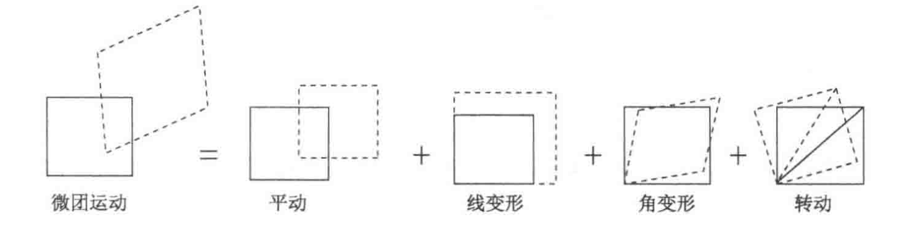

# 流体力学基本方程

## 流体运动的描述方法

### 拉格朗日描述

描述任意流体质点  $(a, b, c)$  的运动规律，用矢径  $\boldsymbol{r}=x \boldsymbol{i}+y \boldsymbol{j}+z \boldsymbol{k}$  表示流体质点的位置，写出其轨迹方程：

$$
\boldsymbol{r}=\boldsymbol{r}(a, b, c, t)
$$

对于不同流体质点，  $(a, b, c)$  是不同的，  $a$ 、 $b$ 、 $c$ 、 $t$  四个参数称为拉格朗日坐标。

当  $(a, b, c)$  固定而  $t$  变化时，方程就给出了某个确定流体质点的运动轨迹 (该质点任意时刻所处的位置)。当  $t$  固定而  $(a, b, c)$  变化时，方程就给出了确定的  $t$  时刻不同流体质点的位置分布。

对同一质点而言， $a$ 、 $b$ 、 $c$  不变，因此速度和加速度都应是位移函数  $\boldsymbol{r}(a, b, c, t)$  对时间  $t$  求偏导数

$$
\boldsymbol{V}=\frac{\partial \boldsymbol{r}(a, b, c, t)}{\partial t} ,\qquad \boldsymbol{a}=\frac{\partial^{2} \boldsymbol{r}(a, b, c, t)}{\partial t^{2}}
$$

### 欧拉描述

对任意空间点  $(x, y, z)$  ，都可以这样记录不同时刻  $t$  位于该点的不同流体质点当时的运动情况：例如，$t$  时刻位于点  $(x, y, z)$  上的流体质点当时的速度为

$$
\boldsymbol{V}=\boldsymbol{V}(x, y, z, t)
$$

由于空间点是任取的，所以其中的位置坐标  $(x, y, z)$  就不再是时间  $t$  的函数，而是独立变量 (这与拉格朗日法中不一样)。  $x$ 、 $y$ 、 $z$ 、 $t$  称为**欧拉坐标**。欧拉法中，各个物理量都是空间坐标  $(x, y, z)$  和时间  $t$  的函数。

**需要特别注意**的是：欧拉法中,  $x$ 、 $y$ 、 $z$ 、 $t$  是四个独立变数。如果不另外赋以意义，则不能有  $\mathrm{d} x / \mathrm{d} t$ 、 $\mathrm{~d}^{2} x / \mathrm{d} t^{2}$  这类表达式。

### 随体导数

物些学三大定律的原始形式都是对“系统”写出来的，属于随体观点，对应于拉格朗日描述方法。随体导数（或物质导数）的详细定义是：某个封闭流体“系统”（如流体微团）在运动过程中，它所具有的物理量对时间的变化率。

由于在欧拉法中流动特性是空间和时间的函数，某个质点的随体导数没法直接给出，需要从物理意义出发进行分析，写出随体导数在欧拉法中的表述形式。由于物理量不仅是时间  $t$  的函数，因此其随时间的变化率不再用  $\mathrm{d} / \mathrm{d} t$ ，而专门采用  $\mathrm{D} / \mathrm{D} t$  符号表示

$$
\frac{\mathrm{D}}{\mathrm{D} t}=\frac{\partial}{\partial t}+(\boldsymbol{V} \cdot \nabla)=\frac{\partial}{\partial t}+u \frac{\partial}{\partial x}+v \frac{\partial}{\partial y}+w \frac{\partial}{\partial z}
$$

### 流体运动的几何描述

**迹线**就是流体质点的运动轨迹。在定常流场中通过某一固定点的迹线只有一条，但在非定常流场中，通过同一点的迹线可以有多条，不向时刻经过该点的流体质点可以走不同的轨迹线。迹线的概念代表了拉格朗日观点，事实上用拉格朗日坐标表示的流体质点的矢径方程就是该流体质点的轨迹方程。

**流线**是指给定的瞬间流场中的假理曲线，该曲线上各点处的切线方向都与流场该点处的速度矢量方向一致。许多流线构成流谱，在流谱上可定出任一空间点处速度方向，因而可以看出流动趋势。

已知速度场为

$$
\boldsymbol{V}(x, y, z, t)=u(x, y, z, t) \boldsymbol{i}+v(x, y, z, t) \boldsymbol{j}+w(x, y, z, t) \boldsymbol{k}
$$

微分形式的流线方程

$$
\frac{\mathrm{d} x}{u(x, y, z, t)}=\frac{\mathrm{d} y}{v(x, y, z, t)}=\frac{\mathrm{d} z}{w(x, y, z, t)}
$$

**在定常流动中，流线与迹线重合，形状不变**，因此可以用显示迹线的方法显示流线。

在流场中任意画一条不是流线的封闭曲线，在同一时刻过此曲线上的每一点作流线，由这些相邻流线所构成的管状曲面称为**流管**

**流面**是指通过一条非流线的曲线(不封闭或封闭的)上每一点所作的那些相邻流线组成的曲面

**脉线**是在一段时间内相继通过空间某固定点的很多流体质点连成的线。在定常流动中脉线的形状不变，与流线、迹线重合，因此常用它来代表流线。

**涡量**定义为

$$
\begin{aligned}
\boldsymbol{\Omega}&=\operatorname{rot} \boldsymbol{V}=\nabla \times \boldsymbol{V} \\
& =\boldsymbol{i}\left(\frac{\partial w}{\partial y}-\frac{\partial v}{\partial z}\right)+\boldsymbol{j}\left(\frac{\partial u}{\partial z}-\frac{\partial w}{\partial x}\right)+\boldsymbol{k}\left(\frac{\partial v}{\partial x}-\frac{\partial u}{\partial y}\right)
\end{aligned}
$$

**涡线**

$$
\mathrm{d} \boldsymbol{r} \times \boldsymbol{\Omega}=0 ,\quad \frac{\mathrm{d} x}{\Omega_{x}(x, y, z, t)}=\frac{\mathrm{d} y}{\Omega_{y}(x, y, z, t)}=\frac{\mathrm{d} z}{\Omega_{z}(x, y, z, t)}
$$

### 控制体

流场中，假定通过一个有限大小且封闭的体来圈定一定区域的流体进行分析，这个空间体积称为**控制体**，其边界定义为**控制面**。

- 控制体形状、大小可以任意，相对于坐标系位置固定
- 控制面可以是实际的流体面，也可以是假想的几何面
- 流体质点系可按照自身运动规律穿越控制面出入控制体

**雷诺输运定理**

某一瞬间，控制体内的流体所构成的体系，它所具有的物理量总量的随体导数，等于同一瞬间控制体系中所含同一物理量的增加率与该物理量通过控制面的净流出率之和。

$$
\begin{aligned}
& \frac{\mathrm{D}}{\mathrm{D} t}\left(\iiint_{\Omega(t)} \eta(x, y, z, t) \mathrm{d} \Omega\right) \\
= & \iiint_{\Omega} \frac{\partial \eta(x, y, z, t)}{\partial t} \delta \Omega +\oiint_{S} \eta(x, y, z, t) \boldsymbol{V}(x, y, z, t) \cdot \boldsymbol{n} \delta S
\end{aligned}
$$

## 流体微团的运动分析

流体微团是由大量连续分布的流体质点组成的，具有线性尺度效应的微小的流体团，其尺寸是微分的量级。

同一时刻由确定的一组连续排列的流体质点组成的线为流体线，组成的面则为流体面。流体微团的边界面是流体面，边界线是流体线。

正交的六面体微团，运动微小时间后，变成斜平行六面体微团。流体微团运动的基本运动形式包括平动、转动、线变形运动和角变形运动。微团的一般运动是这几种基本运动形式的组合。

假设流场的速度分布是坐标的连续函数。  $t$  时刻微团上点  $A(x, y, z)$  的速度  $\boldsymbol{V}_{A}$  为

$$
\boldsymbol{V}_{A}(x, y, z, t)=u_{A}(x, y, z, t) \boldsymbol{i}+v_{A}(x, y, z, t) \boldsymbol{j}+w_{A}(x, y, z, t) \boldsymbol{k}
$$

同一时刻另一点  $P(x+\mathrm{d} x, y+\mathrm{d} y, z+\mathrm{d} z)$  的速度  $\boldsymbol{V}_{P}$

$$
\boldsymbol{V}_{P}=\boldsymbol{V}_{A}+\overline{\overline{\boldsymbol{D}}}_{A} \cdot \mathrm{d} \boldsymbol{r}
$$

- $\overline{\overline{\boldsymbol{D}}}$  **速度导数张量**

$$
\overline{\overline{\boldsymbol{D}}}=\left[\begin{array}{lll}
\frac{\partial u}{\partial x} & \frac{\partial u}{\partial y} & \frac{\partial u}{\partial z} \\
\frac{\partial v}{\partial x} & \frac{\partial v}{\partial y} & \frac{\partial v}{\partial z} \\
\frac{\partial w}{\partial x} & \frac{\partial w}{\partial y} & \frac{\partial w}{\partial z}
\end{array}\right]
$$

- 3 个同名偏导数:  $\partial u / \partial x$ 、 $\partial v / \partial y$ 、 $\partial w / \partial z$
- 6  个异名偏导数:  $\partial u / \partial y$  、  $\partial u / \partial z$ 、 $\partial v / \partial x$ 、 $\partial v / \partial z$ 、 $\partial w / \partial x$ 、 $\partial w / \partial y$

- $\mathrm{d} \boldsymbol{r}=\mathrm{d} x \boldsymbol{i}+\mathrm{d} y \boldsymbol{j}+\mathrm{d} z \boldsymbol{k}$

### 平移运动

### 线变形

只有线变形的情况是异名偏导数为零的情况

单位时间的线应变即线应变率。速度导数中三个同名偏导数  $\partial u / \partial x$ 、 $\partial v / \partial y$ 、 $\partial w / \partial z$  分别对应着微团在  $x$ 、 $y$ 、 $z$  三个方向的线应变率  $\varepsilon_{x}$ 、 $\varepsilon_{y}$ 、 $\varepsilon_{z}$  。

体积应变率(即单位体积在单位时间内的变化)为微团在三个方向的线应变率之和

$$
\nabla \cdot \boldsymbol{V}=\varepsilon_{x}+\varepsilon_{y}+\varepsilon_{z}
$$

### 旋转

微团的旋转是指微团整体像刚体一样的旋转,  微团形状不变。

$$
\boldsymbol{\omega}=\frac{1}{2} \operatorname{rot} \boldsymbol{V}=\frac{1}{2} \nabla \times \boldsymbol{V}
$$

角速度矢量  $\boldsymbol{\omega}$  的方向按右手定则确定, 即涡量在某一方向的分量为正时, 代表绕该方向轴线逆时针旋转。

### 角变形

微团的角变形运动，定义单位时间内一个直角的变化量为角变形率。

$$
\gamma_{x}=\frac{1}{2}\left(\frac{\partial w}{\partial y}+\frac{\partial v}{\partial z}\right) \quad \gamma_{y}=\frac{1}{2}\left(\frac{\partial w}{\partial x}+\frac{\partial u}{\partial z}\right) \quad \gamma_{z}=\frac{1}{2}\left(\frac{\partial v}{\partial x}+\frac{\partial u}{\partial y}\right)
$$

微团整体的旋转角度其实就是微团上两条互相垂直流体线的转角的平均值

### 亥姆霍兹速度分解定理

刚体的速度分解定理

$$
\boldsymbol{V}_{E}=\boldsymbol{V}_{A}+\boldsymbol{\omega} \times\left(\boldsymbol{r}_{E}-\boldsymbol{r}_{A}\right)
$$

根据张量分解定理,  $\overline{\overline{\boldsymbol{D}}}$  可分解为一对称张量与一反对称张量的和:

$$
\overline{\overline{\boldsymbol{D}}}=\overline{\overline{\boldsymbol{S}}}+\overline{\overline{\boldsymbol{A}}}
$$

$$
\overline{\overline{\boldsymbol{S}}}=\frac{1}{2}\left(\overline{\overline{\boldsymbol{D}}}+\overline{\overline{\boldsymbol{D}}}^{\mathrm{T}}\right)
$$

$$
\overline{\overline{\boldsymbol{A}}}=\frac{1}{2}\left(\overline{\overline{\boldsymbol{D}}}-\overline{\overline{\boldsymbol{D}}}^{\mathrm{T}}\right)
$$

应变率张量  $\overline{\overline{\boldsymbol{S}}}$

$$
\overline{\overline{\boldsymbol{S}}}=\left[\begin{array}{lll}
\varepsilon_{x} & \gamma_{z} & \gamma_{y} \\
\gamma_{z} & \varepsilon_{y} & \gamma_{x} \\
\gamma_{y} & \gamma_{x} & \varepsilon_{z}
\end{array}\right]
$$

反对称张量  $\overline{\overline{\boldsymbol{A}}}$

$$
\overline{\overline{\boldsymbol{A}}}=\left[\begin{array}{ccc}
0 & -\omega_{z} & \omega_{y} \\
\omega_{z} & 0 & -\omega_{x} \\
-\omega_{y} & \omega_{x} & 0
\end{array}\right]
$$

$$
\boldsymbol{V}_{P}=\boldsymbol{V}_{A}+\boldsymbol{\omega} \times \mathrm{d} \boldsymbol{r}+\overline{\overline{\boldsymbol{S}}}_{A} \cdot \mathrm{d} \boldsymbol{r}
$$

刚体速度分解定理对整个刚体都成立，因此是整体性定理；而**流体速度分解定理只是对流体微团成立，是局部性定理**。

## 流体力学方程组

### 连续性方程

$$
\frac{\mathrm{D} \rho}{\mathrm{D} t}+\rho \nabla \cdot \boldsymbol{V}=0
$$

$$
\frac{\partial \rho}{\partial t}+\nabla \cdot(\rho \boldsymbol{V})=0
$$

### 动量方程

在流场中取一正交六面体形状的流体微团。

应力的正负规定如下。正应力  $\sigma$  以沿作用面外法向为正, 即以拉为正, 压为负。对切应力  $\tau$  来说, 作用面的外法向沿坐标轴正向时, 则取沿坐标轴正向的  $\tau$  为正, 反之取沿坐标轴负向的  $\tau$  为正。

其上的表面应力分解

$$
\begin{array}{r}
\boldsymbol{P}_{x}=\sigma_{x} \boldsymbol{i}+\tau_{x y} \boldsymbol{j}+\tau_{x z} \boldsymbol{k} \\
\boldsymbol{P}_{y}=\tau_{y x} \boldsymbol{i}+\sigma_{y} \boldsymbol{j}+\tau_{y z} \boldsymbol{k} \\
\boldsymbol{P}_{z}=\tau_{z x} \boldsymbol{i}+\tau_{z y} \boldsymbol{j}+\sigma_{z} \boldsymbol{k}
\end{array}
$$

应力张量  $\overline{\overline{\boldsymbol{\Pi}}}$

$$
\overline{\overline{\boldsymbol{\Pi}}}=\left[\begin{array}{lll}
\sigma_{x} & \tau_{x y} & \tau_{x z} \\
\tau_{y x} & \sigma_{y} & \tau_{y z} \\
\tau_{z x} & \tau_{z y} & \sigma_{z}
\end{array}\right]
$$

可以证明，应力张量是二阶对称张量

作用在流体微团上的表面力的总合力为

$$
\boldsymbol{F}_{\boldsymbol{P} 合}=\left(\frac{\partial \boldsymbol{P}_{x}}{\partial x}+\frac{\partial \boldsymbol{P}_{y}}{\partial y}+\frac{\partial \boldsymbol{P}_{z}}{\partial z}\right) \mathrm{d} x \mathrm{~d} y \mathrm{~d} z
$$

牛顿第二定律

$$
\rho \frac{\mathrm{D} \boldsymbol{V}}{\mathrm{D} t}=\rho \boldsymbol{f}+\frac{\partial \boldsymbol{P}_{x}}{\partial x}+\frac{\partial \boldsymbol{P}_{y}}{\partial y}+\frac{\partial \boldsymbol{P}_{z}}{\partial z}
$$

- $\boldsymbol{f}$  作用在单位质量流体微团上的彻体力

斯托克斯推广,  广义的牛顿黏性应力公式

- 应力张量和应变率张量成线性关系
- 这种线性关系在流体中各向同性
- 流体静止的时候，应变率为零，流体中的偏应力为零，正应力就是各项等值的静压强

$$
\overline{\overline{\boldsymbol{\Pi}}}=2 \mu \overline{\overline{\boldsymbol{S}}}-\left(\frac{2}{3} \mu \nabla \cdot \boldsymbol{V}\right) \overline{\overline{\boldsymbol{E}}}-p \overline{\overline{\boldsymbol{E}}}
$$

$$
\sigma_{x}=2 \mu \frac{\partial u}{\partial x}-\frac{2}{3} \mu \nabla \cdot \boldsymbol{V}-p
$$

$$
\sigma_{y}=2 \mu \frac{\partial v}{\partial y}-\frac{2}{3} \mu \nabla \cdot \boldsymbol{V}-p
$$

$$
\sigma_{z}=2 \mu \frac{\partial w}{\partial z}-\frac{2}{3} \mu \nabla \cdot \boldsymbol{V}-p
$$

$$
\tau_{x y}=\tau_{y x}=\mu\left(\frac{\partial u}{\partial y}+\frac{\partial v}{\partial x}\right)
$$

$$
\tau_{x z}=\tau_{z x}=\mu\left(\frac{\partial u}{\partial z}+\frac{\partial w}{\partial x}\right)
$$

$$
\tau_{y z}=\tau_{z y}=\mu\left(\frac{\partial v}{\partial z}+\frac{\partial w}{\partial y}\right)
$$

### 能量方程

理想无黏流体

单位质量流体的总能量  $E$  为单位质量的内能  $e$  与动能之和:

$$
E=e+\frac{V^{2}}{2}
$$

记单位时间外加给单位质量流体的热量为  $\dot{q}$

$$
\rho \frac{\mathrm{D}}{\mathrm{D} t}\left(e+\frac{1}{2} V^{2}\right)=\rho \dot{q}+\rho \boldsymbol{f} \cdot \boldsymbol{V}-\nabla \cdot(p \boldsymbol{V})
$$

动能方程

$$
\rho \frac{\mathrm{D}}{\mathrm{D} t}\left(\frac{V^{2}}{2}\right)=\rho \boldsymbol{V} \cdot \boldsymbol{f}-\boldsymbol{V} \cdot \nabla p
$$

内能方程

$$
\frac{\mathrm{D} e}{\mathrm{D} t}=\dot{q}-\frac{p}{\rho} \nabla \cdot V
$$

### 状态方程

- 基本的热力学状态参量：密度、压强、温度
- 平衡态：对一个确定的系统，如果没有外界环境影响，无论时间多长，表征热力学状态各有一定的值，这个状态称为平衡态。 **平衡态下，只有两个独立变量**
- 一般流体运动不是严格的平衡态，但实践表明，连续介质假设下，大多数流动的热力学状态无限趋近于平衡态——**准平衡态**

## 流动分类

### 粘性正压牛顿流体流动

物理量与温度无关，粘度为常数

$$
\frac{\partial \rho}{\partial t}+\nabla \cdot(\rho \boldsymbol{V})=0
$$

$$
\rho \frac{\partial \boldsymbol{V}}{\partial t}+\rho(\boldsymbol{V} \cdot \nabla) \boldsymbol{V}=\rho \boldsymbol{f}-\nabla p+\mu \nabla^{2} \boldsymbol{V}+\frac{\mu}{3} \nabla(\nabla \cdot \boldsymbol{V})
$$

$$
\rho=\rho(p)
$$

### 粘性不可压缩流动

密度、粘度为常数

$$
\nabla \cdot \boldsymbol{V}=0
$$

$$
\rho \frac{D \boldsymbol{V}}{D t}=\rho \boldsymbol{f}-\nabla p+\mu \nabla^{2} \boldsymbol{V}
$$

能量方程独立于连续性方程和动量方程，若需关心温度，在解出以上方程后将速度带入能量方程求解。

### 无粘不可压缩流动

密度为常数、粘度为 0、忽略热传导

$$
\nabla \cdot \boldsymbol{V}=0
$$

$$
\rho \frac{D \boldsymbol{V}}{D t}=\rho \boldsymbol{f}-\nabla p
$$

研究液体和理想气体流动的理想化模型。

### 无粘可压缩流动

比热为常数的完全气体，粘度为 0，忽略体积力和热传导

$$
\frac{\partial \rho}{\partial t}+\nabla \cdot(\rho \boldsymbol{V})=0
$$

$$
\rho \frac{D \boldsymbol{V}}{D t}=-\nabla p
$$

$$
\frac{D}{D t}\left(\frac{p}{\rho^{r}}\right)=0
$$

忽略粘性和热传导的流动为等熵流动，能量方程可采用等熵方程

