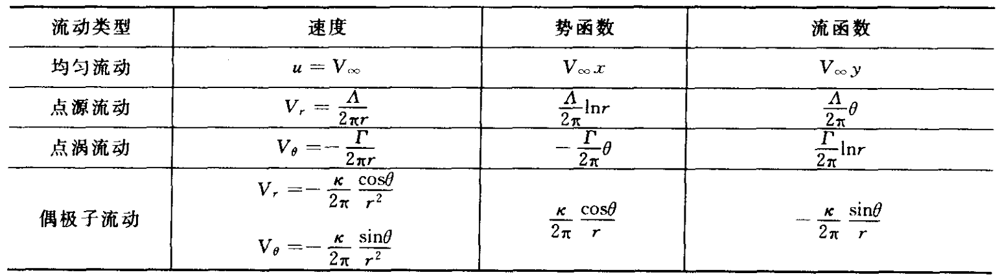

# 空气动力学总结(二)不可压流动

## 无黏不可压流动基础

### 无黏不可压流动的控制方程

适用范围：液体和低速气体(Ma<0.3)流动

$$
\nabla \cdot \boldsymbol{V}=0
$$

$$
\rho \frac{\mathrm{D} \boldsymbol{V}}{\mathrm{D} t}=\rho \mathbf{f}-\nabla p
$$

**伯努利方程**

无黏、不可压缩，定常，略去体积力条件下

$$
p+\frac{1}{2} \rho V^{2}=\text { const }
$$

- 对有旋流动，同一条流线对应同一个常数值
- 对无旋流动，整个流场对应同一个常数值

该常数为总压 $p_{0}$， $\dfrac{1}{2} \rho V^{2}$ 为动压 $q$

压力系数 $C_{p}=\left(p-p_{\infty}\right) / \dfrac{1}{2} \rho V_{\infty}^{2}=1-\left(V/V_{\infty}\right)^{2}$

### 二维无旋流动

**速度势函数**

$$
V=\nabla \phi ,\quad \nabla^{2} \phi=0
$$

**流函数**

$$
\mathrm{d} \psi=-v \mathrm{~d} x+u \mathrm{~d} y
$$

$$
\nabla^{2} \psi=0
$$

- 流函数的等值线是流线
- 过同一点的流函数等值线与等势线正交
- 两条流线间的流量是两流线的流函数值之差

$$
\frac{\partial \phi}{\partial r}=V_{r} \qquad \frac{1}{r} \frac{\partial \phi}{\partial \theta}=V_{\theta}
$$

$$
\frac{1}{r} \frac{\partial \psi}{\partial \theta} =V_{r} \qquad -\frac{\partial \psi}{\partial r} =V_{\theta}
$$

### 基本流动

### 流动的叠加

- 半无限体绕流：均匀流与点源的叠加
- 兰金椭圆绕流：均匀流 + 点源 + 点汇；令速度为0，可以解得两个驻点Ａ和Ｂ
- 绕圆柱无升力流动：均匀流+偶极子
- 圆柱有升力流动：均匀流 + 偶极子 + 涡旋流

达朗贝尔佯谬：势流的情况下在流体中匀速运动的物体不受到液体的作用力

### 库塔-儒可夫斯基定理

二维的无黏、不可压缩流的绕流问题，若翼型上有升力产生，则在绕翼型的速度场中，沿曲线  $A$  进行的速度线积分为有限值，即环量

$$
\Gamma=\oint_{A} \boldsymbol{V} \cdot \mathrm{d} \boldsymbol{s}
$$

可以得到单位展长上的翼型升力  $L^{\prime}$  的表达式

$$
L^{\prime}=\rho_{\infty} V_{\infty} \Gamma
$$

## 二维翼型

### 面涡理论

面涡由无限多的涡丝构成，涡丝与展向平行。定义涡强  $\gamma(s)$。穿过面涡的当地切向速度改变量等于当地面涡强度。

开尔文环量定理：在无粘正压流体中，若外力有势，在一条由相同流体质点组成的封闭曲线的速度环量在随体运动中不随时间变化。

从尾缘脱落的尾涡称为“ 起动涡”；而保持在翼型上的涡量称为“ 附着涡”；如果翼型立即停止，附着涡也随即脱落下来形成“ 停止涡”。由开尔文环量定理，绕翼型的环量与起动涡的环量大小相等方向相反。

### 库塔条件

对于给定环量的物体绕流，只有一个确定的流动同时满足远场和物面边界条件。如果环量不确定，远场边界条件和物体形状不能唯一确定流动形态。

1. 对于给定形状且给定迎角的翼型，绕翼型的环量大小恰好使得流体光滑流过后缘点；
2. 如果翼型后缘夹角为有限大小，则后缘点为驻点；
3. 如果翼型后缘夹角为零,则沿上、下表面流过翼型后缘的速度为相等的有限值。

$$
\gamma_{\mathrm{TE}}=\gamma(a)=V_{1}-V_{2} = 0
$$

### 薄翼理论

小厚度、小弯度翼型

翼型可以用在中弧线上分布的面涡来代替。只需求出能够使中弧线为流线，且满足后缘库塔条件的面涡强度分布。

$$
\frac{1}{2 \pi} \int_{0}^{c} \frac{\gamma(\xi) \mathrm{d} \xi}{x-\xi}=V_{\infty}\left[\alpha-\frac{\mathrm{d} z}{\mathrm{~d} x}\right]
$$

称为**薄翼理论基本公式**，其解为

$$
\gamma(\theta)=2 V_{\infty}\left(A_{0} \frac{1+\cos \theta}{\sin \theta}+\sum_{n=1}^{\infty} A_{n} \sin n \theta\right)
$$

$$
A_{0}=\alpha-\frac{1}{\pi} \int_{0}^{\pi} \frac{\mathrm{d} z}{\mathrm{~d} x} \mathrm{~d} \theta_{0}
$$

$$
A_{n}=\frac{2}{\pi} \int_{0}^{\pi} \frac{\mathrm{d} z}{\mathrm{~d} x} \cos n \theta_{0} \mathrm{~d} \theta_{0}
$$

可计算

$$
\Gamma=\int_{0}^{c} \gamma(\xi) \mathrm{d} \xi=c V_{\infty}\left[\pi A_{0}+\frac{\pi}{2} A_{1}\right]
$$

$$
c_{l}=\frac{L^{\prime}}{q c}=\frac{\rho_{\infty} V_{\infty} \Gamma}{\dfrac{1}{2} \rho_{\infty} V_{\infty}^{2} c}=2 \pi\left[\alpha+\frac{1}{\pi} \int_{0}^{\pi} \frac{\mathrm{d} z}{\mathrm{~d} x}\left(\cos \theta_{0}-1\right) \mathrm{d} \theta_{0}\right]
$$

$$
c_{m,le}=-\frac{\pi}{2}\left(A_{0}+A_{1}-\frac{A_{2}}{2}\right)=-\left[\frac{c_{l}}{4}+\frac{\pi}{4}\left(A_{1}-A_{2}\right)\right]
$$

气动中心在距前缘 1/4 弦长点处，压力中心随升力系数的变化而移动。

对称翼型(平板)的中弧线与弦线重合，其弯度为零。

$$
c_{l}=2 \pi \alpha ,\quad c_{m,le}=-\frac{c_{l}}{4}
$$

气动中心和压力中心均在距前缘 1/4 弦长点处。

## 有限展机翼

### 下洗和诱导阻力

有限展机翼的翼梢旋涡会在机翼周围产生一个小的向下的诱导速度  $w$ ，称之为**下洗速度**。下洗速度与来流速度叠加后，在机翼的各剖面附近形成了相对下偏的当地相对速度。

定义翼型弦线与来流  $V_{\infty}$  的夹角  $\alpha$  为**几何迎角**；当地相对来流的方向定义为来流下偏一个角度  $\alpha_{i}$  后所得的方向，并称  $\alpha_{i}$  为**下洗角**。

当地翼型剖面真正感受到的迎角是翼型弦线与当地相对来流之间的夹角，定义为**有效迎角** $\alpha_{\text {eff }}=\alpha-\alpha_{i}$ 。

升力方向在与来流垂直向上的基础上又向后偏转了一个  $\alpha_{i}$  角，所以在来流方向上会产生一个分量  $D_{i}$ ，这个分量就是由于下洗存在而产生的阻力，称为**诱导阻力**。

作用在有限展长机翼上的下洗减小了机翼每个翼型剖面所感受到的迎角，产生了诱导阻力。

### 有限翼展展向升力分布

- 升力分布为翼展方向的函数  $L^{\prime}(y)$ ；
- 弦长沿翼展变化；
- 零升力攻角沿翼展方向变化，称为**气动扭转**；
- 由于环量和单位展长升力成比例，因此环量也是展长的函数；
- 升力在翼尖为零。

### 线涡及其诱导速度

线涡是可以弯曲的。线涡会在周围的空间中产生诱导流场。如果沿包围线涡的任意封闭路径计算环量，就会得到一个常值  $\Gamma$，定义为线涡的强度。在线涡上取一有向微段  $\mathrm{d} \boldsymbol{l}$。设从微段  $\mathrm{d} \boldsymbol{l}$  到空间任意点  $P$  的矢径为  $\boldsymbol{r}$ , 则微段  $\mathrm{d} \boldsymbol{l}$  在点  $P$  的诱导速度为

$$
\mathrm{d} \boldsymbol{V}=\frac{\Gamma}{4 \pi} \frac{\mathrm{d} \boldsymbol{l} \times \boldsymbol{r}}{|\boldsymbol{r}|^{3}}
$$

半无限长线涡的诱导速度  $V=\dfrac{\Gamma}{4 \pi h}$ ，$h$ 为到线涡出发点的距离。

亥姆霍兹定理：涡丝强度沿长度方向不变；涡丝不能在流体中中断；涡丝或者延长到流体的边界（可以为无穷远），或者形成闭合回路。

### 经典升力线理论

沿升力线无穷多马蹄涡叠加，用附着涡代替有限长机翼，用附着涡和自由拖曳涡描述绕流有限长机翼流场。附着涡在其自身上没有诱导速度，两个拖曳涡在附着涡方向沿下洗方向有诱导速度。

$$
w\left(y_{0}\right)=-\frac{1}{4 \pi} \int_{-b / 2}^{b / 2} \frac{(\mathrm{d} \Gamma / \mathrm{d} y) \mathrm{d} y}{y_{0}-y}
$$

诱导迎角

$$
\alpha_{i}\left(y_{0}\right)=\arctan\left(-\frac{w\left(y_{0}\right)}{V_{\infty}}\right)
$$

$$
\alpha_{\text {eff }}=\alpha-\alpha_{i}
$$

当地翼型的升力系数  $c_{l}=2 \pi\left[\alpha_{\mathrm{eff}}\left(y_{0}\right)-\alpha_{L=0}\right]$

又有当地翼型升力的两种求法

$$
L^{\prime}=\frac{1}{2} \rho_{\infty} V_{\infty}^{2} c\left(y_{0}\right) c_{l}\left(y_{0}\right)=\rho_{\infty} V_{\infty} \Gamma\left(y_{0}\right)
$$

可推出**普朗特升力线理论基本方程**

$$
\alpha\left(y_{0}\right)=\frac{\Gamma\left(y_{0}\right)}{\pi V_{\infty} c\left(y_{0}\right)}+\alpha_{L=0}\left(y_{0}\right)+\frac{1}{4 \pi V_{\infty}} \int_{-b / 2}^{b / 2} \frac{(\mathrm{d} \Gamma / \mathrm{d} y) \mathrm{d} y}{y_{0}-y}
$$

求解出环量  $\Gamma=\Gamma(y)$

升力分布

$$
L^{\prime}\left(y_{0}\right)=\rho_{\infty} V_{\infty} \Gamma\left(y_{0}\right)
$$

总升力

$$
L=\int_{-b / 2}^{b / 2} L^{\prime}(y) d y=\rho_{\infty} V_{\infty} \int_{-b / 2}^{b / 2} \Gamma(y) \mathrm{d} y
$$

升力系数

$$
C_{L}=\frac{L}{q_{\infty} S}=\frac{2}{V_{\infty} S} \int_{-b / 2}^{b / 2} \Gamma(y) \mathrm{d} y
$$

单位展长诱导阻力

$$
D_{i}^{\prime}=L^{\prime} \alpha_{i}
$$

总诱导阻力

$$
D_{i}=\int_{-b / 2}^{b / 2} D^{\prime}(y) \mathrm{d} y=\rho_{\infty} V_{\infty} \int_{-b / 2}^{b / 2} \Gamma(y) \alpha_{i}(y) \mathrm{d} y
$$

诱导阻力系数

$$
C_{D, i}=\frac{D_{i}}{q_{\infty} S}=\frac{2}{V_{\infty} S} \int_{-b / 2}^{b / 2} \Gamma(y) \alpha_{i}(y) \mathrm{d} y
$$

**椭圆型翼载分布**

$$
\Gamma(y)=\Gamma_{0} \sqrt{1-\left(\frac{2 y}{b}\right)^{2}}
$$

下洗速度沿展向为常数

$$
w=-\frac{\Gamma_{0}}{2 b}
$$

升力

$$
L=\rho_{\infty} V_{\infty} \Gamma_{0} \frac{b}{4} \pi
$$

升力系数

$$
C_{L} = \frac{\pi b \Gamma_0}{2 V_\infty S}
$$

诱导攻角

$$
\alpha_{i}=\frac{\Gamma_{0}}{2 b V_{\infty}}=\frac{C_{L}}{\pi \mathrm{AR}}
$$

椭圆升力分布情况下，诱导攻角和展弦比成反比。

诱导阻力系数

$$
C_{D, i}=\frac{C_{L}^{2}}{\pi A R}
$$

诱导阻力系数与升力系数的平方成正比。这是由于诱导阻力和升力均为机翼上下表面压力分布差异造成，因此诱导阻力常被称为升致阻力；诱导阻力系数和展弦比成反比。

弦长沿展向以椭圆规律分布

$$
c(y)=\frac{L^{\prime}(y)}{q_{\infty} c_{l}}
$$

## 黏性流动基础

粘性摩擦切应力与物面的粘附条件（无滑移条件）是粘性流体运动有别与理想流体运动的主要标志。

### 黏性流动的控制方程

**连续方程**

$$
\frac{\partial \rho}{\partial t}+\nabla \cdot(\rho \boldsymbol{V})=0
$$

$$
\frac{\partial \rho}{\partial t}+\frac{\partial\left(\rho u_{i}\right)}{\partial x_{i}}=0
$$

**运动方程**

$$
\rho \frac{\mathrm{D} \boldsymbol{V}}{\mathrm{D} t}=\rho \mathbf{f}+\nabla \cdot [\boldsymbol{\tau}]
$$

$$
\rho \frac{\partial u_{i}}{\partial t}+\rho u_{j} \frac{\partial u_{i}}{\partial x_{j}}=\rho f_{i}+\frac{\partial \tau_{i j}}{\partial x_{i}}
$$

考虑牛顿流体，广义牛顿内摩擦定理，有**本构方程**

$$
[\boldsymbol{\tau}]=2 \mu [\boldsymbol{\varepsilon}]-\left(p+\frac{2}{3} \mu \nabla \cdot \boldsymbol{V}\right)[I]
$$

$$
\tau_{i j}=\left\{\begin{aligned}
& \mu\left(\dfrac{\partial u_{i}}{\partial x_{j}}+\dfrac{\partial u_{j}}{\partial x_{i}}\right) \quad & i \neq j \\
& 2 \mu \dfrac{\partial u_{i}}{\partial x_{j}}-\dfrac{2}{3} \mu \nabla \cdot \boldsymbol{V}-p \quad & i=j
\end{aligned}\right.
$$

常粘度条件，运动方程有

$$
\rho \frac{\mathrm{D} \boldsymbol{V}}{\mathrm{D} t}=\rho \mathbf{f}-\nabla p+\mu \nabla^{2} \boldsymbol{V}+\frac{\mu}{3} \nabla(\nabla \cdot \boldsymbol{V})
$$

不可压，有**涡量输运方程**

$$
\frac{\mathrm{D} \boldsymbol{\Omega}}{\mathrm{D} t}=(\boldsymbol{\Omega} \cdot \nabla) \boldsymbol{V}+\nu \nabla^{2} \boldsymbol{\Omega}
$$

粘性流体运动的基本特征：

- 运动的有旋性
- 旋涡的扩散性
- 能量的耗散性

**能量方程**

$$
\rho \frac{\mathrm{D}}{\mathrm{D} t}\left(e+\frac{V^{2}}{2}\right)=\rho \mathbf{f} \cdot \boldsymbol{V}+\nabla \cdot([\boldsymbol{\tau}] \cdot \boldsymbol{V})+\rho Q
$$

$$
\rho \frac{\mathrm{D}}{\mathrm{D} t}\left(e+\frac{u_{i} u_{i}}{2}\right)=\rho f_{i} u_{i}+\frac{\partial\left(\tau_{i j} u_{j}\right)}{\partial x_{i}}+\rho Q
$$

$$
\rho Q = \rho q+\nabla \cdot(k \nabla T) = \rho q+\frac{\partial}{\partial x_{i}}\left(k \frac{\partial T}{\partial x_{i}}\right)
$$

- $q$ 吸收热辐射、化学反应及燃烧等产生的外部加热

**动能方程**

$$
\rho \frac{\mathrm{D}}{\mathrm{D} t}\left(\frac{u_{i} u_{i}}{2}\right)=\rho f_{i} u_{i}+\frac{\partial\left(\tau_{j i} u_{i}\right)}{\partial x_{j}}-\tau_{j i} \varepsilon_{j i}
$$

**内能方程**

$$
\rho \frac{\mathrm{D} e}{\mathrm{D} t} =\boldsymbol{\pi}: \boldsymbol{\varepsilon} + \rho Q
$$

$$
\rho \frac{\mathrm{D} e}{\mathrm{D} t}=\pi_{i j} \varepsilon_{i j}+\rho Q
$$

定义耗散系数  $\Phi$

$$
\pi_{i j} \varepsilon_{i j} = -p \frac{\partial u_{i}}{\partial x_{i}}+\Phi
$$

对牛顿流体

$$
\Phi=2 \mu \varepsilon_{i j} \varepsilon_{i j}-\frac{2}{3} \mu\left(\frac{\partial u_{i}}{\partial x_{i}}\right)^{2}
$$

则内能方程为

$$
\rho \frac{\mathrm{D} e}{\mathrm{D} t} =-p \nabla \cdot \boldsymbol{V}+\Phi+\rho Q
$$

单位体积流体内能的变化率等于法向力作功、由于粘性而消耗的机械能以及外加热量之和

**焓方程**

$$
h=e+\frac{p}{\rho}
$$

$$
\rho \frac{\mathrm{D} h}{\mathrm{D} t}=\frac{\mathrm{D} p}{\mathrm{D} t}+\Phi+\rho Q
$$

有热焓式

$$
c_{p} \frac{\mathrm{D} T}{\mathrm{D} t}=Q+\frac{\Phi}{\rho}+\frac{1}{\rho} \frac{\mathrm{D} p}{\mathrm{D} t}
$$

总焓式

$$
\frac{\mathrm{D}}{\mathrm{D} t}\left(h+\frac{1}{2} u_{i} u_{i}\right)=Q+u_{i} f_{i}+\frac{1}{\rho} \frac{\partial\left(m_{j i} u_{i}\right)}{\partial x_{j}}+\frac{1}{\rho} \frac{\partial p}{\partial t}
$$

**熵方程**

对于完全气体

$$
T \frac{\mathrm{D} s}{\mathrm{D} t}=\frac{\mathrm{D} e}{\mathrm{D} t}+p \frac{\mathrm{D}}{\mathrm{D} t}\left(\frac{1}{\rho}\right)
$$

则有

$$
T \frac{\mathrm{D} s}{\mathrm{D} t}=\frac{\Phi}{\rho}+Q
$$

### 层流、湍流和转捩

**层流**流动时，流体微团保持相互平行的层状运动。流体的横向掺混仅由于分子热运动产生。对于**湍流**，流体微团间处于无规则的随机运动之中。不同尺寸的旋涡团间相互掺混，引起强烈的能量和热量的交换和传输，并引起机械能量的迅速耗散。流动从层流演变为湍流的现象与过程叫**转捩**。

雷诺实验：(1) 从层流转变为湍流的 Re 大小同入口处条件有关。(2) 压力损失，有上临界点，对应层流转变为湍流；下临界点，对应湍流转变为层流。

### 圆柱绕流

理想流体：

- 前驻点 A，后驻点 D，最大速度点 B、C；
- 中心流线在前驻点分叉，后驻点汇合；
- A-B 区和 A-C 区：顺压梯度区；B-D 区和 C-D 区：逆压梯度区；
- 圆柱面上压强分布对称，无阻力存在。

粘性流体：

- 物面附近产生边界层；
- A-B 点流程：消耗部分动能克服摩擦力阻力做功；
- B-D 点流程，流经一段距离将全部动能消耗殆尽，在壁面某点速度变为零(S点)，出现边界层分离；
- 在分离点之间的空腔内流体质点发生倒流，由下游高压区流向低压区，在圆柱后面形成了旋涡区；
- 旋涡涡区的出现，使得圆柱壁面压强前后不对称（如前驻点的压强要明显大于后驻点的压强）。

流体粘性引起的总阻力包括**摩擦阻力**和**压差阻力**。

### 平行平板间的层流

- 两平行平板间充满不可压牛顿流体
- 流体在  $x$  方向受压力梯度的作用

$$
v = 0
$$

$$
\frac{\partial u}{\partial t} + u \frac{\partial u}{\partial x} = f_{x} - \frac{1}{\rho}\frac{\partial p}{\partial x} + \nu \left( \frac{\partial^{2} u}{\partial x^{2}} + \frac{\partial^{2} u}{\partial y^{2}} \right)
$$

$$
f_{y} = \frac{1}{\rho}\frac{\partial p}{\partial y}
$$

### 管道中的层流

当流体进入管道入口后，边界层厚度由零随离开入口的距离增加，流动沿长度方向逐渐变化，经过一定长度后，流动不再改变，所有截面处的速度分布相同，称之为完全发展的流动，也称为泊肃叶流动(PoiseuilleFlow)。

$$
\mu\left(\frac{\mathrm{d}^{2} u}{\mathrm{~d} r^{2}}+\frac{1}{r} \frac{\mathrm{d} u}{\mathrm{~d} r}\right)=\frac{\mathrm{d} p}{\mathrm{~d} x}
$$

速度分布为抛物面

$$
u=-\frac{1}{4 \mu} \frac{\mathrm{d} p}{\mathrm{~d} x}\left(a^{2}-r^{2}\right)=u_{\max }\left(1-\frac{r^{2}}{a^{2}}\right)
$$

体积流量  $\displaystyle Q=\int_{0}^{a} u \cdot 2 \pi r \mathrm{d} r=-\frac{\pi a^{4}}{8 \mu} \frac{\mathrm{d} p}{\mathrm{~d} x}$

平均速度  $\displaystyle u_{\mathrm{m}}=-\frac{a^{2}}{8 \mu} \frac{\mathrm{d} p}{\mathrm{~d} x}$

剪应力分布  $\displaystyle \tau=\mu \frac{\partial u}{\partial r}=\frac{r}{2} \frac{\mathrm{d} p}{\mathrm{~d} x}$  ，管壁上剪应力  $\displaystyle \tau_{w}=\frac{a}{2} \frac{\mathrm{d} p}{\mathrm{~d} x}$

摩擦系数  $\displaystyle \gamma=\frac{\tau_{w}}{\frac{1}{2} \rho u_{m}^{2}}=\frac{8 \mu}{\rho u_{m} a}=\frac{16}{Re}$

阻力系数  $\displaystyle \lambda=\frac{\Delta p}{\frac{l}{2 a} \cdot \frac{1}{2} \rho u_{m}^{2}}=\frac{64}{Re}$

## 边界层理论

### 边界层

大雷诺数绕流流场，在靠近物面的薄层流体内，流场的特征与理想流动相差甚远，**沿着法向存在很大的速度梯度，粘性力无法忽略**。这一物面近区粘性力起重要作用的薄层称为**边界层**(附面层)。

- 边界层：N-S方程化简为边界层方程
- 尾迹区：N-S方程
- 势流区：理想流Euler方程

沿壁面的法线向外推移， $u=0.99 V_{e}$  的位置和壁面间的距离定义为边界层厚度，并称为边界层的**名义厚度**。

**排挤厚度**就是理想无黏流流线被外推的距离，用于边界层精确计算时修正物面。

$$
\delta_{1}=\frac{1}{\rho_{e} V_{e}} \int_{0}^{h>\delta}\left(\rho_{e} V_{e}-\rho u\right) \mathrm{d} y=\int_{0}^{h>\delta}\left(1-\frac{\rho u}{\rho_{e} V_{e}}\right) \mathrm{d} y
$$

**动量损失厚度**

$$
\delta_{2}=\frac{1}{\rho_{e} V_{e}^{2}} \int_{0}^{h>\delta} \rho u\left(V_{e}-u\right) \mathrm{d} y=\int_{0}^{h>\delta} \frac{\rho u}{\rho_{e} V_{e}}\left(1-\frac{u}{V_{e}}\right) \mathrm{d} y
$$

边界层内损失的动量相当于厚度为  $\delta_{2}$  的理想流体动量。

$$
\delta_{2} < \delta_{1} < \delta
$$

### 不可压缩层流边界层方程

选取长度尺度  $L$ ，速度尺度  $u_{e}$ ，时间尺度  $t=L / u_{e}$ ，近似假定在边界层内满足下列关系:

- 法向尺度远小于纵向尺度，纵向导数远小于法向导数
- 法向速度远远小于纵向速度
- 压强与外流速度的平方成正比

Prandtl 边界层方程

$$
\frac{\partial u}{\partial x}+\frac{\partial v}{\partial y}=0
$$

$$
\frac{\partial u}{\partial t}+u \frac{\partial u}{\partial x}+v \frac{\partial u}{\partial y}=-\frac{1}{\rho} \frac{\partial p}{\partial x}+v \frac{\partial^{2} u}{\partial y^{2}}
$$

$$
\frac{\partial p}{\partial y}=0
$$

边界条件

$$
y=0 , u=0 , v=0
$$

$$
y=\infty , u=u_{e}
$$

对于曲率不大的弯曲物面，上述边界层方程也近似成立。

- 边界层很薄
- 边界层内速度梯度很大，粘性不可忽略
- 边界层内压力沿壁面法向不变，等于外部势流压力
- 边界层内速度分布具有渐进性
- 边界层有涡性

### 定常平板层流边界层

不可压缩、定常、层流、不计重力、无压力梯度

**Blasius 解**

引入流函数  $\psi(x, y)$  和无量纲量  $\eta=\dfrac{y}{\sqrt{x \nu/V_{\infty}}}$

假设在距平板前缘不同位置处，边界层内速度分布是“相似”的： $\dfrac{u}{V_{\infty}}=\phi(\eta)$

则可定义无量纲函数  $f(\eta)$

$$
\psi=\int u \mathrm{~d} y=\sqrt{x \nu V_{\infty}} \int \phi(\eta) \mathrm{d} \eta \equiv \sqrt{x \nu V_{\infty}} f(\eta)
$$

$$
f f^{\prime \prime}+2 f^{\prime \prime \prime}=0
$$

边界条件为

当  $\eta=0$  时，  $f=f^{\prime}=0$

当  $\eta \rightarrow \infty$  时，  $f^{\prime}=1$

**边界层的各种厚度**

边界层厚度  $u / V_{\infty}=0.9916$ 时， $\eta=5.0$

$$
\delta=5 \sqrt{\frac{v x}{V_{\infty}}}=5 \frac{x}{\sqrt{\operatorname{Re}_{x}}}
$$

$$
\delta_{1}=\int_{0}^{\delta}\left(1-\frac{u}{V_{\infty}}\right) d y=1.7208 \frac{x}{\sqrt{\operatorname{Re}_{x}}}
$$

$$
\delta_{2}=\int_{0}^{\delta} \frac{u}{V_{\infty}}\left(1-\frac{u}{V_{\infty}}\right) d y=0.664 \frac{x}{\sqrt{\mathrm{Re}_{x}}}
$$

**壁面摩擦阻力**

壁面切应力

$$
\tau_{0}=\left.\mu \frac{\partial u}{\partial y}\right|_{y=0}=\left.\mu V_{\infty} f^{\prime \prime}(\eta)\right|_{\eta=0} \sqrt{\frac{V_{\infty}}{v x}}=0.332 \rho V_{\infty}^{2} \frac{1}{\sqrt{\operatorname{Re}_{x}}}
$$

壁面摩擦阻力系数

$$
C_{f}=\frac{\tau_{0}}{\frac{1}{2} \rho V_{\infty}^{2}}=0.664 \frac{1}{\sqrt{\operatorname{Re}_{x}}}
$$

平板的总摩擦阻力与阻力系数

$$
D_{F}=\int_{0}^{L} \tau_{0} d x=0.664 \rho V_{\infty}^{2} \sqrt{\frac{\nu L}{U}}
$$

$$
C_{F}=\frac{D_{F}}{\frac{1}{2} \rho V_{\infty}^{2} L}=\frac{1.328}{\sqrt{\operatorname{Re}_{L}}} \quad\left(100<\operatorname{Re}_{L}<5 \times 10^{5}\right)
$$

### 边界层动量积分方程式

$$
\frac{\tau_{0}}{\rho}=\frac{\mathrm{d}}{\mathrm{d} x}\left(V_{\mathrm{e}}^{2} \delta_{2}\right)+V_{\mathrm{e}} \delta_{1} \frac{\mathrm{d} V_{\mathrm{e}}}{\mathrm{d} x}
$$

一阶常微分方程，既适用于层流也适用于湍流边界层。该方程给出了壁面剪切应力与位移厚度和动量厚度之间的关系。

利用动量积分关系式方法求解边界层流动的基本思想就是：根据边界层流动特性和在壁面与边界层外缘的边界条件，近似地给出一个只依赖于单参数（称为型参数）的速度型族来代替边界层内真实的速度分布，这样就可以通过动量积分关系式将上述三个未知量归结为一个未知量，然后确定速度分布规律的型参数，进而可以确定边界层中其他流动参数。

### 边界层的分离

边界层中的流体质点受惯性力、粘性力和压力的作用。惯性力与粘性力的相对大小决定了粘性影响的相对区域大小，或边界层厚度的大小；粘性力的作用始终是阻滞流体质点运动，使流体质点减速，失去动能；压力的作用取决于绕流物体的形状和流道形状，**顺压梯度**有助于流体加速前进，而**逆压梯度**阻碍流体运动。

**分离点**定义为紧邻壁面顺流区与倒流区的分界点。分离点下游区域受逆压梯度的作用而发生倒流。在分离点附近和分离区，边界层假设不再成立，边界层厚度大大增加。

边界层分离的必要条件是存在逆压梯度和粘性剪切层。

根据边界层方程，在壁面上

$$
\frac{\partial^{2} u}{\partial y^{2}}=\frac{1}{\mu} \frac{\partial p}{\partial x}=-\frac{V_{e}}{\nu} \frac{\partial V_{e}}{\partial x}
$$

随着压力梯度的变号，边界层速度分布的曲率将改变符号。

粘性流体绕过曲线壁面时，速度将经历从加速达到最大然后减速的过程，对应的压强也会从顺压变化为逆压，从而边界层内速度分布的曲率也将随之改变。

- 对于顺压梯度区，压力沿程减小，速度沿程增加。边界层内的速度沿y方向是单调增加的，分布曲线无拐点，是一条向外凸的光滑曲线，流动是稳定的。
- 零压梯度区与顺压区速度分布相比，速度分布开始变尖瘦。
- 逆压梯度区出现速度分布的**拐点**，改变了速度分布的形状，在拐点以上为外凸型，在拐点以下为外凹型，存在拐点的速度分布型是不稳定的。

随着流体质点向下游流动从零压梯度点进入逆压区，拐点从物面上向外边界移动，物面近区的速度分布愈来愈瘦小。当拐点移动到空间某点时，物面处速度为 0，该点称为分离点。

分离点下游区域发生了回流，回流把主流推离壁面，边界层假设失效。

逆压梯度愈大，边界层分离愈靠前。边界层分离后，流动特征发生了变化。如：

- 从分离点不断脱离出旋涡，在分离点下游形成不稳定的旋涡区，从而使得主流区由原来无涡区变成有涡。
- 在分离点后出现低压区（或负压区），从而大大增加了绕流物体的阻力。

湍流边界层能够抵抗一定的逆压梯度而不分离(较大逆压下仍然会分离)。高尔夫球凹坑使层流边界层很快转捩成为湍流边界层，湍流的横向输运特性使其具有较饱满的速度型和抵抗逆压梯度的能力，因此具有较小的分离尾迹和流动阻力。

### 绕翼型的流动

边界层外可看作无粘流动。沿翼型表面压力变化，前缘驻点A处，压力最大；最小压力点B；顺压梯度区A-B，沿上表面流动速度将增加，压力减小至最小压力点B；逆压梯度区B-C，边界层内流体受逆压梯度及粘性双重影响，速度迅速减小，边界层迅速增厚。尾迹区，上下表面的边界层在后缘汇合形成尾迹流动。

迎角增大，逆压梯度增大。大迎角时上翼面最大速度点后的减速增压区将出现分离，边界层底层出现倒流，与上层顺流相互作用，形成漩涡脱离物体表面的现象。一方面改变了绕流的形状使升力大为降低；另一方面造成了减速增压过程的机械能有损失，实验表明分离区的压强接近分离点的压强，从而造成了较大的压差阻力，同时还存在摩擦阻力。