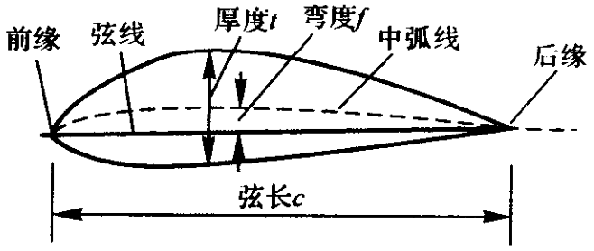

#! https://zhuanlan.zhihu.com/p/693757107
# 空气动力学总结(一)绪论与补充

## 流体的物理模型

流体定义：静止状态无法承受剪切应

连续介质假设：不考虑分子间隙，认为介质连续分布于流体所占据的整个空间。流体由连续的流体微团组成，宏观上要足够小，以反映流场“点”状态；微观上要足够大，以消除分子随机运动带来的宏观物理量在统计上的涨落。

> 连续介质假设成立条件：Knudsen数 $\mathrm{Kn}<0.001$，$\mathrm{Kn}=\dfrac{\lambda}{L}$，其中  $\lambda$  为分子平均自由程， $\mathrm{L}$  为流动的特征尺度

### 基本物理量与物理模型

**理想气体**

$$
p=\rho R T
$$

- 标准大气压：101325 Pa = 1 atm
- 海平面大气密度：1.225 Kg/m3
- 标准情况下的大气，R=287 J/(kg・K)

**弹性模量**
压力增量对流体单位比体积增量之比

$$
E=-\frac{d p}{d V / V}=\rho \frac{d p}{d \rho}
$$

水:  $2.15 \times 10^{9} \mathrm{~N} / \mathrm{m}^{2}$ ，空气：水的  $1 / 20000$

**热膨胀系数**

$$
\beta=-\frac{1}{\rho} \frac{\partial \rho}{\partial \mathrm{T}}=\frac{1}{v} \frac{\partial v}{\partial T}
$$

**黏度**

黏度  $\mu$  反映了流体抵抗剪切应变率的能力

牛顿切应力定律：

$$
\tau=\mu \dfrac{\mathrm{d} u}{\mathrm{d} y}
$$

切应力与速度梯度成正比的流体，称为**牛顿流体**；其余种类的流体称为非牛顿流体。

运动黏度  $\nu=\dfrac{\mu}{\rho}$

当温度升高时，液体黏度减小，气体黏度增大。

对于空气，有萨兰特公式(Sutherland's law)

$$
\mu=\mu_{0} \frac{273+C}{T+C}\left(\frac{T}{273}\right)^{1.5}
$$

其中  $\mu_{0}=1.72e-5$  是  $0^{\circ} \mathrm{C}$  时的动力粘度；$\mathrm{C}=110$

对于水

$$
\mu=\frac{\mu_{0}}{1+0.0337 T+0.000221 T^{2}}
$$

**导热**

$$
\boldsymbol{q}=-k \nabla T
$$

- $q$ 热流密度
- $k$ 热传导系数

**流体的扩散性**

$$
\boldsymbol{J}=-D \nabla C
$$

- $\boldsymbol{J}$ 物质扩散通量
- $D$ 物质扩散系数
- $C$ 物质的体积浓度

**内能和焓**

比焓与比内能之间的关系

$$
h=e+p / \rho
$$

对量热完全气体：

$$
h=c_{p} T ,\quad e=c_{V} T
$$

$$
c_{p}=\frac{\gamma R}{\gamma-1} ,\quad c_{V}=\frac{R}{\gamma-1}
$$

对于标准情况下的大气，$\gamma$  =1.4

### 热力学定律

热力学第一定律

$$
\delta q+\delta w=\mathrm{d} e
$$

熵的定义

$$
\mathrm{d} s=\frac{\delta q_{\mathrm{rev}}}{T}
$$

- $s$ 熵
- $\delta q_{\mathrm{rev}}$ 可逆地加于系统的热增量

实际上

$$
\mathrm{d} s=\frac{\delta q}{T}+\mathrm{d} s_{\mathrm{irrev}}
$$

- $\delta q$ 不可逆过程中实际加在系统上的热增量
- $s_{\mathrm{irrev}}$ 不可逆过程中，系统由于黏性消耗，热传导和质量耗散而产生的熵增

热力学第二定律

$$
\mathrm{d} s \geqslant \frac{\delta q}{T}
$$

熵的实际计算：

可逆过程中

$$
T \mathrm{~d} s=\mathrm{d} e+p \mathrm{~d} v
$$

$$
T \mathrm{~d} s=\mathrm{d} h-v \mathrm{~d} p
$$

对量热完全气体

$$
s_{2}-s_{1}=c_{p} \ln \frac{T_{2}}{T_{1}}-R \ln \frac{p_{2}}{p_{1}}=c_{V} \ln \frac{T_{2}}{T_{1}}+R \ln \frac{v_{2}}{v_{1}}
$$

定义既绝热又可逆的过程叫做等熵过程。对量热完全气体，有**等熵关系式**

$$
\frac{p_{2}}{p_{1}}=\left(\frac{\rho_{2}}{\rho_{1}}\right)^{\gamma}=\left(\frac{T_{2}}{T_{1}}\right)^{\gamma /(\gamma-1)}
$$

### 声速

考虑等熵过程

$$
a=\sqrt{\left(\frac{\mathrm{d} p}{\mathrm{~d} \rho}\right)_{\mathrm{s}}}=\sqrt{\gamma R T}
$$

标准海平面大气的声速  $a=340.9 \mathrm{~m} / \mathrm{s}$

马赫数

$$
Ma = \frac{V}{a}
$$

马赫角

$$
\mu=\sin ^{-1} \frac{1}{Ma}
$$

### 滞止参数

**流动定常、绝热、无黏**

由热力学第一定理，沿流线

$$
h+\frac{V^{2}}{2}=h_{0}
$$

对于量热完全气体  $h_{0}=c_{p} T_{0}$ ，称**总温**  $T_{0}$， **总焓**  $h_{0}$  。

如果所有的流线都来自均匀自由来流，那么总焓在不同流线也是相等的，在整个流场中为常数，等于自由来流对应的总焓。

**流动定常、绝热、无黏、等熵**

沿流线总焓相同，则量热完全气体有

$$
\frac{\gamma}{\gamma-1} \frac{p}{\rho}+\frac{1}{2} V^{2}=\frac{\gamma}{\gamma-1} \frac{p_{0}}{\rho_{0}}
$$

$$
p_{0}=\rho_{0} R T_{0}
$$

称**总压**  $p_{0}$，**总密度**  $\rho_{0}$ 

如果整个流动区域都是等熵的，则总压和总密度分别为常数。

可以定义滞止声速

$$
a_{0} = \sqrt{\gamma R T_{0}}
$$

对理想气体

$$
a^{2}+\frac{\gamma-1}{2} V^{2}=a_{0}^{2}
$$

**等熵关系式**

$$
T=T_{0}\left(1+\frac{\gamma-1}{2} Ma^{2}\right)^{-1}
$$

$$
p=p_{0}\left(1+\frac{\gamma-1}{2} Ma^{2}\right)^{-\gamma/(\gamma-1)}
$$

$$
\rho=\rho_{0}\left(1+\frac{\gamma-1}{2} Ma^{2}\right)^{-1/(\gamma-1)}
$$

### 临界参数

亚声速流或者超声速流中，考虑流场中一点，流体微团**等熵**加速或减速至声速，对应的参数称为**临界参数**，用 “  $*$  ” 标记。

$$
a^{*}=\sqrt{\gamma R T^{*}}
$$

$$
\left(\frac{a^{*}}{a_{0}}\right)^{2}=\frac{T^{*}}{T_{0}}=\frac{2}{\gamma+1} \qquad \frac{p^{*}}{p_{0}}=\left(\frac{2}{\gamma+1}\right)^{\gamma/(\gamma-1)} \qquad \frac{\rho^{*}}{\rho_{0}}=\left(\frac{2}{\gamma+1}\right)^{1/(\gamma-1)}
$$

特征马赫数  $Ma^{*}=\dfrac{V}{a^*}$

$$
{Ma^{*}}^{2}=\frac{(\gamma+1) Ma^{2}}{2+(\gamma-1) Ma^{2}}
$$

## 流体运动

### 描述方法

拉格朗日描述，欧拉描述

**随体导数**

$$
\frac{\mathrm{D}}{\mathrm{D} t}=\frac{\partial}{\partial t}+(\boldsymbol{V} \cdot \nabla)=\frac{\partial}{\partial t}+u_{j} \frac{\partial}{\partial x_{j}}
$$

**流场**

- **流线**：给定的瞬间流场中的假理曲线，该曲线上各点处的切线方向都与流场该点处的速度矢量方向一致
- **迹线**：流体质点的运动轨迹。在定常流动中，流线与迹线重合，形状不变
- **流管**：在流场中任意画一条不是流线的封闭曲线，在同一时刻过此曲线上的每一点作流线，由这些相邻流线所构成的管状曲面
- **流面**：通过一条非流线的曲线(不封闭或封闭的)上每一点所作的那些相邻流线组成的曲面
- **流量**：单位时间内穿过指定截面的流体量
- **脉线**：在一段时间内相继通过空间某固定点的很多流体质点连成的线。在定常流动中脉线的形状不变，与流线、迹线重合，因此常用它来代表流线。
- **涡量**：$\boldsymbol{\Omega}=\operatorname{rot} \boldsymbol{V}=\nabla \times \boldsymbol{V}$
- **涡线**：同一瞬时，该线上每一点的涡轴线都与曲线相切
- 涡面，涡管，涡通量

**雷诺输运定理**

某一瞬间，控制体内的流体所构成的体系，它所具有的物理量总量的随体导数，等于同一瞬间控制体系中所含同一物理量的增加率与该物理量通过控制面的净流出率之和。

$$
\begin{aligned}
& \frac{\mathrm{D}}{\mathrm{D} t}\left(\iiint_{\Omega(t)} \eta(x, y, z, t) \mathrm{d} \Omega\right) \\
= & \iiint_{\Omega} \frac{\partial \eta(x, y, z, t)}{\partial t} \delta \Omega +\oiint_{S} \eta(x, y, z, t) \boldsymbol{V}(x, y, z, t) \cdot \boldsymbol{n} \delta S
\end{aligned}
$$

### 运动分析

平移，线变形，旋转，角变形

应变率张量

$$
\varepsilon_{i j}=\frac{1}{2}\left(\frac{\partial u_{i}}{\partial x_{j}}+\frac{\partial u_{j}}{\partial x_{i}}\right)
$$

应力张量  $\tau_{ij}$

## 二维翼型

### 几何描述

### 气动性质

攻角（迎角）$\alpha$ ：来流与翼型弦线的夹角

单位展长升力 $L^{\prime}$ ：与重力方向相反的气动力分量

单位展长阻力 $L^{\prime}$ ：与升力垂直

单位展长升力力矩 $\displaystyle M^{\prime}=-\int_{0}^{c} \xi \mathrm{d} L^{\prime}$ ：单位展长涡元关于前缘力矩

升力系数  $\displaystyle c_{l}=\frac{L^{\prime}}{q_{\infty} c}$

阻力系数  $\displaystyle c_{d}=\frac{D^{\prime}}{q_{\infty} c}$

力矩系数  $\displaystyle c_{m,le}=\frac{M^{\prime}}{q_{\infty} c^{2}}$

气动中心(焦点)：气动力矩不随迎角变化的点

压力中心  $x_{cp}=-\dfrac{M^{\prime}}{L^{\prime}}$

## 三维机翼

### 几何参数

翼展  $b$ ， 翼面积  $S$

展弦比  $AR=\dfrac{b^{2}}{S}$

几何扭转：攻角沿翼展变化。翼尖攻角小于翼根攻角，称为外洗，反之，称为内洗。

根梢比：翼根弦长与翼尖弦长之比

厚弦比：翼型的最大厚度和弦长的比

### 气动性质

升力、阻力和力矩： $L$ ，$D$  和  $M$

升力系数  $C_{L}=\dfrac{L}{q_{\infty} S}$

阻力系数  $C_{D}=\dfrac{D}{q_{\infty} S}$

力矩系数  $C_{M}=\dfrac{M}{q_{\infty} S}$

## 量纲分析和相似理论

实验的理论基础则是相似原理，实验数据分析则要应用量纲分析。

### 量纲分析

量纲公式

速度  $\operatorname{dim} v=LT^{-1}$  、加速度  $\operatorname{dim} a=LT^{-2}$  、密度  $\operatorname{dim} \rho=ML^{-3}$ 力  $\operatorname{dim} F=MLT^{-2}$  、压强  $\operatorname{dim} p=ML^{-1} T^{-2}$

表面张力  $\operatorname{dim} \sigma=MT^{-2}$  、体积模量  $\operatorname{dim} K=ML^{-1} T^{-2}$  动力粘度  $\operatorname{dim} \mu=M L^{-1} T^{-1}$  、运动粘度  $\operatorname{dim} v=L^{2} T^{-1}$  比热容  $\operatorname{dim} c_{p}=\operatorname{dim} c_{V}=L^{2} T^{-2} \Theta^{-1}$  气体常数  $\operatorname{dim} R=L^{2} T^{-2} \Theta^{-1}$

量纲一致性原则：描述物理现象的物理方程中的各项量纲必然相同。量纲分析：利用量纲一致性原则寻求物理量之间的关系。

$\Pi$定理(铂金汉定理)：如果一个物理过程涉及到  $n$  个物理量和  $m$  个基本量纲，则这个物理过程可以由  $n$  个物理量组成的  $n-m$  个无量纲量的函数关系来描述。

1. 确定影响此物理现象的各个物理量
2. 从  $n$  个物理量中选取  $m$  个基本物理量作为  $m$  个基本量纲的代表
3. 从三个基本物理量以外的物理量中，每次轮取一个，连同三个基本物理量组合成一个无量纲的  $\pi$  项，一共写出   $n-3$  个  $\pi$  项
4. 写出描述物理现象的无因次关系式

### 流动的相似理论

流动相似应满足的条件

- 几何相似：模型和原型的全部对应线形长度的比值为一定常数
- 运动相似：模型与原形的流场所有对应点上、对应时刻的流速方向相同而流速大小的比例相等
- 动力相似：模型与原型的流场所有对应点作用在流体微团上的各种力彼此方向相同，而它们大小的比例相等

只有在满足以上三个相似之后，模型流动才能够真实地模拟出原型流动，模拟才具有实际价值和意义。

四个无量纲数

雷诺数  $Re=\dfrac{\rho U L}{\mu}$ ：惯性力与粘性力的比值

弗劳德数  $Fr=\dfrac{U^{2}}{g L}$ ：惯性力与重力的比值

斯特劳哈尔数  $S_{t}=\dfrac{L}{t U}=\dfrac{f L}{U}$ ：当地惯性力和迁移惯性力的比值，$f$  为特征频率

欧拉数  $Eu=\dfrac{\Delta p}{\rho U^{2}}$ ：所受压力与惯性力之比

相似判据：只要四个无量纲数在两流场中是相同的，那么原型和模型流场相似，则两方程应反映同一事实。

马赫数  $Ma=\dfrac{U}{c_{0}}$ ：惯性力和弹性力之比

普朗特数  $Pr=\dfrac{c_{p} \mu}{k}$ ：流体动量扩散能力与热量扩散能力的对比关系

