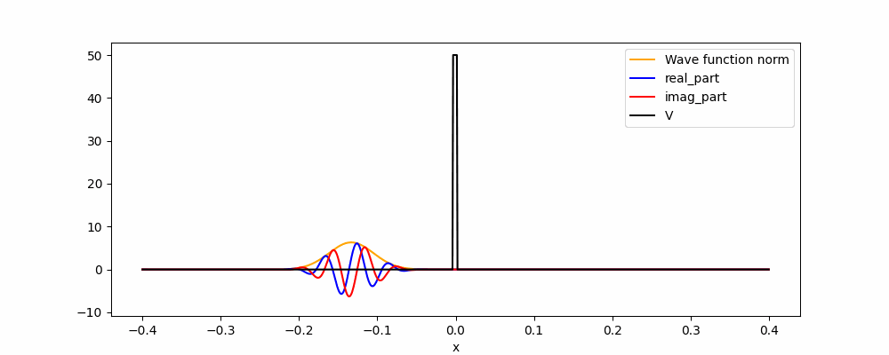
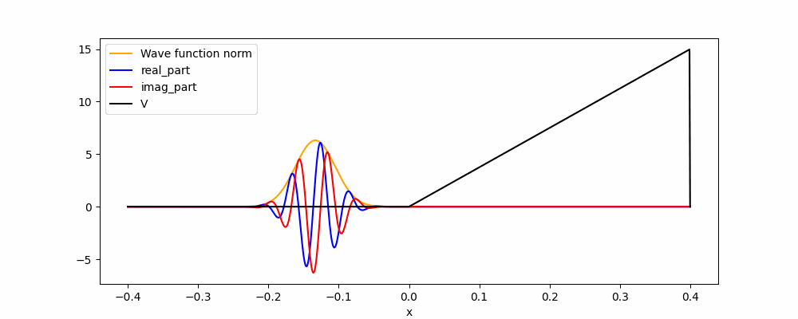
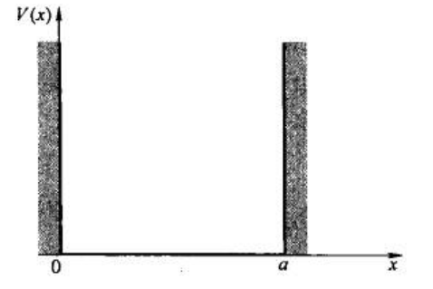

#! https://zhuanlan.zhihu.com/p/608306983
# 量子力学速通(1)初探微观世界

微观世界的物理图像与宏观世界截然不同。这里先说微观粒子（如电子），经典力学的模型使用点和牛顿三大定律来描述，但这种描述并不适用于微观情况。下面介绍使用波函数和薛定谔方程来描述微观粒子的行为。这种描述方式在量子力学中被广泛使用，可以更好地解释许多微观现象。

---

## 波函数

学过高中物理就知道，微观粒子具有**波粒二象性**。波粒二象性中的波，是指微观粒子具有相干叠加性；粒，是指微观粒子所占的空间往往局限于一点，且有固定的质量、电荷。如何描述粒子的波粒二象性？答案是利用概率波。

在量子力学中，用**波函数**来描述微观粒子，记作$\Psi(\boldsymbol{r}, t)$。这是一个复变函数，其输入为坐标$\boldsymbol{r}$和时间$t$，**输出为一个复数**。可以认为，波函数存储了粒子的许多信息。

首先是粒子的位置。众所周知，量子力学总和概率联系在一起。粒子的波函数的模的平方，表示粒子在坐标$\boldsymbol{r}$的概率密度，即
$$
P(\boldsymbol{r},t) = |\Psi(\boldsymbol{r},t)|^2 \tag{1}
$$
这个函数可以用来计算在任意时刻 $t$ 粒子被观测到时，它处于空间中某个给定的体积元内的概率。需要注意的是，这种概率密度函数描述的是一个粒子存在的概率密度，而不是粒子的实际位置。在进行观测之前，我们无法得知粒子的实际位置，只能通过多次观测，根据观测结果的统计规律推断其在空间中的分布情况。

由于概率的归一性，于是有
$$
\int_{V}|\Psi(\boldsymbol{r}, t)|^{2} \mathrm{~d} \boldsymbol{r}=1 \tag{2}
$$
其中$V$代表整个空间。这就是波函数的**归一化条件**。

紧接着，我们可以计算粒子坐标的期望
<!-- $$
\langle \boldsymbol{r} \rangle=\int_{V} \boldsymbol{r} |\Psi(\boldsymbol{r}, t)|^{2} \mathrm{d} \boldsymbol{r} \tag{3}
$$ -->
$$
\langle x\rangle=\int x|\Psi(x, t)|^{2} \mathrm{~d} x
$$
$y,z$同理。

紧接着是动量，为了简便起见，我们只考虑一维的情况
$$
\langle p\rangle=m \frac{\mathrm{d}\langle x\rangle}{\mathrm{d} t}=\int \Psi^{*}\left(-\mathrm{i} \hbar \frac{\partial}{\partial x}\right) \Psi \mathrm{d} x \tag{3}
$$
注意，这里粒子质量$m$消失了，并出现了虚数单位$\mathrm{i}$和约化普朗克常数$\hbar$。这是因为这里动量的推导用到了薛定谔方程，不必在意。

可以定义动量算符$\hat{p}$
$$
\hat{p}=-\mathrm{i} \hbar \frac{\partial}{\partial x} \tag{4}
$$

观察式(3)的结构，有一个有趣的结论，就是如果一个物理量（如能量）可以用坐标和动量表示，即$Q(x,p)$，则可以代入动量算符，使其成为一个算符$\hat{Q}(x,\hat{p})$，且有
$$
\langle\hat{Q}\rangle=\int \Psi^{*} \hat{Q}(x, \hat{p}) \Psi \mathrm{d} x \tag{5}
$$

举个例子，动能算符$\hat{T}$为
$$
\hat{T}=-\frac{\hbar^{2}}{2 m} \frac{\partial^{2}}{\partial x^{2}} \tag{6}
$$

则动能的期望为
$$
\langle\hat{T}\rangle=-\frac{\hbar^{2}}{2 m} \int \Psi^{*} \frac{\partial^{2} \Psi}{\partial x^{2}} \mathrm{~d} x \tag{7}
$$

综上所述，波函数可以用来描述粒子，波函数包含了粒子的许多信息。事实上，**对于任何一个微观体系，它的状态和该状态所决定的物理性质都可用波函数表示**。这是量子力学的一个基本假设。

此外，一个物理量，可以转变为一个算符，用来计算该物理量的期望。这又引出了量子力学的另一个基本假设：**微观体系的每个可观测量的物理量都对应着一个线性自轭算符**。

## 薛定谔方程

有了描述微观粒子运动的工具后，就可以用**薛定谔方程**描述粒子的运动规律
<!-- $$
i \hbar \frac{\partial \Psi}{\partial t}=-\frac{\hbar^{2}}{2 m} \frac{\partial^{2} \Psi}{\partial x^{2}}+V \Psi
$$ -->
$$
\mathrm{i} \hbar \frac{\partial \Psi}{\partial t}=-\frac{\hbar^{2}}{2 m} \nabla^{2} \Psi+V \Psi \tag{8}
$$
其中$\mathrm{i}$为虚数单位，$\hbar$为约化普朗克常数。$V(\boldsymbol{r},t)$是势能函数，其含义与经典力学一致。

薛定谔方程的作用和地位从逻辑上讲就像牛顿第二定律：给定适当的初始条件（一般为$\Psi(\boldsymbol{r},0)$），然后通过薛定谔方程解出波函数$\Psi(\boldsymbol{r},t)$。

## 粒子的运动模拟

假设在一维情况下，$t=0$时，某粒子的波函数为
$$
\Psi(x, 0)=\frac{1}{\left(2 \pi \sigma^{2}\right)^{1 / 4}} \mathrm{e}^{-\left(x-x_{0}\right)^{2} /\left(2 \sigma\right)^{2}} \mathrm{e}^{\mathrm{i} \frac{p_{0}}{\hbar} x} \tag{9}
$$
这种形式的波函数，称为高斯波函数。其中$\sigma$是位置的标准差，$x_{0}$是波峰的坐标，$p_{0}$为初始时的动量。

那么，在$V(x,t)=0$时，该粒子怎么运动？

这里不求解薛定谔方程的解析解，只是用有限差分法获得薛定谔方程的数值解。相关代码都存放在[git仓库](https://github.com/cjyyx/notes/tree/main/%E5%AD%A6%E4%B9%A0%E7%AC%94%E8%AE%B0/%E9%87%8F%E5%AD%90%E5%8A%9B%E5%AD%A6%E5%AF%BC%E8%AE%BA/PythonScript/1_1)中。

如动图所示，粒子向右运动，其波函数向右传播。其中黄色的曲线代表波函数的模，蓝色代表波函数的实部，红色代表波函数的虚部。可以看到，随着波函数的传播，其速度不变，但坐标的标准差变大。如果想更加具体得了解自由粒子的运动，可以看[这个视频](https://www.bilibili.com/video/BV1fx41187fr)。

接下来展示一下隧穿效应。

图中的黑线代表势能。可以看到，虽然粒子的能量不足以使粒子越过势能壁，但是粒子仍旧有可能穿透势能壁。

如果增高势能壁会怎样？

粒子无法穿过了。

如果增厚势能壁会怎样？

粒子也无法穿过了。

接下来是"上坡"。

势阱

## 定态

薛定谔方程是非线性偏微分方程，因此求解析解比较困难。但是，当势能函数$V(\boldsymbol{r},t)$不随时间改变时，或者说不依赖时间时，薛定谔方程变得线性，因此可以求得解析解。这种情况称为**定态**。

简便起见，这里依旧考虑一维情况。当势能与时间无关时，薛定谔方程的解为
$$
\Psi(x, t)=\sum_{n=1}^{\infty} c_{n} \psi_{n}(x) \mathrm{e}^{-\mathrm{i} E_{n} t / \hbar}
$$

其中，$c_{n}$为复数常数，由初值条件决定。$\psi_{n}(x)$和$E_{n}$满足如下偏微分方程
$$
-\frac{\hbar^{2}}{2 m} \frac{\mathrm{d}^{2} \psi}{\mathrm{d} x^{2}}+V \psi=E \psi
$$
该偏微分方程称为**定态薛定谔方程**，其有两个未知量，一个是复变函数$\psi(x)$，另一个是实数$E$。因为边界条件的限制，该偏微分方程的解一般是可数的，即解为
$$
\left(\psi_{1}(x),E_{1}\right),\left(\psi_{2}(x),E_{2}\right),\left(\psi_{3}(x),E_{3}\right),\dots
$$

## 一维无限深方势阱

假设势能函数$V(x)$如下
$$
V(x)=\left\{\begin{array}{ll}
0, &  0 \leqslant x \leqslant a, \\
\infty, & else
\end{array}\right.
$$

此时的情况称为一维无限深方势阱。这是量子力学中最简单的情况之一

我们可以轻松解得
$$
E_{n}=\frac{n^{2} \pi^{2} \hbar^{2}}{2 m a^{2}}
$$
$$
\psi_{n}(x)=\sqrt{\frac{2}{a}} \sin \left(\frac{n \pi}{a} x\right)
$$

## 参考资料

1. 量子力学概论,大卫J格里菲斯
2. 量子力学教程,曾谨言
3. 【量子力学】快速理解什么是波函数：波函数的动画演示,https://www.bilibili.com/video/BV1fx41187fr
4. 一维自由高斯波包（量子）,https://wuli.wiki//online/GausWP.html
5. matplotlib ArtistAnimation 定制多artist的动画 简单演示,https://blog.csdn.net/weixin_44176696/article/details/105350469
6. [第一章 量子力学基础知识]量子力学基本假设,https://zhuanlan.zhihu.com/p/474365250
