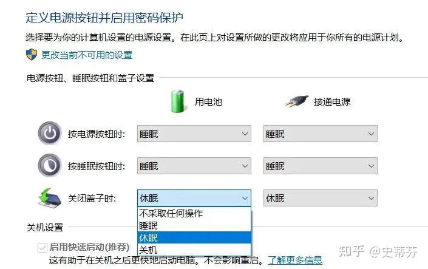

安装-能源之星X

关闭笔记本计算机盖-休眠 https://zhuanlan.zhihu.com/p/577500147

解决因硬件的唤醒事件 https://zhuanlan.zhihu.com/p/93306740

列出全部有能力唤醒电脑的硬件设备 `powercfg /devicequery wake_programmable`

禁止唤醒 `powercfg /devicedisablewake "xxxx"`