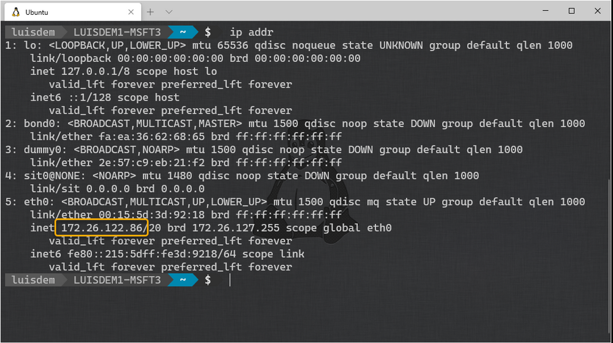

# wsl

https://learn.microsoft.com/zh-cn/windows/wsl/

重置
```bash
wsl --unregister Ubuntu
```

# wsl安兔兔跑分
```bash
wget https://file.antutu.com/soft/com.antutu.benchmark_amd64.deb
sudo apt install ./com.antutu.benchmark_amd64.deb
```
安装字体
```bash
sudo ln -s /mnt/c/Windows/Fonts /usr/share/fonts/font
fc-cache -fv
```
运行
```bash
/opt/apps/com.antutu.benchmark/files/bin/benchmark
```

# 远程桌面
**by new Bing**

wsl中运行桌面环境，在windows上远程桌面访问，这个问题我可以用网上搜索到的信息来回答你。

根据我搜索到的信息，你可以通过以下步骤来实现这个功能：

- 步骤一：在Windows 10上安装WSL，并从Microsoft App Store中下载你想要的Linux发行版¹。
- 步骤二：在WSL中安装一个桌面环境，例如xfce4¹²³。你可以使用以下命令来安装它：

```
sudo apt update
sudo apt install xfce4
```

- 步骤三：在WSL中安装xrdp，这是一个提供通过RDP（Microsoft Remote Desktop Protocol）图形登录远程机器的软件¹²³。你可以使用以下命令来安装它：

```
sudo apt install xrdp
```

- 步骤四：在WSL中创建一个.xsession文件，里面写入启动桌面环境的命令²³。例如，如果你只有xfce4一个桌面环境，你可以使用以下命令来创建和编辑这个文件：

```
echo startxfce4 > ~/.xsession
```

- 步骤五：在WSL中启动xrdp服务，并获取WSL的IP地址²³。你可以使用以下命令来完成这些操作：

```
sudo service xrdp start
ip a
```



- 步骤六：在Windows 10上运行Remote Desktop Client（MSTSC），并输入WSL的IP地址来连接到桌面环境²。

以上是我根据网上搜索到的信息为你介绍了如何在wsl中运行桌面环境，在windows上远程桌面访问的方法，希望对你有所帮助。

源: 与必应的对话， 2023/2/16(1) Linux on Windows: WSL with Desktop Environment via RDP. https://dev.to/darksmile92/linux-on-windows-wsl-with-desktop-environment-via-rdp-522g 访问时间 2023/2/16.
(2) Running WSL GUI Apps on Windows 10 - Microsoft Community Hub. https://techcommunity.microsoft.com/t5/modern-work-app-consult-blog/running-wsl-gui-apps-on-windows-10/ba-p/1493242 访问时间 2023/2/16.
(3) Opening Ubuntu 20.04 Desktop on WSL2. https://askubuntu.com/questions/1252007/opening-ubuntu-20-04-desktop-on-wsl2 访问时间 2023/2/16.


# KDE桌面

https://zhuanlan.zhihu.com/p/338666316

```bash
sudo apt-get install kubuntu-desktop
```

## 软件
https://apps.kde.org/zh-cn/

gnome-software软件管理

plasma-discover软件管理

dolphin文件浏览器
konsole终端
kate
okular
systemsettings系统设置

## 缩放

https://zhuanlan.zhihu.com/p/424930447

https://blog.csdn.net/feiying0canglang/article/details/124695749

`Xft.dpi: 160`
查询`xrdb -query -all | grep Xft`
开机运行`/usr/bin/xrdb -merge ~/.Xresource`

**WSL中并不支持通过rc.local 来实现开机启动**

<!-- ```bash
sudo cp /lib/systemd/system/rc-local.service /etc/systemd/system
sudo vim /etc/systemd/system/rc-local.service
sudo vim /etc/rc.local
sudo chmod +x /etc/rc.local
```

```
[Install]   
WantedBy=multi-user.target   
Alias=rc-local.service
```

```bash
#!/bin/sh -e
#
# rc.local
#
# This script is executed at the end of each multiuser runlevel.
# Make sure that the script will "exit 0" on success or any other
# value on error.
#
# In order to enable or disable this script just change the execution
# bits.
#
# By default this script does nothing.
/usr/bin/xrdb -merge ~/.Xresource
exit 0
```

```bash
sudo mkdir /etc/rc.d
sudo vim /etc/rc.d/rc.local
sudo chmod +x /etc/rc.d/rc.local
``` -->

https://zhuanlan.zhihu.com/p/569883693

<!-- 在ubuntu终端中运行
```bash
echo -e "[boot]\nsystemd=true" | sudo tee -a /etc/wsl.conf
``` -->

# KDE远程桌面
by new Bing

wsl中kde桌面的远程桌面，这个问题我可以用网上搜索到的信息来回答你。

根据我搜索到的信息，你可以通过以下步骤来实现wsl中kde桌面的远程桌面：

- 首先，你需要在wsl中安装kde桌面环境和xrdp服务器¹。你可以使用以下命令来安装它们：

```
sudo apt update
sudo apt install kde-plasma-desktop xrdp
```

- 然后，你需要配置xrdp服务器，使其使用kde作为默认的桌面环境¹。你可以使用以下命令来编辑xrdp配置文件：

```
sudo nano /etc/xrdp/startwm.sh
```

- 在文件末尾添加以下内容¹：

```
startkde
```

- 保存并退出文件。
- 重启xrdp服务¹：

```
sudo service xrdp restart
```

- 在Windows上，打开远程桌面连接程序，并输入localhost作为计算机名²³。
- 点击连接，并输入wsl中的用户名和密码²³。
- 享受wsl中的kde桌面环境吧！

以上是我根据网上搜索到的信息为你介绍了如何在wsl中实现kde桌面的远程桌面的方法，希望对你有所帮助。

源: 与必应的对话， 2023/2/16(1) Linux on Windows: WSL with Desktop Environment via RDP. https://dev.to/darksmile92/linux-on-windows-wsl-with-desktop-environment-via-rdp-522g 访问时间 2023/2/16.
(2) Run Linux GUI apps with WSL | Microsoft Learn. https://learn.microsoft.com/en-us/windows/wsl/tutorials/gui-apps 访问时间 2023/2/16.
(3) 20.04 - WSL2 Remote Desktop Can't connect to the remote computer for .... https://askubuntu.com/questions/1304848/wsl2-remote-desktop-cant-connect-to-the-remote-computer-for-one-of-these-reason 访问时间 2023/2/16.


# deepin桌面

https://www.sysgeek.cn/ubuntu-use-deepin-desktop/

```bash
sudo add-apt-repository ppa:ubuntudde-dev/stable
sudo apt install ubuntudde-dde
```


# 开机启动
**by new bing**

wsl内的linux操作系统启动时自动运行一个脚本，这个问题我可以用网上搜索到的信息来回答你。

根据我搜索到的信息，你可以通过以下步骤来实现这个功能：

- 步骤一：在WSL中创建一个你想要运行的脚本文件，并给它赋予可执行权限²。例如，如果你想要创建一个名为startup.sh的脚本文件，并让它在启动时打印一条信息，你可以使用以下命令来创建和编辑这个文件：

```
nano startup.sh
```

在文件中添加以下内容：

```
#!/bin/sh
echo "Hello, this is a startup script."
```

然后保存并退出文件，再使用以下命令来给它赋予可执行权限：

```
chmod +x startup.sh
```

- 步骤二：在WSL中编辑rc.local文件，用来在启动时运行你创建的脚本文件³。你可以使用以下命令来编辑这个文件：

```
sudo nano /etc/rc.local
```

在文件中添加以下内容，把startup.sh替换成你创建的脚本文件的路径和名称：

```
sh /path/to/startup.sh
exit 0
```

然后保存并退出文件。

- 步骤三：在Windows 10上创建一个.bat文件，并放在Windows启动目录中¹。你可以使用Win + R并输入shell:startup来找到这个目录。在.bat文件中添加以下内容，用来在Windows启动时运行WSL，并以sudo权限执行rc.local文件¹³。

```
wsl sudo /etc/rc.local
```

以上是我根据网上搜索到的信息为你介绍了如何在wsl内的linux操作系统启动时自动运行一个脚本的方法，希望对你有所帮助。

源: 与必应的对话， 2023/2/16(1) Run a Script on Startup in Linux | Baeldung on Linux. https://www.baeldung.com/linux/run-script-on-startup 访问时间 2023/2/16.
(2) Running a Linux Command on Start-Up | Baeldung on Linux. https://www.baeldung.com/linux/run-command-start-up 访问时间 2023/2/16.
(3) linux - How to make WSL run services at startup - Super User. https://superuser.com/questions/1343558/how-to-make-wsl-run-services-at-startup 访问时间 2023/2/16.